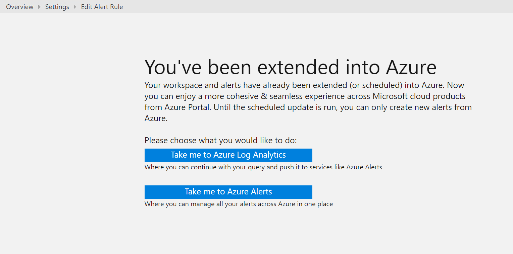

# Extend Log Analytics alerts to Azure Alerts
Until recently, Azure Log Analytics included its own alert functionality, which could proactively notify you of conditions based on Log Analytics data. You managed alert rules in the Microsoft Operations Management Suite portal. The new alerts experience has now integrated alerting across various services in Microsoft Azure. This is available as **Alerts** under Azure Monitor in the Azure portal, and supports alerting from activity logs, metrics, and logs from both Log Analytics and Azure Application Insights. 

## Benefits of extending your alerts
There are several advantages of creating and managing alerts in the Azure portal, such as:

- Unlike in the Operations Management Suite portal, where only 250 alerts could be created and viewed, Azure Alerts has no such limitation.
- From Azure Alerts, you can manage, enumerate, and view all your alert types. Previously, you could only do so for Log Analytics alerts.
- You can limit access to users to only monitoring and alerting, by using the [Azure Monitor role](monitoring-roles-permissions-security.md).
- In Azure Alerts, you can use [action groups](monitoring-action-groups.md). This allows you to have more than one action for each alert. You can SMS, send a voice call, invoke an Azure Automation runbook, invoke a webhook, and configure an IT Service Management (ITSM) Connector. 

## Process of extending your alerts
The process of moving alerts from Log Analytics into Azure Alerts does not involve changing your alert definition, query, or configuration in any way. The only change required is that in Azure, you perform all actions by using an action group. If action groups are already associated with your alert, they are included when extended into Azure.

> [!NOTE]
> Microsoft will automatically extend alerts created in public cloud instances of Log Analytics to Azure Alerts, starting on May 14, 2018, in a recurring series until completed. If you have any problems creating [action groups](monitoring-action-groups.md), use [these remediation steps](monitoring-alerts-extend-tool.md#troubleshooting) to get action groups created automatically. You can use these steps until July 5, 2018. *Not applicable for Azure Goverment and Soveriegn cloud users of Log Analytics*. 
> 

When you schedule alerts in a Log Analytics workspace to be extended to Azure, they continue to work, and do not in any way compromise your configuration. When scheduled, your alerts might be unavailable for modification temporarily, but you can continue to create new Azure Alerts during this time. If you attempt to edit or create alerts from the Operations Management Suite portal, you have the option to continue creating them from your Log Analytics workspace. You can also choose to create them from Azure Alerts in the Azure portal.

 

> [!NOTE]
> Extending alerts from Log Analytics to Azure does not incur charges to your account. Using Azure Alerts for query based Log Analytics alerts is not billed when used within the limits and conditions stated in the [Azure Monitor pricing policy](https://azure.microsoft.com/pricing/details/monitor/).  

### How to extend your alerts voluntarily
To extend your alerts to Azure Alerts, you can use a wizard available in the Operations Management Suite portal, or you can do so programmatically by using an API. For more information, see [Extending alerts into Azure using Operations Management Suite portal and API](monitoring-alerts-extend-tool.md).

## Experience after extending your alerts
After your alerts are extended to Azure Alerts, they continue to be available in the Operations Management Suite portal for management no differently than before.

When you attempt to edit an existing alert or create a new alert in the Operations Management Suite portal, you are automatically redirected to Azure Alerts.  

> [!NOTE]
> Ensure that the permissions assigned to individuals who need to add or edit alerts are properly assigned in Azure. To understand what permissions you need to grant, see [permissions for using Azure Monitor and Alerts](monitoring-roles-permissions-security.md).  
> 

You can continue to create alerts from the [Log Analytics API](../log-analytics/log-analytics-api-alerts.md) and [Log Analytics Resource Template](../monitoring/monitoring-solutions-resources-searches-alerts.md). You must include action groups when you do so.

## Next steps

* Learn about the tools to [initiate extending alerts from Log Analytics into Azure](monitoring-alerts-extend-tool.md).
* Learn more about the [Azure Alerts experience](monitoring-overview-unified-alerts.md).
* Learn how to create [log alerts in Azure Alerts](monitor-alerts-unified-log.md).
