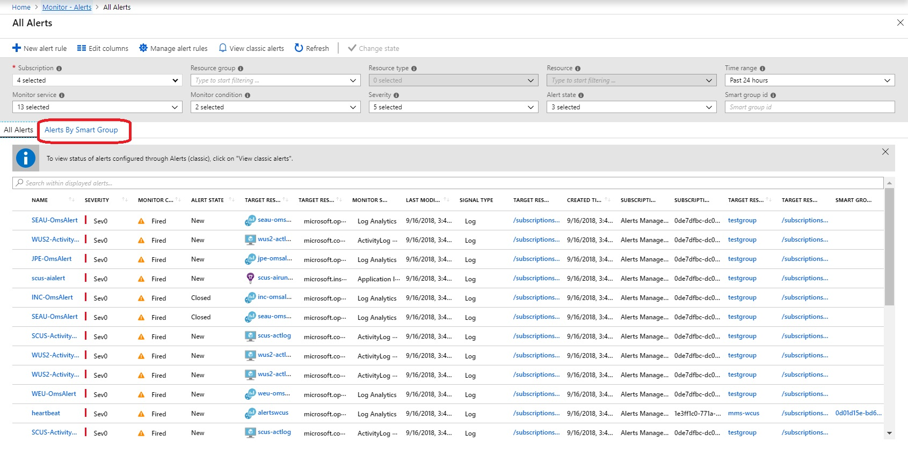
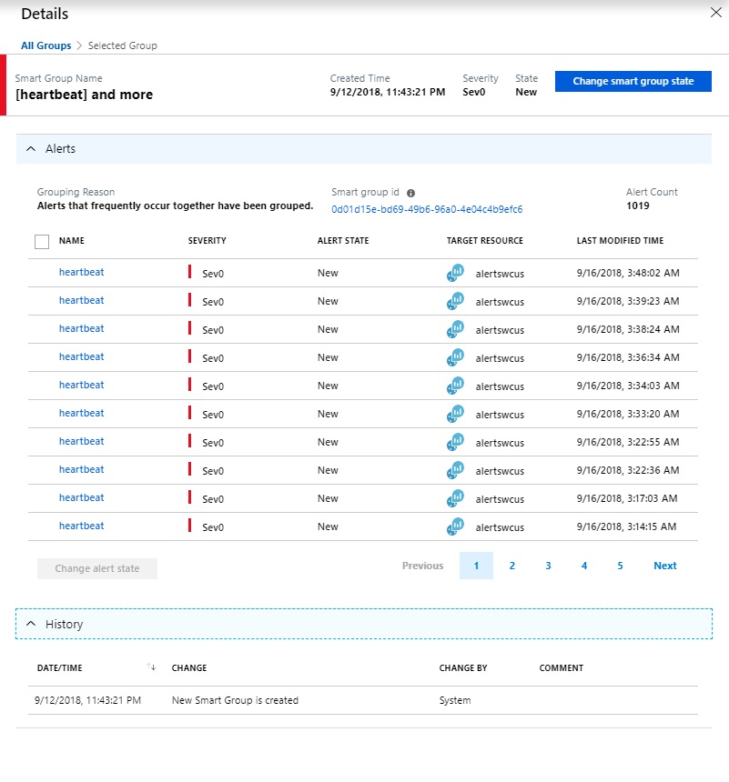

# Overview 
This article shows you how to access smart groups, and the possibilities of using smart groups.
1.	To see the Smart Groups created for your alert instances you can either
     1.	Click on **Smart Groups** from the **Alerts Summary** page    
    
     2.	Click on Alerts by Smart Groups from the All Alerts page   
     
2.	This takes you to the list view for all Smart Groups created over your alert instances. Instead of sifting through multiple alerts, you can now deal with the smart groups instead.   

3.	Clicking on any Smart Group opens up the details page, where you can see the grouping reason, along with the member alerts. This aggregation allows you to deal with a singular smart group, instead of sifting through multiple alerts.   

4.	One further possibility is to use smart group instances to initiate your incident instances in your ITSM solution (through the Alerts Management API) instead of creating them on-top of your alert instances.
