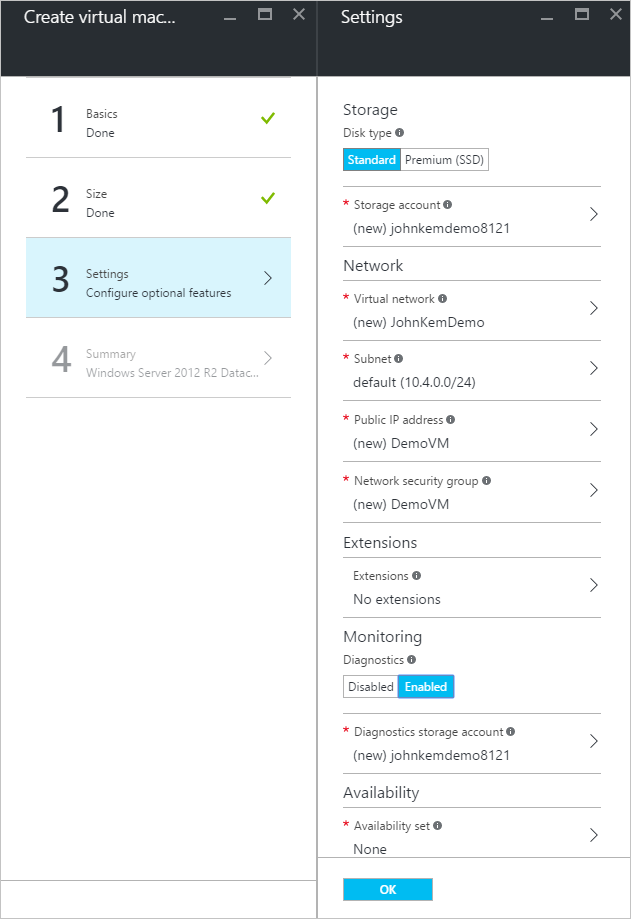
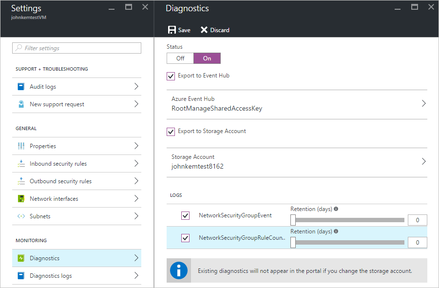

<properties
	pageTitle="Overview of Azure Diagnostic Logs"
	description="Learn what Azure Diagnostic Logs are and how you can use them to understand events occurring within an Azure resource."
	authors="johnkemnetz"
	manager="robb"
	editor=""
	services="monitoring"
documentationCenter=""/>

<tags
	ms.service="monitoring"
	ms.workload="na"
	ms.tgt_pltfrm="na"
	ms.devlang="na"
	ms.topic="article"
	ms.date="07/23/2016"
	ms.author="johnkem"/>

# Overview of Azure Diagnostic Logs
**Azure Diagnostic Logs** are logs emitted by a resource that provide rich, frequent data about the operation of that resource. The content of these logs vary by resource type (for example, Windows event system logs are one category of Diagnostic Log for VMs and blob, table, and queue logs are categories of Diagnostic Logs for storage accounts) and differ from [Audit Logs](../resource-group-audit.md), which provide insight into the operations that were performed on resources in your subscription. Not all resources support the new type of Diagnostic Logs described here. [This list of Supported Services](monitoring-and-diagnostics-diagnostic-logs-supported-services.md) shows which resource types support the new Diagnostic Logs.

## What You Can Do with Diagnostic Logs
Here are some of the things you can do with Diagnostic Logs:

- Save them to a **Storage Account** for auditing or manual inspection. You can specify the retention time (in days) using the **Diagnostic Settings**.
- [Stream them to **Event Hubs**](monitoring-and-diagnostics-stream-diagnostic-logs-to-event-hubs.md) for ingestion by a 3rd party service or custom analytics solution such as PowerBI.

## Diagnostic Settings
Diagnostic Logs are configured using Diagnostic Settings. **Diagnostic Settings** for a resource control:

- Where Diagnostic Logs are sent (Storage Account, Event Hubs, and/or OMS).
- Which Log Categories are sent.
- How long each log category should be retained in a Storage Account – a retention of zero days will mean logs are kept forever. If retention policies are set but storing logs in a Storage Account is disabled (eg. if only Event Hubs or OMS options are selected), the retention policies will have no effect.

These settings are easily configured via the Diagnostics blade for a resource in the Azure Portal, via Azure PowerShell and CLI commands, or via the [Insights REST API](https://msdn.microsoft.com/en-us/library/azure/dn931943.aspx).

##How to Enable Collection of Diagnostic Logs
Collection of Diagnostic Logs can be enabled as part of creating a resource or after a resource is created via the resource’s blade in the Portal. You can also enable Diagnostic Logs at any point using Azure PowerShell or CLI commands, or using the Insights REST API.

> [AZURE.TIP] These instructions may not apply directly to every resource. See links at the bottom of this page for special steps required for some resource types.

###Enable Diagnostic Logs in the Portal
You can enable Diagnostic Logs in the Azure Portal when you create some resource types by doing the following:

1.	Go to **New** and choose the resource you are interested in.
2.	After configuring the basic settings and selecting a size, in the **Settings** blade, under **Monitoring**, select **Enabled** and choose a storage account where you would like to store the Diagnostic Logs. You’ll be charged normal data rates for storage and transactions when you send diagnostics to a storage account.

3.	Click **OK** and create the resource.

To enable Diagnostic Logs in the Azure Portal after a resource has been created, do the following:

1.	Go to the blade for the resource and open the **Diagnostics** blade.
2.	Click **On** and pick a Storage Account and/or Event Hub.

3.	Under **Logs**, select which **Log Categories** you would like to collect or stream.
4.	Click **Save**.

###Enable Diagnostic Logs Programmatically
To enable Diagnostic Logs via the Azure PowerShell Cmdlets, use the following commands.

To enable storage of Diagnostic Logs in a Storage Account, use this command:

    Set-AzureRmDiagnosticSetting -ResourceId [your resource Id] -StorageAccountId [your storage account id] -Enabled $true

The Storage Account ID will be the resource id for the storage account to which you want to send the logs. 

To enable streaming of Diagnostic Logs to an Event Hub, use this command:

    Set-AzureRmDiagnosticSetting -ResourceId [your resource Id] -ServiceBusRuleId [your service bus rule id] -Enabled $true

The Service Bus Rule ID will be a string with this format: `{service bus resource ID}/authorizationrules/{key name}`.

To enable Diagnostic Logs via the Azure CLI, use the following commands:

To enable storage of Diagnostic Logs in a Storage Account, use this command:

    azure insights diagnostic set --resourceId <resourceId> --storageId <storageAccountId> --enabled true

The Storage Account ID will be the resource id for the storage account to which you want to send the logs. 

To enable streaming of Diagnostic Logs to an Event Hub, use this command:

    azure insights diagnostic set --resourceId <resourceId> --serviceBusRuleId <serviceBusRuleId> --enabled true

The Service Bus Rule ID will be a string with this format: `{service bus resource ID}/authorizationrules/{key name}`.

To change Diagnostic Settings using the Insights REST API, see [this document](https://msdn.microsoft.com/en-us/library/azure/dn931931.aspx).

## Schema for Diagnostic Logs
The schema for Diagnostic Logs varies depending on the resource and log category. Below are the schemas for some popular resources.

| Service                       | Schema & Docs                                                                                   |
|-------------------------------|-------------------------------------------------------------------------------------------------|
|    Software Load Balancer     |    https://azure.microsoft.com/en-us/documentation/articles/load-balancer-monitor-log/          |
|    Network Security Groups    |    https://azure.microsoft.com/en-us/documentation/articles/virtual-network-nsg-manage-log/     |
|    Application Gateways       |    https://azure.microsoft.com/en-us/documentation/articles/application-gateway-diagnostics/    |
|    Key Vault                  |    https://azure.microsoft.com/en-us/documentation/articles/key-vault-logging/                  |
|    Azure Search               |    https://azure.microsoft.com/en-us/documentation/articles/search-traffic-analytics/           |

