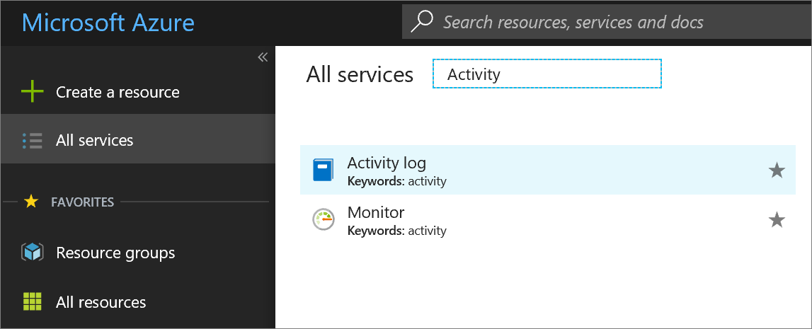
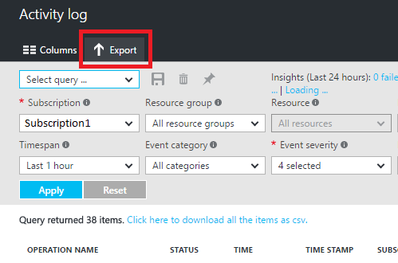

# Archive the Azure Activity Log
In this article, we show how you can use the Azure portal, PowerShell Cmdlets, or Cross-Platform CLI to archive your [**Azure Activity Log**](monitoring-overview-activity-logs.md) in a storage account. This option is useful if you would like to retain your Activity Log longer than 90 days (with full control over the retention policy) for audit, static analysis, or backup. If you only need to retain your events for 90 days or less you do not need to set up archival to a storage account, since Activity Log events are retained in the Azure platform for 90 days without enabling archival.

## Prerequisites
Before you begin, you need to [create a storage account](../storage/storage-create-storage-account.md#create-a-storage-account) to which you can archive your Activity Log. We highly recommend that you do not use an existing storage account that has other, non-monitoring data stored in it so that you can better control access to monitoring data. However, if you are also archiving Diagnostic Logs and metrics to a storage account, it may make sense to use that storage account for your Activity Log as well to keep all monitoring data in a central location. The storage account you use must be a general purpose storage account, not a blob storage account. The storage account does not have to be in the same subscription as the subscription emitting logs as long as the user who configures the setting has appropriate RBAC access to both subscriptions.

## Log Profile
To archive the Activity Log using any of the methods below, you set the **Log Profile** for a subscription. The Log Profile defines the type of events that are stored or streamed and the outputs—storage account and/or event hub. It also defines the retention policy (number of days to retain) for events stored in a storage account. If the retention policy is set to zero, events are stored indefinitely. Otherwise, this can be set to any value between 1 and 2147483647. Retention policies are applied per-day, so at the end of a day (UTC), logs from the day that is now beyond the retention policy will be deleted. For example, if you had a retention policy of one day, at the beginning of the day today the logs from the day before yesterday would be deleted. [You can read more about log profiles here](monitoring-overview-activity-logs.md#export-the-activity-log-with-log-profiles). 

## Archive the Activity Log using the portal
1. In the portal, click the **Activity Log** link on the left-side navigation. If you don’t see a link for the Activity Log, click the **More Services** link first.
   
    
2. At the top of the blade, click **Export**.
   
    
3. In the blade that appears, check the box for **Export to a storage account** and select a storage account.
   
    
4. Using the slider or text box, define a number of days for which Activity Log events should be kept in your storage account. If you prefer to have your data persisted in the storage account indefinitely, set this number to zero.
5. Click **Save**.

## Archive the Activity Log via PowerShell
```
Add-AzureRmLogProfile -Name my_log_profile -StorageAccountId /subscriptions/s1/resourceGroups/myrg1/providers/Microsoft.Storage/storageAccounts/my_storage -Locations global,westus,eastus -RetentionInDays 180 -Categories Write,Delete,Action
```

| Property | Required | Description |
| --- | --- | --- |
| StorageAccountId |No |Resource ID of the Storage Account to which Activity Logs should be saved. |
| Locations |Yes |Comma-separated list of regions for which you would like to collect Activity Log events. You can view a list of all regions [by visiting this page](https://azure.microsoft.com/en-us/regions) or by using [the Azure Management REST API](https://msdn.microsoft.com/library/azure/gg441293.aspx). |
| RetentionInDays |Yes |Number of days for which events should be retained, between 1 and 2147483647. A value of zero stores the logs indefinitely (forever). |
| Categories |Yes |Comma-separated list of event categories that should be collected. Possible values are Write, Delete, and Action. |

## Archive the Activity Log via CLI
```
azure insights logprofile add --name my_log_profile --storageId /subscriptions/s1/resourceGroups/insights-integration/providers/Microsoft.Storage/storageAccounts/my_storage --locations global,westus,eastus,northeurope --retentionInDays 180 –categories Write,Delete,Action
```

| Property | Required | Description |
| --- | --- | --- |
| name |Yes |Name of your log profile. |
| storageId |No |Resource ID of the Storage Account to which Activity Logs should be saved. |
| locations |Yes |Comma-separated list of regions for which you would like to collect Activity Log events. You can view a list of all regions [by visiting this page](https://azure.microsoft.com/en-us/regions) or by using [the Azure Management REST API](https://msdn.microsoft.com/library/azure/gg441293.aspx). |
| retentionInDays |Yes |Number of days for which events should be retained, between 1 and 2147483647. A value of zero will store the logs indefinitely (forever). |
| categories |Yes |Comma-separated list of event categories that should be collected. Possible values are Write, Delete, and Action. |

## Storage schema of the Activity Log
Once you have set up archival, a storage container will be created in the storage account as soon as an Activity Log event occurs. The blobs within the container follow the same format across the Activity Log and Diagnostic Logs. The structure of these blobs is:

> insights-operational-logs/name=default/resourceId=/SUBSCRIPTIONS/{subscription ID}/y={four-digit numeric year}/m={two-digit numeric month}/d={two-digit numeric day}/h={two-digit 24-hour clock hour}/m=00/PT1H.json
> 
> 

For example, a blob name might be:

> insights-operational-logs/name=default/resourceId=/SUBSCRIPTIONS/s1id1234-5679-0123-4567-890123456789/y=2016/m=08/d=22/h=18/m=00/PT1H.json
> 
> 

Each PT1H.json blob contains a JSON blob of events that occurred within the hour specified in the blob URL (e.g. h=12). During the present hour, events are appended to the PT1H.json file as they occur. The minute value (m=00) is always 00, since Activity Log events are broken into individual blobs per hour.

Within the PT1H.json file, each event is stored in the “records” array, following this format:

```
{
    "records": [
        {
            "time": "2015-01-21T22:14:26.9792776Z",
            "resourceId": "/subscriptions/s1/resourceGroups/MSSupportGroup/providers/microsoft.support/supporttickets/115012112305841",
            "operationName": "microsoft.support/supporttickets/write",
            "category": "Write",
            "resultType": "Success",
            "resultSignature": "Succeeded.Created",
            "durationMs": 2826,
            "callerIpAddress": "111.111.111.11",
            "correlationId": "c776f9f4-36e5-4e0e-809b-c9b3c3fb62a8",
            "identity": {
                "authorization": {
                    "scope": "/subscriptions/s1/resourceGroups/MSSupportGroup/providers/microsoft.support/supporttickets/115012112305841",
                    "action": "microsoft.support/supporttickets/write",
                    "evidence": {
                        "role": "Subscription Admin"
                    }
                },
                "claims": {
                    "aud": "https://management.core.windows.net/",
                    "iss": "https://sts.windows.net/72f988bf-86f1-41af-91ab-2d7cd011db47/",
                    "iat": "1421876371",
                    "nbf": "1421876371",
                    "exp": "1421880271",
                    "ver": "1.0",
                    "http://schemas.microsoft.com/identity/claims/tenantid": "1e8d8218-c5e7-4578-9acc-9abbd5d23315 ",
                    "http://schemas.microsoft.com/claims/authnmethodsreferences": "pwd",
                    "http://schemas.microsoft.com/identity/claims/objectidentifier": "2468adf0-8211-44e3-95xq-85137af64708",
                    "http://schemas.xmlsoap.org/ws/2005/05/identity/claims/upn": "admin@contoso.com",
                    "puid": "20030000801A118C",
                    "http://schemas.xmlsoap.org/ws/2005/05/identity/claims/nameidentifier": "9vckmEGF7zDKk1YzIY8k0t1_EAPaXoeHyPRn6f413zM",
                    "http://schemas.xmlsoap.org/ws/2005/05/identity/claims/givenname": "John",
                    "http://schemas.xmlsoap.org/ws/2005/05/identity/claims/surname": "Smith",
                    "name": "John Smith",
                    "groups": "cacfe77c-e058-4712-83qw-f9b08849fd60,7f71d11d-4c41-4b23-99d2-d32ce7aa621c,31522864-0578-4ea0-9gdc-e66cc564d18c",
                    "http://schemas.xmlsoap.org/ws/2005/05/identity/claims/name": " admin@contoso.com",
                    "appid": "c44b4083-3bq0-49c1-b47d-974e53cbdf3c",
                    "appidacr": "2",
                    "http://schemas.microsoft.com/identity/claims/scope": "user_impersonation",
                    "http://schemas.microsoft.com/claims/authnclassreference": "1"
                }
            },
            "level": "Information",
            "location": "global",
            "properties": {
                "statusCode": "Created",
                "serviceRequestId": "50d5cddb-8ca0-47ad-9b80-6cde2207f97c"
            }
        }
    ]
}
```


| Element name | Description |
| --- | --- |
| time |Timestamp when the event was generated by the Azure service processing the request corresponding the event. |
| resourceId |Resource ID of the impacted resource. |
| operationName |Name of the operation. |
| category |Category of the action, eg. Write, Read, Action. |
| resultType |The type of the result, eg. Success, Failure, Start |
| resultSignature |Depends on the resource type. |
| durationMs |Duration of the operation in milliseconds |
| callerIpAddress |IP address of the user who has performed the operation, UPN claim, or SPN claim based on availability. |
| correlationId |Usually a GUID in the string format. Events that share a correlationId belong to the same uber action. |
| identity |JSON blob describing the authorization and claims. |
| authorization |Blob of RBAC properties of the event. Usually includes the “action”, “role” and “scope” properties. |
| level |Level of the event. One of the following values: “Critical”, “Error”, “Warning”, “Informational” and “Verbose” |
| location |Region in which the location occurred (or global). |
| properties |Set of `<Key, Value>` pairs (i.e. Dictionary) describing the details of the event. |

> [!NOTE]
> The properties and usage of those properties can vary depending on the resource.
> 
> 

## Next steps
* [Download blobs for analysis](../storage/storage-dotnet-how-to-use-blobs.md#download-blobs)
* [Stream the Activity Log to Event Hubs](monitoring-stream-activity-logs-event-hubs.md)
* [Read more about the Activity Log](monitoring-overview-activity-logs.md)

