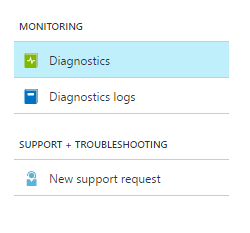
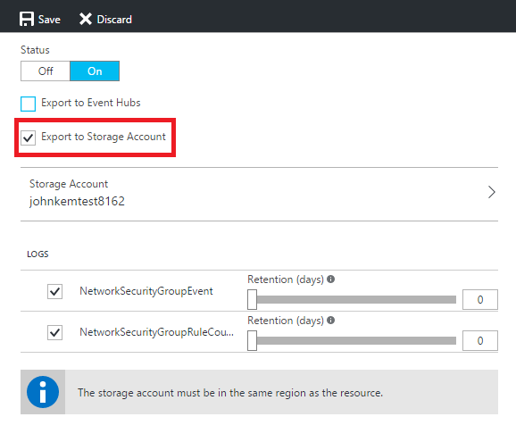

# Archive Azure Diagnostic Logs
In this article, we show how you can use the Azure portal, PowerShell Cmdlets, CLI, or REST API to archive your [Azure Diagnostic Logs](monitoring-overview-of-diagnostic-logs.md) in a storage account. This option is useful if you would like to retain your Diagnostic Logs with an optional retention policy for audit, static analysis, or backup. The storage account does not have to be in the same subscription as the resource emitting logs as long as the user who configures the setting has appropriate RBAC access to both subscriptions.

## Prerequisites
Before you begin, you need to [create a storage account](../storage/storage-create-storage-account.md#create-a-storage-account) to which you can archive your Diagnostic Logs. We highly recommend that you do not use an existing storage account that has other, non-monitoring data stored in it so that you can better control access to monitoring data. However, if you are also archiving your Activity Log and diagnostic metrics to a storage account, it may make sense to use that storage account for your Diagnostic Logs as well to keep all monitoring data in a central location. The storage account you use must be a general purpose storage account, not a blob storage account.

## Diagnostic Settings
To archive your Diagnostic Logs using any of the methods below, you set a **Diagnostic Setting** for a particular resource. A diagnostic setting for a resource defines the categories of logs that are that are stored or streamed and the outputs—storage account and/or event hub. It also defines the retention policy (number of days to retain) for events of each log category stored in a storage account. If a retention policy is set to zero, events for that log category are stored indefinitely (that is to say, forever). A retention policy can otherwise be any number of days between 1 and 2147483647. [You can read more about diagnostic settings here](monitoring-overview-of-diagnostic-logs.md#diagnostic-settings). Retention policies are applied per-day, so at the end of a day (UTC), logs from the day that is now beyond the retention policy will be deleted. For example, if you had a retention policy of one day, at the beginning of the day today the logs from the day before yesterday would be deleted

## Archive Diagnostic Logs using the portal
1. In the portal, click into the resource blade for the resource on which you would like to enable archival of Diagnostic Logs.
2. In the **Monitoring** section of the resource settings menu, select **Diagnostics**.
   
    
3. Check the box for **Export to Storage Account**, then select a storage account. Optionally, set a number of days to retain these logs by using the **Retention (days)** sliders. A retention of zero days stores the logs indefinitely.
   
    
4. Click **Save**.

Diagnostic Logs are archived to that storage account as soon as new event data is generated.

## Archive Diagnostic Logs via the PowerShell Cmdlets
```
Set-AzureRmDiagnosticSetting -ResourceId /subscriptions/s1id1234-5679-0123-4567-890123456789/resourceGroups/testresourcegroup/providers/Microsoft.Network/networkSecurityGroups/testnsg -StorageAccountId /subscriptions/s1id1234-5679-0123-4567-890123456789/resourceGroups/myrg1/providers/Microsoft.Storage/storageAccounts/my_storage -Categories networksecuritygroupevent,networksecuritygrouprulecounter -Enabled $true -RetentionEnabled $true -RetentionInDays 90
```

| Property | Required | Description |
| --- | --- | --- |
| ResourceId |Yes |Resource ID of the resource on which you want to set a diagnostic setting. |
| StorageAccountId |No |Resource ID of the Storage Account to which Diagnostic Logs should be saved. |
| Categories |No |Comma-separated list of log categories to enable. |
| Enabled |Yes |Boolean indicating whether diagnostics are enabled or disabled on this resource. |
| RetentionEnabled |No |Boolean indicating if a retention policy are enabled on this resource. |
| RetentionInDays |No |Number of days for which events should be retained between 1 and 2147483647. A value of zero stores the logs indefinitely. |

## Archive Diagnostic Logs via the Cross-Platform CLI
```
azure insights diagnostic set --resourceId /subscriptions/s1id1234-5679-0123-4567-890123456789/resourceGroups/testresourcegroup/providers/Microsoft.Network/networkSecurityGroups/testnsg --storageId /subscriptions/s1id1234-5679-0123-4567-890123456789/resourceGroups/myrg1/providers/Microsoft.Storage/storageAccounts/my_storage –categories networksecuritygroupevent,networksecuritygrouprulecounter --enabled true
```

| Property | Required | Description |
| --- | --- | --- |
| resourceId |Yes |Resource ID of the resource on which you want to set a diagnostic setting. |
| storageId |No |Resource ID of the Storage Account to which Diagnostic Logs should be saved. |
| categories |No |Comma-separated list of log categories to enable. |
| enabled |Yes |Boolean indicating whether diagnostics are enabled or disabled on this resource. |

## Archive Diagnostic Logs via the REST API
[See this document](https://msdn.microsoft.com/library/azure/dn931931.aspx) for information on how you can set up a diagnostic setting using the Azure Monitor REST API.

## Schema of Diagnostic Logs in the storage account
Once you have set up archival, a storage container is created in the storage account as soon as an event occurs in one of the log categories you have enabled. The blobs within the container follow the same format across Diagnostic Logs and the Activity Log. The structure of these blobs is:

> insights-logs-{log category name}/resourceId=/SUBSCRIPTIONS/{subscription ID}/RESOURCEGROUPS/{resource group name}/PROVIDERS/{resource provider name}/{resource type}/{resource name}/y={four-digit numeric year}/m={two-digit numeric month}/d={two-digit numeric day}/h={two-digit 24-hour clock hour}/m=00/PT1H.json
> 
> 

Or, more simply,

> insights-logs-{log category name}/resourceId=/{resource Id}/y={four-digit numeric year}/m={two-digit numeric month}/d={two-digit numeric day}/h={two-digit 24-hour clock hour}/m=00/PT1H.json
> 
> 

For example, a blob name might be:

> insights-logs-networksecuritygrouprulecounter/resourceId=/SUBSCRIPTIONS/s1id1234-5679-0123-4567-890123456789/RESOURCEGROUPS/TESTRESOURCEGROUP/PROVIDERS/MICROSOFT.NETWORK/NETWORKSECURITYGROUP/TESTNSG/y=2016/m=08/d=22/h=18/m=00/PT1H.json
> 
> 

Each PT1H.json blob contains a JSON blob of events that occurred within the hour specified in the blob URL (for example, h=12). During the present hour, events are appended to the PT1H.json file as they occur. The minute value (m=00) is always 00, since Diagnostic Log events are broken into individual blobs per hour.

Within the PT1H.json file, each event is stored in the “records” array, following this format:

```
{
    "records": [
        {
            "time": "2016-07-01T00:00:37.2040000Z",
            "systemId": "46cdbb41-cb9c-4f3d-a5b4-1d458d827ff1",
            "category": "NetworkSecurityGroupRuleCounter",
            "resourceId": "/SUBSCRIPTIONS/s1id1234-5679-0123-4567-890123456789/RESOURCEGROUPS/TESTRESOURCEGROUP/PROVIDERS/MICROSOFT.NETWORK/NETWORKSECURITYGROUPS/TESTNSG",
            "operationName": "NetworkSecurityGroupCounters",
            "properties": {
                "vnetResourceGuid": "{12345678-9012-3456-7890-123456789012}",
                "subnetPrefix": "10.3.0.0/24",
                "macAddress": "000123456789",
                "ruleName": "/subscriptions/ s1id1234-5679-0123-4567-890123456789/resourceGroups/testresourcegroup/providers/Microsoft.Network/networkSecurityGroups/testnsg/securityRules/default-allow-rdp",
                "direction": "In",
                "type": "allow",
                "matchedConnections": 1988
            }
        }
    ]
}
```

| Element name | Description |
| --- | --- |
| time |Timestamp when the event was generated by the Azure service processing the request corresponding the event. |
| resourceId |Resource ID of the impacted resource. |
| operationName |Name of the operation. |
| category |Log category of the event. |
| properties |Set of `<Key, Value>` pairs (i.e. Dictionary) describing the details of the event. |

> [!NOTE]
> The properties and usage of those properties can vary depending on the resource.
> 
> 

## Next Steps
* [Download blobs for analysis](../storage/storage-dotnet-how-to-use-blobs.md#download-blobs)
* [Stream Diagnostic Logs to Event Hubs](monitoring-stream-diagnostic-logs-to-event-hubs.md)
* [Read more about Diagnostic Logs](monitoring-overview-of-diagnostic-logs.md)

