# Get started with Azure Monitor
Azure Monitor is the platform service that provides a single source for monitoring Azure resources. With Azure Monitor, you can visualize, query, route, archive, and take action on the metrics and logs coming from resources in Azure. You can work with this data using the Monitor portal blade, [Monitor PowerShell Cmdlets](insights-powershell-samples.md), [Cross-Platform CLI](insights-cli-samples.md), or [Azure Monitor REST APIs](https://msdn.microsoft.com/library/dn931943.aspx). In this article, we walk through a few of the key components of Azure Monitor, using the portal for demonstration.

1. In the portal, navigate to **More services** and find the **Monitor** option. Click the star icon to add this option to your favorites list so that it is always easily accessible from the left-hand navigation bar.
   
    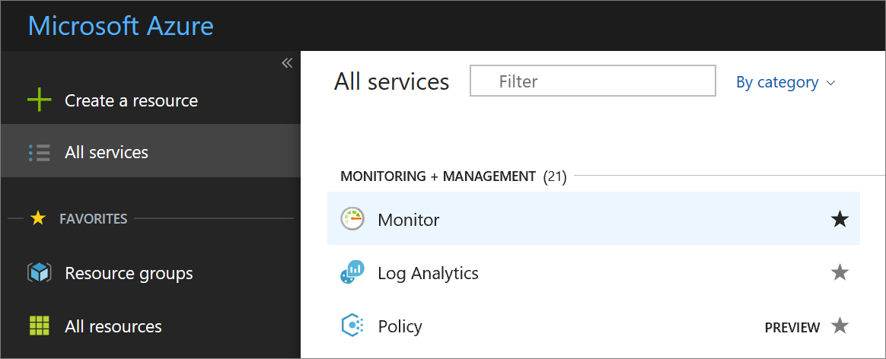
2. Click the **Monitor** option to open up the **Monitor** blade. This blade brings together all your monitoring settings and data into one consolidated view. It first opens to the **Activity log** section.
   
    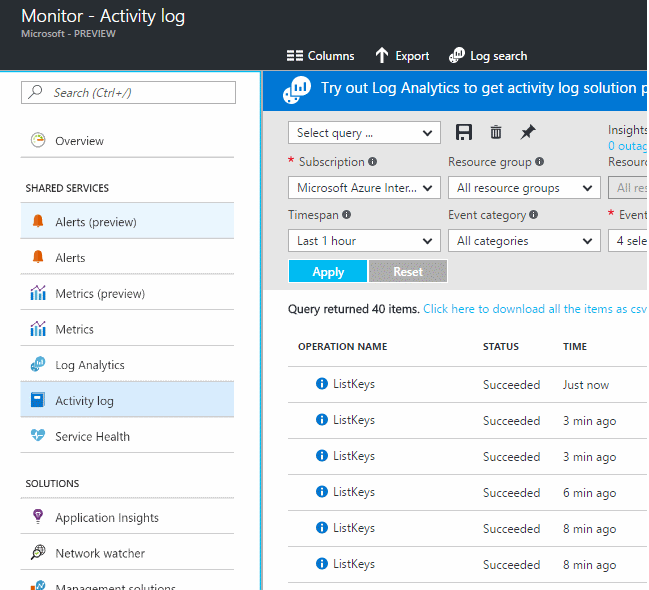
   
    Azure Monitor has three basic categories of monitoring data: The **activity log**, **metrics**, and **diagnostic logs**.
3. Click **Activity log** to ensure that the activity log section is displayed.
   
    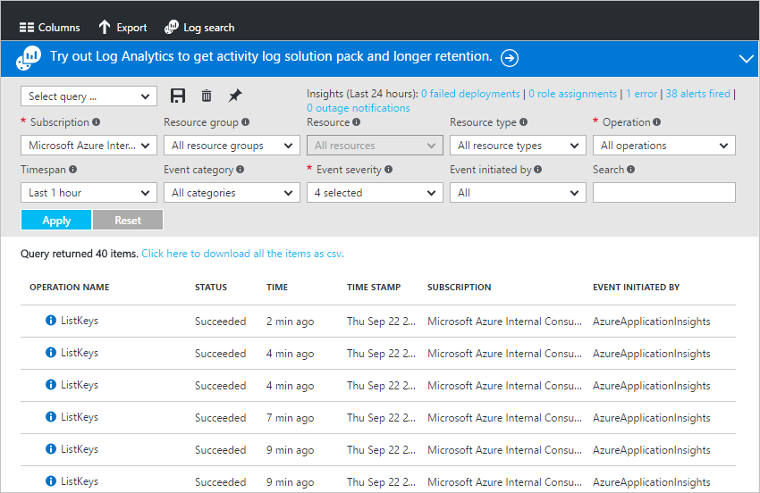
   
    The [**activity log**](monitoring-overview-activity-logs.md) describes all operations performed on resources in your subscription. Using the Activity Log, you can determine the ‘what, who, and when’ for any create, update, or delete operations on resources in your subscription. For example, the Activity Log tells you when a web app was stopped and who stopped it. Activity Log events are stored in the platform and available to query for 90 days.
   
    You can create and save queries for common filters, then pin the most important queries to a portal dashboard so you'll always know if events that meet your criteria have occurred.
4. Filter the view to a particular resource group over the last week, then click the **Save** button.
   
    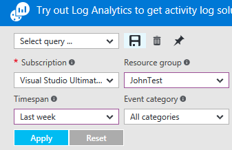
5. Now, click the **Pin** button.
   
    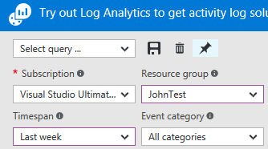
   
    Most of the views in this walkthrough can be pinned to a dashboard. This helps you create a single source of information for operational data on your services. 
6. Return to your dashboard. You can now see that the query (and number of results) is displayed in your dashboard. This is useful if you want to quickly see any high-profile actions that have occurred recently in your subscription, eg. a new role was assigned or a VM was deleted.
   
    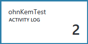
7. Return to the **Monitor** tile and click the **Metrics** section. You first need to select a resource by filtering and selecting using the drop down options at the top of the blade.
   
    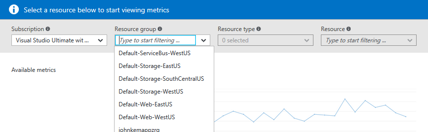
   
    All Azure resources emit [**metrics**](monitoring-overview-metrics.md). This view brings together all metrics in a single pane of glass so you can easily understand how your resources are performing.
8. Once you have selected a resource, all available metrics appear on the left side of the blade. You can chart multiple metrics at once by selecting metrics and modify the graph type and time range. You can also view all metric alerts set on this resource.
   
    
   
   > [!NOTE]
   > Some metrics are only available by enabling [Application Insights](../application-insights/app-insights-overview.md) and/or Windows or Linux Azure Diagnostics on your resource.
   > 
   > 
9. When you are happy with your chart, you can use the **Pin** button to pin it to your dashboard.
10. Return to the **Monitor** blade and click **Diagnostic logs**.
    
    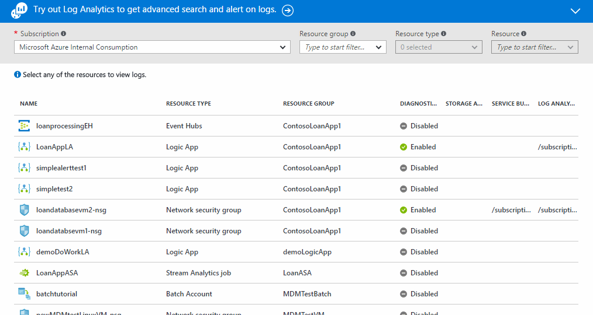
    
    [**Diagnostic logs**](monitoring-overview-of-diagnostic-logs.md) are logs emitted *by* a resource that provide data about the operation of that particular resource. For example, Network Security Group Rule Counters and Logic App Workflow Logs are both types of diagnostic logs. These logs can be stored in a storage account, streamed to an Event Hub, and/or sent to [Log Analytics](../log-analytics/log-analytics-overview.md). Log Analytics is Microsoft's operational intelligence product for advanced searching and alerting.
    
    In the portal you can view and filter a list of all resources in your subscription to identify if they have diagnostic logs enabled.
11. Click a resource in the diagnostic logs blade. If diagnostic logs are being stored in a storage account, you will see a list of hourly logs that you can directly download.
    
    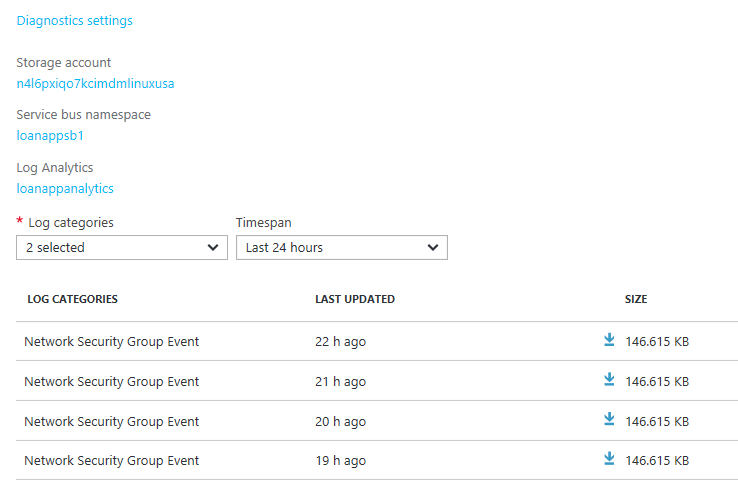
    
    You can also click **Diagnostic Settings**, which allows you to set up or modify your settings for archival to a storage account, streaming to Event Hubs, or sending to a Log Analytics workspace.
    
    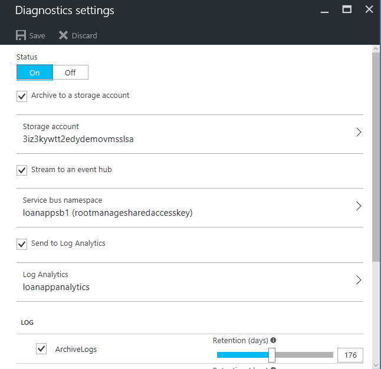
    
    If you have set up diagnostic logs to Log Analytics, you can then search them in the **Log search** section of the portal.
12. Navigate to the **Alerts** section of the Monitor blade.
    
    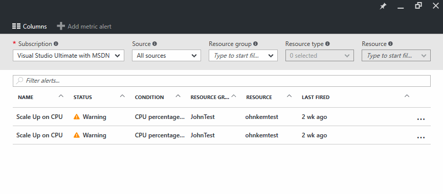
    
    Here you can manage all [**alerts**](monitoring-overview-alerts.md) on your Azure resources. This includes alerts on metrics, activity log events, Application Insights web tests (Locations), and Application Insights proactive diagnostics. Alerts can trigger an email to be sent or an HTTP POST to a webhook URL.
13. Click **Add metric alert** to create an alert.
    
    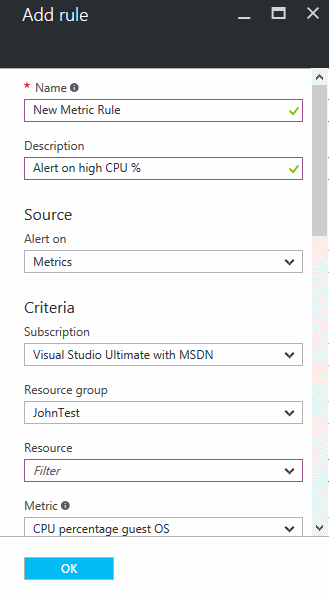
    
    You can then pin an alert to your dashboard to easily see its state at any time.
14. The Monitor section also includes links to [Application Insights](../application-insights/app-insights-overview.md) applications and [Log Analytics](../log-analytics/log-analytics-overview.md) management solutions. These other Microsoft products have deep integration with Azure Monitor.
15. If you are not using Application Insights or Log Analytics, chances are that Azure Monitor has a partnership with your current monitoring, logging, and alerting products. See our [partners page](monitoring-partners.md) for a full list and instructions for how to integrate.

By following these steps and pinning all relevant tiles to a dashboard, you can create comprehensive views of your application and infrastructure like this one:

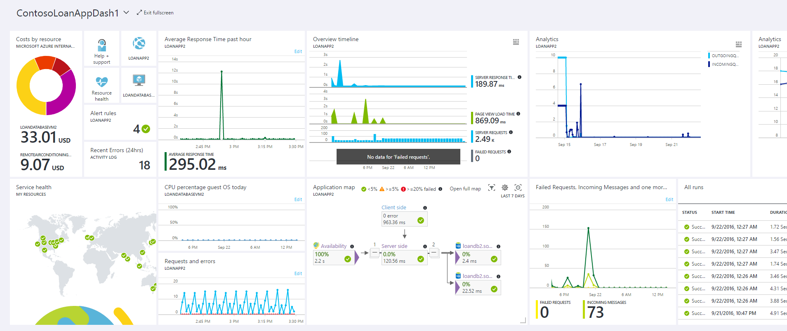

## Next Steps
* Read the [Overview of Azure Monitor](monitoring-overview.md)

