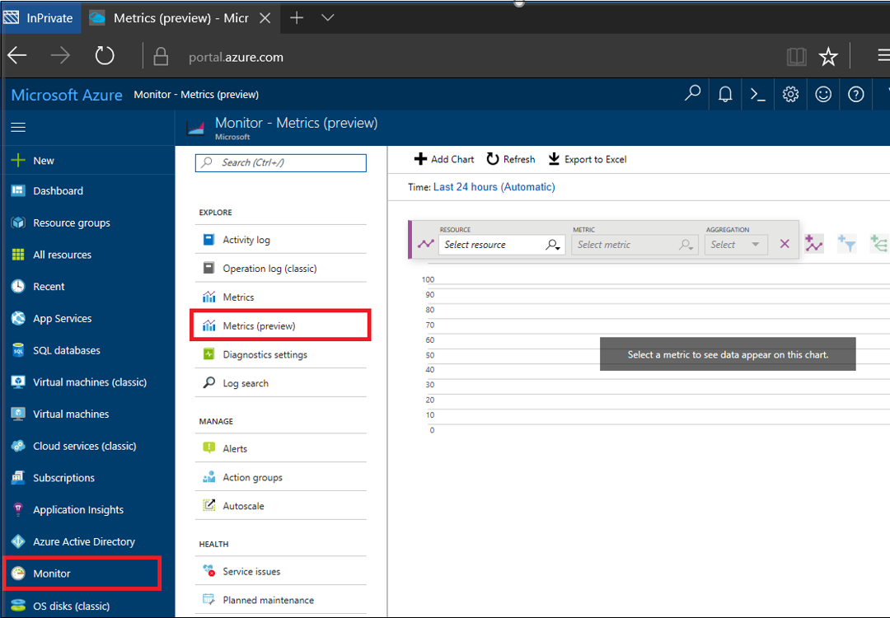
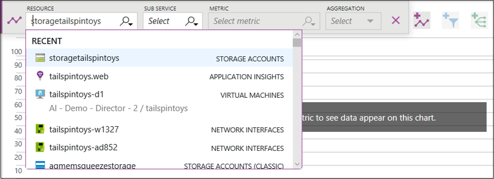
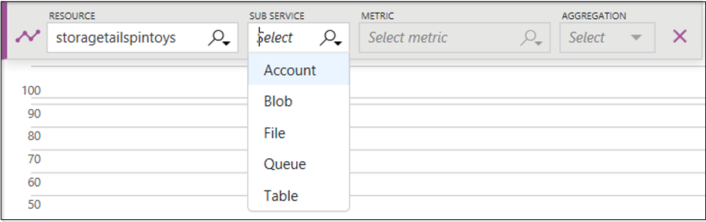
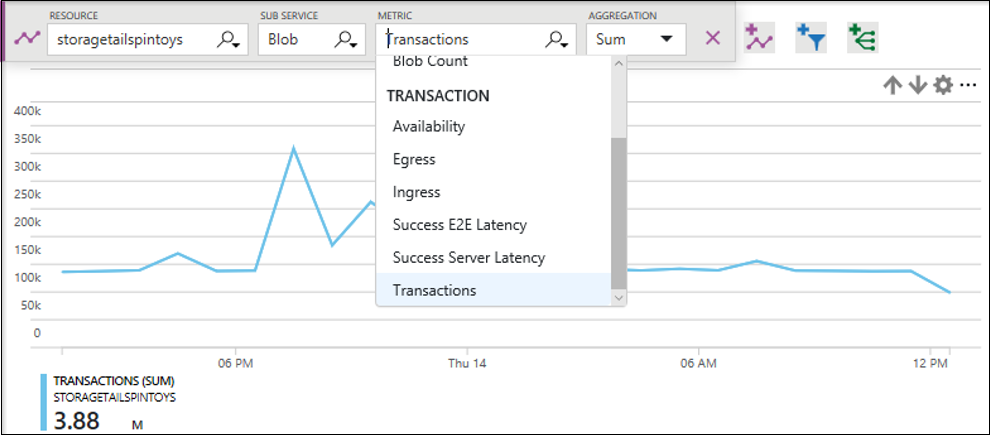
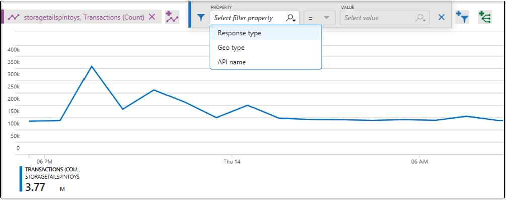
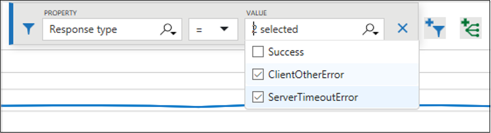
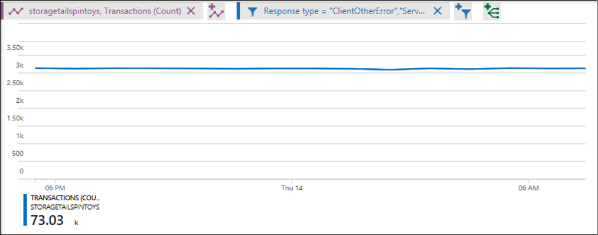
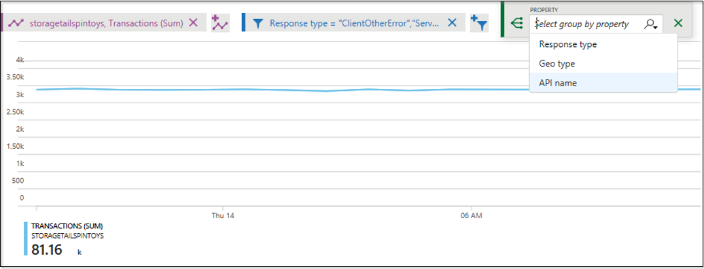
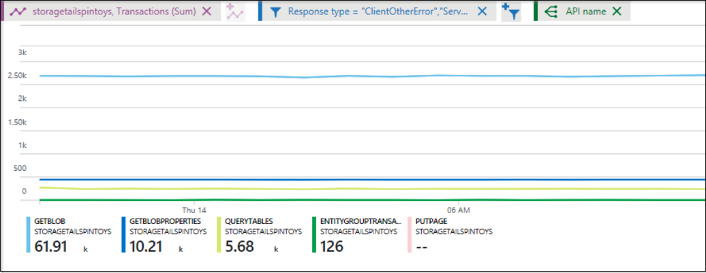
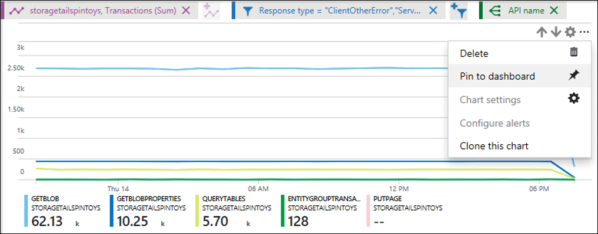

# Azure Monitor Metrics Explorer

This how-to describes the next generation Azure Monitor Metrics charting experience that is currently in public preview. The new experience supports rendering charts for both multi-dimensional metrics, and basic metrics with no dimensions. You can plot charts that overlay metrics from different resource types, multiple resource groups, and subscriptions. The multi-dimensional metrics charts can be customized by applying dimension filters as well as grouping. Any chart, including customized charts can be pinned to dashboards.

If you are looking for information about the old experience which only supports basic metrics with no dimensions, please see the section entitled “Access metrics via the portal” in the [Microsoft Azure Metrics Overview guide](https://docs.microsoft.com/azure/monitoring-and-diagnostics/monitoring-overview-metrics).

## What is Azure Monitor Metrics Explorer?

Azure Monitor Metrics Explorer is a component of the Microsoft Azure portal that allows plotting charts, visually correlating trends, and investigating spikes and dips in metrics' values. Metrics Explorer is an essential starting point for investigating various performance and availability issues with your applications and infrastructure hosted in Azure or monitored by Azure Monitor services. 

## What are Metrics in Azure?

Metrics in Microsoft Azure are the series of measured values and counts that are collected and stored over time. There are standard (or “platform”) metrics, and custom metrics. The standard metrics are provided to you by the Azure platform itself. Standard metrics reflect the health and usage statistics of your Azure resources. Whereas custom metrics are sent to Azure by your applications using the [Application Insights API for custom events](https://docs.microsoft.com/azure/application-insights/app-insights-api-custom-events-metrics). Custom metrics are stored in the Application Insights resources together with other application specific metrics.

## What are Multi-Dimensional Metrics?

Many of Azure's resources now expose multi-dimensional metrics. These metrics track multiple series of values for one or many named dimensions. For example, a metric "Available disk space" can have a dimension called "Drive" with values "C:", "D:", which would allow viewing either available disk space across all drives or for each drive individually. 

The example below illustrates two datasets for a hypothetical metric called "Network Throughput". The first dataset has no dimensions. The second dataset shows the values with two dimensions, "IP Address" and "Direction":

### Network Throughput
(This metric has no dimensions)

 | Timestamp        | Metric Value | 
   | ------------- |:-------------| 
   | 8/9/2017 8:14 | 1,331.8 Kbps | 
   | 8/9/2017 8:15 | 1,141.4 Kbps |
   | 8/9/2017 8:16 | 1,110.2 Kbps |

This non-dimensional metric can only answer a basic question like "what was my network throughput at a given time?”

### Network Throughput + two dimensions ("IP" and "Direction")

| Timestamp          | Dimension "IP" | Dimension "Direction" | Metric Value| 
   | ------------- |:-----------------|:------------------- |:-----------|  
   | 8/9/2017 8:14 | IP="192.168.5.2" | Direction="Send"    | 646.5 Kbps |
   | 8/9/2017 8:14 | IP="192.168.5.2" | Direction="Receive" | 420.1 Kbps |
   | 8/9/2017 8:14 | IP="10.24.2.15"  | Direction="Send"    | 150.0 Kbps | 
   | 8/9/2017 8:14 | IP="10.24.2.15"  | Direction="Receive" | 115.2 Kbps |
   | 8/9/2017 8:15 | IP="192.168.5.2" | Direction="Send"    | 515.2 Kbps |
   | 8/9/2017 8:15 | IP="192.168.5.2" | Direction="Receive" | 371.1 Kbps |
   | 8/9/2017 8:15 | IP="10.24.2.15"  | Direction="Send"    | 155.0 Kbps |
   | 8/9/2017 8:15 | IP="10.24.2.15"  | Direction="Receive" | 100.1 Kbps |

This metric can answer questions such as "what was the network throughput for each IP address?", and "how much data was sent versus received?" Multi-dimensional metrics carry additional analytical and diagnostic value compared to non-dimensional metrics. 

## How do I create a new chart?

   > [!NOTE]
   > Some of the features of the old Metrics experience are not yet available in the new Metrics Explorer. While the new experience is in preview, you can continue using the old (non-dimensional) Metrics view of Azure Monitor. 

1. Open the Azure portal
2. Navigate to the new **Monitor** tab, and then select **Metrics (preview)**.

   

3. The **metric selector** will automatically be open for you. Choose a resource from the list to view its associated metrics. Only resources with metrics are shown in the list.

   

   > [!NOTE]
   >If you have more than one Azure subscription, Metrics Explorer pulls out the resources across all subscriptions that are selected in the Portal Settings -> Filter by subscriptions list. To change it, click on the Portal settings gear icon on top of the screen and select which subscriptions you want to use.

4. For some resources types (i.e. Storage Accounts and Virtual Machines), before selecting a metric you must choose a **Sub Service**. Each sub service carries its own set of metrics that are relevant to this sub service only, and not to other sub services.

   For example, each Azure Storage has metrics for subservices “Blobs”, “Files”, “Queues” and “Tables”, which are all parts of the storage account. However, the metric “Queue Message Count” is naturally applicable to the subservice “Queue” and not to any other storage account subservices.

   

5. Select a metric from the list. If you know a partial name of the metric you want, you can start typing it in to see a filtered list of available metrics:

   

6. After selecting a metric, the chart will render with the default aggregation for the selected metric. At this point you can just click away from the **metrics selector** to close it. You can also optionally switch the chart to a different aggregation. For some metrics, switching aggregation allows you to choose which value you want to see on the chart. For example, you can switch between the average, minimum and maximum values. 

7. By clicking on the Add Metric icon  and repeating steps 3-6 you can add more metrics on the same chart.

   > [!NOTE]
   > You typically don’t want to have metrics with different units of measure (i.e. “milliseconds” and “kilobytes”) or with significantly different scale on one chart. Instead, consider using multiple charts. Click on the Add Chart button to create multiple charts in Metrics Explorer.

## How do I apply filters to the charts?

You can apply filters to the charts that show metrics with dimensions. For example, if the metric “Transaction count” has a dimension, “Response type”, which indicates whether the response from transactions succeeded or failed then filtering on this dimension would plot a chart line for only successful (or only failed) transactions. 

### To add a filter:

1. Click on the Add Filter icon  above the chart

2. Select which dimension (property) you want to filter

   

3. Select which dimension values you want to include when plotting the chart (this example shows filtering out the successful storage transactions):

   

4. After selecting the filter values, click away from the Filter Selector to close it. Now the chart shows how many storage transactions have failed:

   

5. You can repeat steps 1-4 to apply multiple filters to the same charts.

## How do I segment a chart?

You can split a metric by dimension to visualize how different segments of the metric compare against each other, and identify the outlying segments of a dimension. 

### To segment a chart:

1. Click on the Add Grouping icon   above the chart.
 
   > [!NOTE]
   > You can have multiple filters but only one grouping on any single chart.

2. Choose a dimension on which you want to segment your chart: 

   

   Now the chart now shows multiple lines, one for each segment of dimension:

   

3. Click away from the **Grouping Selector** to close it.

   > [!NOTE]
   > Use both Filtering and Grouping on the same dimension to hide the segments that are irrelevant for your scenario and make charts easier to read.

## How do I pin charts to dashboards?

After configuring the charts, you may want to add it to the dashboards so that you can view it again, possibly in context of other monitoring telemetry, or share with your team. 

To pin a configured chart to a dashboard:

After configuring your chart, click on the **Chart Actions** menu in the right top corner of the chart, and click **Pin to dashboard**.

   

## Next steps

  Read [Creating custom KPI dashboards](http://brian-wren-is-writing-this-topic-for-ignite/) to learn about the best practices for creating actionable dashboards with metrics.