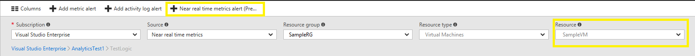
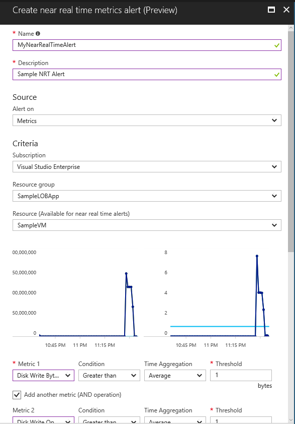
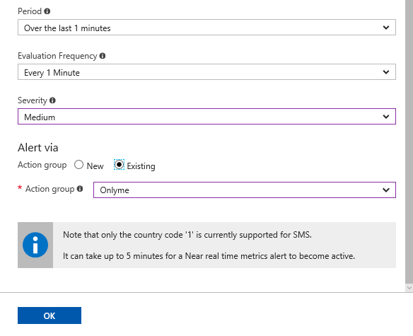

# Near Real-Time Metric Alerts (Preview)
Azure Monitor now supports a new type of metric alerts called Near Real-Time Metric Alerts (Preview). This feature is currently in public preview.
These alerts differ from regular metric alerts in few ways

- **Improved Latency** - Near real-time metric alerts can monitor changes in metric values as soon as 1 min.
- **More control over metric conditions** - Near real-time metric alerts allow users to define richer alert rules. The alerts now support monitoring the maximum, minimum, average, and total values of the metrics.
- **Combined monitoring of multiple metrics** - Near real-time metric alerts can monitor multiple metrics(currently two) with a single rule. Alert gets triggered if both the metrics breach their respective thresholds for the specified time period.
- **Modular notification system** - Near real-time metric alerts use [action groups](monitoring-action-groups.md). This functionality allows users to create actions in a modular fashion and reuse them for many alert rules.

> [!NOTE]
> Near real-time metric alerts feature is currently in public preview. The functionality and user experience is subject to change.
>

## What resources can I create near real-time metric alerts for?
Full list of resource types that are supported by near real-time metric alerts:
* Microsoft.ApiManagement/service
* Microsoft.Automation/automationAccounts
* Microsoft.Batch/batchAccounts
* Microsoft.Cache/Redis
* Microsoft.ClassicCompute/virtualMachines
* Microsoft.CognitiveServices/accounts
* Microsoft.Compute/virtualMachines
* Microsoft.Compute/virtualMachineScaleSets
* Microsoft.DataFactory/dataFactories
* Microsoft.DataFactory/factories
* Microsoft.DataLakeAnalytics/accounts
* Microsoft.DataLakeStore/accounts
* Microsoft.DBforMySQL/servers
* Microsoft.DBforPostgreSQL/servers
* Microsoft.Devices/IotHubs
* Microsoft.EventHub/namespaces
* Microsoft.Logic/workflows
* Microsoft.Network/applicationGateways
* Microsoft.Network/publicipaddresses
* Microsoft.Network/networkInterfaces
* Microsoft.Network/trafficmanagerprofiles
* Microsoft.Search/searchServices
* Microsoft.ServiceBus/namespaces
* Microsoft.Sql/servers/databases
* Microsoft.StreamAnalytics/streamingjobs
* Microsoft.Timeseriesinsights

## Create a Near Real-Time Metric Alert
Currently, near real-time metric alerts can only be created through the Azure portal. Support for configuring near real-time metric alerts through PowerShell, command-line interface (CLI), and Azure Monitor REST API is coming soon.

1. In the [portal](https://portal.azure.com/), locate the resource you are interested in monitoring and select it. This resource should be of one of the resource types listed in the [previous section](#what-resources-can-i-create-near-real-time-metric-alerts-for). You can also do the same for all supported resources types centrally from Monitor>Alerts.

2. Select **Alerts** or **Alert rules** under the MONITORING section. The text and icon may vary slightly for different resources.
   

3. Click the **Add near real time metrics alert (preview)** command. If the command is grayed out, ensure the resource is selected in the filter.

    

4. **Name** your alert rule, and choose a **Description**, which also shows in notification emails.
5. Select the **Metric** you want to monitor, then choose a **Condition**, **Time Aggregation**, and **Threshold** value for the metric. Optionally select another **Metric** you want to monitor, then choose a **Condition**, **Time Aggregation**, and **Threshold** value for the second metric. 

    
    
6. Choose the **Period** of time that the metric rules must be satisfied before the alert triggers. So for example, if you use the period "Over the last 5 minutes" and your alert looks for CPU above 80% (and NetworkIn above 500 MB), the alert triggers when the CPU has been consistently above 80% for 5 minutes. Once the first trigger occurs, it again triggers when the CPU stays below 80% for 5 minutes. The alert is evaluated according to the **Evaluation Frequency**

6. Pick an appropriate **Severity** from the drop down.

7. Specify if you want to use a New or Existing **Action Group**.

8. If you chose to create **New** Action Group,  give the action group a name and a short name, specify actions(SMS, Email, Webhook) and fill respective details.

8. Select **OK** when done to create the alert.   

Within a few minutes, the alert is active and triggers as previously described.

## Managing near real-time metric alerts
Once you have created an alert, you can select it and:

* View a graph showing the metric threshold and the actual values from the previous day.
* Edit or delete it.
* **Disable** or **Enable** it if you want to temporarily stop or resume receiving notifications for that alert.

