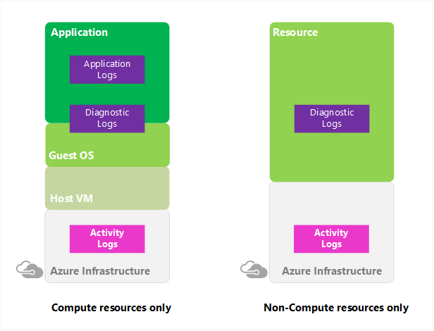
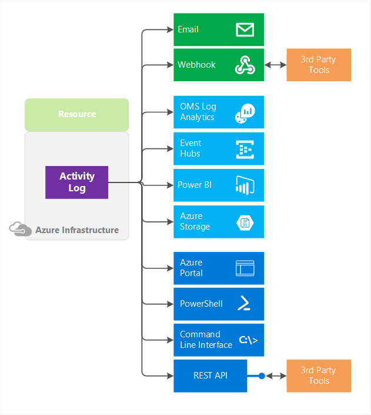
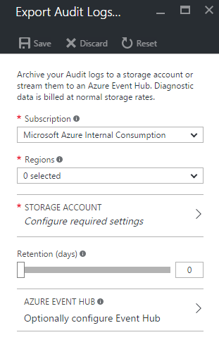

# Monitor Subscription Activity with the Azure Activity Log

The **Azure Activity Log** is a subscription log that provides insight into subscription-level events that have occurred in Azure. This includes a range of data, from Azure Resource Manager operational data to updates on Service Health events. The Activity Log was previously known as “Audit Logs” or “Operational Logs,” since the Administrative category reports control-plane events for your subscriptions. Using the Activity Log, you can determine the ‘what, who, and when’ for any write operations (PUT, POST, DELETE) taken on the resources in your subscription. You can also understand the status of the operation and other relevant properties. The Activity Log does not include read (GET) operations or operations for resources that use the Classic/"RDFE" model.



Figure 1: Activity Logs vs other types of logs

The Activity Log differs from [Diagnostic Logs](monitoring-overview-of-diagnostic-logs.md). Activity Logs provide data about the operations on a resource from the outside (the "control plane"). Diagnostics Logs are emitted by a resource and provide information about the operation of that resource (the "data plane").

> [!WARNING]
> The Azure Activity Log is primarily for activities that occur in Azure Resource Manager. It does not track resources using the Classic/RDFE model. Some Classic resource types have a proxy resource provider in Azure Resource Manager (for example, Microsoft.ClassicCompute). If you interact with a Classic resource type through Azure Resource Manager using these proxy resource providers, the operations appear in the Activity Log. If you interact with a Classic resource type outside of the Azure Resource Manager proxies, your actions are only recorded in the Operation Log. The Operation Log can be browsed in a separate section of the portal.
>
>

You can retrieve events from your Activity Log using the Azure portal, CLI, PowerShell cmdlets, and Azure Monitor REST API.

> [!NOTE]
>  [The newer alerts](monitoring-overview-unified-alerts.md) offers an enhanced experience when creating and managing activity log alert rules.  [Learn more](monitoring-activity-log-alerts-new-experience.md).

View the following video introducing the Activity Log.
> [!VIDEO https://channel9.msdn.com/Blogs/Seth-Juarez/Logs-John-Kemnetz/player]


## Categories in the Activity Log
The Activity Log contains several categories of data. For full details on the schemata of these categories, [see this article](monitoring-activity-log-schema.md). These include:
* **Administrative** - This category contains the record of all create, update, delete, and action operations performed through Resource Manager. Examples of the types of events you would see in this category include "create virtual machine" and "delete network security group" Every action taken by a user or application using Resource Manager is modeled as an operation on a particular resource type. If the operation type is Write, Delete, or Action, the records of both the start and success or fail of that operation are recorded in the Administrative category. The Administrative category also includes any changes to role-based access control in a subscription.
* **Service Health** - This category contains the record of any service health incidents that have occurred in Azure. An example of the type of event you would see in this category is "SQL Azure in East US is experiencing downtime." Service health events come in five varieties: Action Required, Assisted Recovery, Incident, Maintenance, Information, or Security, and only appear if you have a resource in the subscription that would be impacted by the event.
* **Resource Health** - This category contains the record of any resource health events that have occurred to your Azure resources. An example of the type of event you would see in this category is "Virtual Machine health status changed to unavailable." Resource health events can represent one of four health statuses: Available, Unavailable, Degraded, and Unknown. Additionally, resource health events can be categorized as being Platform Initiated or User Initiated.
* **Alert** - This category contains the record of all activations of Azure alerts. An example of the type of event you would see in this category is "CPU % on myVM has been over 80 for the past 5 minutes." A variety of Azure systems have an alerting concept -- you can define a rule of some sort and receive a notification when conditions match that rule. Each time a supported Azure alert type 'activates,' or the conditions are met to generate a notification, a record of the activation is also pushed to this category of the Activity Log.
* **Autoscale** - This category contains the record of any events related to the operation of the autoscale engine based on any autoscale settings you have defined in your subscription. An example of the type of event you would see in this category is "Autoscale scale up action failed." Using autoscale, you can automatically scale out or scale in the number of instances in a supported resource type based on time of day and/or load (metric) data using an autoscale setting. When the conditions are met to scale up or down, the start and succeeded or failed events are recorded in this category.
* **Recommendation** - This category contains recommendation events from Azure Advisor.
* **Security** - This category contains the record of any alerts generated by Azure Security Center. An example of the type of event you would see in this category is "Suspicious double extension file executed."
* **Policy** - This category does not contain any events; it is reserved for future use. 

## Event schema per category
[See this article to understand the Activity Log event schema per category.](monitoring-activity-log-schema.md)

## What you can do with the Activity Log
Here are some of the things you can do with the Activity Log:




* Query and view it in the **Azure portal**.
* [Create an alert on an Activity Log event.](monitoring-activity-log-alerts.md)
* [Stream it to an **Event Hub**](monitoring-stream-activity-logs-event-hubs.md) for ingestion by a third-party service or custom analytics solution such as PowerBI.
* Analyze it in PowerBI using the [**PowerBI content pack**](https://powerbi.microsoft.com/documentation/powerbi-content-pack-azure-audit-logs/).
* [Save it to a **Storage Account** for archival or manual inspection](monitoring-archive-activity-log.md). You can specify the retention time (in days) using the **Log Profile**.
* Query it via PowerShell Cmdlet, CLI, or REST API.

## Query the Activity Log in the Azure portal
Within the Azure portal, you can view your Activity Log in several places:
* The **Activity Log** that you can access by searching for the Activity Log under **All services** in the left-hand navigation pane.
* **Monitor** appears by default in the left-hand navigation pane. The Activity Log is one section of Azure Monitor.
* Any resource's **resource**, for example, the configuration blade for a Virtual Machine. The Activity Log is be one of the sections on most of these resource blades, and clicking on it automatically filters the events to those related to that specific resource.

In the Azure portal, you can filter your Activity Log by these fields:
* Timespan - The start and end time for events.
* Category - The event category as described above.
* Subscription - One or more Azure subscription names.
* Resource group - One or more resource groups within those subscriptions.
* Resource (name) - The name of a specific resource.
* Resource type - The type of resource, for example, Microsoft.Compute/virtualmachines.
* Operation name - The name of an Azure Resource Manager operation, for example, Microsoft.SQL/servers/Write.
* Severity - The severity level of the event (Informational, Warning, Error, Critical).
* Event initiated by - The 'caller,' or user who performed the operation.
* Open search - This is an open text search box that searches for that string across all fields in all events.

Once you have defined a set of filters, you can save it as a query that is persisted across sessions if you ever need to perform the same query with those filters applied again in the future. You can also pin a query to your Azure dashboard to always keep an eye on specific events.

Clicking "Apply" runs your query and show all matching events. Clicking on any event in the list shows the summary of that event as well as the full raw JSON of that event.

For even more power, you can click the **Log Search** icon, which displays your Activity Log data in the [Log Analytics Activity Log Analytics solution](../log-analytics/log-analytics-activity.md). The Activity Log blade offers a basic filter/browse experience on logs, but Log Analytics enables you to pivot, query, and visualize your data in more powerful ways.

## Export the Activity Log with a Log Profile
A **Log Profile** controls how your Activity Log is exported. Using a Log Profile, you can configure:

* Where the Activity Log should be sent (Storage Account or Event Hubs)
* Which event categories (Write, Delete, Action) should be sent. *The meaning of "category" in Log Profiles and Activity Log events is different. In the Log Profile, "Category" represents the operation type (Write, Delete, Action). In an Activity Log event, the "category" property represents the source or type of event (for example, Administration, ServiceHealth, Alert, and more).*
* Which regions (locations) should be exported. Make sure to include "global," as many events in the Activity Log are global events.
* How long the Activity Log should be retained in a Storage Account.
    - A retention of zero days means logs are kept forever. Otherwise, the value can be any number of days between 1 and 2147483647.
    - If retention policies are set but storing logs in a Storage Account is disabled (for example, if only Event Hubs or Log Analytics options are selected), the retention policies have no effect.
    - Retention policies are applied per-day, so at the end of a day (UTC), logs from the day that is now beyond the retention policy are deleted. For example, if you had a retention policy of one day, at the beginning of the day today the logs from the day before yesterday would be deleted. The delete process begins at midnight UTC, but note that it can take up to 24 hours for the logs to be deleted from your storage account.

You can use a storage account or event hub namespace that is not in the same subscription as the one emitting logs. The user who configures the setting must have the appropriate RBAC access to both subscriptions.

> [!NOTE]
>  You cannot currently archive data to a storage account that behind a secured virtual network.

> [!WARNING]
> The format of the log data in the storage account will change to JSON Lines on Nov. 1st, 2018. [See this article for a description of the impact and how to update your tooling to handle the new format.](./monitor-diagnostic-logs-append-blobs.md) 
>
> 

These settings can be configured via the “Export” option in the Activity Log blade in the portal. They can also be configured programmatically [using the Azure Monitor REST API](https://msdn.microsoft.com/library/azure/dn931927.aspx), PowerShell cmdlets, or CLI. A subscription can only have one log profile.

### Configure log profiles using the Azure portal
You can stream the Activity Log to an Event Hub or store them in a Storage Account by using the “Export” option in the Azure portal.

1. Navigate to **Activity Log** using the menu on the left side of the portal.

    
2. Click the **Export** button at the top of the blade.

    
3. In the blade that appears, you can select:  
  * regions for which you would like to export events
  * the Storage Account to which you would like to save events
  * the number of days you want to retain these events in storage. A setting of 0 days retains the logs forever.
  * the Service Bus Namespace in which you would like an Event Hub to be created for streaming these events.

     
4. Click **Save** to save these settings. The settings are immediately be applied to your subscription.

### Configure log profiles using the Azure PowerShell Cmdlets

#### Get existing log profile

```
Get-AzureRmLogProfile
```

#### Add a log profile

```
Add-AzureRmLogProfile -Name my_log_profile -StorageAccountId /subscriptions/s1/resourceGroups/myrg1/providers/Microsoft.Storage/storageAccounts/my_storage -serviceBusRuleId /subscriptions/s1/resourceGroups/Default-ServiceBus-EastUS/providers/Microsoft.ServiceBus/namespaces/mytestSB/authorizationrules/RootManageSharedAccessKey -Location global,westus,eastus -RetentionInDays 90 -Category Write,Delete,Action
```

| Property | Required | Description |
| --- | --- | --- |
| Name |Yes |Name of your log profile. |
| StorageAccountId |No |Resource ID of the Storage Account to which the Activity Log should be saved. |
| serviceBusRuleId |No |Service Bus Rule ID for the Service Bus namespace you would like to have event hubs created in. Is a string with this format: `{service bus resource ID}/authorizationrules/{key name}`. |
| Location |Yes |Comma-separated list of regions for which you would like to collect Activity Log events. |
| RetentionInDays |Yes |Number of days for which events should be retained, between 1 and 2147483647. A value of zero stores the logs indefinitely (forever). |
| Category |No |Comma-separated list of event categories that should be collected. Possible values are Write, Delete, and Action. |

#### Remove a log profile
```
Remove-AzureRmLogProfile -name my_log_profile
```

### Configure log profiles Using the Azure CLI

#### Get existing log profile

```azurecli
az monitor log-profiles list
az monitor log-profiles show --name <profile name>
```

The `name` property should be the name of your log profile.

#### Add a log profile

```azurecli
az monitor log-profiles create --name <profile name> \
    --locations <location1 location2 ...> \
    --location <location> \
    --categories <category1 category2 ...>
```

For the full documentation for creating a monitor profile with the CLI, see the [CLI command reference](/cli/azure/monitor/log-profiles#az-monitor-log-profiles-create)

#### Remove a log profile

```azurecli
az monitor log-profiles delete --name <profile name>
```

## Next Steps
* [Learn more about the Activity Log (formerly Audit Logs)](../azure-resource-manager/resource-group-audit.md)
* [Stream the Azure Activity Log to Event Hubs](monitoring-stream-activity-logs-event-hubs.md)
