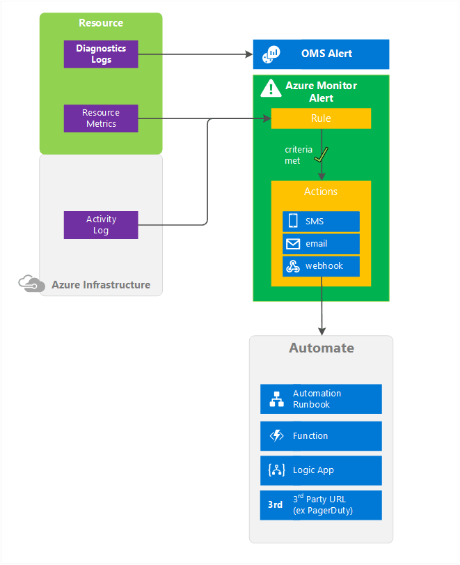

# What are alerts in Microsoft Azure?
This article describes what alerts are, their benefits, and how to get started with using them. It specifically applies to Azure Monitor, but provides pointers to other services.  

Alerts are a method of monitoring Azure resource metrics, events, or logs and being notified when a condition you specify is met.  

## Alerts in different Azure services
Alerts are available across different services, including:

* **Application Insights**: Enables web test and metric alerts. See [Set alerts in Application Insights](../application-insights/app-insights-alerts.md) and [Monitor availability and responsiveness of any website](../application-insights/app-insights-monitor-web-app-availability.md).
* **Log Analytics (Operations Management Suite)**: Enables the routing of Activity and Diagnostic Logs to Log Analytics. Operations Management Suite allows metric, log, and other alert types. For more information, see [Alerts in Log Analytics](../log-analytics/log-analytics-alerts.md).  
* **Azure Monitor**: Enables alerts based on both metric values and activity log events. You can use the [Azure Monitor REST API](https://msdn.microsoft.com/library/dn931943.aspx) to manage alerts.  For more information, see [Using the Azure portal, PowerShell, or the command-line interface to create alerts](insights-alerts-portal.md).

## Visual Summary
The following diagram summarizes alerts and what you can do with them specifically in "Azure Monitor". Other actions may be available for the services listed previously. For example, currently alerts on Diagnostics Logs are only available in Log Analytics.

## What can trigger alerts in Azure Monitor

You can receive alerts based on:

* **Metric values**: This alert triggers when the value of a specified metric crosses a threshold that you assign in either direction. That is, it triggers both when the condition is first met and then afterward when that condition is no longer being met. For a growing list of available metrics supported by Azure monitor, see [List of metrics supported on Azure Monitor](monitoring-supported-metrics.md).
* **Activity log events**: This alert can trigger when a particular event occurs on a resource, or when a service notification is posted to your subscription.

## What can Metric Alerts do?
You can configure an alert to do the following actions:

* Send email notifications to the service administrator, to co-administrators, or to additional email addresses that you specify.
* Call a webhook, which enables you to launch additional automation actions. Examples include calling:
    - Azure Automation Runbook
    - Azure Function
    - Azure Logic App
    - a third-party service

## What can Activity Log Alerts do?
You can configure an alert to do the following actions:
* Trigger whenever a specific event occurs one of the resources under your subscription
* Trigger whenever a service notification is posted to your subscription
* Alert members of an action group via
    * SMS
    * Email
    * Webhook

## Next steps
Get information about alert rules and configuring them by using:

* Learn more about [Metrics](monitoring-overview-metrics.md)
* Configure [Metric Alerts via Azure portal](insights-alerts-portal.md)
* Configure [Metric Alerts PowerShell](insights-alerts-powershell.md)
* Configure [Metric Alerts Command-line interface (CLI)](insights-alerts-command-line-interface.md)
* Configure [Metric Alerts Azure Monitor REST API](https://msdn.microsoft.com/library/azure/dn931945.aspx)
* Learn more about [Activity Log](monitoring-overview-activity-logs.md)
* Configure [Activity Log Alerts via Azure portal](monitoring-activity-log-alerts.md)
* Configure [Activity Log Alerts via Resource Manager](monitoring-create-activity-log-alerts-with-resource-manager-template.md)
* Review the [activity log alert webhook schema](monitoring-activity-log-alerts-webhook.md)
* Learn more about [Service Notifications](monitoring-service-notifications.md)
* Learn more about [Action Groups](monitoring-action-groups.md)
