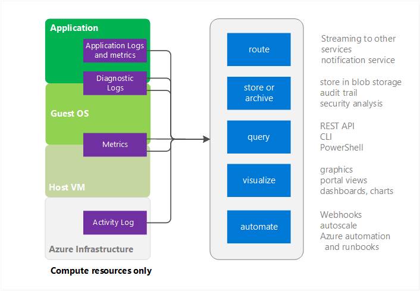
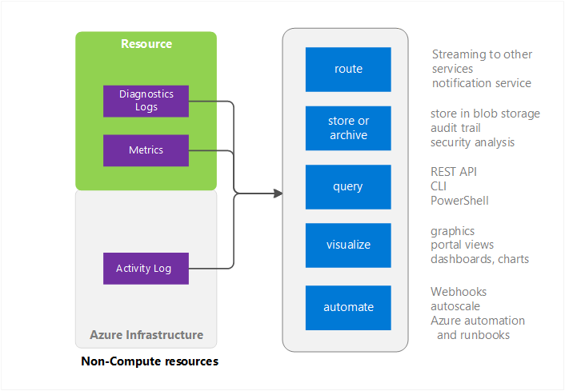

# Overview of Azure Monitor
This article provides an overview of the Azure Monitor service in Microsoft Azure. It discusses what Azure Monitor does and provides pointers to additional information on how to use Azure Monitor.  If you prefer a video introduction, see Next steps links at the bottom of this article. 

## Why monitor your application or system
Cloud applications are complex with many moving parts. Monitoring provides data to ensure that your application stays up and running in a healthy state. It also helps you to stave off potential problems or troubleshoot past ones. In addition, you can use monitoring data to gain deep insights about your application. That knowledge can help you to improve application performance or maintainability, or automate actions that would otherwise require manual intervention.

## Azure Monitor and Microsoft's other monitoring products
Azure Monitor provides base level infrastructure metrics and logs for most services in Microsoft Azure. Azure services that do not yet put their data into Azure Monitor will put it there in the future.

Microsoft ships additional products and services that provide additional monitoring capabilities for developers, DevOps, or IT Ops that also have on-premises installations. For an overview and understanding of how these different products and services work together, see [Monitoring in Microsoft Azure](monitoring-overview.md).

## Monitoring Sources - Compute

The Compute services include 
- Cloud Services 
- Virtual Machines 
- Virtual Machine scale sets 
- Service Fabric

### Application - Diagnostics Logs, Application Logs, and Metrics
Applications can run on top of the Guest OS in the compute model. They emit their own set of logs and metrics. Azure Monitor relies on the Azure diagnostics extension (Windows or Linux) to collect most application level metrics and logs. The types include

* Performance counters
* Application Logs
* Windows Event Logs
* .NET Event Source
* IIS Logs
* Manifest based ETW
* Crash Dumps
* Customer Error Logs

Without the diagnostics extension, only a few metrics like CPU usage are available. 

### Host and Guest VM metrics
The previously listed compute resources have a dedicated host VM and guest OS they interact with. The host VM and guest OS are the equivalent of root VM and guest VM in the Hyper-V hypervisor model. You can collect metrics on both. You can also collect diagnostics logs on the guest OS.   

### Activity Log
You can search the Activity Log (previously called Operational or Audit Logs) for information about your resource as seen by the Azure infrastructure. The log contains information such as times when resources are created or destroyed.  For more information, see [Overview of Activity Log](monitoring-overview-activity-logs.md). 

## Monitoring Sources - everything else

### Resource - Metrics and Diagnostics Logs
Collectable metrics and diagnostics logs vary based on the resource type. For example, Web Apps provides statistics on the Disk IO and Percent CPU. Those metrics don't exist for a Service Bus queue, which instead provides metrics like queue size and message throughput. A list of collectable metrics for each resource is available at [supported metrics](monitoring-supported-metrics.md). 

### Host and Guest VM metrics
There is not necessarily a 1:1 mapping between your resource and a particular Host or Guest VM so metrics are not available.

### Activity Log
The activity log is the same as for compute resources.  

## Uses for Monitoring Data
Once you collect your data, you can do the following with it in Azure Monitor

### Route
You can stream monitoring data to other locations in real time.

Examples include:

- Send to Application Insights so you can use its richer visualization and analysis tools.
- Send to Event Hubs so you can route to third-party tools. 

### Store and Archive
Some monitoring data is already stored and available in Azure Monitor for a set amount of time. 
- Metrics are stored for 30 days. 
- Activity log entries are stored for 90 days. 
- Diagnostics logs are not stored at all. 

If you want to store data longer than the time periods listed above, you can use an Azure storage. Monitoring data is kept in your storage acccount based on a retention policy you set. You do have to pay for the space the data takes up in Azure storage. 

A few ways to use this data:

- Once written, you can have other tools within or outside of Azure read it and process it.
- You download the data locally for a local archive or change your retention policy in the cloud to keep data for extended periods of time.  
- You leave the data in Azure storage indefinitely for archive purposes. 

### Query
You can use the Azure Monitor REST API, cross platform Command-Line Interface (CLI) commands, PowerShell cmdlets, or the .NET SDK to access the data in the system or Azure storage

Examples include:

* Getting data for a custom monitoring application you have written
* Creating custom queries and sending that data to a third-party application.

### Visualize
Visualizing your monitoring data in graphics and charts helps you find trends quicker than looking through the data itself.  

A few visualization methods include:

* Use the Azure portal
* Route data to Azure Application Insights
* Route data to Microsoft PowerBI
* Route the data to a third-party visualization tool using either live streaming or by having the tool read from an archive in Azure storage

### Automate
You can use monitoring data to trigger alerts or even whole processes. Examples include:

* Use data to autoscale compute instances up or down based on application load.
* Send emails when a metric crosses a predetermined threshold.
* Call a web URL (webhook) to execute an action in a system outside of Azure
* Start a runbook in Azure automation to perform any variety of tasks

## Methods of accessing Azure Monitor
In general, you can manipulate data tracking, routing, and retrieval using one of the following methods. Not all methods are available for all actions or data types.

* [Azure portal](https://portal.azure.com)
* [PowerShell](insights-powershell-samples.md)  
* [Cross-platform Command Line Interface (CLI)](insights-cli-samples.md)
* [REST API](https://docs.microsoft.com/rest/api/monitor/)
* [.NET SDK](http://www.nuget.org/packages/Microsoft.Azure.Management.Monitor)

## Next steps
Learn more about
- A video walkthrough of just Azure Monitor is available at  
[Get Started with Azure Monitor](https://channel9.msdn.com/Blogs/Azure-Monitoring/Get-Started-with-Azure-Monitor). An additional video explaining a scenario where you can use Azure Monitor is available at [Explore Microsoft Azure monitoring and diagnostics](https://channel9.msdn.com/events/Ignite/2016/BRK2234) and [Azure Monitor in a video from Ignite 2016](https://myignite.microsoft.com/videos/4977)
- Run through the Azure Monitor interface in [Getting Started with Azure Monitor](monitoring-get-started.md)
- Set up the [Azure Diagnostics Extensions](../azure-diagnostics.md) if you are attempting to diagnose problems in your Cloud Service, Virtual Machine, Virtual machine scale sets, or Service Fabric application.
- [Application Insights](https://azure.microsoft.com/documentation/services/application-insights/) if you are trying to diagnostic problems in your App Service Web app.
- [Troubleshooting Azure Storage](../storage/storage-e2e-troubleshooting.md) when using Storage Blobs, Tables, or Queues
- [Log Analytics](https://azure.microsoft.com/documentation/services/log-analytics/) and the [Operations Management Suite](https://www.microsoft.com/oms/)
