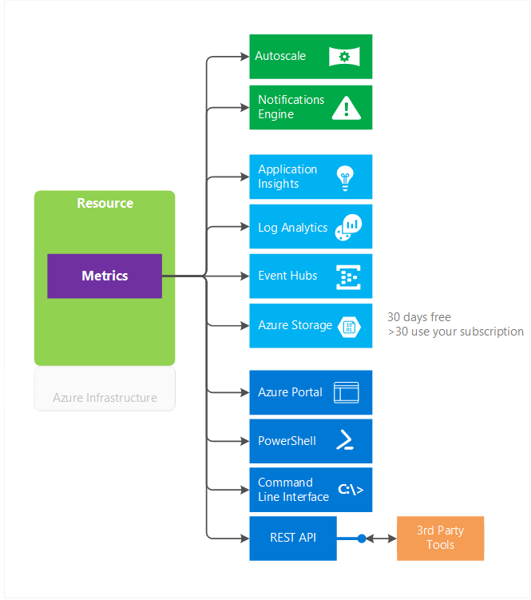
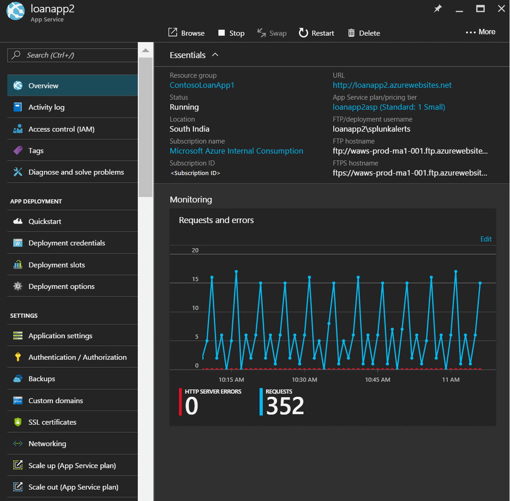
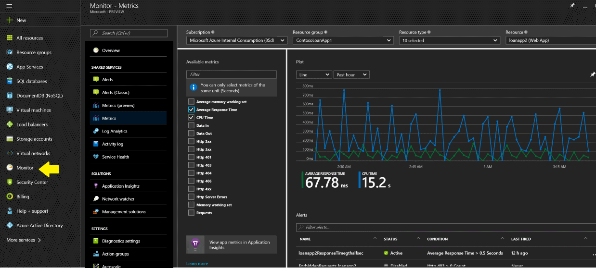
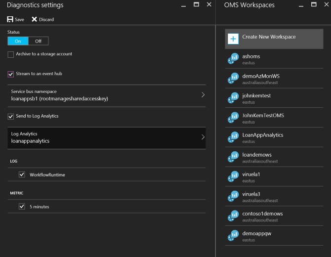
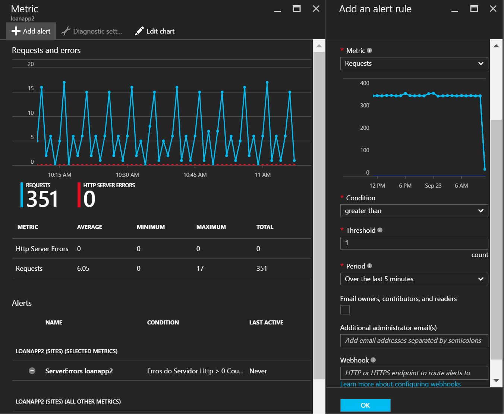
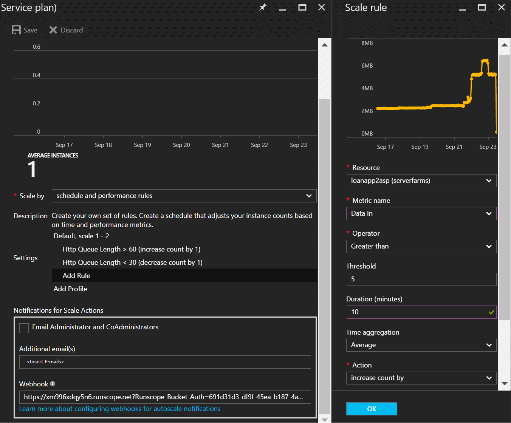

# Overview of metrics in Microsoft Azure
This article describes what metrics are in Microsoft Azure, their benefits, and how to start using them.  

## What are metrics?
Azure Monitor enables you to consume telemetry to gain visibility into the performance and health of your workloads on Azure. The most important type of Azure telemetry data is the metrics (also called performance counters) emitted by most Azure resources. Azure Monitor provides several ways to configure and consume these metrics for monitoring and troubleshooting.

## What can you do with metrics?
Metrics are a valuable source of telemetry and enable you to do the following tasks:

* **Track the performance** of your resource (such as a VM, website, or logic app) by plotting its metrics on a portal chart and pinning that chart to a dashboard.
* **Get notified of an issue** that impacts the performance of your resource when a metric crosses a certain threshold.
* **Configure automated actions**, such as autoscaling a resource or firing a runbook when a metric crosses a certain threshold.
* **Perform advanced analytics** or reporting on performance or usage trends of your resource.
* **Archive** the performance or health history of your resource **for compliance or auditing** purposes.

## What are the characteristics of metrics?
Metrics have the following characteristics:

* All metrics have **one-minute frequency**. You receive a metric value every minute from your resource, giving you near real-time visibility into the state and health of your resource.
* Metrics are **available immediately**. You don't need to opt in or set up additional diagnostics.
* You can access **30 days of history** for each metric. You can quickly look at the recent and monthly trends in the performance or health of your resource.

You can also:

* Configure a metric **alert rule that sends a notification or takes automated action** when the metric crosses the threshold that you have set. Autoscale is a special automated action that enables you to scale out your resource to meet incoming requests or loads on your website or computing resources. You can configure an Autoscale setting rule to scale in or out based on a metric crossing a threshold.

* **Route** all metrics Application Insights or Log Analytics (OMS) to enable instant analytics, search, and custom alerting on metrics data from your resources. You can also stream metrics to an Event Hub, enabling you to then route them to Azure Stream Analytics or to custom apps for near-real time analysis. You set up Event Hub streaming using diagnostic settings.

* **Archive metrics to storage** for longer retention or use them for offline reporting. You can route your metrics to Azure Blob storage when you configure diagnostic settings for your resource.

* Easily discover, access, and **view all metrics** via the Azure portal when you select a resource and plot the metrics on a chart.

* **Consume** the metrics via the new Azure Monitor REST APIs.

* **Query** metrics by using the PowerShell cmdlets or the Cross-Platform REST API.

  

## Access metrics via the portal
Following is a quick walkthrough of how to create a metric chart by using the Azure portal.

### To view metrics after creating a resource
1. Open the Azure portal.
2. Create an Azure App Service website.
3. After you create a website, go to the **Overview** blade of the website.
4. You can view new metrics as a **Monitoring** tile. You can then edit the tile and select more metrics.

   

### To access all metrics in a single place
1. Open the Azure portal.
2. Navigate to the new **Monitor** tab, and then and select the **Metrics** option underneath it.
3. Select your subscription, resource group, and the name of the resource from the drop-down list.
4. View the available metrics list. Then select the metric you are interested in and plot it.
5. You can pin it to the dashboard by clicking the pin on the upper-right corner.

   

> [!NOTE]
> You can access host-level metrics from VMs (Azure Resource Manager-based) and virtual machine scale sets without any additional diagnostic setup. These new host-level metrics are available for Windows and Linux instances. These metrics are not to be confused with the Guest-OS-level metrics that you have access to when you turn on Azure Diagnostics on your VMs or virtual machine scale sets. To learn more about configuring Diagnostics, see [What is Microsoft Azure Diagnostics](../azure-diagnostics.md).
>
>

## Access metrics via the REST API
Azure Metrics can be accessed via the Azure Monitor APIs. There are two APIs that help you discover and access metrics:

* Use the [Azure Monitor Metric definitions REST API](https://msdn.microsoft.com/library/mt743621.aspx) to access the list of metrics that are available for a service.
* Use the [Azure Monitor Metrics REST API](https://msdn.microsoft.com/library/mt743622.aspx) to access the actual metrics data.

> [!NOTE]
> This article covers the metrics via the [new API for metrics](https://msdn.microsoft.com/library/dn931930.aspx) for Azure resources. The API version for the new metric definitions API is 2016-03-01 and the version for metrics API is 2016-09-01. The legacy metric definitions and metrics can be accessed with the API version 2014-04-01.
>
>

For a more detailed walkthrough using the Azure Monitor REST APIs, see [Azure Monitor REST API walkthrough](monitoring-rest-api-walkthrough.md).

## Export metrics
You can go to the **Diagnostics settings** blade under the **Monitor** tab and view the export options for metrics. You can select metrics (and diagnostic logs) to be routed to Blob storage, to Azure Event Hubs, or to OMS for use-cases that were mentioned previously in this article.

 

You can configure this via Resource Manager templates, [PowerShell](insights-powershell-samples.md), [Azure CLI](insights-cli-samples.md), or [REST APIs](https://msdn.microsoft.com/library/dn931943.aspx).

## Take action on metrics
To receive notifications or take automated actions on metric data, you can configure alert rules or Autoscale settings.

### Configure alert rules
You can configure alert rules on metrics. These alert rules can check if a metric has crossed a certain threshold. They can then notify you via email or fire a webhook that can be used to run any custom script. You can also use the webhook to configure third-party product integrations.

 

### Autoscale your Azure resources
Some Azure resources support the scaling out or in of multiple instances to handle your workloads. Autoscale applies to App Service (Web Apps), virtual machine scale sets, and classic Azure Cloud Services. You can configure Autoscale rules to scale out or in when a certain metric that impacts your workload crosses a threshold that you specify. For more information, see [Overview of autoscaling](monitoring-overview-autoscale.md).

 

## Learn about supported services and metrics
Azure Monitor is a new metrics infrastructure. It supports the following Azure services in the Azure portal and the new version of the Azure Monitor API:

* VMs (Azure Resource Manager-based)
* Virtual machine scale sets
* Batch
* Event Hubs namespace
* Service Bus namespace (premium SKU only)
* SQL Database (version 12)
* Elastic SQL Pool
* Websites
* Web server farms
* Logic Apps
* IoT hubs
* Redis Cache
* Networking: Application gateways
* Search

You can view a detailed list of all the supported services and their metrics at [Azure Monitor metrics--supported metrics per resource type](monitoring-supported-metrics.md).

## Next steps
Refer to the links throughout this article. Additionally, learn about:  

* [Common metrics for autoscaling](insights-autoscale-common-metrics.md)
* [How to create alert rules](insights-alerts-portal.md)
* [Analyze logs from Azure storage with Log Analytics](../log-analytics/log-analytics-azure-storage.md)
