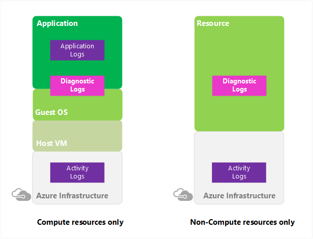
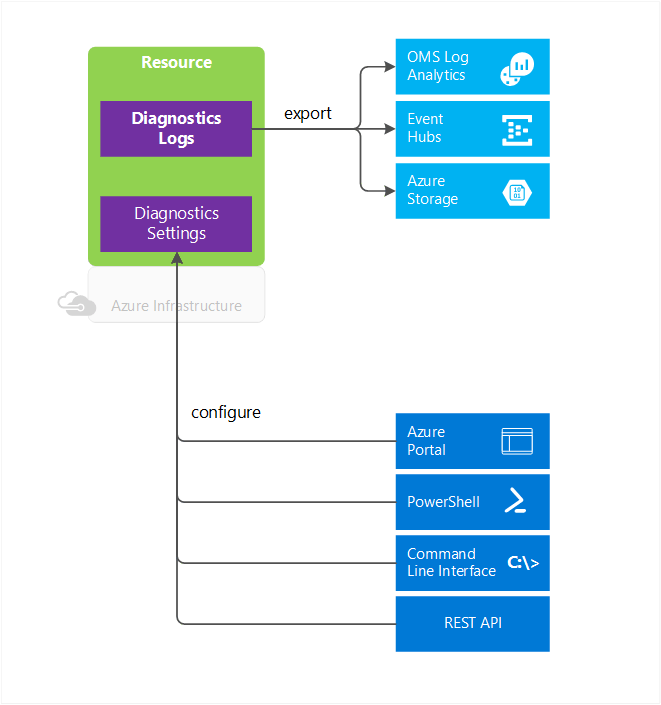
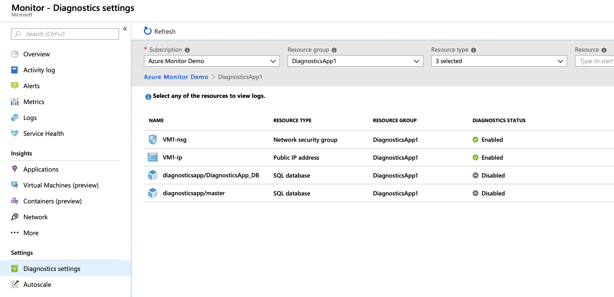
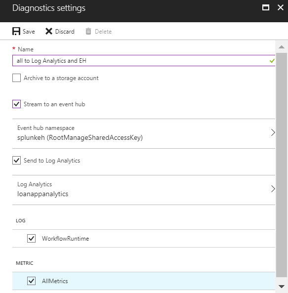
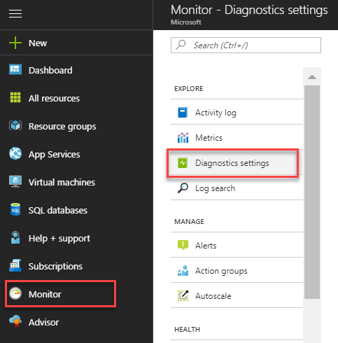

# Collect and consume log data from your Azure resources

## What are Azure Monitor diagnostic logs

**Azure Monitor diagnostic logs** are logs emitted by an Azure service that provide rich, frequent data about the operation of that service. Azure Monitor makes available two types of diagnostic logs:
* **Tenant logs** - these logs come from tenant-level services that exist outside of an Azure subscription, such as Azure Active Directory logs.
* **Resource logs** - these logs come from Azure services that deploy resources within an Azure subscription, such as Network Security Groups or Storage Accounts.

    

The content of these logs varies by the Azure service and resource type. For example, Network Security Group rule counters and Key Vault audits are two types of diagnostic logs.

These logs differ from the [Activity Log](monitoring-overview-activity-logs.md). The Activity Log provides insight into the operations that were performed on resources in your subscription using Resource Manager, for example, creating a virtual machine or deleting a logic app. The Activity Log is a subscription-level log. Resource-level diagnostic logs provide insight into operations that were performed within that resource itself, for example, getting a secret from a Key Vault.

These logs also differ from guest OS-level diagnostic logs. Guest OS diagnostic logs are those collected by an agent running inside of a virtual machine or other supported resource type. Resource-level diagnostic logs require no agent and capture resource-specific data from the Azure platform itself, while guest OS-level diagnostic logs capture data from the operating system and applications running on a virtual machine.

Not all services support the diagnostic logs described here. [This article contains a section listing which services support diagnostic logs](./monitoring-diagnostic-logs-schema.md).

## What you can do with diagnostic logs
Here are some of the things you can do with diagnostic logs:



* Save them to a [**Storage Account**](monitoring-archive-diagnostic-logs.md) for auditing or manual inspection. You can specify the retention time (in days) using **resource diagnostic settings**.
* [Stream them to **Event Hubs**](monitoring-stream-diagnostic-logs-to-event-hubs.md) for ingestion by a third-party service or custom analytics solution such as PowerBI.
* Analyze them with [Log Analytics](../log-analytics/log-analytics-azure-storage.md)

You can use a storage account or Event Hubs namespace that is not in the same subscription as the one emitting logs. The user who configures the setting must have the appropriate RBAC access to both subscriptions.

> [!NOTE]
>  You cannot currently archive network flow logs to a storage account that behind a secured virtual network.

> [!WARNING]
> The format of the log data in the storage account will change to JSON Lines on Nov. 1st, 2018. [See this article for a description of the impact and how to update your tooling to handle the new format.](./monitor-diagnostic-logs-append-blobs.md) 
>
> 

## Diagnostic settings

Resource diagnostic logs are configured using resource diagnostic settings. Tenant diagnostic logs are configured using a tenant diagnostic setting. **Diagnostic settings** for a service control:

* Where diagnostic logs and metrics are sent (Storage Account, Event Hubs, and/or Log Analytics).
* Which log categories are sent and whether metric data is also sent.
* How long each log category should be retained in a storage account
    - A retention of zero days means logs are kept forever. Otherwise, the value can be any number of days between 1 and 2147483647.
    - If retention policies are set but storing logs in a Storage Account is disabled (for example, if only Event Hubs or Log Analytics options are selected), the retention policies have no effect.
    - Retention policies are applied per-day, so at the end of a day (UTC), logs from the day that is now beyond the retention policy are deleted. For example, if you had a retention policy of one day, at the beginning of the day today the logs from the day before yesterday would be deleted. The delete process begins at midnight UTC, but note that it can take up to 24 hours for the logs to be deleted from your storage account.

These settings are easily configured via the diagnostic settings in the portal, via Azure PowerShell and CLI commands, or via the [Azure Monitor REST API](https://docs.microsoft.com/rest/api/monitor/).

> [!NOTE]
> Sending multi-dimensional metrics via diagnostic settings is not currently supported. Metrics with dimensions are exported as flattened single dimensional metrics, aggregated across dimension values.
>
> *For example*: The 'Incoming Messages' metric on an Event Hub can be explored and charted on a per queue level. However, when exported via diagnostic settings the metric will be represented as all incoming messages across all queues in the Event Hub.
>
>

## How to enable collection of diagnostic logs

Collection of diagnostic logs can be enabled [as part of creating a resource in a Resource Manager template](./monitoring-enable-diagnostic-logs-using-template.md) or after a resource is created from that resource's page in the portal. You can also enable collection at any point using Azure PowerShell or CLI commands, or using the Azure Monitor REST API.

> [!TIP]
> These instructions may not apply directly to every resource. See the schema links at the bottom of this page to understand special steps that may apply to certain resource types.

### Enable collection of diagnostic logs in the portal

You can enable collection of resource diagnostic logs in the Azure portal after a resource has been created either by going to a specific resource or by navigating to Azure Monitor. To enable this via Azure Monitor:

1. In the [Azure portal](http://portal.azure.com), navigate to Azure Monitor and click on **Diagnostic Settings**

    

2. Optionally filter the list by resource group or resource type, then click on the resource for which you would like to set a diagnostic setting.

3. If no settings exist on the resource you have selected, you are prompted to create a setting. Click "Turn on diagnostics."

   

   If there are existing settings on the resource, you will see a list of settings already configured on this resource. Click "Add diagnostic setting."

   

3. Give your setting a name, check the boxes for each destination to which you would like to send data, and configure which resource is used for each destination. Optionally, set a number of days to retain these logs by using the **Retention (days)** sliders (only applicable to the storage account destination). A retention of zero days stores the logs indefinitely.

   

4. Click **Save**.

After a few moments, the new setting appears in your list of settings for this resource, and diagnostic logs are sent to the specified destinations as soon as new event data is generated.

Tenant diagnostic settings can only be configured in the portal blade for the tenant service - these settings do not appear in the Azure Monitor diagnostic settings blade. For example, Azure Active Directory audit logs are configured by clicking on the **Data Export Settings** in the Audit Logs blade.


### Enable collection of resource diagnostic logs via PowerShell

To enable collection of resource diagnostic logs via Azure PowerShell, use the following commands:

To enable storage of diagnostic logs in a storage account, use this command:

```powershell
Set-AzureRmDiagnosticSetting -ResourceId [your resource id] -StorageAccountId [your storage account id] -Enabled $true
```

The storage account ID is the resource ID for the storage account to which you want to send the logs.

To enable streaming of diagnostic logs to an event hub, use this command:

```powershell
Set-AzureRmDiagnosticSetting -ResourceId [your resource id] -ServiceBusRuleId [your Service Bus rule id] -Enabled $true
```

The service bus rule ID is a string with this format: `{Service Bus resource ID}/authorizationrules/{key name}`.

To enable sending of diagnostic logs to a Log Analytics workspace, use this command:

```powershell
Set-AzureRmDiagnosticSetting -ResourceId [your resource id] -WorkspaceId [resource id of the log analytics workspace] -Enabled $true
```

You can obtain the resource ID of your Log Analytics workspace using the following command:

```powershell
(Get-AzureRmOperationalInsightsWorkspace).ResourceId
```

You can combine these parameters to enable multiple output options.

You cannot currently configure tenant diagnostic settings using Azure PowerShell.

### Enable collection of resource diagnostic logs via the Azure CLI

To enable collection of resource diagnostic logs via the Azure CLI, you use the [az monitor diagnostic-settings create](/cli/azure/monitor/diagnostic-settings#az-monitor-diagnostic-settings-create) command.

To enable storage of diagnostic logs in a Storage Account:

```azurecli
az monitor diagnostic-settings create --name <diagnostic name> \
    --storage-account <name or ID of storage account> \
    --resource <target resource object ID> \
    --resource-group <storage account resource group> \
    --logs '[
    {
        "category": <category name>,
        "enabled": true,
        "retentionPolicy": {
            "days": <# days to retain>,
            "enabled": true
        }
    }]'
```

The `--resource-group` argument is only required if `--storage-account` is not an object ID.

To enable streaming of diagnostic logs to an event hub:

```azurecli
az monitor diagnostic-settings create --name <diagnostic name> \
    --event-hub <event hub name> \
    --event-hub-rule <event hub rule ID> \
    --resource <target resource object ID> \
    --logs '[
    {
        "category": <category name>,
        "enabled": true
    }
    ]'
```

The rule ID is a string with this format: `{Service Bus resource ID}/authorizationrules/{key name}`.

To enable sending of diagnostic logs to a Log Analytics workspace:

```azurecli
az monitor diagnostic-settings create --name <diagnostic name> \
    --workspace <log analytics name or object ID> \
    --resource <target resource object ID> \
    --resource-group <log analytics workspace resource group> \
    --logs '[
    {
        "category": <category name>,
        "enabled": true
    }
    ]'
```

The `--resource-group` argument is only required if `--workspace` is not an object ID

With any command, you can add additional categories to the diagnostic log by adding dictionaries to the JSON array passed as the `--logs` parameter. You can combine the `--storage-account`, `--event-hub`, and `--workspace` parameters to enable multiple output options.

You cannot currently configure tenant diagnostic settings using the CLI.

### Enable collection of resource diagnostic logs via REST API

To change diagnostic settings using the Azure Monitor REST API, see [this document](https://docs.microsoft.com/rest/api/monitor/).

You cannot currently configure tenant diagnostic settings using the Azure Monitor REST API.

## Manage resource diagnostic settings in the portal

Ensure that all of your resources are set up with diagnostic settings. Navigate to **Monitor** in the portal and open **Diagnostic settings**.



You may have to click "All services" to find the Monitor section.

Here you can view and filter all resources that support diagnostic settings to see if they have diagnostics enabled. You can also drill down to see if multiple settings are set on a resource and check which storage account, Event Hubs namespace, and/or Log Analytics workspace that data are flowing to.


Adding a diagnostic setting brings up the Diagnostic Settings view, where you can enable, disable, or modify your diagnostic settings for the selected resource.

## Supported services, categories, and schemas for diagnostic logs

[See this article](monitoring-diagnostic-logs-schema.md) for a complete list of supported services and the log categories and schemas used by those services.

## Next steps

* [Stream resource diagnostic logs to **Event Hubs**](monitoring-stream-diagnostic-logs-to-event-hubs.md)
* [Change resource diagnostic settings using the Azure Monitor REST API](https://msdn.microsoft.com/library/azure/dn931931.aspx)
* [Analyze logs from Azure storage with Log Analytics](../log-analytics/log-analytics-azure-storage.md)
