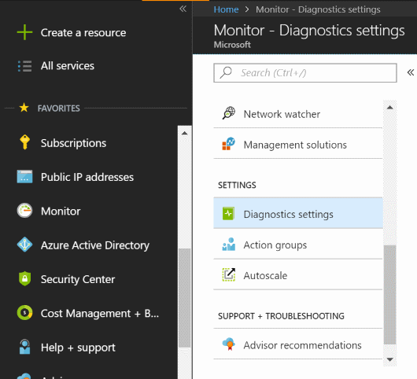
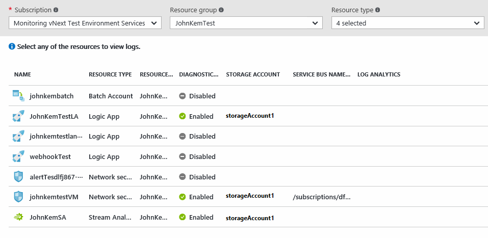

# Collect and consume diagnostic data from your Azure resources

## What are Azure Diagnostic Logs
**Azure Diagnostic Logs** are logs emitted by a resource that provide rich, frequent data about the operation of that resource. The content of these logs varies by resource type. For example, Windows event system logs are one category of Diagnostic Log for VMs and blob, table, and queue logs are categories of Diagnostic Logs for storage accounts.

Diagnostics Logs differ from the [Activity Log (formerly known as Audit Log or Operational Log)](monitoring-overview-activity-logs.md). The Activity log provides insight into the operations that were performed on resources in your subscription. Diagnostics logs provide insight into operations that your resource performed itself.

Not all resources support the new type of Diagnostic Logs described here. This article contains a section listing which resource types support the new Diagnostic Logs.


Figure 1: Diagnostics Logs vs other types of logs

## What you can do with Diagnostic Logs
Here are some of the things you can do with Diagnostic Logs:


* Save them to a [**Storage Account**](monitoring-archive-diagnostic-logs.md) for auditing or manual inspection. You can specify the retention time (in days) using the **Diagnostic Settings**.
* [Stream them to **Event Hubs**](monitoring-stream-diagnostic-logs-to-event-hubs.md) for ingestion by a third-party service or custom analytics solution such as PowerBI.
* Analyze them with [OMS Log Analytics](../log-analytics/log-analytics-azure-storage.md)

You can use a storage account or event hub namespace that is not in the same subscription as the one emitting logs. The user who configures the setting must have the appropriate RBAC access to both subscriptions.

## Diagnostic Settings
Diagnostic Logs for non-Compute resources are configured using Diagnostic Settings. **Diagnostic Settings** for a resource control:

* Where Diagnostic Logs are sent (Storage Account, Event Hubs, and/or OMS Log Analytics).
* Which Log Categories are sent.
* How long each log category should be retained in a Storage Account
    - A retention of zero days means logs are kept forever. Otherwise, the value can be any number of days between 1 and 2147483647.
    - If retention policies are set but storing logs in a Storage Account is disabled (for example, if only Event Hubs or OMS options are selected), the retention policies have no effect.
    - Retention policies are applied per-day, so at the end of a day (UTC), logs from the day that is now beyond the retention policy are deleted. For example, if you had a retention policy of one day, at the beginning of the day today the logs from the day before yesterday would be deleted.

These settings are easily configured via the Diagnostics blade for a resource in the Azure portal, via Azure PowerShell and CLI commands, or via the [Azure Monitor REST API](https://msdn.microsoft.com/library/azure/dn931943.aspx).

> [!WARNING]
> Diagnostic logs and metrics for Compute resources (for example, VMs or Service Fabric) use [a separate mechanism for configuration and selection of outputs](../azure-diagnostics.md).
>
>

## How to enable collection of Diagnostic Logs
Collection of Diagnostic Logs can be enabled as part of creating a resource or after a resource is created via the resource’s blade in the Portal. You can also enable Diagnostic Logs at any point using Azure PowerShell or CLI commands, or using the Azure Monitor REST API.

> [!TIP]
> These instructions may not apply directly to every resource. See the schema links at the bottom of this page to understand special steps that may apply to certain resource types.
>
>

[This article shows how you can use a resource template to enable Diagnostic Settings when creating a resource](monitoring-enable-diagnostic-logs-using-template.md)

### Enable Diagnostic Logs in the portal
You can enable Diagnostic Logs in the Azure portal when you create compute resource types by enabling the Windows or Linux Azure Diagnostics extension:

1. Go to **New** and choose the resource you are interested in.
2. After configuring the basic settings and selecting a size, in the **Settings** blade, under **Monitoring**, select **Enabled** and choose a storage account where you would like to store the Diagnostic Logs. You are charged normal data rates for storage and transactions when you send diagnostics to a storage account.

   
3. Click **OK** and create the resource.

For non-compute resources, you can enable Diagnostic Logs in the Azure portal after a resource has been created by doing the following:

1. Go to the blade for the resource and open the **Diagnostics** blade.
2. Click **On** and pick a Storage Account and/or Event Hub.

   
3. Under **Logs**, select which **Log Categories** you would like to collect or stream.
4. Click **Save**.

### Enable Diagnostic Logs via PowerShell
To enable Diagnostic Logs via the Azure PowerShell Cmdlets, use the following commands.

To enable storage of Diagnostic Logs in a Storage Account, use this command:

```powershell
    Set-AzureRmDiagnosticSetting -ResourceId [your resource id] -StorageAccountId [your storage account id] -Enabled $true
```

The Storage Account ID is the resource id for the storage account to which you want to send the logs.

To enable streaming of Diagnostic Logs to an Event Hub, use this command:

```powershell
    Set-AzureRmDiagnosticSetting -ResourceId [your resource id] -ServiceBusRuleId [your service bus rule id] -Enabled $true
```

The Service Bus Rule ID is a string with this format: `{service bus resource ID}/authorizationrules/{key name}`.

To enable sending of Diagnostic Logs to a Log Analytics workspace, use this command:

```powershell
    Set-AzureRmDiagnosticSetting -ResourceId [your resource id] -WorkspaceId [resource id of the log analytics workspace] -Enabled $true
```

You can obtain the resource id of your Log Analytics workspace using the following command:

```powershell
(Get-AzureRmOperationalInsightsWorkspace).ResourceId
```

You can combine these parameters to enable multiple output options.

### Enable Diagnostic Logs via CLI
To enable Diagnostic Logs via the Azure CLI, use the following commands:

To enable storage of Diagnostic Logs in a Storage Account, use this command:

```azurecli
    azure insights diagnostic set --resourceId <resourceId> --storageId <storageAccountId> --enabled true
```

The Storage Account ID is the resource id for the storage account to which you want to send the logs.

To enable streaming of Diagnostic Logs to an Event Hub, use this command:

```azurecli
    azure insights diagnostic set --resourceId <resourceId> --serviceBusRuleId <serviceBusRuleId> --enabled true
```

The Service Bus Rule ID is a string with this format: `{service bus resource ID}/authorizationrules/{key name}`.

To enable sending of Diagnostic Logs to a Log Analytics workspace, use this command:

```azurecli
    azure insights diagnostic set --resourceId <resourceId> --workspaceId <resource id of the log analytics workspace> --enabled true
```

You can combine these parameters to enable multiple output options.

### Enable Diagnostic Logs via REST API
To change Diagnostic Settings using the Azure Monitor REST API, see [this document](https://msdn.microsoft.com/library/azure/dn931931.aspx).

## Manage Diagnostic Settings in the portal
Ensure that all of your resources are set up with diagnostic settings. Navigate to the **Monitoring** blade in the portal and open the **Diagnostic Logs** blade.



You may have to click "More services" to find the Monitoring blade.

In this blade, you can view and filter all resources that support Diagnostic Logs to see if they have diagnostics enabled. You can also check which storage account, event hub, and/or Log Analytics workspace those logs are flowing to.



Clicking on a resource shows all logs that have been stored in the storage account and give you the option to turn off or modify the diagnostic settings. Click the download icon to download logs for a particular time period.


> [!NOTE]
> Diagnostic logs only appear in this view and be available for download if you have configured diagnostic settings to save them to a storage account.
>
>

Clicking on the link for **Diagnostic Settings** shows the Diagnostic Settings blade, where you can enable, disable, or modify your diagnostic settings for the selected resource.

## Supported services and schema for Diagnostic Logs
The schema for Diagnostic Logs varies depending on the resource and log category.   

| Service | Schema & Docs |
| --- | --- |
| API Management | Schema not available. |
| Application Gateways |[Diagnostics Logging for Application Gateway](../application-gateway/application-gateway-diagnostics.md) |
| Azure Automation |[Log analytics for Azure Automation](../automation/automation-manage-send-joblogs-log-analytics.md) |
| Azure Batch |[Azure Batch diagnostic logging](../batch/batch-diagnostics.md) |
| Customer Insights | Schema not available. |
| Content Delivery Network | Schema not available. |
| Data Lake Analytics |[Accessing diagnostic logs for Azure Data Lake Analytics](../data-lake-analytics/data-lake-analytics-diagnostic-logs.md) |
| Data Lake Store |[Accessing diagnostic logs for Azure Data Lake Store](../data-lake-store/data-lake-store-diagnostic-logs.md) |
| Event Hubs |[Azure Event Hubs diagnostic logs](../event-hubs/event-hubs-diagnostic-logs.md) |
| Key Vault |[Azure Key Vault Logging](../key-vault/key-vault-logging.md) |
| Load Balancer |[Log analytics for Azure Load Balancer](../load-balancer/load-balancer-monitor-log.md) |
| Logic Apps |[Logic Apps B2B custom tracking schema](../logic-apps/logic-apps-track-integration-account-custom-tracking-schema.md) |
| Network Security Groups |[Log analytics for network security groups (NSGs)](../virtual-network/virtual-network-nsg-manage-log.md) |
| Recovery Services | Schema not available.|
| Search |[Enabling and using Search Traffic Analytics](../search/search-traffic-analytics.md) |
| Server Management | Schema not available. |
| Service Bus |[Azure Service Bus diagnostic logs](../service-bus-messaging/service-bus-diagnostic-logs.md) |
| Stream Analytics |[Job diagnostic logs](../stream-analytics/stream-analytics-job-diagnostic-logs.md) |

## Supported log categories per resource type
|Resource Type|Category|Category Display Name|
|---|---|---|
|Microsoft.ApiManagement/service|GatewayLogs|Logs related to ApiManagement Gateway|
|Microsoft.Automation/automationAccounts|JobLogs|Job Logs|
|Microsoft.Automation/automationAccounts|JobStreams|Job Streams|
|Microsoft.Automation/automationAccounts|DscNodeStatus|Dsc Node Status|
|Microsoft.Batch/batchAccounts|ServiceLog|Service Logs|
|Microsoft.Cdn/profiles/endpoints|CoreAnalytics|Gets the metrics of the endpoint, e.g., bandwidth, egress, etc.|
|Microsoft.CustomerInsights/hubs|AuditEvents|AuditEvents|
|Microsoft.DataLakeAnalytics/accounts|Audit|Audit Logs|
|Microsoft.DataLakeAnalytics/accounts|Requests|Request Logs|
|Microsoft.DataLakeStore/accounts|Audit|Audit Logs|
|Microsoft.DataLakeStore/accounts|Requests|Request Logs|
|Microsoft.EventHub/namespaces|ArchiveLogs|Archive Logs|
|Microsoft.EventHub/namespaces|OperationalLogs|Operational Logs|
|Microsoft.EventHub/namespaces|AutoScaleLogs|Auto Scale Logs|
|Microsoft.KeyVault/vaults|AuditEvent|Audit Logs|
|Microsoft.Logic/workflows|WorkflowRuntime|Workflow runtime diagnostic events|
|Microsoft.Logic/integrationAccounts|IntegrationAccountTrackingEvents|Integration Account track events|
|Microsoft.Network/networksecuritygroups|NetworkSecurityGroupEvent|Network Security Group Event|
|Microsoft.Network/networksecuritygroups|NetworkSecurityGroupRuleCounter|Network Security Group Rule Counter|
|Microsoft.Network/loadBalancers|LoadBalancerAlertEvent|Load Balancer Alert Events|
|Microsoft.Network/loadBalancers|LoadBalancerProbeHealthStatus|Load Balancer Probe Health Status|
|Microsoft.Network/applicationGateways|ApplicationGatewayAccessLog|Application Gateway Access Log|
|Microsoft.Network/applicationGateways|ApplicationGatewayPerformanceLog|Application Gateway Performance Log|
|Microsoft.Network/applicationGateways|ApplicationGatewayFirewallLog|Application Gateway Firewall Log|
|Microsoft.RecoveryServices/Vaults|AzureBackupReport|Azure Backup Reporting Data|
|Microsoft.RecoveryServices/Vaults|AzureSiteRecoveryJobs|Azure Site Recovery Jobs|
|Microsoft.RecoveryServices/Vaults|AzureSiteRecoveryEvents|Azure Site Recovery Events|
|Microsoft.RecoveryServices/Vaults|AzureSiteRecoveryReplicatedItems|Azure Site Recovery Replicated Items|
|Microsoft.Search/searchServices|OperationLogs|Operation Logs|
|Microsoft.ServerManagement/nodes|RequestLogs|Request Logs|
|Microsoft.ServiceBus/namespaces|OperationalLogs|Operational Logs|
|Microsoft.StreamAnalytics/streamingjobs|Execution|Execution|
|Microsoft.StreamAnalytics/streamingjobs|Authoring|Authoring|

## Next Steps

* [Stream Diagnostic Logs to **Event Hubs**](monitoring-stream-diagnostic-logs-to-event-hubs.md)
* [Change Diagnostic Settings using the Azure Monitor REST API](https://msdn.microsoft.com/library/azure/dn931931.aspx)
* [Analyze logs from Azure storage with Log Analytics](../log-analytics/log-analytics-azure-storage.md)
