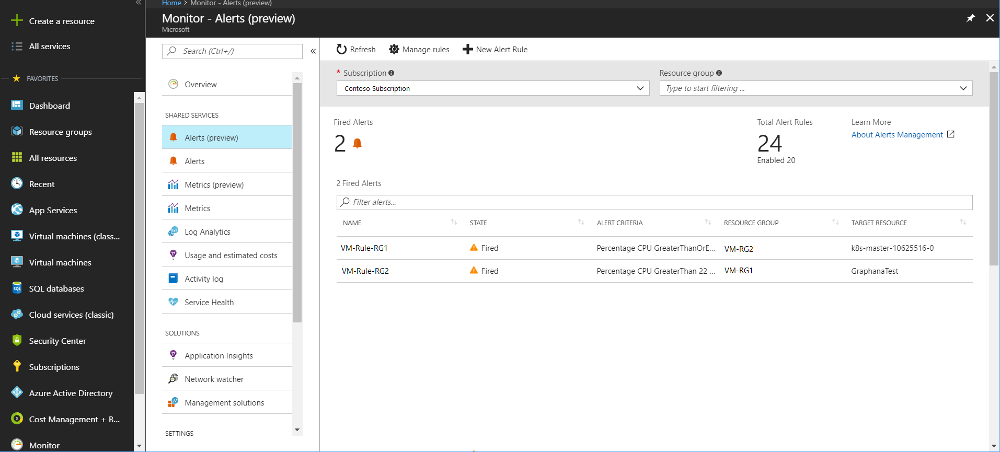
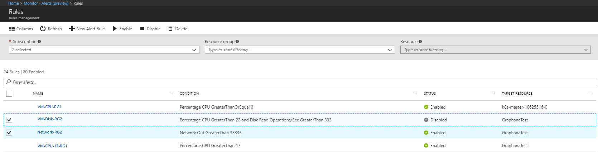

# Explore the new Alerts (Preview) experience in Azure Monitor

## Overview
 Alerts experience in Azure has a fresh look and updated functionality. This new experience is available from the **Alerts (Preview)** tab under Azure Monitor. The following are some of the advantages of using the new Alerts (Preview) experience:

 - **Separation of Fired alerts and Alert Rules** - In the Alerts(Preview) experience, Alert Rules (the definition of condition that triggers an alert), and Fired Alerts (an instance of the alert rule firing) are differentiated, so the operational and configuration views are separated.
 - **A unified authoring experience for metric and log alerts** - The new Alerts (Preview) authoring experience guides the user along the process of configuring an alert rule, which makes it simpler to discover the right things to get alerted on.
 - **View fired Log Analytics alerts in Azure portal** - In the Alerts (Preview) experience, you can now also see fired Log Analytics alerts in your subscription.  
 - **Unified authoring experience for Activity log alerts** - You can now create Activity log alerts directly from **Monitor** > **Alerts (Preview)**. Earlier you could create these only  through **Monitor** > **Activity log**.

The following sections describe, in more detail, how the new experience works.

## Taxonomy
The Alerts(preview) experience uses following concepts to separate the Alert Rule and Fired Alert objects while unifying the authoring experience across different alert types.

- **Target Resource** - A target can be any Azure resource. Target Resource defines the scope and signals available for alerting. Example targets: a virtual machine, a storage account, a virtual machine scale set, a Log Analytics workspace, or solution.

- **Criteria** - Criteria is combination of Signal and Logic applied on a Target resource. Examples: Percentage CPU > 70%, Server Response Time > 4 ms, Result count of a log query > 100 etc. 

- **Signal** - Signals are emitted by the Target resource and can be of several types. This preview supports **Metric**, **Activity log**, **Application Insights** and **Log** as Signal types.

- **Logic** - User-defined logic to check if the Signal is within expected range/values.  
 
- **Action** - A specific call sent to a receiver of a notification (for example, emailing an address or posting to a webhook URL). Notifications can usually trigger multiple actions. The alert types supported in this preview, support action groups.  
 
- **Alert rule** - The definition of a condition that would trigger the alert. In this preview, Alert rule captures the Target and Criteria for alerting. The Alert rule can be in an Enabled or a Disabled state.
 
- **Fired Alert**  - Created when an enabled Alert rule is fired. The fired alert object can be in Fired or Unresolved state.

    > [!NOTE]
    > This is different from current alerts experience where the alert represents both the rule and fired alert and therefore can be in one of Warning, Active or Disabled states.
    >

## Single place to view and manage alerts
The goal of the Alerts (Preview) experience is to be the single place to view and manage all your Azure alerts. The following subsections describe the functions of each individual screen of the new experience.

### Alerts (preview) overview page
**Monitor - Alerts (Preview)** overview page shows aggregated summary of all the fired alerts, and total configured/enabled alert rules. It also shows a list of all fired alerts. Changing the subscriptions or filter parameters updates the aggregates and the alerts fired list.

> [!NOTE]
> Fired Alerts shown in Alerts (Preview) are limited to supported metric and log alerts; Azure Monitor shows count of fire alerts including those in older Azure Alerts

  

### Alert rules management
**Monitor - Alerts (Preview)>Rules** is a single page to manage all alert rules across your Azure subscriptions. It lists all the alert rules (enabled or disabled) and can be sorted based on target resources, resource groups, rule name, or status. Alert rules can also be disabled/enabled or edited from this page.  

 

## One alert authoring experience across all monitoring sources
In the Alerts (Preview) experience, alerts can be authored in a consistent manner regardless of the monitoring service or signal type. All alerts fired and related details are available in single page.  
 
Authoring an alert is a three-step task where the user first picks a target for the alert, followed by selecting the right signal and then specifying the logic to be applied on the signal as part of the alert rule. This simplified authoring process no longer requires the user to know the monitoring source or signals supported before selecting an Azure resource. The common authoring experience automatically filters the list of available signals based on target resource selected and guides the creation of alert logic

You can learn more on how to create following alert types [here](monitor-alerts-unified-usage.md).
- Metric Alerts (called Near-Real-Time Metric Alerts in current experience)
- Log alerts (Log Analytics)
- Log alerts (Activity Logs)
- Log  alerts (Application Insights)

 

## Alert types supported in this preview

| **Signal Type** | **Monitor Source** | **Description** | 
|-------------|----------------|-------------|
| Metric | Azure monitor | Called [**Near-Real-Time Metric alerts**](monitoring-near-real-time-metric-alerts.md) in current experience, these metric alerts support evaluating metric conditions as frequently as 1 min and allow for multi-metric rules. A list of supported resource types is available [here](monitoring-near-real-time-metric-alerts.md#what-resources-can-i-create-near-real-time-metric-alerts-for). Other metric alerts as defined [here](monitoring-overview-alerts.md#alerts-in-different-azure-services) are not supported in the Alerts (Preview) experience.|
| Logs  | Log Analytics | Receive notifications or run automated actions when a Log search query over metric and/or event data meets certain criteria.|
| Logs  | Activity Logs | This category contains the records of all Create, Update, and Delete actions performed through the selected target (resource/resource group/subscription). |
| Logs  | Service Health Logs | Not supported in Alerts (Preview) experience.   |
| Logs  | Application Insights | This category contains logs with the performance details of your application. Using analytics query, you can define the conditions for the actions to be taken - based on the application data. |
| Metric | Application Insights | Not supported in Alerts (Preview) experience. |
| Availability Tests | Application Insights | Not supported in Alerts (Preview) experience. |

## Next steps
- [Learn how to use the new Alerts (Preview) experience to create, view, and manage alerts](monitor-alerts-unified-usage.md)
- [Learn about log alerts in Alerts (Preview) experience](monitor-alerts-unified-log.md)
- [Learn about metric alerts in Alerts (Preview) experience](monitoring-near-real-time-metric-alerts.md)
- [Learn about Activity log alerts in Alerts (Preview) experience](monitoring-activity-log-alerts-new-experience.md)
