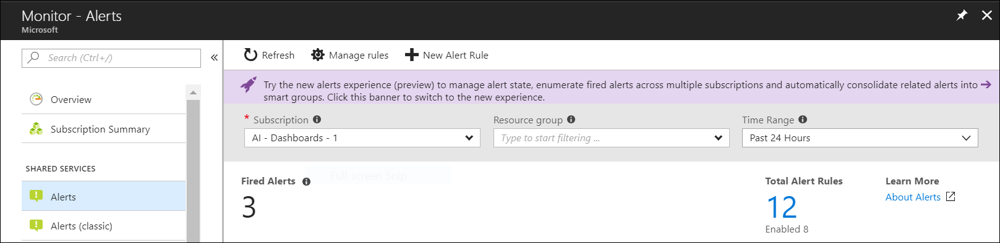
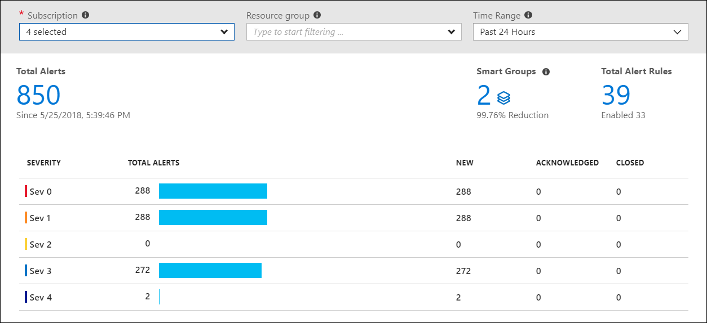
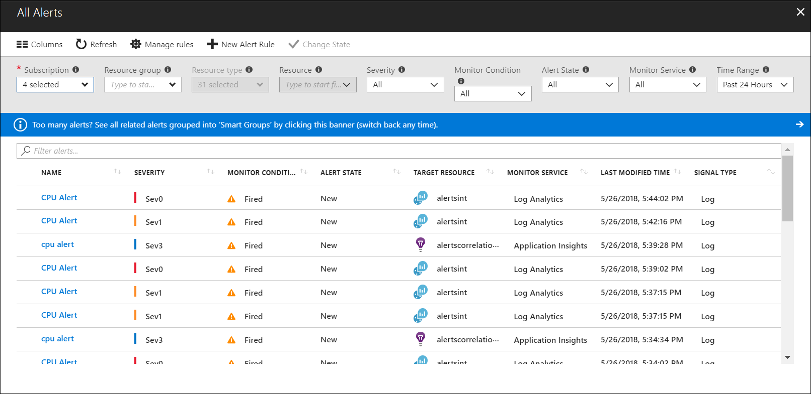

---
title: Unified alerts in Azure Monitor
description: Description of unified alerts in Azure that allow you to manage alerts and alerts rules across Azure services.
author: manishsm-msft
services: monitoring
ms.service: azure-monitor
ms.topic: conceptual
ms.date: 06/07/2018
ms.author: mamit
ms.component: alerts
---

# Unified alerts in Azure Monitor

## Overview

> [!NOTE]
>  A new unified alert experience that enables you to manage alerts from multiple subscriptions and introduces alert states and smart groups is currently available in public preview. See the last section of this article for a description of this enhanced experience and the process for enabling it.

This article describes the unified alert experience in Azure Monitor. The [previous alert experience](monitoring-overview-alerts.md) is available from the **Alerts (Classic)** option in the Azure Monitor menu. 

## Features of the unified alert experience

The unified experience has the following benefits over the classic experience:

-	**Better notification system**: [Action groups](https://docs.microsoft.com/azure/monitoring-and-diagnostics/monitoring-action-groups) are named groups of notifications and actions that can be reused in multiple alerts. 
- **Unified authoring experience**: Alerts and alert rules for metrics, logs, and activity logs across Azure Monitor, Log Analytics, and Application Insights can be managed in one place. 
- **View fired Log Analytics alerts in the Azure portal**: Log Analytics alerts can now be viewed with alerts from other sources in the Azure portal. Previously, alerts from other sources were in a separate portal.
- **Separation of fired alerts and alert rules**: Alert rules are now distinguished from alerts. An alert rule is the definition of a condition that triggers an alert. An alert is an instance of an alert rule firing.
- **Better workflow**: The unified alert authoring experience guides you through the process of configuring an alert rule.
 
Metric alerts have the following improvements over classic metric alerts:

-	**Improved latency**: Metric alerts can run as frequently as once every minute. Classic metric alerts always run at a frequency of once every 5 minutes. Log alerts still have a delay longer than a minute due to the time it takes to ingest the logs. 
-	**Support for multi-dimensional metrics**: You can alert on dimensional metrics, which means you can monitor a specific instance of the metric.
-	**More control over metric conditions**: You can define richer alert rules that support monitoring the maximum, minimum, average, and total values of metrics.
-	**Combined monitoring of multiple metrics**: You can monitor up to two metrics with a single rule. An alert is triggered if both metrics breach their respective thresholds for the specified time period.
-	**Metrics from logs** (limited public preview): Some log data that's going into Log Analytics can now be extracted and converted into Azure Monitor metrics and then alerted on just like other metrics. 

## Alert rules
The unified alerts experience uses the following concepts to separate alert rules from alerts while unifying the authoring experience across different alert types.

| Item | Definition |
|:---|:---|
| Alert rule | Definition of the condition to create an alert. An alert rule is composed of a _target resource_, _signal_, _criteria_, and _logic_. An alert rule is only active if it's in an _enabled_ state.
| Target resource | Defines the specific resources and signals that are available for alerting. A target can be any Azure resource.  Examples: virtual machine, storage account, virtual machine scale set, Log Analytics workspace, Application Insights resource |
| Signal | Source of data emitted by the target resource. Supported signal types are *Metric*, *Activity log*, *Application Insights*, and *Log*. |
| Criteria | Combination of _signal_ and _logic_ applied on a target resource.  Examples: Percentage CPU > 70%, Server Response Time > 4 ms, Result count of a log query > 100, and so on |
| Logic | User-defined logic to verify that the signal is within expected the range/values. |
| Action | Action to perform when the alert is fired. Multiple actions can occur when an alert fires. These alerts support action groups.  Examples: emailing to email address, calling a webhook URL |
| Monitor condition | Indicates whether the condition that created a metric alert has been resolved. Metric alert rules sample a particular metric at regular intervals. If the criteria in the alert rule is met, then a new alert is created with a condition of "fired."  When the metric is sampled again, if the criteria is still met, then nothing happens.  If the criteria is not met, then the condition of the alert is changed to "resolved." The next time that the criteria is met, another alert is created with a condition of "fired." |

## Alert pages
Unified alerts provide a single place to view and manage all your Azure alerts. The following sections describe the functions of each individual page of the unified experience.

### Alerts overview page
The **Alerts** overview page shows an aggregated summary of all fired alerts, and the total number of enabled alert rules. Changing the subscriptions or filter parameters updates the aggregates and the alerts fired list.

  

### Alert rules management
**Rules** is a single page for managing all alert rules across your Azure subscriptions. It lists all alert rules and can be sorted based on target resources, resource groups, rule name, or status. Alert rules can also be edited, enabled, or disabled from this page.

 

## Create an alert rule
Alerts can be authored in a consistent manner regardless of the monitoring service or signal type. All fired alerts and related details are available in single page.
 
You create a new alert rule with the following three steps:
1. Pick the _target_ for the alert.
1. Select the _signal_ from the available signals for the target.
1. Specify the _logic_ to be applied to data from the signal.
 
This simplified authoring process no longer requires you to know the monitoring source or signals that are supported before selecting an Azure resource. The list of available signals is automatically filtered based on the target resource that you select, and it guides you through defining the logic of the alert rule.

You can learn more about how to create alert rules in [Create, view, and manage alerts using Azure Monitor](monitor-alerts-unified-usage.md).

Alerts are available across several Azure monitoring services. For information about how and when to use each of these services, see [Monitoring Azure applications and resources](./monitoring-overview.md). The following table provides a listing of the types of alert rules that are available across Azure. It also lists what's currently supported by the unified alert experience.

| **Monitor source** | **Signal type**  | **Description** | 
|-------------|----------------|-------------|
| Azure Monitor | Metric  | Also called [near-real-time metric alerts](monitoring-near-real-time-metric-alerts.md), they support evaluating metric conditions as frequently as once a minute and allow for multi-metric and multi-dimensional metric rules. A list of supported resource types is available in [Newer metric alerts for Azure services in the Azure portal](monitoring-near-real-time-metric-alerts.md#metrics-and-dimensions-supported). [Classic metric alerts](monitoring-overview-alerts.md) are not supported in the new alerts experience. You can find them under Alerts (Classic) in the Azure portal. The classic alerts support some metric types that have not yet been moved to the newer alerts. For a full list, see [supported metrics](https://docs.microsoft.com/azure/monitoring-and-diagnostics/monitoring-supported-metrics). |
| Log Analytics | Logs  | Receive notifications or run automated actions when a log search query meets certain criteria. Alerts in Log Analytics are [being copied into the new experience](monitoring-alerts-extend.md). A [preview of *Log Analytics logs as metrics*](monitoring-alerts-extend-tool.md) is available. The preview enables you to take certain types of logs and convert them to metrics, where you can then alert on them by using the new alerting experience. The preview is useful if you have non-Azure logs that you want to get along with native Azure Monitor metrics. |
| Activity logs | Activity log | Contains the records of all create, update, and delete actions that were created by the selected target. |
| Service health | Activity log  | Not supported in unified alerts. See [Create activity log alerts on service notifications](monitoring-activity-log-alerts-on-service-notifications.md).  |
| Application Insights | Logs  | Contains logs with the performance details of your application. By using the analytics query, you can define the conditions for the actions to be taken based on application data. |
| Application Insights | Metric | Not supported in unified alerts. See [Metric alerts](../application-insights/app-insights-alerts.md). |
| Application Insights | Web availability tests | Not supported in unified alerts.  See [Web test alerts](../application-insights/app-insights-monitor-web-app-availability.md). Available to any website that's instrumented to send data to Application Insights. Receive a notification when availability or responsiveness of a website is below expectations. |

## Enhanced unified alerts (public preview)

An enhanced unified alerts experience was released in public preview for Azure Monitor on June 1, 2018. This experience builds on the benefits of [unified alerts](#overview), which were released in March 2018, and which provide the ability to manage and aggregate individual alerts and modify the alert state. This section describes the new features and how to navigate the new alert pages in the Azure portal.

### Enhanced unified alerts

The new experience provides the following features that aren't available in the classic unified experience:

- **View alerts across subscriptions**: You can now view and manage individual instances of alerts across multiple subscriptions in a single view.
- **Manage the state of alerts**: Alerts now have a state that indicates whether they've been acknowledged as closed.
- **Organize alerts with smart groups**: Smart groups automatically group together related alerts so you can manage them as a set instead of individually.

### Enable enhanced unified alerts
Enable the new unified alerts experience by selecting the banner at the top of the Alerts page. This process creates an alert store that includes the past 30 days of fired alerts across supported services. After the new experience is enabled, you can switch back and forth between the new and old experience by selecting this banner.

> [!NOTE]
>  It might take a few minutes for the new experience to be enabled initially.

All subscriptions that you have access to are enrolled when you enable the new experience. Although the entire subscription is enabled, only users that select the new experience can view it. Other users with access to the subscription must enable the experience separately.

Enabling the new alert experience does not impact the configuration of action groups or notifications in your alert rules. It only changes the way that you view and manage fired instances of the alerts in the Azure portal.

### Smart groups
Smart groups reduce noise by allowing you to manage related alerts as a single unit rather than as individual alerts. You can view the details of smart groups and set the state similarly to how you can with alerts. Each alert is a member of one and only one smart group.

Smart groups are automatically created by using machine learning to combine related alerts that represent a single issue. When an alert is created, the algorithm adds it to a new smart group or an existing smart group based on information such as historical patterns, similar properties, and similar structure. 

Currently, the algorithm only considers alerts from the same monitor service within a subscription. Smart groups can reduce up to 99% of alert noise through this consolidation. You can view the reason that alerts were included in a group in the smart group detail page.

The name of a smart group is the name of its first alert. You can't create or rename a smart group.

### Alert states
Enhanced unified alerts introduce the concept of alert state. You can set the state of an alert to specify where it is in the resolution process. When an alert is created, it has a status of *New*. You can change the status when you acknowledge an alert and when you close it. All state changes are stored in the history of the alert.

The following alert states are supported.

| State | Description |
|:---|:---|
| New | The issue has just been detected and has not yet been reviewed. |
| Acknowledged | An administrator has reviewed the alert and started working on it. |
| Closed | The issue has been resolved. After an alert has been closed, you can reopen it by changing it to another state. |

The state of an alert is different than the monitor condition. Metric alert rules can set an alert to a condition of _resolved_ when the error condition is no longer met. Alert state is set by the user and is independent of the monitor condition. Although the system can set the monitor condition to "resolved," the alert state isn't changed until the user changes it.

#### Change the state of an alert or smart group
You can change the state of an individual alert or manage multiple alerts together by setting the state of a smart group.

Change the state of an alert by selecting **Change alert state** in the detail view for the alert. Or change the state for a smart group by selecting **Change smart group state** in its detail view. Change the state of multiple items at one time by first selecting them in a list view and then selecting **Change State** at the top of the page. 

In both cases, select a new state from the dropdown menu. Then provide an optional comment. If you're changing a single item, you also have an option to apply the same changes to all the alerts in the smart group.

### Alerts page
The default Alerts page provides a summary of alerts that are created within a particular time window. It displays the total alerts for each severity with columns that identify the total number of alerts in each state for each severity. Select any of the severities to open the [All Alerts](#all-alerts-page) page filtered by that severity.

You can filter this view by selecting values in the dropdown menus at the top of the page.

| Column | Description |
|:---|:---|
| Subscription | Select up to five Azure subscriptions. Only alerts in the selected subscriptions are included in the view. |
| Resource group | Select a single resource group. Only alerts with targets in the selected resource group are included in the view. |
| Time range | Only alerts fired within the selected time window are included in the view. Supported values are the past hour, the past 24 hours, the past 7 days, and the past 30 days. |

Select the following values at the top of the Alerts page to open another page.

| Value | Description |
|:---|:---|
| Total alerts | The total number of alerts that match the selected criteria. Select this value to open the All Alerts view with no filter. |
| Smart groups | The total number of smart groups that were created from the alerts that match the selected criteria. Select this value to open the smart groups list in the All Alerts view.
| Total alert rules | The total number of alert rules in the selected subscription and resource group. Select this value to open the Rules view filtered on the selected subscription and resource group.

### All Alerts page 
By using the All Alerts page, you can view a list of alerts that were created within the selected time window. You can view either a list of the individual alerts or a list of the smart groups that contain the alerts. Select the banner at the top of the page to toggle between views.

You can filter the view by selecting the following values in the dropdown menus at the top of the page.

| Column | Description |
|:---|:---|
| Subscription | Select up to five Azure subscriptions. Only alerts in the selected subscriptions are included in the view. |
| Resource group | Select a single resource group. Only alerts with targets in the selected resource group are included in the view. |
| Resource type | Select one or more resource types. Only alerts with targets of the selected type are included in the view. This column is only available after a resource group has been specified. |
| Resource | Select a resource. Only alerts with that resource as a target are included in the view. This column is only available after a resource type has been specified. |
| Severity | Select an alert severity, or select *All* to include alerts of all severities. |
| Monitor condition | Select a monitor condition, or select *All* to include alerts of conditions. |
| Alert state | Select an alert state, or select *All* to include alerts of states. |
| Monitor service | Select a service, or select *All* to include all services. Only alerts created by rules that use service as a target are included. |
| Time range | Only alerts fired within the selected time window are included in the view. Supported values are the past hour, the past 24 hours, the past 7 days, and the past 30 days. |

Select **Columns** at the top of the page to select which columns to display. 

### Alert detail page
The Alert detail page is displayed when you select an alert. It provides details of the alert and enables you to change its state.

The Alert detail page includes the following sections.

| Section | Description |
|:---|:---|
| Essentials | Displays the properties and other significant information about the alert. |
| History | Lists each action taken by the alert and any changes made to the alert. This is currently limited to state changes. |
| Smart group | Information about the smart group the alert is included in. The *alert count* refers to the number of alerts that are included in the smart group. This includes the other alerts in the same smart group that were created in the past 30 days.  This is regardless of the time filter in the alerts list page. Select an alert to view its detail. |
| More details | Displays further contextual information for the alert, which is typically specific to the type of source that created the alert. |

### Smart group detail page
The Smart group detail page is displayed when you select a smart group. It provides details about the smart group, including the reasoning that was used to create the group, and enables you to change its state.
 

The smart group detail page includes the following sections.

| Section | Description |
|:---|:---|
| Alerts | Lists the individual alerts that are included in the smart group. Select an alert to open its alert detail page. |
| History | Lists each action taken by the smart group and any changes that are made to it. This is currently limited to state changes and alert membership changes. |

## Next steps
- [Learn how to use the new Alerts experience to create, view, and manage alerts](monitor-alerts-unified-usage.md)
- [Learn about log alerts in the Alerts experience](monitor-alerts-unified-log.md)
- [Learn about metric alerts in the Alerts experience](monitoring-near-real-time-metric-alerts.md)
- [Learn about Activity log alerts in the Alerts experience](monitoring-activity-log-alerts-new-experience.md)
