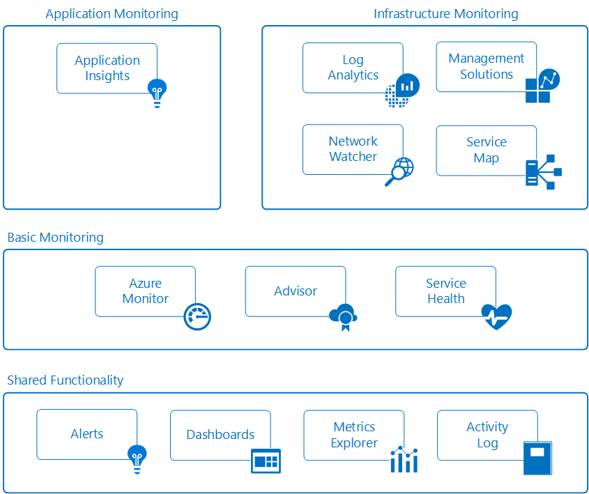

# Monitoring Azure applications and resources

Monitoring is the act of collecting and analyzing data to determine the performance, health, and availability of your business application and the resources it depends on. An effective monitoring strategy will help you understand the detailed operation of the different components of your application and to increase your uptime by proactively notifying you of critical issues so that you can resolve them before they become problems.

Azure includes multiple services that individually perform a specific role or task in the monitoring space and together deliver a comprehensive solution for collecting, analyzing and acting on telemetry from your application and the underlying Azure resources supporting them.  They can also work to monitor critical on-premises resources in order to provide a hybrid monitoring environment.   Understanding the tools and data that are available is the first step in developing a complete monitoring strategy for your application. 

The following diagram shows a conceptual view of the different components that work together to provide monitoring of Azure resources.  Each of these is described in the following sections with links to detailed technical information.

## Basic Monitoring
Basic monitoring provides fundamental required monitoring across Azure resources.  These services require minimal configuration and collect core telemetry that's leveraged by the premium monitoring services.    

### Azure Monitor
[Azure Monitor](../monitoring-and-diagnostics/monitoring-overview-azure-monitor.md) enables basic monitoring for Azure service by allowing collection of [Metrics](../monitoring-and-diagnostics/monitoring-overview-metrics.md), [Activity Logs](../monitoring-and-diagnostics/monitoring-overview-activity-logs.md), and [Diagnostic logs](../monitoring-and-diagnostics/monitoring-overview-of-diagnostic-logs.md).  For example, the Activity log will tell you when new resources are created or modified.  Metrics are available that provide performance statistics for different resources and even the operating system inside of a virtual machine.  You can view this data with one of the explorers in the Azure portal, send it to Log Analytics for trending and detailed analysis, or create alert rules to proactively notify you of critical issues.

### Service Health
The health of your application relies on the Azure services that it depends on.  [Azure Service Health](../service-health/service-health-overview.md) identifies any issues with Azure services that might impact your application and also helps you plan for any schedule maintenance.

### Azure Advisor
[Azure Advisor](../advisor/advisor-overview.md) constantly monitors your resource configuration and usage telemetry to provide you personalized recommendations based on best practices.  Following these recommendations help you improve the performance, security, and availability of the resources supporting your applications.

## Premium monitoring services
The following Azure services provide rich capabilities for collecting and analyzing monitoring data.  They build on basic monitoring and leverage common functionality in Azure and provide powerful analytics with collected data to give you unique insights to your applications and infrastructure.  They present data within the context of particular scenarios targeted to different audiences.

### Application Insights
[Application Insights](http://azure.microsoft.com/documentation/services/application-insights) allows you to monitor availability, performance, and usage of your application whether it's hosted in the cloud or on-premises.  By instrumenting your application to work with Application Insights, you can achieve deep insights allowing you to quickly identify and diagnose errors without waiting for a user to report them. With the information that you collect, you can make informed choices on your application's maintenance and improvements.  In addition to the extensive tools for interacting with the data it collects, Application Insights stores its data in a common repository to leverage shared functionality such as alerts, dashboards, and deep analysis with the Log Analytics query language.

### Log Analytics
[Log Analytics](http://azure.microsoft.com/documentation/services/log-analytics) plays a central role in Azure monitoring by collecting data from a variety of resources into a single repository where it can be analyzed with a powerful query language.  Application Insights and Azure Security Center store their data in the Log Analytics  data store and leverage its analytics engine.  This combined with data collected from Azure Monitor, management solutions, and agents installed on virtual machines in the cloud or on-premises allow you to form a complete picture of your entire environment. 

### Service Map
[Service Map](../operations-management-suite/operations-management-suite-service-map.md) provides insight into your IaaS environment by analyzing virtual machines with their different processes and dependencies on other computers and external processes.  It integrates events, performance data, and management solutions in Log Analytics so that you can view this data in the context of each computer and its relation to the rest of your environment.  Service Map is similar to the [application map in Application Insights](../application-insights/app-insights-app-map.md) but focuses on the infrastructure components supporting your applications.

### Network Watcher
[Network Watcher](../network-watcher/network-watcher-monitoring-overview.md) provides scenario-based monitoring and diagnostics for different network scenarios in Azure.  It stores data in Azure metrics and diagnostics for further analysis and works with the following network monitoring solutions for monitoring various aspects of your network:
* [Network Performance Monitor (NPM)](https://blogs.msdn.microsoft.com/azuregov/2017/09/05/network-performance-monitor-general-availability/) - A cloud based network monitoring solution that monitors connectivity across public clouds, data centers and on-premises environments
* [ExpressRoute Monitor](https://azure.microsoft.com/en-in/blog/monitoring-of-azure-expressroute-in-preview/) - An NPM capability that monitors the end-to-end connectivity and performance over ExpressRoute circuits.
* Traffic Analytics - A cloud based solution, that provides visibility into user and application activity on your cloud network.
* [DNS Analytics](https://docs.microsoft.com/en-us/azure/log-analytics/log-analytics-dns) - Provides security, performance and operations related insights, based on your DNS servers.

### Management solutions
[Management solutions](../log-analytics/log-analytics-add-solutions.md) are packaged sets of logic that provide insights for a particular application or service.  They rely on Log Analytics to store and analyze the monitoring data they collect.  Management solutions are available from Microsoft and partners that provide monitoring for various Azure and third party services. Example of monitoring solutions include [Container Monitoring](../log-analytics/log-analytics-containers.md) which helps you view and manage your container hosts and [Azure SQL Analytics](../log-analytics/log-analytics-azure-sql.md) which collects and visualizes performance metrics for SQL Azure databases.

## Shared functionality
The following Azure tools provide critical functionality to the premium monitoring services.  They are shared by multiple services allowing you to leverage common functionality and configurations across multiple services.

### Alerts
[Azure Alerts](../monitoring-and-diagnostics/monitoring-overview-alerts.md) proactively notify you of critical conditions and potentially take corrective action.  Alert rules can leverage data from multiple sources including metrics and logs. They use [Action Groups](../monitoring-and-diagnostics/monitoring-action-groups.md) which contain unique sets of recipients and actions in response to an alert.  Based on your requirements, you can have alerts launch external actions using webhooks and integrate with your ITSM tools.

### Dashboards
[Azure Dashboards](../azure-portal/azure-portal-dashboards.md) allow you to combine different kinds of data  into a single pane in the Azure portal and share with other Azure users.  For example, you could create a dashboard that combines tiles showing a graph of metrics, a table of activity logs, a usage chart from Application Insights, and the output of a log search in Log Analytics.

You can also export Log Analytics data to [Power BI](https://docs.microsoft.com/power-bi/) to take advantage of additional visualizations and also to make the data available to others within and outside of your organization.

### Metrics Explorer
[Metrics](../monitoring-and-diagnostics/monitoring-overview-metrics.md) are numerical values generated by Azure resources that help you understand the operation and performance of the resource. You can send metrics to Log Analytics for analysis with data from other sources.

### Activity Logs
[Activity Logs](../monitoring-and-diagnostics/monitoring-overview-activity-logs.md) provide data about the operation of Azure resources.  This includes such information as configuration changes to the resource, service health incidents, recommendations on better utilizing the resource, and information related to autoscale operations.  You can view logs for a particular resource on its page in the Azure portal or view logs from multiple resources in Activity Log Explorer.  You can also send Activity logs to Log Analytics so they can be analyzed with data collected by management solutions, agents on virtual machines, and other sources.

## Example scenarios
Following are high level examples that illustrate how you would leverage different monitoring tools in Azure for different scenarios.

### Monitoring a web application
Consider a web application deployed in Azure using App Services, Azure Storage, and a SQL database.  You could start by accessing [metrics](../monitoring-and-diagnostics/monitoring-overview-metrics.md) and [activity logs](../monitoring-and-diagnostics/monitoring-overview-activity-logs.md) for each of these individual resources on their pages in Azure portal.  This would include critical information such as the number of requests to the application and average response time in addition to identifying any configuration changes.

You could then go to Monitor in the portal in order to view metrics and logs for the different resources together.  As you determine standard parameters for the metrics, you [create alert rules](../monitoring-and-diagnostics/monitoring-overview-unified-alerts.md) to proactively notify you when, for example, average response time increases beyond a threshold.  In order to get a quick view of your application's daily performance, you create an Azure dashboard to show graphs of metrics representing critical KPIs.

To perform deeper monitoring of your application, you [configure it for Application Insights](../application-insights/quick-monitor-portal.md).  You can now collect additional data providing further insight into the operation and performance of your application.  Application Insights detects the underlying relationships between your app’s components allowing for visual representation via the [Application Map](../application-insights/app-insights-app-map.md) coupled with [end-to-end tracing](../application-insights/app-insights-transaction-diagnostics.md) to diagnose the exact component, dependency, or exception where a problem has occurred.  You create [Availability tests](../application-insights/app-insights-monitor-web-app-availability.md) to proactively test your application from different regions.  To help your developers, you [enable the Profiler](../application-insights/enable-profiler-compute.md) so you can track requests and any exceptions down to a specific line of code.  

In order to gain further visibility into services used in your application, you add the [SQL Analytics solution](../log-analytics/log-analytics-azure-sql.md) to collect additional data into Log Analytics. After some time, you decide to investigate the root cause for time periods when performance on the site has fallen below threshold.  You write a query using Log Analytics to correlate the usage and performance data collected by Application Insights with configuration and performance data across the Azure resources supporting your application.

### Monitoring virtual machines
You have a mix of Windows and Linux virtual machines running in the Azure.  You use Azure Monitor to view [activity logs](../monitoring-and-diagnostics/monitoring-overview-activity-logs.md) and [host level metrics](../monitoring-and-diagnostics/monitoring-overview-metrics.md) and then add the [Azure Diagnostics extension](../virtual-machines/linux/tutorial-monitoring.md#install-diagnostics-extension) to the virtual machines in order to collect metrics from the guest operating system.  You then create [alert rules](../monitoring-and-diagnostics/monitoring-overview-unified-alerts.md) to proactively notify you when basic metrics such processor utilization and memory cross thresholds.

To collect more details about virtual machines running a business application, you [create a Log Analytics workspace and enable the VM extension](../log-analytics/log-analytics-quick-collect-azurevm.md) on each machine.  You configure [collection of different data sources](../log-analytics/log-analytics-data-sources.md) for your application and [create views](../log-analytics/log-analytics-view-designer.md) to report on its daily operation and performance.  You then [create alert rules](../monitoring-and-diagnostics/monitoring-overview-unified-alerts.md) to notify you when particular error events are received.  In order to continuously monitor the health of the installed agent, you add the [Agent Health management solution](../operations-management-suite/oms-solution-agenthealth.md).

To gain further insight into the application you [add the dependency agent](../operations-management-suite/operations-management-suite-service-map-configure.md) to the virtual machines in order to add them to [Service Map](../operations-management-suite/operations-management-suite-service-map.md).  It discovers critical processes and identifies connections between machines with other services.  After a reported outage, you use Service Map to perform forensics to identify the particular machines that experienced the problem.  You then create a [query on the Log Analytics data](../log-analytics/log-analytics-log-search-new.md) to identify the issue in the future and create an alert rule to proactively notify you when the condition has been detected.

## Next steps
Learn more about

* [Azure Monitor in a video from Ignite 2016](https://myignite.microsoft.com/videos/4977)
* [Getting Started with Azure Monitor](monitoring-get-started.md)
* [Azure Diagnostics](../azure-diagnostics.md) if you are attempting to diagnose problems in your Cloud Service, Virtual Machine, Virtual machine scale set, or Service Fabric application.
* [Application Insights](https://azure.microsoft.com/documentation/services/application-insights/) if you are trying to diagnostic problems in your App Service Web app.
* [Log Analytics](https://azure.microsoft.com/documentation/services/log-analytics/) for analyzing collected monitoring data.
