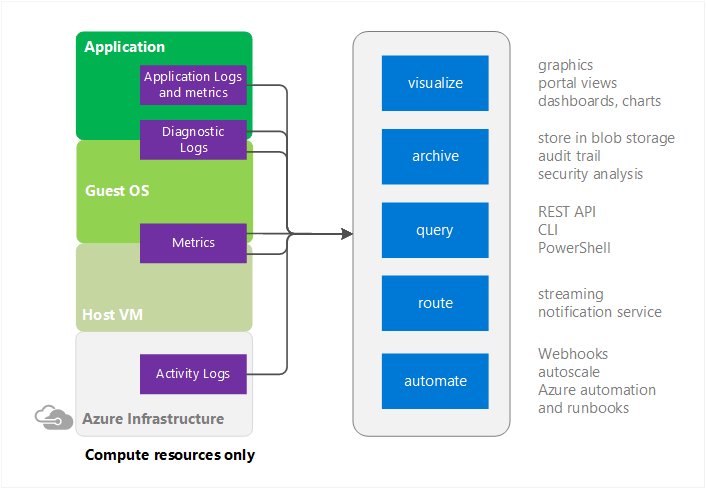
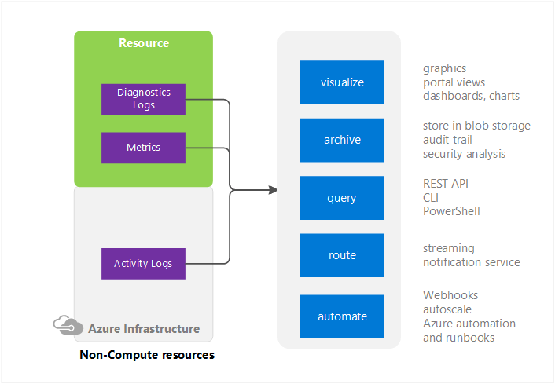

# Overview of Azure Monitor
This article provides a conceptual overview of monitoring Azure resources. It provides pointers to information on specific types of resources.  For high-level information on monitoring your application from non-Azure point of view, see [Monitoring and diagnostics guidance](../best-practices-monitoring.md).

A video walkthrough of Azure Monitor is available at  
[Get Started with Azure Monitor](https://channel9.msdn.com/Blogs/Azure-Monitoring/Get-Started-with-Azure-Monitor). An additional video explaining a scenario where you can use Azure Monitor is available at [Explore Microsoft Azure monitoring and diagnostics](https://channel9.msdn.com/events/Ignite/2016/BRK2234).  

Cloud applications are complex with many moving parts. Monitoring provides data to ensure that your application stays up and running in a healthy state. It also helps you to stave off potential problems or troubleshoot past ones. In addition, you can use monitoring data to gain deep insights about your application. That knowledge can help you to improve application performance or maintainability, or automate actions that would otherwise require manual intervention.

The following diagram shows a conceptual view of Azure monitoring, including the type of logs you can collect and what you can do with that data.   

 

## Monitoring Sources
### Activity Logs
You can search the Activity Log (previously called Operational or Audit Logs) for information about your resource as seen by the Azure infrastructure. The log contains information such as times when resources are created or destroyed.  

### Host VM
**Compute Only**

Some compute resources like Cloud Services, Virtual Machines, and Service Fabric have a dedicated Host VM they interact with. The Host VM is the equivalent of Root VM in the Hyper-V hypervisor model. In this case, you can collect metrics on just the Host VM in addition to the Guest OS.  

For other Azure services, there is not necessarily a 1:1 mapping between your resource and a particular Host VM so host VM metrics are not available.

### Resource - Metrics and Diagnostics Logs
Collectable metrics vary based on the resource type. For example, Virtual Machines provides statistics on the Disk IO and Percent CPU. But those stats don't exist for a Service Bus queue, which instead provides metrics like queue size and message throughput.

For compute resources you can obtain metrics on the Guest OS and diagnostics modules like Azure Diagnostics. Azure Diagnostics helps gather and route diagnostic data to other locations, including Azure storage.

A list of currently collectable metrics is available at [supported metrics](monitoring-supported-metrics.md).

### Application - Diagnostics Logs, Application Logs, and Metrics
**Compute Only**

Applications can run on top of the Guest OS in the compute model. They emit their own set of logs and metrics.

Types of metrics include

* Performance counters
* Application Logs
* Windows Event Logs
* .NET Event Source
* IIS Logs
* Manifest based ETW
* Crash Dumps
* Customer Error Logs

## Uses for Monitoring Data
### Visualize
Visualizing your monitoring data in graphics and charts helps you find trends far more quickly than looking through the data itself.  

A few visualization methods include:

* Use the Azure portal
* Route data to Azure Application Insights
* Route data to Microsoft PowerBI
* Route the data to a third-party visualization tool using either live streaming or by having the tool read from an archive in Azure storage

### Archive
Monitoring data is typically written to Azure storage and kept there until you delete it.

A few ways to use this data:

* Once written, you can have other tools within or outside of Azure read it and process it.
* You download the data locally for a local archive or change your retention policy in the cloud to keep data for extended periods of time.  
* You leave the data in Azure storage indefinitely, though you have to pay for Azure storage based on the amount of data you keep.
  -

### Query
You can use the Azure Monitor REST API, cross platform Command-Line Interface (CLI) commands, PowerShell cmdlets, or the .NET SDK to access the data in the system or Azure storage

Examples include:

* Getting data for a custom monitoring application you have written
* Creating custom queries and sending that data to a third-party application.

### Route
You can stream monitoring data to other locations in real time.

Examples include:

* Send to Application Insights so you can use the visualization tools there.
* Send to Event Hubs so you can route to third-party tools to perform real-time analysis.

### Automate
You can use monitoring data to trigger alerts or even whole processes.
Examples include:

* Use data to autoscale compute instances up or down based on application load.
* Send emails when a metric crosses a predetermined threshold.
* Call a web URL (webhook) to execute an action in a system outside of Azure
* Start a runbook in Azure automation to perform any variety of tasks

## Methods of Use
In general, you can manipulate data tracking, routing, and retrieval using one of the following methods. Not all methods are available for all actions or data types.

* [Azure portal](https://portal.azure.com)
* [PowerShell](insights-powershell-samples.md)  
* [Cross-platform Command Line Interface (CLI)](insights-cli-samples.md)
* [REST API](https://msdn.microsoft.com/library/dn931943.aspx)
* [.NET SDK](https://msdn.microsoft.com/library/dn802153.aspx)

## Azure’s Monitoring Offerings
Azure has offerings available for monitoring your services from bare-metal infrastructure to application telemetry. The best monitoring strategy combines use of all three to gain comprehensive, detailed insight into the health of your services.

* [Azure Monitor](http://aka.ms/azmondocs) – Offers visualization, query, routing, alerting, autoscale, and automation on data both from the Azure infrastructure (Activity Log) and each individual Azure resource (Diagnostic Logs). This article is part of the Azure Monitor documentation. The Azure Monitor name was released September 25 at Ignite 2016.  The previous name was "Azure Insights."  
* [Application Insights](https://azure.microsoft.com/documentation/services/application-insights/) – Provides rich detection and diagnostics for issues at the application layer of your service, well-integrated on top of data from Azure Monitoring. It's the default diagnostics platform for App Service Web Apps.  You can route data from other services to it.  
* [Log Analytics](https://azure.microsoft.com/documentation/services/log-analytics/) part of [Operations Management Suite](https://www.microsoft.com/oms/) – Provides a holistic IT management solution for both on-premises and third-party cloud-based infrastructure (such as AWS) in addition to Azure resources.  Data from Azure Monitor can be routed directly to Log Analytics so you can see metrics and logs for your entire environment in one place.     

## Next steps
Learn more about

* [Azure Monitor in a video from Ignite 2016](https://myignite.microsoft.com/videos/4977)
* [Getting Started with Azure Monitor](monitoring-get-started.md)
* [Azure Diagnostics](../azure-diagnostics.md) if you are attempting to diagnose problems in your Cloud Service, Virtual Machine, or Service Fabric application.
* [Application Insights](https://azure.microsoft.com/documentation/services/application-insights/) if you are trying to diagnostic problems in your App Service Web app.
* [Troubleshooting Azure Storage](../storage/storage-e2e-troubleshooting.md) when using Storage Blobs, Tables, or Queues
* [Log Analytics](https://azure.microsoft.com/documentation/services/log-analytics/) and the [Operations Management Suite](https://www.microsoft.com/oms/)
