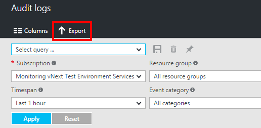
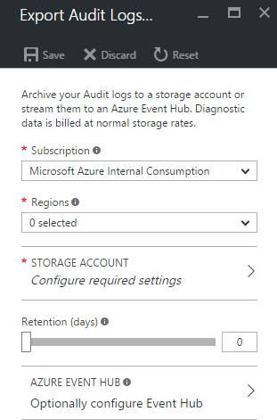

# Stream the Azure Activity Log to Event Hubs
The [**Azure Activity Log**](monitoring-overview-activity-logs.md) can be streamed in near real time to any application using the built-in “Export” option in the portal, or by enabling the Service Bus Rule ID in a Log Profile via the Azure PowerShell Cmdlets or Azure CLI.

## What you can do with the Activity Log and Event Hubs
Here are just a few ways you might use the streaming capability for the Activity Log:

* **Stream to third-party logging and telemetry systems** – Over time, Event Hubs streaming will become the mechanism to pipe your Activity Log into third-party SIEMs and log analytics solutions.
* **Build a custom telemetry and logging platform** – If you already have a custom-built telemetry platform or are just thinking about building one, the highly scalable publish-subscribe nature of Event Hubs allows you to flexibly ingest the activity log. [See Dan Rosanova’s guide to using Event Hubs in a global scale telemetry platform here.](https://azure.microsoft.com/documentation/videos/build-2015-designing-and-sizing-a-global-scale-telemetry-platform-on-azure-event-Hubs/)

## Enable streaming of the Activity Log
You can enable streaming of the Activity Log either programmatically or via the portal. Either way, you pick an Event Hubs namespace and a shared access policy for that namespace, and an event hub with the name 'insights-logs-operationallogs' is created in that namespace when the first new Activity Log event occurs. If you do not have an Event Hubs namespace, you first need to create one. If you have previously streamed Activity Log events to this Event Hubs namespace, the event hub that was previously created will be reused. The shared access policy defines the permissions that the streaming mechanism has. Today, streaming to an event hub requires **Manage**, **Send**, and **Listen** permissions. You can create or modify Event Hubs namespace shared access policies in the Azure portal under the “Configure” tab for your namespace. To update the Activity Log log profile to include streaming, the user making the change must have the ListKey permission on that event hub authorization rule.

The Event Hubs namespace does not have to be in the same subscription as the subscription emitting logs as long as the user who configures the setting has appropriate RBAC access to both subscriptions.

### Via Azure portal
1. Navigate to the **Activity Log** section using the All services search on the left side of the portal.
   
    
2. Click the **Export** button at the top of the activity log. Note that the filter settings you had applied while viewing the Activity Log in the previous view have no impact on your export settings -- those are only for filtering what you see while browsing your Activity Log in the portal.
   
    
3. In the section that appears, select **All regions**. Do not select particular regions.
   
    
    
    > [!WARNING]
    > Only select 'All regions.' Otherwise you will miss key events that you would have otherwise expected to receive. This is due to the fact that the Activity Log is a global (non-regional) log, so most events do not have a region associated with them.
    >
    >
    
4. Click **Save** to save these settings. The settings are immediately applied to your subscription.
5. If you have several subscriptions, you should repeat this action and send all the data to the same event hub.

### Via PowerShell Cmdlets
If a log profile already exists, you first need to remove that profile.

1. Use `Get-AzureRmLogProfile` to identify if a log profile exists
2. If so, use `Remove-AzureRmLogProfile` to remove it.
3. Use `Set-AzureRmLogProfile` to create a profile:

```powershell

Add-AzureRmLogProfile -Name my_log_profile -serviceBusRuleId /subscriptions/s1/resourceGroups/Default-ServiceBus-EastUS/providers/Microsoft.ServiceBus/namespaces/mytestSB/authorizationrules/RootManageSharedAccessKey -Locations global,westus,eastus -RetentionInDays 90 -Categories Write,Delete,Action

```

The Service Bus Rule ID is a string with this format: {service bus resource ID}/authorizationrules/{key name}, for example 

### Via Azure CLI
If a log profile already exists, you first need to remove that profile.

1. Use `azure insights logprofile list` to identify if a log profile exists
2. If so, use `azure insights logprofile delete` to remove it.
3. Use `azure insights logprofile add` to create a profile:

```azurecli-interactive
azure insights logprofile add --name my_log_profile --storageId /subscriptions/s1/resourceGroups/insights-integration/providers/Microsoft.Storage/storageAccounts/my_storage --serviceBusRuleId /subscriptions/s1/resourceGroups/Default-ServiceBus-EastUS/providers/Microsoft.ServiceBus/namespaces/mytestSB/authorizationrules/RootManageSharedAccessKey --locations global,westus,eastus,northeurope --retentionInDays 90 –categories Write,Delete,Action
```

The Service Bus Rule ID is a string with this format: `{service bus resource ID}/authorizationrules/{key name}`.

## How do I consume the log data from Event Hubs?
[The schema for the Activity Log is available here](monitoring-overview-activity-logs.md). Each event is in an array of JSON blobs called “records.”

## Next Steps
* [Archive the Activity Log to a storage account](monitoring-archive-activity-log.md)
* [Read the overview of the Azure Activity Log](monitoring-overview-activity-logs.md)
* [Set up an alert based on an Activity Log event](insights-auditlog-to-webhook-email.md)

