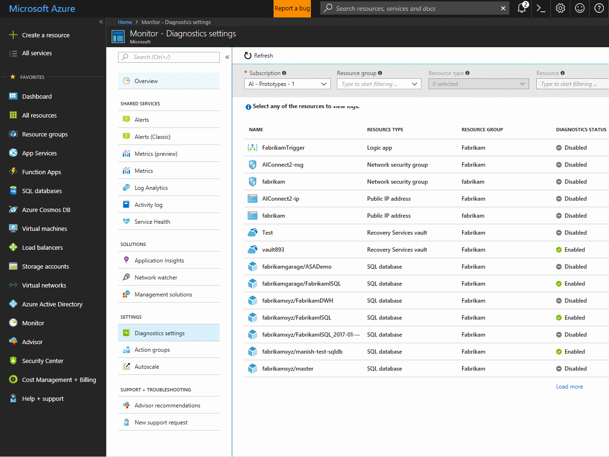

# Stream Azure Diagnostic Logs to an Event Hubs Namespace
**[Azure diagnostic logs](monitoring-overview-of-diagnostic-logs.md)** can be streamed in near real time to any application using the built-in “Export to Event Hubs” option in the Portal, or by enabling the Service Bus Rule ID in a diagnostic setting via the Azure PowerShell Cmdlets or Azure CLI.

## What you can do with diagnostics logs and Event Hubs
Here are just a few ways you might use the streaming capability for Diagnostic Logs:

* **Stream logs to 3rd party logging and telemetry systems** – Over time, Event Hubs streaming will become the mechanism to pipe your diagnostic logs in to third-party SIEMs and log analytics solutions.
* **View service health by streaming “hot path” data to PowerBI** – Using Event Hubs, Stream Analytics, and PowerBI, you can easily transform your diagnostics data in to near real-time insights on your Azure services. [This documentation article gives a great overview of how to set up Event Hubs, process data with Stream Analytics, and use PowerBI as an output](../stream-analytics/stream-analytics-power-bi-dashboard.md). Here are a few tips for getting set up with diagnostic logs:
  
  * An event hub for a category of diagnostic logs is created automatically when you check the option in the portal or enable it through PowerShell, so you want to select the event hub in the namespace with the name that starts with **insights-**.
  * The following SQL code is a sample Stream Analytics query that you can use to parse all the log data in to a PowerBI table:

    ```sql
    SELECT
    records.ArrayValue.[Properties you want to track]
    INTO
    [OutputSourceName – the PowerBI source]
    FROM
    [InputSourceName] AS e
    CROSS APPLY GetArrayElements(e.records) AS records
    ```

* **Build a custom telemetry and logging platform** – If you already have a custom-built telemetry platform or are just thinking about building one, the highly scalable publish-subscribe nature of Event Hubs allows you to flexibly ingest diagnostic logs. [See Dan Rosanova’s guide to using Event Hubs in a global scale telemetry platform here](https://azure.microsoft.com/documentation/videos/build-2015-designing-and-sizing-a-global-scale-telemetry-platform-on-azure-event-Hubs/).

## Enable streaming of diagnostic logs
You can enable streaming of diagnostic logs programmatically, via the portal, or using the [Azure Monitor REST APIs](https://docs.microsoft.com/rest/api/monitor/servicediagnosticsettings). Either way, you create a diagnostic setting in which you specify an Event Hubs namespace and the log categories and metrics you want to send in to the namespace. An event hub is created in the namespace for each log category you enable. A diagnostic **log category** is a type of log that a resource may collect.

> [!WARNING]
> Enabling and streaming diagnostic logs from Compute resources (for example, VMs or Service Fabric) [requires a different set of steps](../event-hubs/event-hubs-streaming-azure-diags-data.md).
> 
> 

The Service Bus or Event Hubs namespace does not have to be in the same subscription as the resource emitting logs as long as the user who configures the setting has appropriate RBAC access to both subscriptions.

## Stream diagnostic logs using the portal
1. In the portal, navigate to Azure Monitor and click on **Diagnostic Settings**

    

2. Optionally filter the list by resource group or resource type, then click on the resource for which you would like to set a diagnostic setting.

3. If no settings exist on the resource you have selected, you are prompted to create a setting. Click "Turn on diagnostics."

   

   If there are existing settings on the resource, you will see a list of settings already configured on this resource. Click "Add diagnostic setting."

   

3. Give your setting a name and check the box for **Stream to an event hub**, then select an Event Hubs namespace.
   
   
    
   The namespace selected will be where the event hub is created (if this is your first time streaming diagnostic logs) or streamed to (if there are already resources that are streaming that log category to this namespace), and the policy defines the permissions that the streaming mechanism has. Today, streaming to an event hub requires Manage, Send, and Listen permissions. You can create or modify Event Hubs namespace shared access policies in the portal under the Configure tab for your namespace. To update one of these diagnostic settings, the client must have the ListKey permission on the Event Hubs authorization rule.

4. Click **Save**.

After a few moments, the new setting appears in your list of settings for this resource, and diagnostic logs are streamed to that storage account as soon as new event data is generated.

### Via PowerShell Cmdlets
To enable streaming via the [Azure PowerShell Cmdlets](insights-powershell-samples.md), you can use the `Set-AzureRmDiagnosticSetting` cmdlet with these parameters:

```powershell
Set-AzureRmDiagnosticSetting -ResourceId [your resource ID] -ServiceBusRuleId [your Service Bus rule ID] -Enabled $true
```

The Service Bus Rule ID is a string with this format: `{Service Bus resource ID}/authorizationrules/{key name}`, for example, `/subscriptions/{subscription ID}/resourceGroups/Default-ServiceBus-WestUS/providers/Microsoft.ServiceBus/namespaces/{Service Bus namespace}/authorizationrules/RootManageSharedAccessKey`.

### Via Azure CLI
To enable streaming via the [Azure CLI](insights-cli-samples.md), you can use the `insights diagnostic set` command like this:

```azurecli
azure insights diagnostic set --resourceId <resourceID> --serviceBusRuleId <serviceBusRuleID> --enabled true
```

Use the same format for Service Bus Rule ID as explained for the PowerShell Cmdlet.

## How do I consume the log data from Event Hubs?
Here is sample output data from Event Hubs:

```json
{
    "records": [
        {
            "time": "2016-07-15T18:00:22.6235064Z",
            "workflowId": "/SUBSCRIPTIONS/DF602C9C-7AA0-407D-A6FB-EB20C8BD1192/RESOURCEGROUPS/JOHNKEMTEST/PROVIDERS/MICROSOFT.LOGIC/WORKFLOWS/JOHNKEMTESTLA",
            "resourceId": "/SUBSCRIPTIONS/DF602C9C-7AA0-407D-A6FB-EB20C8BD1192/RESOURCEGROUPS/JOHNKEMTEST/PROVIDERS/MICROSOFT.LOGIC/WORKFLOWS/JOHNKEMTESTLA/RUNS/08587330013509921957/ACTIONS/SEND_EMAIL",
            "category": "WorkflowRuntime",
            "level": "Error",
            "operationName": "Microsoft.Logic/workflows/workflowActionCompleted",
            "properties": {
                "$schema": "2016-04-01-preview",
                "startTime": "2016-07-15T17:58:55.048482Z",
                "endTime": "2016-07-15T18:00:22.4109204Z",
                "status": "Failed",
                "code": "BadGateway",
                "resource": {
                    "subscriptionId": "df602c9c-7aa0-407d-a6fb-eb20c8bd1192",
                    "resourceGroupName": "JohnKemTest",
                    "workflowId": "243aac67fe904cf195d4a28297803785",
                    "workflowName": "JohnKemTestLA",
                    "runId": "08587330013509921957",
                    "location": "westus",
                    "actionName": "Send_email"
                },
                "correlation": {
                    "actionTrackingId": "29a9862f-969b-4c70-90c4-dfbdc814e413",
                    "clientTrackingId": "08587330013509921958"
                }
            }
        },
        {
            "time": "2016-07-15T18:01:15.7532989Z",
            "workflowId": "/SUBSCRIPTIONS/DF602C9C-7AA0-407D-A6FB-EB20C8BD1192/RESOURCEGROUPS/JOHNKEMTEST/PROVIDERS/MICROSOFT.LOGIC/WORKFLOWS/JOHNKEMTESTLA",
            "resourceId": "/SUBSCRIPTIONS/DF602C9C-7AA0-407D-A6FB-EB20C8BD1192/RESOURCEGROUPS/JOHNKEMTEST/PROVIDERS/MICROSOFT.LOGIC/WORKFLOWS/JOHNKEMTESTLA/RUNS/08587330012106702630/ACTIONS/SEND_EMAIL",
            "category": "WorkflowRuntime",
            "level": "Information",
            "operationName": "Microsoft.Logic/workflows/workflowActionStarted",
            "properties": {
                "$schema": "2016-04-01-preview",
                "startTime": "2016-07-15T18:01:15.5828115Z",
                "status": "Running",
                "resource": {
                    "subscriptionId": "df602c9c-7aa0-407d-a6fb-eb20c8bd1192",
                    "resourceGroupName": "JohnKemTest",
                    "workflowId": "243aac67fe904cf195d4a28297803785",
                    "workflowName": "JohnKemTestLA",
                    "runId": "08587330012106702630",
                    "location": "westus",
                    "actionName": "Send_email"
                },
                "correlation": {
                    "actionTrackingId": "042fb72c-7bd4-439e-89eb-3cf4409d429e",
                    "clientTrackingId": "08587330012106702632"
                }
            }
        }
    ]
}
```

| Element Name | Description |
| --- | --- |
| records |An array of all log events in this payload. |
| time |Time at which the event occurred. |
| category |Log category for this event. |
| resourceId |Resource ID of the resource that generated this event. |
| operationName |Name of the operation. |
| level |Optional. Indicates the log event level. |
| properties |Properties of the event. |

You can view a list of all resource providers that support streaming to Event Hubs [here](monitoring-overview-of-diagnostic-logs.md).

## Stream data from Compute resources
You can also stream diagnostic logs from Compute resources using the Windows Azure Diagnostics agent. [See this article](../event-hubs/event-hubs-streaming-azure-diags-data.md) for how to set that up.

## Next steps
* [Read more about Azure Diagnostic Logs](monitoring-overview-of-diagnostic-logs.md)
* [Get started with Event Hubs](../event-hubs/event-hubs-csharp-ephcs-getstarted.md)

