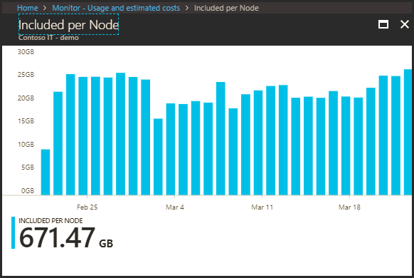
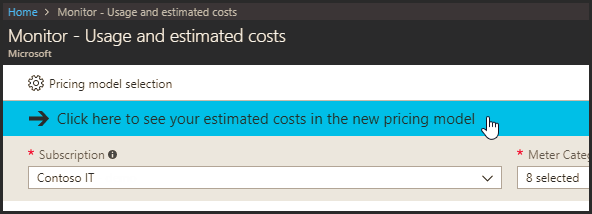

# Monitoring usage and estimated costs

In the Monitor hub of the Azure portal, the **Usage and estimated costs** page is designed to help understand the usage from core monitoring features such as [alerting, metrics, notifications](https://azure.microsoft.com/pricing/details/monitor/), [Log Analytics](https://azure.microsoft.com/pricing/details/log-analytics/) and [Application Insights](https://azure.microsoft.com/pricing/details/application-insights/). For customers on the pricing plans available prior to April 2018, this also includes Log Analytics usage purchased via the Insights and Analytics offer.

On this page, users can view their usage of these resources for the past 31 days, aggregated per subscription, with drill-ins to see the usage trend over this period. There’s a lot of data needed to pull together and make this estimate, so please be patient as the page loads.
Here’s an example showing monitoring usage and an estimate of the resulting costs:

Clicking on the link in the Monthly usage column will open a chart showing the usage trends over the last 31-day period:

Here’s another similar usage and cost summary, in this case for a subscription in the new April 2018 consumption-based pricing model. Observe the lack of any node-based billing and that data ingestion and retention for Log Analytics and Application Insights are now reported on a new common meter.

## New pricing model

In April 2018, a new monitoring pricing model was released.  This features cloud-friendly, consumption-based pricing. You only pay for what you use, without node-based commitments. Details of the new pricing model are available for [alerting, metrics, notifications](https://azure.microsoft.com/pricing/details/monitor/), [Log Analytics](https://azure.microsoft.com/pricing/details/log-analytics/) and [Application Insights](https://azure.microsoft.com/pricing/details/application-insights/).

For customers onboarding to Log Analytics or Application Insights after April 2, 2018, the new pricing model is the only option. For customers who have already been using these services, moving to the new pricing model is optional.

## Assessing the impact of the new pricing model

The new pricing model will have different impacts for each customer based on their monitoring usage patterns. For customers already using Log Analytics or Application Insights prior to April 2 2018, the **Usage and estimated cost** page in Azure Monitor gives a way to estimate any change in costs if you move to the new pricing model, and provides the way to move a subscription into the new model. For most customers, the new pricing model will be advantageous, but for customers with especially high data usage patterns or in higher-cost regions, this may not be the case.

To see an estimate of your costs for the subscriptions you’ve selected on the **Usage and estimated costs** page, click the blue banner near the top of the page. It’s best to do this one subscription at a time, since that is the level at which the new pricing model can be adopted.

Now you’ll see a similar version of this page with a green banner:

Here you will see a different set of meters – the meters which correspond to the new pricing model. For instance, data ingestion meters such as

1. Insight and Analytics\Overage per Node
2. Insight and Analytics\Included per Node
3. Application Insights\Basic Overage Data
4. Application Insights\Included Data

are combined into a new common data ingestion meter called **Shared Services\Data Ingestion** since the new pricing model does not have node-based included data allocations.

Another change you will see is that data ingested into Log Analytics or Application Insights in regions with higher costs will be shown with the new regional meters to properly reflect this, for instance **“Data Ingestion (US West Central)**.

> [!NOTE]
> If you have an Operations Management Suite (OMS) subscription, you receive Log Analytics and Application Insights data ingestion allocations for each node purchased. Since this is applied at the account level (not at the subscription), this estimate cannot show the effect of these allocations. Please consult your account representative for a more in-depth discussion of the new pricing model in this case.

## Changes when moving to the new pricing model

Moving a subscription into the new pricing model will change the pricing tier for each Log Analytics to a new Per-GB tier, and it will move any (called “pergb2018” in Azure Resource Manager). This move will also change any Application Insights resources in the Enterprise plan to the Basic plan. The effects of these are shown on the cost estimation described above. 

## Moving to the new pricing model

If you’ve decided to adopt the new pricing model for a subscription, click the **Pricing model selection** option at the top of the **Usage and estimated costs** page:

This will open the **Pricing model selection** page, listing each of the subscriptions you were viewing on the prior page:

To move a subscription to the new pricing model, you just check the box and click **Save**.  You can move back to the older pricing model in the same way. Keep in mind, that subscription owner or contributor permissions are required to change the pricing model.