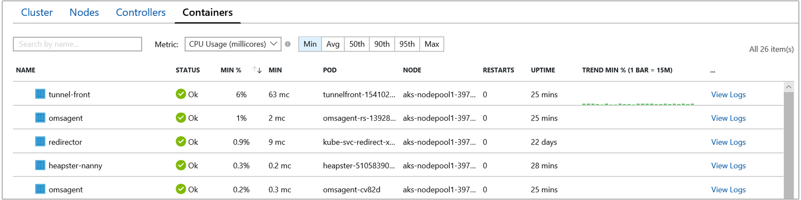

# Monitor Azure Kubernetes Service (AKS) container health (Preview)

This article describes how to set up and use Azure Monitor container health to monitor the performance of your workloads deployed to Kubernetes environments hosted on Azure Kubernetes Service (AKS).  Monitoring your Kubernetes cluster and containers is critical, especially when running a production cluster, at scale, with multiple applications.

Container health gives you performance monitoring ability by collecting memory and processor metrics from controllers, nodes, and containers available in Kubernetes through the Metrics API.  After enabling container health, these metrics are automatically collected for you using a containerized version of the OMS Agent for Linux and stored in your [Log Analytics](../log-analytics/log-analytics-overview.md) workspace.  The pre-defined views included show the residing container workloads and what is affecting the performance health of the Kubernetes cluster so you can understand:  

* What containers are running on the node and their average processor and memory utilization to identify resource bottlenecks
* Identify where the container resides in a controller and/or pods to see the overall  performance for a controller or pod 
* Review the resource utilization of workloads running on the host unrelated to the standard processes supporting the pod
* Understand the behavior of the cluster under average and heaviest load to help identify capacity needs and determine the maximum load it can sustain 

If you are interested in monitoring and managing your Docker and Windows container hosts to view configuration, audit, and resource utilization, see the [Container Monitoring solution](../log-analytics/log-analytics-containers.md).

## Requirements 
Before starting, review the following details so you can understand the supported prerequisites.

- A new or existing AKS cluster
- A containerized OMS agent for Linux version microsoft/oms:ciprod04202018 and later. The version number is represented by a date following the format - *mmddyyyy*.  It is installed automatically during onboarding of container health.  
- A Log Analytics workspace.  It can be created when you enable monitoring of your new AKS cluster, or you can create one through [Azure Resource Manager](../log-analytics/log-analytics-template-workspace-configuration.md), [PowerShell](https://docs.microsoft.com/azure/log-analytics/scripts/log-analytics-powershell-sample-create-workspace?toc=%2fpowershell%2fmodule%2ftoc.json), or from the [Azure portal](../log-analytics/log-analytics-quick-create-workspace.md).
- Member of the Log Analytics contributor role in order to enable container monitoring.  For more information on how to control access to a Log Analytics workspace, see [Manage workspaces](../log-analytics/log-analytics-manage-access.md).

## Components 

This capability relies on a containerized OMS Agent for Linux to collect performance and event data from all nodes in the cluster.  The agent is automatically deployed and registered with the specified Log Analytics workspace after you enable container monitoring. 

>[!NOTE] 
>If you have already deployed an AKS cluster, you enable monitoring using a provided Azure Resource Manager template as demonstrated later in this article. You cannot use `kubectl` to upgrade, delete, re-deploy, or deploy the agent.  
>

## Sign in to Azure portal
Sign in to the Azure portal at [https://portal.azure.com](https://portal.azure.com). 

## Enable container health monitoring for a new cluster
You can enable monitoring of a new AKS cluster during deployment from the Azure portal.  Follow the steps in the quickstart article [Deploy an Azure Kubernetes Service (AKS) cluster](../aks/kubernetes-walkthrough-portal.md).  When you are on the **Monitoring** page, select **Yes** for the option **Enable Monitoring** to enable, and then select an existing or create a new Log Analytics workspace.  

After monitoring is enabled all configuration tasks are completed successfully, you can monitor the performance of your cluster from one of two ways:

1. Directly from the AKS cluster by selecting **Health** from the left pane.<br><br> 
2. By clicking on the **Monitor container health** tile in the AKS cluster page for the selected cluster.  In Azure Monitor, select **Health** from the left pane.  


After monitoring is enabled, it can take around 15 minutes before you are able to see operational data for the cluster.  

## Enable container health monitoring for existing managed clusters
You can enable monitoring of an AKS cluster already deployed either from the Azure portal or with the provided Azure Resource Manager template using the PowerShell cmdlet **New-AzureRmResourceGroupDeployment** or Azure CLI.  


### Enable from Azure portal
Perform the following steps to enable monitoring of your AKS container from the Azure portal.

1. In the Azure portal, click **All services**. In the list of resources, type **Containers**. As you begin typing, the list filters based on your input. Select **Kubernetes services**.<br><br> <br><br>  
2. In your list of containers, select a container.
3. On the container overview page, select **Monitor container health** and the **Onboarding to Container Health and Logs** page appears.
4. On the **Onboarding to Container Health and Logs** page, if you have an existing Log Analytics workspace in the same subscription as the cluster, select it from the drop-down list.  The list preselects the default workspace and location the AKS container is deployed to in the subscription.<br><br>  

>[!NOTE]
>If you want to create a new Log Analytics workspace to store the monitoring data from the cluster, follow the steps in [Create a Log Analytics workspace](../log-analytics/log-analytics-quick-create-workspace.md) and be sure to create the workspace in the same subscription that the AKS container is deployed to.  
>
 
After monitoring is enabled, it can take around 15 minutes before you are able to see operational data for the cluster. 

### Enable using Azure Resource Manager template
This method includes two JSON templates, one template specifies the configuration to enable monitoring and the other JSON template contains parameter values you configure to specify the following:

* AKS container resource ID 
* Resource group the cluster is deployed in 
* Log Analytics workspace and region to create the workspace in 

The Log Analytics workspace has to be created manually.  To create the workspace, you can set one up through [Azure Resource Manager](../log-analytics/log-analytics-template-workspace-configuration.md), [PowerShell](https://docs.microsoft.com/azure/log-analytics/scripts/log-analytics-powershell-sample-create-workspace?toc=%2fpowershell%2fmodule%2ftoc.json), from the [Azure portal](../log-analytics/log-analytics-quick-create-workspace.md).

If you are not familiar with the concepts of deploying resources using a template with PowerShell, see [Deploy resources with Resource Manager templates and Azure PowerShell](../azure-resource-manager/resource-group-template-deploy.md)or for Azure CLI see, [Deploy resources with Resource Manager templates and Azure CLI](../azure-resource-manager/resource-group-template-deploy-cli.md).

If you chose to use Azure CLI, you first need to install and use CLI locally.  It is required that you are running the Azure CLI version 2.0.27 or later. Run `az --version` to identify the version. If you need to install or upgrade, see [Install Azure CLI](https://docs.microsoft.com/cli/azure/install-azure-cli). 

#### Create and execute template

1. Copy and paste the following JSON syntax into your file:

    ```json
    {
    "$schema": "https://schema.management.azure.com/schemas/2015-01-01/deploymentTemplate.json#",
    "contentVersion": "1.0.0.0",
    "parameters": {
      "aksResourceId": {
        "type": "string",
        "metadata": {
           "description": "AKS Cluster Resource ID"
           }
    },
    "aksResourceLocation": {
    "type": "string",
     "metadata": {
        "description": "Location of the AKS resource e.g. \"East US\""
       }
    },
    "workspaceResourceId": {
      "type": "string",
      "metadata": {
         "description": "Azure Monitor Log Analytics Resource ID"
       }
    },
    "workspaceRegion": {
    "type": "string",
    "metadata": {
       "description": "Azure Monitor Log Analytics workspace region"
      }
     }
    },
    "resources": [
      {
    "name": "[split(parameters('aksResourceId'),'/')[8]]",
    "type": "Microsoft.ContainerService/managedClusters",
    "location": "[parameters('aksResourceLocation')]",
    "apiVersion": "2018-03-31",
    "properties": {
      "mode": "Incremental",
      "id": "[parameters('aksResourceId')]",
      "addonProfiles": {
        "omsagent": {
          "enabled": true,
          "config": {
            "logAnalyticsWorkspaceResourceID": "[parameters('workspaceResourceId')]"
          }
         }
       }
      }
     },
    {
        "type": "Microsoft.Resources/deployments",
        "name": "[Concat('ContainerInsights', '(', split(parameters('workspaceResourceId'),'/')[8], ')')]",
        "apiVersion": "2017-05-10",
        "subscriptionId": "[split(parameters('workspaceResourceId'),'/')[2]]",
        "resourceGroup": "[split(parameters('workspaceResourceId'),'/')[4]]",
        "properties": {
            "mode": "Incremental",
            "template": {
                "$schema": "https://schema.management.azure.com/schemas/2015-01-01/deploymentTemplate.json#",
                "contentVersion": "1.0.0.0",
                "parameters": {},
                "variables": {},
                "resources": [
                    {
                        "apiVersion": "2015-11-01-preview",
                        "type": "Microsoft.OperationsManagement/solutions",
                        "location": "[parameters('workspaceRegion')]",
                        "name": "[Concat('ContainerInsights', '(', split(parameters('workspaceResourceId'),'/')[8], ')')]",
                        "properties": {
                            "workspaceResourceId": "[parameters('workspaceResourceId')]"
                        },
                        "plan": {
                            "name": "[Concat('ContainerInsights', '(', split(parameters('workspaceResourceId'),'/')[8], ')')]",
                            "product": "[Concat('OMSGallery/', 'ContainerInsights')]",
                            "promotionCode": "",
                            "publisher": "Microsoft"
                        }
                    }
                ]
            },
            "parameters": {}
        }
       }
     ]
    }
    ```

2. Save this file as **existingClusterOnboarding.json** to a local folder.
3. Copy and paste the following JSON syntax into your file:

    ```json
    {
       "$schema": "https://schema.management.azure.com/  schemas/2015-01-01/deploymentParameters.json#",
       "contentVersion": "1.0.0.0",
       "parameters": {
         "aksResourceId": {
           "value": "/subscriptions/<SubscroptiopnId>/resourcegroups/<ResourceGroup>/providers/Microsoft.ContainerService/managedClusters/<ResourceName>"
       },
       "aksResourceLocation": {
         "value": "East US"
       },
       "workspaceResourceId": {
         "value": "/subscriptions/<SubscriptionId>/resourceGroups/<ResourceGroup>/providers/Microsoft.OperationalInsights/workspaces/<workspaceName>"
       },
       "workspaceRegion": {
         "value": "eastus"
       }
     }
    }
    ```

4. Edit the value for **aksResourceId**, **aksResourceLocation** with the values, which you can find on the **AKS Overview** page for the AKS cluster.  The value for **workspaceResourceId** is the full resource ID of your Log Analytics workspace, which includes the workspace name.  Also specify the location the workspace is in for **workspaceRegion**.    
5. Save this file as **existingClusterParam.json** to a local folder.
6. You are ready to deploy this template. 

    * Use the following PowerShell commands from the folder containing the template:

        ```powershell
        New-AzureRmResourceGroupDeployment -Name OnboardCluster -ResourceGroupName ClusterResourceGroupName -TemplateFile .\existingClusterOnboarding.json -TemplateParameterFile .\existingClusterParam.json
        ```
        The configuration change can take a few minutes to complete. When it finishes, you see a message similar to the following that includes the result:

        ```powershell
        provisioningState       : Succeeded
        ```

    * To run following command with Azure CLI on Linux:
    
        ```azurecli
        az login
        az account set --subscription "Subscription Name"
        az group deployment create --resource-group <ResourceGroupName> --template-file ./existingClusterOnboarding.json --parameters @./existingClusterParam.json
        ```

        The configuration change can take a few minutes to complete. When it finishes, you see a message similar to the following that includes the result:

        ```azurecli
        provisioningState       : Succeeded
        ```
After monitoring is enabled, it can take around 15 minutes before you are able to see operational data for the cluster.  

## Verify agent and solution deployment
With agent version *06072018* and higher, you are able to verify that both the agent and the solution were deployed successfully.  With earlier versions of the agent, you can only verify agent deployment.

### Agent version 06072018 and higher
Run the following command to verify the agent is deployed successfully.   

```
kubectl get ds omsagent --namespace=kube-system
```

The output should resemble the following indicating it did deploy properly:

```
User@aksuser:~$ kubectl get ds omsagent --namespace=kube-system 
NAME       DESIRED   CURRENT   READY     UP-TO-DATE   AVAILABLE   NODE SELECTOR                 AGE
omsagent   2         2         2         2            2           beta.kubernetes.io/os=linux   1d
```  

To verify deployment of the solution, run the following command:

```
kubectl get deployment omsagent-rs -n=kube-system
```

The output should resemble the following indicating it did deploy properly:

```
User@aksuser:~$ kubectl get deployment omsagent-rs -n=kube-system 
NAME       DESIRED   CURRENT   UP-TO-DATE   AVAILABLE    AGE
omsagent   1         1         1            1            3h
```

### Agent version earlier than 06072018

To verify the OMS agent version released before *06072018* is deployed properly, run the following command:  

```
kubectl get ds omsagent --namespace=kube-system
```

The output should resemble the following indicating it did deploy properly:  

```
User@aksuser:~$ kubectl get ds omsagent --namespace=kube-system 
NAME       DESIRED   CURRENT   READY     UP-TO-DATE   AVAILABLE   NODE SELECTOR                 AGE
omsagent   2         2         2         2            2           beta.kubernetes.io/os=linux   1d
```  

## View performance utilization
When you open container health, the page immediately presents the performance utilization of your entire cluster.  Viewing information about your AKS cluster is organized into four perspectives:

- Cluster
- Nodes 
- Controllers  
- Containers

On the Cluster tab, the line performance charts show key performance metrics of your cluster.  


The following is a breakdown of the performance metrics presented:

- Node CPU Utilization % - This chart represents an aggregated perspective of CPU utilization for the entire cluster.  You can filter the results for the time range by selecting *Avg*, *Min*, *Max*, *50th*, *90th*, and *95th* from the percentiles selector above the chart, either individually or combined. 
- Node memory utilization % - This chart represents an aggregated perspective of memory utilization for the entire cluster.  You can filter the results for the time range by selecting *Avg*, *Min*, *Max*, *50th*, *90th*, and *95th* from the percentiles selector above the chart, either individually or combined. 
- Node count - This chart represents node count and status from Kubernetes.  Status of the cluster nodes represented are *All*, *Ready*, and *Not Ready* and can be filtered individually or combined from the selector above the chart.    
- Activity pod count - This chart represents pod count and status from Kubernetes.  Status of the pods represented are *All*, *Pending*, *Running*, and *Unknown* and can be filtered individually or combined from the selector above the chart.  

Switching to the Nodes tab, the row hierarchy follows the Kubernetes object model starting with a node in your cluster.  Expand the node and you see one or more pods running on the node, and if there is more than one container grouped to a pod, they are shown as the last row in the hierarchy. You are able to also see how many non-pod related workloads are running on the host in case host has processor or memory pressure.


You can select controllers or containers from the top of the page and review the status and resource utilization for those objects.  Use the dropdown boxes at the top of the screen to filter by namespace, service, and node. If instead you want to review memory utilization, from the **Metric** drop-down list select **Memory RSS** or **Memory working set**.  **Memory RSS** is only supported for Kubernetes version 1.8 and later. Otherwise, you see values for **MIN %** showing as *NaN%*, which is a numeric data type value representing an undefined or unrepresentable value. 


By default, Performance data is based on the last six hours but you can change the window with the **Time Range** drop-down list found on the upper right-hand corner of the page. At this time, the page does not auto-refresh, so you need to manually refresh it. You can  also filter the results within the time range by selecting *Avg*, *Min*, *Max*, *50th*, *90th*, and *95th* from the percentile selector. 


In the following example, you notice for node *aks-nodepool-3977305*, the value for **Containers** is 5, which is a rollup of the total number of containers deployed.


It can help you quickly identify if you don't have a proper balance of containers between nodes in your cluster.  

The following table describes the information presented when you view Nodes.

| Column | Description | 
|--------|-------------|
| Name | The name of the host |
| Status | Kubernetes view of the node status |
| AVG%, MIN%, MAX%, 50TH%, 90TH% | Average node percentage based on percentile during that time duration selected. |
| AVG, MIN, MAX, 50TH, 90TH | Average nodes actual value based on percentile during that time duration selected.  The Average value is measured from the CPU/Memory limit set for a node; for pods and containers it is the avg value reported by the host. |
| Containers | Number of containers. |
| Uptime | Represents the time since a node started or was rebooted. |
| Controllers | Only for containers and pods. It shows which controller it is residing. Not all pods will be in a controller, so some may show N/A. | 
| Trend AVG%, MIN%, MAX%, 50TH%, 90TH% | Bar graph trend presenting percentile metric % of the controller. |


From the selector, choose **Controllers**.


Here you can see the performance health of your controllers.


The row hierarchy starts with a controller and expands the controller and you see one or  one or more containers.  Expand a pod and the last row show the container grouped to the pod.  

The following table describes the information presented when you view Controllers.

| Column | Description | 
|--------|-------------|
| Name | The name of the controller|
| Status | Rollup status of the containers when it has completed running with status, such as *OK*, *Terminated*, *Failed* *Stopped*, or *Paused*. If the container is running, but the status was either not properly presented or was not picked up by the agent and has not responded more than 30 minutes, the status is *Unknown*. Additional details of the status icon are provided in the table below.|
| AVG%, MIN%, MAX%, 50TH%, 90TH% | Roll up average of the average % of each entity for the selected metric and percentile. |
| AVG, MIN, MAX, 50TH, 90TH  | Roll up of the average CPU millicore or memory performance of the container for the selected percentile.  The Average value is measured from the CPU/Memory limit set for a pod. |
| Containers | Total number of containers for the controller or pod. |
| Restarts | Roll up of the restart count from containers. |
| Uptime | Represents the time since a container started. |
| Node | Only for containers and pods. It shows which controller it is residing. | 
| Trend AVG%, MIN%, MAX%, 50TH%, 90TH%| Bar graph trend representing percentile metric of the controller. |

The icons in the status field indicate the online status of containers:
 
| Icon | Status | 
|--------|-------------|
|  | Running (Ready)|
|  | Waiting or Paused|
|  | Last reported running but hasn't responded more than 30 minutes|
|  | Successfully stopped or failed to stop|

The status icon shows a count based on what the pod provides. It shows the worse two states and when you hover over the status, it shows a roll up status from all pods in the container.  If there isn't a ready state, the status value will show a **(0)**.  

From the selector, choose **Containers**.


Here we can see the performance health of your containers.


The following table describes the information presented when you view Containers.

| Column | Description | 
|--------|-------------|
| Name | The name of the controller|
| Status | Status of the containers, if any. Additional details of the status icon are provided in the table below.|
| AVG%, MIN%, MAX%, 50TH%, 90TH% | Roll up average of the average % of each entity for the selected metric and percentile. |
| AVG, MIN, MAX, 50TH, 90TH  | Roll up of the average CPU millicore or memory performance of the container for the selected percentile.  The Average value is measured from the CPU/Memory limit set for a pod. |
| Pod | Container where the pod resides.| 
| Node |  Node where the container resides. | 
| Restarts | Represents the time since a container started. |
| Uptime | Represents the time since a container was started or rebooted. |
| Trend AVG%, MIN%, MAX%, 50TH%, 90TH% | Bar graph trend representing average metric % of the container. |

The icons in the status field indicate the online status of pods:
 
| Icon | Status | 
|--------|-------------|
|  | Running (Ready)|
|  | Waiting or Paused|
|  | Last reported running but hasn't responded more than 30 minutes|
|  | Successfully stopped or failed to stop|
|  | Failed state |

## Container data collection details
Container health collects various performance metrics and log data from container hosts and containers. Data is collected every three minutes.

### Container records

The following table shows examples of records collected by container health and the data types that appear in log search results.

| Data type | Data type in Log Search | Fields |
| --- | --- | --- |
| Performance for hosts and containers | `Perf` | Computer, ObjectName, CounterName &#40;%Processor Time, Disk Reads MB, Disk Writes MB, Memory Usage MB, Network Receive Bytes, Network Send Bytes, Processor Usage sec, Network&#41;, CounterValue, TimeGenerated, CounterPath, SourceSystem |
| Container inventory | `ContainerInventory` | TimeGenerated, Computer, container name, ContainerHostname, Image, ImageTag, ContainerState, ExitCode, EnvironmentVar, Command, CreatedTime, StartedTime, FinishedTime, SourceSystem, ContainerID, ImageID |
| Container image inventory | `ContainerImageInventory` | TimeGenerated, Computer, Image, ImageTag, ImageSize, VirtualSize, Running, Paused, Stopped, Failed, SourceSystem, ImageID, TotalContainer |
| Container log | `ContainerLog` | TimeGenerated, Computer, image ID, container name, LogEntrySource, LogEntry, SourceSystem, ContainerID |
| Container service log | `ContainerServiceLog`  | TimeGenerated, Computer, TimeOfCommand, Image, Command, SourceSystem, ContainerID |
| Container node inventory | `ContainerNodeInventory_CL`| TimeGenerated, Computer, ClassName_s, DockerVersion_s, OperatingSystem_s, Volume_s, Network_s, NodeRole_s, OrchestratorType_s, InstanceID_g, SourceSystem|
| Container process | `ContainerProcess_CL` | TimeGenerated, Computer, Pod_s, Namespace_s, ClassName_s, InstanceID_s, Uid_s, PID_s, PPID_s, C_s, STIME_s, Tty_s, TIME_s, Cmd_s, Id_s, Name_s, SourceSystem |
| Inventory of pods in a Kubernetes cluster | `KubePodInventory` | TimeGenerated, Computer, ClusterId, ContainerCreationTimeStamp, PodUid, PodCreationTimeStamp, ContainerRestartCount, PodRestartCount, PodStartTime, ContainerStartTime, ServiceName, ControllerKind, ControllerName, ContainerStatus, ContainerID, ContainerName, Name, PodLabel, Namespace, PodStatus, ClusterName, PodIp, SourceSystem |
| Inventory of nodes part of a Kubernetes cluster | `KubeNodeInventory` | TimeGenerated, Computer, ClusterName, ClusterId, LastTransitionTimeReady, Labels, Status, KubeletVersion, KubeProxyVersion, CreationTimeStamp, SourceSystem | 
| Kubernetes Events | `KubeEvents_CL` | TimeGenerated, Computer, ClusterId_s, FirstSeen_t, LastSeen_t, Count_d, ObjectKind_s, Namespace_s, Name_s, Reason_s, Type_s, TimeGenerated_s, SourceComponent_s, ClusterName_s, Message,  SourceSystem | 
| Services in the Kubernetes cluster | `KubeServices_CL` | TimeGenerated, ServiceName_s, Namespace_s, SelectorLabels_s, ClusterId_s, ClusterName_s, ClusterIP_s, ServiceType_s, SourceSystem | 
| Performance metrics for nodes part of the Kubernetes cluster | Perf &#124; where ObjectName == “K8SNode” | Computer, ObjectName, CounterName &#40;cpuUsageNanoCores, , memoryWorkingSetBytes, memoryRssBytes, networkRxBytes, networkTxBytes, restartTimeEpoch, networkRxBytesPerSec, networkTxBytesPerSec, cpuAllocatableNanoCores, memoryAllocatableBytes, cpuCapacityNanoCores, memoryCapacityBytes&#41;,CounterValue, TimeGenerated, CounterPath, SourceSystem | 
| Performance metrics for containers part of the Kubernetes cluster | Perf &#124; where ObjectName == “K8SContainer” | CounterName &#40;cpuUsageNanoCores, memoryWorkingSetBytes, memoryRssBytes, restartTimeEpoch, cpuRequestNanoCores, memoryRequestBytes, cpuLimitNanoCores, memoryLimitBytes&#41;,CounterValue, TimeGenerated, CounterPath, SourceSystem | 

## Search logs to analyze data
Log Analytics can help you look for trends, diagnose bottlenecks, forecast, or correlate data that can help you determine whether the current cluster configuration is performing optimally.  Pre-defined log searches are provided to immediately start using or to customize in order to return the information the way you want. 

You can perform interactive analysis of data in the workspace by selecting the **View Log** option, available on the far right when you expand a controller or container.  **Log Search** page appears right above the page you were on in the portal.

   

The container logs output forwarded to Log Analytics are STDOUT and STDERR. Because container health is monitoring Azure managed Kubernetes (AKS), Kube-system is not collected today due to the large volume of data generated.     

### Example log search queries
It's often useful to build queries starting with an example or two and then modifying them to fit your requirements. You can experiment with the following sample queries to help you build more advanced queries.

| Query | Description | 
|-------|-------------|
| ContainerInventory<br> &#124; project Computer, Name, Image, ImageTag, ContainerState, CreatedTime, StartedTime, FinishedTime<br> &#124; render table | List all Container's lifecycle Information| 
| KubeEvents_CL<br> &#124; where not(isempty(Namespace_s))<br> &#124; sort by TimeGenerated desc<br> &#124; render table | Kubernetes Events|
| ContainerImageInventory<br> &#124; summarize AggregatedValue = count() by Image, ImageTag, Running | Image Inventory | 
| **In Advanced Analytics, select line charts**:<br> Perf<br> &#124; where ObjectName == "Container" and CounterName == "% Processor Time"<br> &#124; summarize AvgCPUPercent = avg(CounterValue) by bin(TimeGenerated, 30m), InstanceName | Container CPU | 
| **In Advanced Analytics, select line charts**:<br> Perf &#124; where ObjectName == "Container" and CounterName == "Memory Usage MB"<br> &#124; summarize AvgUsedMemory = avg(CounterValue) by bin(TimeGenerated, 30m), InstanceName | Container Memory |

## How to stop monitoring with container health
After enabling monitoring of your AKS container you decide you no longer wish to monitor it, you can *opt out* using the provided Azure Resource Manager templates with the PowerShell cmdlet **New-AzureRmResourceGroupDeployment** or Azure CLI.  One JSON template specifies the configuration to *opt out* and the other JSON template contains parameter values you configure to specify the AKS cluster resource ID and resource group the cluster is deployed in.  If you are not familiar with the concepts of deploying resources using a template with PowerShell, see [Deploy resources with Resource Manager templates and Azure PowerShell](../azure-resource-manager/resource-group-template-deploy.md) or for Azure CLI see, [Deploy resources with Resource Manager templates and Azure CLI](../azure-resource-manager/resource-group-template-deploy-cli.md).

If you chose to use Azure CLI, you first need to install and use CLI locally.  It is required that you are running the Azure CLI version 2.0.27 or later. Run `az --version` to identify the version. If you need to install or upgrade, see [Install Azure CLI](https://docs.microsoft.com/cli/azure/install-azure-cli). 

### Create and execute template

1. Copy and paste the following JSON syntax into your file:

    ```json
    {
      "$schema": "https://schema.management.azure.com/schemas/2015-01-01/deploymentTemplate.json#",
      "contentVersion": "1.0.0.0",
      "parameters": {
        "aksResourceId": {
           "type": "string",
           "metadata": {
             "description": "AKS Cluster Resource ID"
           }
       },
      "aksResourceLocation": {
        "type": "string",
        "metadata": {
           "description": "Location of the AKS resource e.g. \"East US\""
         }
       }
    },
    "resources": [
      {
        "name": "[split(parameters('aksResourceId'),'/')[8]]",
        "type": "Microsoft.ContainerService/managedClusters",
        "location": "[parameters('aksResourceLocation')]",
        "apiVersion": "2018-03-31",
        "properties": {
          "mode": "Incremental",
          "id": "[parameters('aksResourceId')]",
          "addonProfiles": {
            "omsagent": {
              "enabled": false,
              "config": null
            }
           }
         }
       }
      ]
    }
    ```

2. Save this file as **OptOutTemplate.json** to a local folder.
3. Copy and paste the following JSON syntax into your file:

    ```json
    {
     "$schema": "https://schema.management.azure.com/schemas/2015-01-01/deploymentParameters.json#",
     "contentVersion": "1.0.0.0",
     "parameters": {
       "aksResourceId": {
         "value": "/subscriptions/<SubscriptionID>/resourcegroups/<ResourceGroup>/providers/Microsoft.ContainerService/managedClusters/<ResourceName>"
      },
      "aksResourceLocation": {
        "value": "<aksClusterRegion>"
        }
      }
    }
    ```

4. Edit the value for **aksResourceId** and **aksResourceLocation** with the values of the AKS cluster, which you can find on the **Properties** page for the selected cluster.

    

    While you are on the **Properties** page, also copy the **Workspace Resource ID**.  This value is required if you decide you want to delete the Log Analytics workspace later, which is not performed as part of this process.  

5. Save this file as **OptOutParam.json** to a local folder.
6. You are ready to deploy this template. 

    * To use the following PowerShell commands from the folder containing the template:

        ```powershell
        Connect-AzureRmAccount
        Select-AzureRmSubscription -SubscriptionName <yourSubscriptionName>
        New-AzureRmResourceGroupDeployment -Name opt-out -ResourceGroupName <ResourceGroupName> -TemplateFile .\OptOutTemplate.json -TemplateParameterFile .\OptOutParam.json
        ```

        The configuration change can take a few minutes to complete. When it completes, a message similar to the following that includes the result is returned:

        ```powershell
        ProvisioningState       : Succeeded
        ```

    * To run following command with Azure CLI on Linux:

        ```azurecli
        az login   
        az account set --subscription "Subscription Name" 
        az group deployment create --resource-group <ResourceGroupName> --template-file ./OptOutTemplate.json --parameters @./OptOutParam.json  
        ```

        The configuration change can take a few minutes to complete. When it completes, a message similar to the following that includes the result is returned:

        ```azurecli
        ProvisioningState       : Succeeded
        ```

If the workspace was created only to support monitoring the cluster and it's no longer needed, you have to manually delete it. If you are not familiar with how to delete a workspace, see [Delete an Azure Log Analytics workspace with the Azure portal](../log-analytics/log-analytics-manage-del-workspace.md).  Don't forget about the **Workspace Resource ID** we copied earlier in step 4, you're going to need that.  

## Troubleshooting
This section provides information to help troubleshoot issues with container health.

If container health was successfully enabled and configured but you are not seeing any status information or results in Log Analytics when you perform a log search, you can perform the following steps to help diagnose the problem.   

1. Check the status of the agent by running the following command: 

    `kubectl get ds omsagent --namespace=kube-system`

    The output should resemble the following indicating it did deploy properly:

    ```
    User@aksuser:~$ kubectl get ds omsagent --namespace=kube-system 
    NAME       DESIRED   CURRENT   READY     UP-TO-DATE   AVAILABLE   NODE SELECTOR                 AGE
    omsagent   2         2         2         2            2           beta.kubernetes.io/os=linux   1d
    ```  
2. Check the solution deployment status with agent version *06072018* or higher by running the following command:

    `kubectl get deployment omsagent-rs -n=kube-system`

    The output should resemble the following indicating it did deploy properly:

    ```
    User@aksuser:~$ kubectl get deployment omsagent-rs -n=kube-system 
    NAME       DESIRED   CURRENT   UP-TO-DATE   AVAILABLE    AGE
    omsagent   1         1         1            1            3h
    ```

3. Check the status of the pod to verify it is running or not by running the following command: `kubectl get pods --namespace=kube-system`

    The output should resemble the following with a status of *Running* for the omsagent:

    ```
    User@aksuser:~$ kubectl get pods --namespace=kube-system 
    NAME                                READY     STATUS    RESTARTS   AGE 
    aks-ssh-139866255-5n7k5             1/1       Running   0          8d 
    azure-vote-back-4149398501-7skz0    1/1       Running   0          22d 
    azure-vote-front-3826909965-30n62   1/1       Running   0          22d 
    omsagent-484hw                      1/1       Running   0          1d 
    omsagent-fkq7g                      1/1       Running   0          1d 
    ```

4. Check the agent logs. When the containerized agent gets deployed, it runs a quick check by running OMI commands and shows the version of the agent and 
5.  provider. To see that the agent has been onboarded successfully, run the following command: `kubectl logs omsagent-484hw --namespace=kube-system`

    The status should resemble the following:

    ```
    User@aksuser:~$ kubectl logs omsagent-484hw --namespace=kube-system
	:
	:
	instance of Container_HostInventory
	{
	    [Key] InstanceID=3a4407a5-d840-4c59-b2f0-8d42e07298c2
	    Computer=aks-nodepool1-39773055-0
	    DockerVersion=1.13.1
	    OperatingSystem=Ubuntu 16.04.3 LTS
	    Volume=local
	    Network=bridge host macvlan null overlay
	    NodeRole=Not Orchestrated
	    OrchestratorType=Kubernetes
	}
	Primary Workspace: b438b4f6-912a-46d5-9cb1-b44069212abc    Status: Onboarded(OMSAgent Running)
	omi 1.4.2.2
	omsagent 1.6.0.23
	docker-cimprov 1.0.0.31
    ```

## Next steps

[Search logs](../log-analytics/log-analytics-log-search.md) to view detailed container health and application performance information.  
