# Monitor Azure Kubernetes Service (AKS) container health (preview)

This article describes how to set up and use Azure Monitor container health to monitor the performance of workloads that are deployed to Kubernetes environments and hosted on Azure Kubernetes Service (AKS). Monitoring your Kubernetes cluster and containers is critical, especially when you're running a production cluster, at scale, with multiple applications.

Container health gives you performance monitoring ability by collecting memory and processor metrics from controllers, nodes, and containers that are available in Kubernetes through the Metrics API. After you enable container health, these metrics are automatically collected for you through a containerized version of the Log Analytics agent for Linux and stored in your [Log Analytics](../log-analytics/log-analytics-overview.md) workspace. The included pre-defined views display the residing container workloads and what affects the performance health of the Kubernetes cluster so that you can:  

* Identify containers that are running on the node and their average processor and memory utilization. This knowledge can help you identify resource bottlenecks.
* Identify where the container resides in a controller or a pod. This knowledge can help you view the controller's or pod's overall performance. 
* Review the resource utilization of workloads running on the host that are unrelated to the standard processes that support the pod.
* Understand the behavior of the cluster under average and heaviest loads. This knowledge can help you identify capacity needs and determine the maximum load that the cluster can sustain. 

If you are interested in monitoring and managing your Docker and Windows container hosts to view configuration, audit, and resource utilization, see the [Container Monitoring solution](../log-analytics/log-analytics-containers.md).

## Prerequisites 
Before you start, make sure that you have the following:

- A new or existing AKS cluster.
- A containerized Log Analytics agent for Linux version microsoft/oms:ciprod04202018 or later. The version number is represented by a date in the following format: *mmddyyyy*. The agent is installed automatically during the onboarding of container health. 
- A Log Analytics workspace. You can create it when you enable monitoring of your new AKS cluster or let the onboarding experience create a default workspace in the default resource group of the AKS cluster subscription. If you chose to create it yourself, you can create it through [Azure Resource Manager](../log-analytics/log-analytics-template-workspace-configuration.md), through [PowerShell](https://docs.microsoft.com/azure/log-analytics/scripts/log-analytics-powershell-sample-create-workspace?toc=%2fpowershell%2fmodule%2ftoc.json), or in the [Azure portal](../log-analytics/log-analytics-quick-create-workspace.md).
- The Log Analytics contributor role, to enable container monitoring. For more information about how to control access to a Log Analytics workspace, see [Manage workspaces](../log-analytics/log-analytics-manage-access.md).

[!INCLUDE [log-analytics-agent-note](../../includes/log-analytics-agent-note.md)]

## Components 

Your ability to monitor performance relies on a containerized Log Analytics agent for Linux, which collects performance and event data from all nodes in the cluster. The agent is automatically deployed and registered with the specified Log Analytics workspace after you enable container monitoring. 

>[!NOTE] 
>If you have already deployed an AKS cluster, you enable monitoring by using either Azure CLI or a provided Azure Resource Manager template, as demonstrated later in this article. You cannot use `kubectl` to upgrade, delete, re-deploy, or deploy the agent. 
>

## Sign in to the Azure portal
Sign in to the [Azure portal](https://portal.azure.com). 

## Enable container health monitoring for a new cluster
During deployment, you can enable monitoring of a new AKS cluster in the Azure portal or with Azure CLI. Follow the steps in the quickstart article [Deploy an Azure Kubernetes Service (AKS) cluster](../aks/kubernetes-walkthrough-portal.md) if you want to enable from the portal. On the **Monitoring** page, for the **Enable Monitoring** option, select **Yes**, and then select an existing Log Analytics workspace or create a new one. 

To enable monitoring of a new AKS cluster created with Azure CLI, follow the step in the quickstart article under the section [Create AKS cluster](../aks/kubernetes-walkthrough.md#create-aks-cluster).  

>[!NOTE]
>If you choose to use the Azure CLI, you first need to install and use the CLI locally. You must be running the Azure CLI version 2.0.43 or later. To identify your version, run `az --version`. If you need to install or upgrade the Azure CLI, see [Install the Azure CLI](https://docs.microsoft.com/cli/azure/install-azure-cli). 
>

After you've enabled monitoring and all configuration tasks are completed successfully, you can monitor the performance of your cluster in either of two ways:

* Directly in the AKS cluster by selecting **Health** in the left pane.
* By selecting the **Monitor container health** tile in the AKS cluster page for the selected cluster. In Azure Monitor, in the left pane, select **Health**. 

  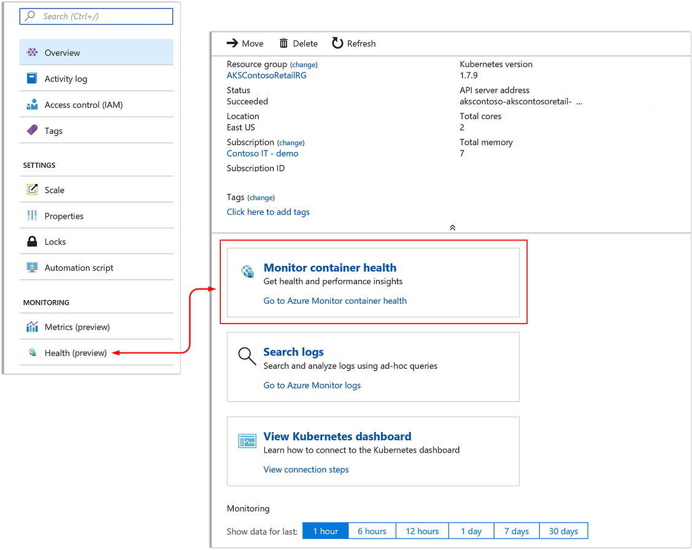

After you've enabled monitoring, it might take about 15 minutes before you can view operational data for the cluster. 

## Enable container health monitoring for existing managed clusters
You can enable monitoring of an AKS cluster that's already deployed either using Azure CLI, from the portal, or with the provided Azure Resource Manager template by using the PowerShell cmdlet `New-AzureRmResourceGroupDeployment`. 

### Enable monitoring using Azure CLI
The following step enables monitoring of your AKS cluster using Azure CLI. In this example, you are not required to per-create or specify an existing workspace. This command simplifies the process for you by creating a default workspace in the default resource group of the AKS cluster subscription if one does not already exist in the region.  The default workspace created resembles the format of *DefaultWorkspace-<GUID>-<Region>*.  

```azurecli
az aks enable-addons -a monitoring -n MyExistingManagedCluster -g MyExistingManagedClusterRG  
```

The output will resemble the following:

```azurecli
provisioningState       : Succeeded
```

### Enable monitoring in the Azure portal
To enable monitoring of your AKS container in the Azure portal, do the following:

1. In the Azure portal, select **All services**. 
2. In the list of resources, begin typing **Containers**.  
	The list filters based on your input. 
3. Select **Kubernetes services**.  

    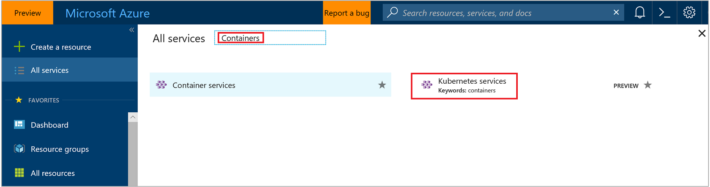

4. In the list of containers, select a container.
5. On the container overview page, select **Monitor container health**.  
6. On the **Onboarding to Container Health and Logs** page, if you have an existing Log Analytics workspace in the same subscription as the cluster, select it in the drop-down list.  
    The list preselects the default workspace and location that the AKS container is deployed to in the subscription. 

    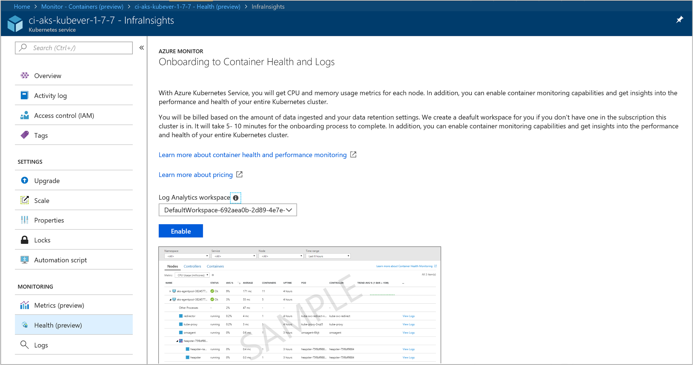

>[!NOTE]
>If you want to create a new Log Analytics workspace for storing the monitoring data from the cluster, follow the instructions in [Create a Log Analytics workspace](../log-analytics/log-analytics-quick-create-workspace.md). Be sure to create the workspace in the same subscription that the AKS container is deployed to. 
 
After you've enabled monitoring, it might take about 15 minutes before you can view operational data for the cluster. 

### Enable monitoring by using an Azure Resource Manager template
This method includes two JSON templates. One template specifies the configuration to enable monitoring, and the other contains parameter values that you configure to specify the following:

* The AKS container resource ID. 
* The resource group that the cluster is deployed in.
* The Log Analytics workspace and region to create the workspace in. 

The Log Analytics workspace has to be created manually. To create the workspace, you can set it up through [Azure Resource Manager](../log-analytics/log-analytics-template-workspace-configuration.md), through [PowerShell](https://docs.microsoft.com/azure/log-analytics/scripts/log-analytics-powershell-sample-create-workspace?toc=%2fpowershell%2fmodule%2ftoc.json), or in the [Azure portal](../log-analytics/log-analytics-quick-create-workspace.md).

If you are unfamiliar with the concept of deploying resources by using a template, see:
* [Deploy resources with Resource Manager templates and Azure PowerShell](../azure-resource-manager/resource-group-template-deploy.md)
* [Deploy resources with Resource Manager templates and the Azure CLI](../azure-resource-manager/resource-group-template-deploy-cli.md)

If you choose to use the Azure CLI, you first need to install and use the CLI locally. You must be running the Azure CLI version 2.0.27 or later. To identify your version, run `az --version`. If you need to install or upgrade the Azure CLI, see [Install the Azure CLI](https://docs.microsoft.com/cli/azure/install-azure-cli). 

#### Create and execute a template

1. Copy and paste the following JSON syntax into your file:

    ```json
    {
    "$schema": "https://schema.management.azure.com/schemas/2015-01-01/deploymentTemplate.json#",
    "contentVersion": "1.0.0.0",
    "parameters": {
      "aksResourceId": {
        "type": "string",
        "metadata": {
           "description": "AKS Cluster Resource ID"
           }
    },
    "aksResourceLocation": {
    "type": "string",
     "metadata": {
        "description": "Location of the AKS resource e.g. \"East US\""
       }
    },
    "workspaceResourceId": {
      "type": "string",
      "metadata": {
         "description": "Azure Monitor Log Analytics Resource ID"
       }
    },
    "workspaceRegion": {
    "type": "string",
    "metadata": {
       "description": "Azure Monitor Log Analytics workspace region"
      }
     }
    },
    "resources": [
      {
    "name": "[split(parameters('aksResourceId'),'/')[8]]",
    "type": "Microsoft.ContainerService/managedClusters",
    "location": "[parameters('aksResourceLocation')]",
    "apiVersion": "2018-03-31",
    "properties": {
      "mode": "Incremental",
      "id": "[parameters('aksResourceId')]",
      "addonProfiles": {
        "omsagent": {
          "enabled": true,
          "config": {
            "logAnalyticsWorkspaceResourceID": "[parameters('workspaceResourceId')]"
          }
         }
       }
      }
     },
    {
        "type": "Microsoft.Resources/deployments",
        "name": "[Concat('ContainerInsights', '(', split(parameters('workspaceResourceId'),'/')[8], ')')]",
        "apiVersion": "2017-05-10",
        "subscriptionId": "[split(parameters('workspaceResourceId'),'/')[2]]",
        "resourceGroup": "[split(parameters('workspaceResourceId'),'/')[4]]",
        "properties": {
            "mode": "Incremental",
            "template": {
                "$schema": "https://schema.management.azure.com/schemas/2015-01-01/deploymentTemplate.json#",
                "contentVersion": "1.0.0.0",
                "parameters": {},
                "variables": {},
                "resources": [
                    {
                        "apiVersion": "2015-11-01-preview",
                        "type": "Microsoft.OperationsManagement/solutions",
                        "location": "[parameters('workspaceRegion')]",
                        "name": "[Concat('ContainerInsights', '(', split(parameters('workspaceResourceId'),'/')[8], ')')]",
                        "properties": {
                            "workspaceResourceId": "[parameters('workspaceResourceId')]"
                        },
                        "plan": {
                            "name": "[Concat('ContainerInsights', '(', split(parameters('workspaceResourceId'),'/')[8], ')')]",
                            "product": "[Concat('OMSGallery/', 'ContainerInsights')]",
                            "promotionCode": "",
                            "publisher": "Microsoft"
                        }
                    }
                ]
            },
            "parameters": {}
        }
       }
     ]
    }
    ```

2. Save this file as **existingClusterOnboarding.json** to a local folder.
3. Paste the following JSON syntax into your file:

    ```json
    {
       "$schema": "https://schema.management.azure.com/  schemas/2015-01-01/deploymentParameters.json#",
       "contentVersion": "1.0.0.0",
       "parameters": {
         "aksResourceId": {
           "value": "/subscriptions/<SubscriptionId>/resourcegroups/<ResourceGroup>/providers/Microsoft.ContainerService/managedClusters/<ResourceName>"
       },
       "aksResourceLocation": {
         "value": "East US"
       },
       "workspaceResourceId": {
         "value": "/subscriptions/<SubscriptionId>/resourceGroups/<ResourceGroup>/providers/Microsoft.OperationalInsights/workspaces/<workspaceName>"
       },
       "workspaceRegion": {
         "value": "eastus"
       }
     }
    }
    ```

4. Edit the values for **aksResourceId** and **aksResourceLocation** by using the values on the **AKS Overview** page for the AKS cluster. The value for **workspaceResourceId** is the full resource ID of your Log Analytics workspace, which includes the workspace name. Also specify the location of the workspace for **workspaceRegion**. 
5. Save this file as **existingClusterParam.json** to a local folder.
6. You are ready to deploy this template. 

    * Use the following PowerShell commands in the folder that contains the template:

        ```powershell
        New-AzureRmResourceGroupDeployment -Name OnboardCluster -ResourceGroupName ClusterResourceGroupName -TemplateFile .\existingClusterOnboarding.json -TemplateParameterFile .\existingClusterParam.json
        ```
        The configuration change can take a few minutes to complete. When it's completed, a message is displayed that's similar to the following and includes the result:

        ```powershell
        provisioningState       : Succeeded
        ```

    * To run the following command by using the Azure CLI on Linux:
    
        ```azurecli
        az login
        az account set --subscription "Subscription Name"
        az group deployment create --resource-group <ResourceGroupName> --template-file ./existingClusterOnboarding.json --parameters @./existingClusterParam.json
        ```

        The configuration change can take a few minutes to complete. When it's completed, a message is displayed that's similar to the following and includes the result:

        ```azurecli
        provisioningState       : Succeeded
        ```
After you've enabled monitoring, it might take about 15 minutes before you can view operational data for the cluster. 

## Verify agent and solution deployment
With agent version *06072018* or later, you can verify that both the agent and the solution were deployed successfully. With earlier versions of the agent, you can verify only agent deployment.

### Agent version 06072018 or later
Run the following command to verify that the agent is deployed successfully. 

```
kubectl get ds omsagent --namespace=kube-system
```

The output should resemble the following, which indicates that it was deployed properly:

```
User@aksuser:~$ kubectl get ds omsagent --namespace=kube-system 
NAME       DESIRED   CURRENT   READY     UP-TO-DATE   AVAILABLE   NODE SELECTOR                 AGE
omsagent   2         2         2         2            2           beta.kubernetes.io/os=linux   1d
```  

To verify deployment of the solution, run the following command:

```
kubectl get deployment omsagent-rs -n=kube-system
```

The output should resemble the following, which indicates that it was deployed properly:

```
User@aksuser:~$ kubectl get deployment omsagent-rs -n=kube-system 
NAME       DESIRED   CURRENT   UP-TO-DATE   AVAILABLE    AGE
omsagent   1         1         1            1            3h
```

### Agent version earlier than 06072018

To verify that the Log Analytics agent version released before *06072018* is deployed properly, run the following command:  

```
kubectl get ds omsagent --namespace=kube-system
```

The output should resemble the following, which indicates that it was deployed properly:  

```
User@aksuser:~$ kubectl get ds omsagent --namespace=kube-system 
NAME       DESIRED   CURRENT   READY     UP-TO-DATE   AVAILABLE   NODE SELECTOR                 AGE
omsagent   2         2         2         2            2           beta.kubernetes.io/os=linux   1d
```  

## View configuration with CLI
Use the `aks show` command to get details such as is the solution enabled or not, what is the Log Analytics workspace resourceID, and summary details about the cluster.  

```azurecli
az aks show -g <resoourceGroupofAKSCluster> -n <nameofAksCluster>
```

After a few minutes, the command completes and returns JSON-formatted information about solution.  The results of the command should show the monitoring add-on profile and resembles the following example output:

```
"addonProfiles": {
    "omsagent": {
      "config": {
        "logAnalyticsWorkspaceResourceID": "/subscriptions/<WorkspaceSubscription>/resourceGroups/<DefaultWorkspaceRG>/providers/Microsoft.OperationalInsights/workspaces/<defaultWorkspaceName>"
      },
      "enabled": true
    }
  }
```

## View performance utilization
When you open container health, the page immediately presents the performance utilization of your entire cluster. Viewing information about your AKS cluster is organized into four perspectives:

- Cluster
- Nodes 
- Controllers  
- Containers

On the **Cluster** tab, the four line performance charts display key performance metrics of your cluster. 

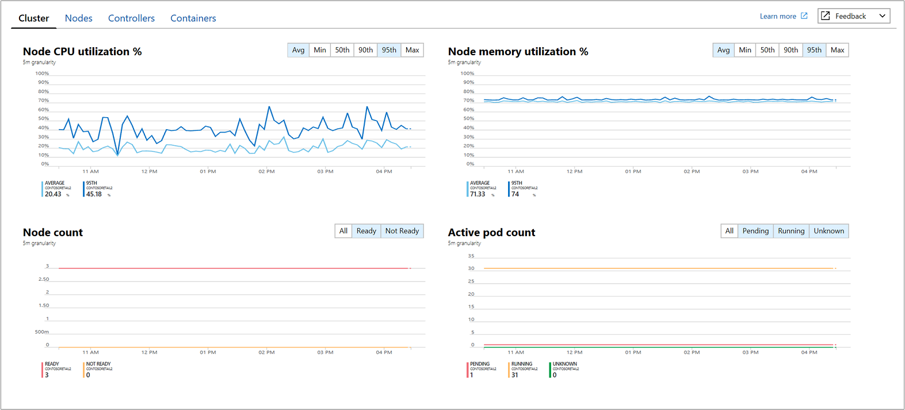

The performance chart displays four performance metrics:

- **Node CPU Utilization&nbsp;%**: An aggregated perspective of CPU utilization for the entire cluster. You can filter the results for the time range by selecting **Avg**, **Min**, **Max**, **50th**, **90th**, and **95th** in the percentiles selector above the chart, either individually or combined. 
- **Node memory utilization&nbsp;%**: An aggregated perspective of memory utilization for the entire cluster. You can filter the results for the time range by selecting **Avg**, **Min**, **Max**, **50th**, **90th**, and **95th** in the percentiles selector above the chart, either individually or combined. 
- **Node count**: A node count and status from Kubernetes. Statuses of the cluster nodes represented are *All*, *Ready*, and *Not Ready* and can be filtered individually or combined in the selector above the chart. 
- **Activity pod count**: A pod count and status from Kubernetes. Statuses of the pods represented are *All*, *Pending*, *Running*, and *Unknown* and can be filtered individually or combined in the selector above the chart. 

When you switch to **Nodes**, **Controllers**, and **Containers** tab, automatically displayed on the right-side of the page is the property pane.  It shows the properties of the item selected, including labels you define to organize Kubernetes objects.  Click on the **>>** link in the pane to view\hide the pane.  

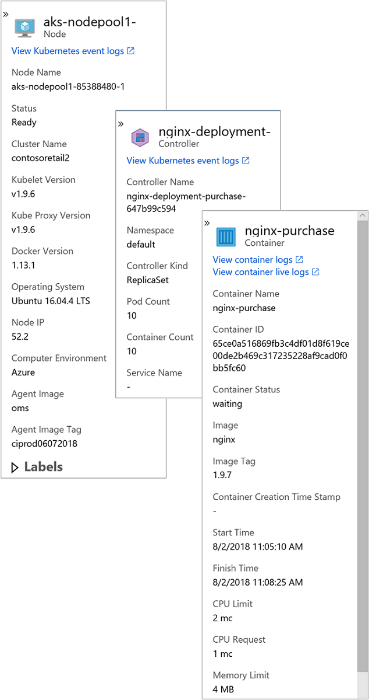

As you expand the objects in the hierarchy, the properties pane updates based on the object selected. From the pane you can also view Kubernetes events with pre-defined log searches by clicking on the **View Kubernetes event logs** link at the top of the pane. For additional information about viewing Kubernetes log data, see [Search logs to analyze data](#search-logs-to-analyze-data).

Switch to the **Nodes** tab and the row hierarchy follows the Kubernetes object model, starting with a node in your cluster. Expand the node and you can view one or more pods running on the node. If more than one container is grouped to a pod, they are displayed as the last row in the hierarchy. You can also view how many non-pod related workloads are running on the host if the host has processor or memory pressure.

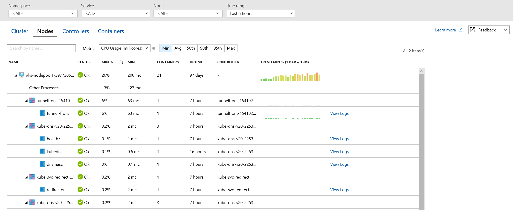

You can select controllers or containers at the top of the page and review the status and resource utilization for those objects. Use the drop-down boxes at the top to filter by namespace, service, and node. If instead you want to review memory utilization, in the **Metric** drop-down list, select **Memory RSS** or **Memory working set**. **Memory RSS** is supported only for Kubernetes version 1.8 and later. Otherwise, you view values for **Min&nbsp;%** as *NaN&nbsp;%*, which is a numeric data type value that represents an undefined or unrepresentable value. 

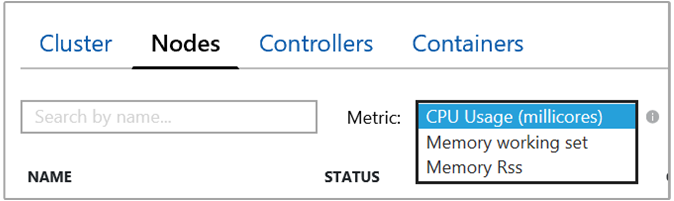

By default, Performance data is based on the last six hours, but you can change the window by using the **Time Range** drop-down list at the upper right. At this time, the page does not auto-refresh, so you need to manually refresh it. You can also filter the results within the time range by selecting **Avg**, **Min**, **Max**, **50th**, **90th**, and **95th** in the percentile selector. 

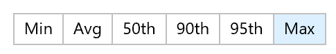

In the following example, note for node *aks-nodepool-3977305*, the value for **Containers** is 5, which is a roll-up of the total number of containers deployed.

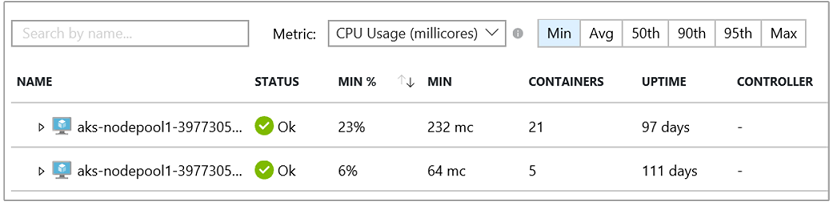

It can help you quickly identify whether you have a proper balance of containers between nodes in your cluster. 

The information that's presented when you view Nodes is described in the following table:

| Column | Description | 
|--------|-------------|
| Name | The name of the host. |
| Status | Kubernetes view of the node status. |
| Avg&nbsp;%, Min&nbsp;%, Max&nbsp;%, 50th&nbsp;%, 90th&nbsp;% | Average node percentage based on percentile during the selected duration. |
| Avg, Min, Max, 50th, 90th | Average nodes actual value based on percentile during that time duration selected. The average value is measured from the CPU/Memory limit set for a node; for pods and containers it is the avg value reported by the host. |
| Containers | Number of containers. |
| Uptime | Represents the time since a node started or was rebooted. |
| Controllers | Only for containers and pods. It shows which controller it is residing in. Not all pods are in a controller, so some might display **N/A**. | 
| Trend Avg&nbsp;%, Min&nbsp;%, Max&nbsp;%, 50th&nbsp;%, 90th&nbsp;% | Bar graph trend presenting the percentile metric percentage of the controller. |


In the selector, select **Controllers**.

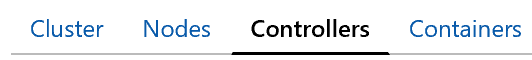

Here you can view the performance health of your controllers.

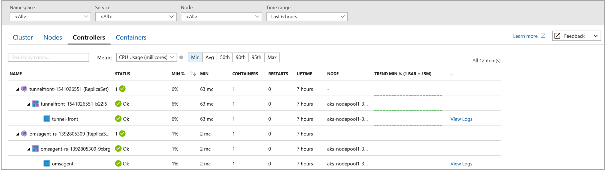

The row hierarchy starts with a controller and expands the controller. You view one or more containers. Expand a pod, and the last row displays the container grouped to the pod. 

The information that's displayed when you view controllers is described in the following table:

| Column | Description | 
|--------|-------------|
| Name | The name of the controller.|
| Status | The roll-up status of the containers when it has completed running with status, such as *OK*, *Terminated*, *Failed* *Stopped*, or *Paused*. If the container is running, but the status was either not properly displayed or was not picked up by the agent and has not responded more than 30 minutes, the status is *Unknown*. Additional details of the status icon are provided in the table below.|
| Avg&nbsp;%, Min&nbsp;%, Max&nbsp;%, 50th&nbsp;%, 90th&nbsp;% | Roll-up average of the average percentage of each entity for the selected metric and percentile. |
| Avg, Min, Max, 50th, 90th  | Roll-up of the average CPU millicore or memory performance of the container for the selected percentile. The average value is measured from the CPU/Memory limit set for a pod. |
| Containers | Total number of containers for the controller or pod. |
| Restarts | Roll-up of the restart count from containers. |
| Uptime | Represents the time since a container started. |
| Node | Only for containers and pods. It shows which controller it is residing. | 
| Trend Avg&nbsp;%, Min&nbsp;%, Max&nbsp;%, 50th&nbsp;%, 90th&nbsp;%| Bar graph trend representing percentile metric of the controller. |

The icons in the status field indicate the online status of the containers:
 
| Icon | Status | 
|--------|-------------|
|  | Running (Ready)|
|  | Waiting or Paused|
|  | Last reported running but hasn't responded more than 30 minutes|
|  | Successfully stopped or failed to stop|

The status icon displays a count based on what the pod provides. It shows the worst two states, and when you hover over the status, it displays a roll-up status from all pods in the container. If there isn't a ready state, the status value displays **(0)**. 

In the selector, select **Containers**.

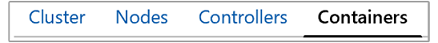

Here you can view the performance health of your containers.

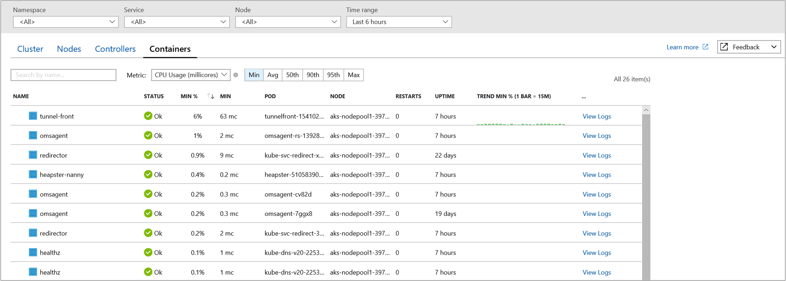

The information that's displayed when you view containers is described in the following table:

| Column | Description | 
|--------|-------------|
| Name | The name of the controller.|
| Status | Status of the containers, if any. Additional details of the status icon are provided in the next table.|
| Avg&nbsp;%, Min&nbsp;%, Max&nbsp;%, 50th&nbsp;%, 90th&nbsp;% | The roll-up of the average percentage of each entity for the selected metric and percentile. |
| Avg, Min, Max, 50th, 90th  | The roll-up of the average CPU millicore or memory performance of the container for the selected percentile. The average value is measured from the CPU/Memory limit set for a pod. |
| Pod | Container where the pod resides.| 
| Node |  Node where the container resides. | 
| Restarts | Represents the time since a container started. |
| Uptime | Represents the time since a container was started or rebooted. |
| Trend Avg&nbsp;%, Min&nbsp;%, Max&nbsp;%, 50th&nbsp;%, 90th&nbsp;% | A bar graph trend that represents the average metric percentage of the container. |

The icons in the status field indicate the online statuses of pods, as described in the following table:
 
| Icon | Status | 
|--------|-------------|
|  | Running (Ready)|
|  | Waiting or Paused|
|  | Last reported running but hasn't responded in more than 30 minutes|
|  | Successfully stopped or failed to stop|
|  | Failed state |

## Container data-collection details
Container health collects various performance metrics and log data from container hosts and containers. Data is collected every three minutes.

### Container records

Examples of records that are collected by container health and the data types that appear in log search results are displayed in the following table:

| Data type | Data type in Log Search | Fields |
| --- | --- | --- |
| Performance for hosts and containers | `Perf` | Computer, ObjectName, CounterName &#40;%Processor Time, Disk Reads MB, Disk Writes MB, Memory Usage MB, Network Receive Bytes, Network Send Bytes, Processor Usage sec, Network&#41;, CounterValue, TimeGenerated, CounterPath, SourceSystem |
| Container inventory | `ContainerInventory` | TimeGenerated, Computer, container name, ContainerHostname, Image, ImageTag, ContainerState, ExitCode, EnvironmentVar, Command, CreatedTime, StartedTime, FinishedTime, SourceSystem, ContainerID, ImageID |
| Container image inventory | `ContainerImageInventory` | TimeGenerated, Computer, Image, ImageTag, ImageSize, VirtualSize, Running, Paused, Stopped, Failed, SourceSystem, ImageID, TotalContainer |
| Container log | `ContainerLog` | TimeGenerated, Computer, image ID, container name, LogEntrySource, LogEntry, SourceSystem, ContainerID |
| Container service log | `ContainerServiceLog`  | TimeGenerated, Computer, TimeOfCommand, Image, Command, SourceSystem, ContainerID |
| Container node inventory | `ContainerNodeInventory_CL`| TimeGenerated, Computer, ClassName_s, DockerVersion_s, OperatingSystem_s, Volume_s, Network_s, NodeRole_s, OrchestratorType_s, InstanceID_g, SourceSystem|
| Container process | `ContainerProcess_CL` | TimeGenerated, Computer, Pod_s, Namespace_s, ClassName_s, InstanceID_s, Uid_s, PID_s, PPID_s, C_s, STIME_s, Tty_s, TIME_s, Cmd_s, Id_s, Name_s, SourceSystem |
| Inventory of pods in a Kubernetes cluster | `KubePodInventory` | TimeGenerated, Computer, ClusterId, ContainerCreationTimeStamp, PodUid, PodCreationTimeStamp, ContainerRestartCount, PodRestartCount, PodStartTime, ContainerStartTime, ServiceName, ControllerKind, ControllerName, ContainerStatus, ContainerID, ContainerName, Name, PodLabel, Namespace, PodStatus, ClusterName, PodIp, SourceSystem |
| Inventory of nodes part of a Kubernetes cluster | `KubeNodeInventory` | TimeGenerated, Computer, ClusterName, ClusterId, LastTransitionTimeReady, Labels, Status, KubeletVersion, KubeProxyVersion, CreationTimeStamp, SourceSystem | 
| Kubernetes Events | `KubeEvents_CL` | TimeGenerated, Computer, ClusterId_s, FirstSeen_t, LastSeen_t, Count_d, ObjectKind_s, Namespace_s, Name_s, Reason_s, Type_s, TimeGenerated_s, SourceComponent_s, ClusterName_s, Message,  SourceSystem | 
| Services in the Kubernetes cluster | `KubeServices_CL` | TimeGenerated, ServiceName_s, Namespace_s, SelectorLabels_s, ClusterId_s, ClusterName_s, ClusterIP_s, ServiceType_s, SourceSystem | 
| Performance metrics for nodes part of the Kubernetes cluster | Perf &#124; where ObjectName == “K8SNode” | Computer, ObjectName, CounterName &#40;cpuUsageNanoCores, , memoryWorkingSetBytes, memoryRssBytes, networkRxBytes, networkTxBytes, restartTimeEpoch, networkRxBytesPerSec, networkTxBytesPerSec, cpuAllocatableNanoCores, memoryAllocatableBytes, cpuCapacityNanoCores, memoryCapacityBytes&#41;,CounterValue, TimeGenerated, CounterPath, SourceSystem | 
| Performance metrics for containers part of the Kubernetes cluster | Perf &#124; where ObjectName == “K8SContainer” | CounterName &#40;cpuUsageNanoCores, memoryWorkingSetBytes, memoryRssBytes, restartTimeEpoch, cpuRequestNanoCores, memoryRequestBytes, cpuLimitNanoCores, memoryLimitBytes&#41;,CounterValue, TimeGenerated, CounterPath, SourceSystem | 

## Search logs to analyze data
Log Analytics can help you look for trends, diagnose bottlenecks, forecast, or correlate data that can help you determine whether the current cluster configuration is performing optimally. Pre-defined log searches are provided for you to immediately start using or to customize to return the information the way you want. 

You can perform interactive analysis of data in the workspace by selecting the **View Kubernetes event logs** or **View container logs** option in the preview pane. The **Log Search** page appears to the right of the Azure portal page that you were on.

   

The container logs output that's forwarded to Log Analytics are STDOUT and STDERR. Because container health is monitoring Azure-managed Kubernetes (AKS), Kube-system is not collected today because of the large volume of generated data. 

### Example log search queries
It's often useful to build queries that start with an example or two and then modify them to fit your requirements. To help build more advanced queries, you can experiment with the following sample queries:

| Query | Description | 
|-------|-------------|
| ContainerInventory<br> &#124; project Computer, Name, Image, ImageTag, ContainerState, CreatedTime, StartedTime, FinishedTime<br> &#124; render table | List all of a container's lifecycle information| 
| KubeEvents_CL<br> &#124; where not(isempty(Namespace_s))<br> &#124; sort by TimeGenerated desc<br> &#124; render table | Kubernetes events|
| ContainerImageInventory<br> &#124; summarize AggregatedValue = count() by Image, ImageTag, Running | Image inventory | 
| **In Advanced Analytics, select line charts**:<br> Perf<br> &#124; where ObjectName == "Container" and CounterName == "% Processor Time"<br> &#124; summarize AvgCPUPercent = avg(CounterValue) by bin(TimeGenerated, 30m), InstanceName | Container CPU | 
| **In Advanced Analytics, select line charts**:<br> Perf &#124; where ObjectName == "Container" and CounterName == "Memory Usage MB"<br> &#124; summarize AvgUsedMemory = avg(CounterValue) by bin(TimeGenerated, 30m), InstanceName | Container memory |

## How to stop monitoring with container health
If, after you enable monitoring of your AKS container, you decide you no longer want to monitor it, you can *opt out* by using either the provided Azure Resource Manager templates with the PowerShell cmdlet **New-AzureRmResourceGroupDeployment** or the Azure CLI. One JSON template specifies the configuration to *opt out*. The other contains parameter values that you configure to specify the AKS cluster resource ID and resource group that the cluster is deployed in. 

If you're unfamiliar with the concept of deploying resources by using a template, see:
* [Deploy resources with Resource Manager templates and Azure PowerShell](../azure-resource-manager/resource-group-template-deploy.md)
* [Deploy resources with Resource Manager templates and the Azure CLI](../azure-resource-manager/resource-group-template-deploy-cli.md)

If you choose to use the Azure CLI, you first need to install and use the CLI locally. You must be running the Azure CLI version 2.0.27 or later. To identify your version, run `az --version`. If you need to install or upgrade the Azure CLI, see [Install the Azure CLI](https://docs.microsoft.com/cli/azure/install-azure-cli). 

### Create and execute template

1. Copy and paste the following JSON syntax into your file:

    ```json
    {
      "$schema": "https://schema.management.azure.com/schemas/2015-01-01/deploymentTemplate.json#",
      "contentVersion": "1.0.0.0",
      "parameters": {
        "aksResourceId": {
           "type": "string",
           "metadata": {
             "description": "AKS Cluster Resource ID"
           }
       },
      "aksResourceLocation": {
        "type": "string",
        "metadata": {
           "description": "Location of the AKS resource e.g. \"East US\""
         }
       }
    },
    "resources": [
      {
        "name": "[split(parameters('aksResourceId'),'/')[8]]",
        "type": "Microsoft.ContainerService/managedClusters",
        "location": "[parameters('aksResourceLocation')]",
        "apiVersion": "2018-03-31",
        "properties": {
          "mode": "Incremental",
          "id": "[parameters('aksResourceId')]",
          "addonProfiles": {
            "omsagent": {
              "enabled": false,
              "config": null
            }
           }
         }
       }
      ]
    }
    ```

2. Save this file as **OptOutTemplate.json** to a local folder.
3. Paste the following JSON syntax into your file:

    ```json
    {
     "$schema": "https://schema.management.azure.com/schemas/2015-01-01/deploymentParameters.json#",
     "contentVersion": "1.0.0.0",
     "parameters": {
       "aksResourceId": {
         "value": "/subscriptions/<SubscriptionID>/resourcegroups/<ResourceGroup>/providers/Microsoft.ContainerService/managedClusters/<ResourceName>"
      },
      "aksResourceLocation": {
        "value": "<aksClusterRegion>"
        }
      }
    }
    ```

4. Edit the values for **aksResourceId** and **aksResourceLocation** by using the values of the AKS cluster, which you can find on the **Properties** page for the selected cluster.

    

    While you are on the **Properties** page, also copy the **Workspace Resource ID**. This value is required if you decide you want to delete the Log Analytics workspace later. Deleting the Log Analytics workspace is not performed as part of this process. 

5. Save this file as **OptOutParam.json** to a local folder.
6. You are ready to deploy this template. 

    * To use the following PowerShell commands in the folder containing the template:

        ```powershell
        Connect-AzureRmAccount
        Select-AzureRmSubscription -SubscriptionName <yourSubscriptionName>
        New-AzureRmResourceGroupDeployment -Name opt-out -ResourceGroupName <ResourceGroupName> -TemplateFile .\OptOutTemplate.json -TemplateParameterFile .\OptOutParam.json
        ```

        The configuration change can take a few minutes to complete. When it's completed, a message similar to the following that includes the result is returned:

        ```powershell
        ProvisioningState       : Succeeded
        ```

    * To run following command with Azure CLI on Linux:

        ```azurecli
        az login   
        az account set --subscription "Subscription Name" 
        az group deployment create --resource-group <ResourceGroupName> --template-file ./OptOutTemplate.json --parameters @./OptOutParam.json  
        ```

        The configuration change can take a few minutes to complete. When it's completed, a message similar to the following that includes the result is returned:

        ```azurecli
        ProvisioningState       : Succeeded
        ```

If the workspace was created only to support monitoring the cluster and it's no longer needed, you have to manually delete it. If you are not familiar with how to delete a workspace, see [Delete an Azure Log Analytics workspace with the Azure portal](../log-analytics/log-analytics-manage-del-workspace.md). Don't forget about the **Workspace Resource ID** we copied earlier in step 4, you're going to need that. 

## Troubleshooting
This section provides information to help troubleshoot issues with container health.

If container health was successfully enabled and configured but you cannot view status information or results in Log Analytics when you perform a log search, you can help diagnose the problem by doing the following: 

1. Check the status of the agent by running the following command: 

    `kubectl get ds omsagent --namespace=kube-system`

    The output should resemble the following, which indicates that it was deployed properly:

    ```
    User@aksuser:~$ kubectl get ds omsagent --namespace=kube-system 
    NAME       DESIRED   CURRENT   READY     UP-TO-DATE   AVAILABLE   NODE SELECTOR                 AGE
    omsagent   2         2         2         2            2           beta.kubernetes.io/os=linux   1d
    ```  
2. Check the solution deployment status with agent version *06072018* or later by running the following command:

    `kubectl get deployment omsagent-rs -n=kube-system`

    The output should resemble the following, which indicates that it was deployed properly:

    ```
    User@aksuser:~$ kubectl get deployment omsagent-rs -n=kube-system 
    NAME       DESIRED   CURRENT   UP-TO-DATE   AVAILABLE    AGE
    omsagent   1         1         1            1            3h
    ```

3. Check the status of the pod to verify that it is running by running the following command: `kubectl get pods --namespace=kube-system`

    The output should resemble the following with a status of *Running* for the omsagent:

    ```
    User@aksuser:~$ kubectl get pods --namespace=kube-system 
    NAME                                READY     STATUS    RESTARTS   AGE 
    aks-ssh-139866255-5n7k5             1/1       Running   0          8d 
    azure-vote-back-4149398501-7skz0    1/1       Running   0          22d 
    azure-vote-front-3826909965-30n62   1/1       Running   0          22d 
    omsagent-484hw                      1/1       Running   0          1d 
    omsagent-fkq7g                      1/1       Running   0          1d 
    ```

4. Check the agent logs. When the containerized agent gets deployed, it runs a quick check by running OMI commands and displays the version of the agent and provider. 

5. To verify that the agent has been onboarded successfully, run the following command: `kubectl logs omsagent-484hw --namespace=kube-system`

    The status should resemble the following:

    ```
    User@aksuser:~$ kubectl logs omsagent-484hw --namespace=kube-system
	:
	:
	instance of Container_HostInventory
	{
	    [Key] InstanceID=3a4407a5-d840-4c59-b2f0-8d42e07298c2
	    Computer=aks-nodepool1-39773055-0
	    DockerVersion=1.13.1
	    OperatingSystem=Ubuntu 16.04.3 LTS
	    Volume=local
	    Network=bridge host macvlan null overlay
	    NodeRole=Not Orchestrated
	    OrchestratorType=Kubernetes
	}
	Primary Workspace: b438b4f6-912a-46d5-9cb1-b44069212abc    Status: Onboarded(OMSAgent Running)
	omi 1.4.2.2
	omsagent 1.6.0.23
	docker-cimprov 1.0.0.31
    ```

## Next steps

To view detailed container health and application performance information, see [Search logs](../log-analytics/log-analytics-log-search.md). 
