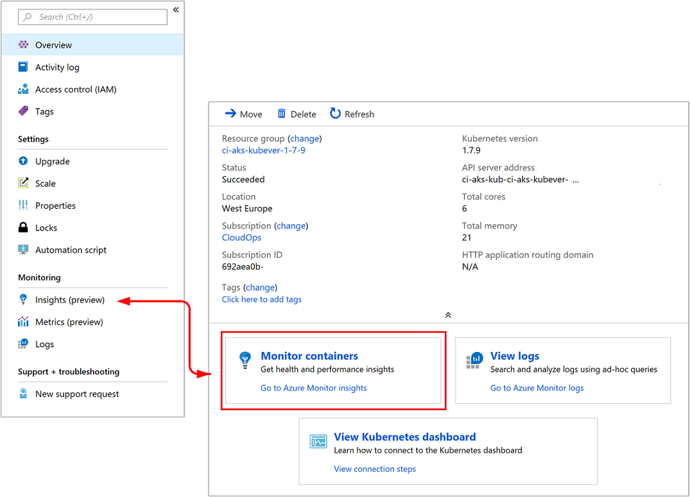
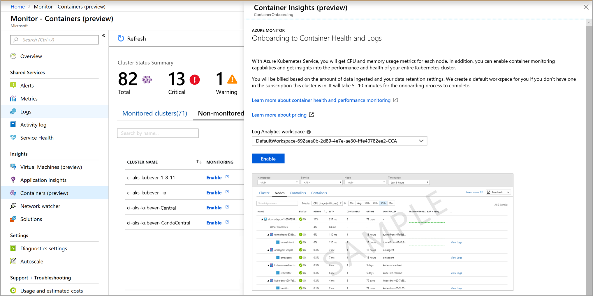
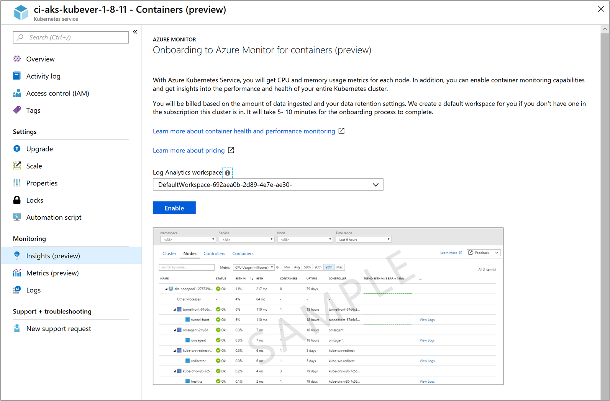

# How to onboard Azure Monitor for containers
This article describes how to set up Azure Monitor for containers to monitor the performance of workloads that are deployed to Kubernetes environments and hosted on [Azure Kubernetes Service](https://docs.microsoft.com/azure/aks/).

## Prerequisites 
Before you start, make sure that you have the following:

- A new or existing AKS cluster.
- A containerized Log Analytics agent for Linux version microsoft/oms:ciprod04202018 or later. The version number is represented by a date in the following format: *mmddyyyy*. The agent is installed automatically during the onboarding of this feature. 
- A Log Analytics workspace. You can create it when you enable monitoring of your new AKS cluster or let the onboarding experience create a default workspace in the default resource group of the AKS cluster subscription. If you chose to create it yourself, you can create it through [Azure Resource Manager](../log-analytics/log-analytics-template-workspace-configuration.md), through [PowerShell](https://docs.microsoft.com/azure/log-analytics/scripts/log-analytics-powershell-sample-create-workspace?toc=%2fpowershell%2fmodule%2ftoc.json), or in the [Azure portal](../log-analytics/log-analytics-quick-create-workspace.md).
- The Log Analytics contributor role, to enable container monitoring. For more information about how to control access to a Log Analytics workspace, see [Manage workspaces](../log-analytics/log-analytics-manage-access.md).

[!INCLUDE [log-analytics-agent-note](../../includes/log-analytics-agent-note.md)]

## Components 

Your ability to monitor performance relies on a containerized Log Analytics agent for Linux, which collects performance and event data from all nodes in the cluster. The agent is automatically deployed and registered with the specified Log Analytics workspace after you enable container monitoring. 

>[!NOTE] 
>If you have already deployed an AKS cluster, you enable monitoring by using either Azure CLI or a provided Azure Resource Manager template, as demonstrated later in this article. You cannot use `kubectl` to upgrade, delete, re-deploy, or deploy the agent. 
>The template needs to be deployed in the same resource group as the cluster.”

## Sign in to the Azure portal
Sign in to the [Azure portal](https://portal.azure.com). 

## Enable monitoring for a new cluster
During deployment, you can enable monitoring of a new AKS cluster in the Azure portal or with Azure CLI. Follow the steps in the quickstart article [Deploy an Azure Kubernetes Service (AKS) cluster](../aks/kubernetes-walkthrough-portal.md) if you want to enable from the portal. On the **Monitoring** page, for the **Enable Monitoring** option, select **Yes**, and then select an existing Log Analytics workspace or create a new one. 

To enable monitoring of a new AKS cluster created with Azure CLI, follow the step in the quickstart article under the section [Create AKS cluster](../aks/kubernetes-walkthrough.md#create-aks-cluster).  

>[!NOTE]
>If you choose to use the Azure CLI, you first need to install and use the CLI locally. You must be running the Azure CLI version 2.0.43 or later. To identify your version, run `az --version`. If you need to install or upgrade the Azure CLI, see [Install the Azure CLI](https://docs.microsoft.com/cli/azure/install-azure-cli). 
>

After you've enabled monitoring and all configuration tasks are completed successfully, you can monitor the performance of your cluster in either of two ways:

* Directly in the AKS cluster by selecting **Health** in the left pane.
* By selecting the **Monitor Container insights** tile in the AKS cluster page for the selected cluster. In Azure Monitor, in the left pane, select **Health**. 

  

After you've enabled monitoring, it might take about 15 minutes before you can view health metrics for the cluster. 

## Enable monitoring for existing managed clusters
You can enable monitoring of an AKS cluster that's already deployed either using Azure CLI, from the portal, or with the provided Azure Resource Manager template by using the PowerShell cmdlet `New-AzureRmResourceGroupDeployment`. 

### Enable monitoring using Azure CLI
The following step enables monitoring of your AKS cluster using Azure CLI. In this example, you are not required to per-create or specify an existing workspace. This command simplifies the process for you by creating a default workspace in the default resource group of the AKS cluster subscription if one does not already exist in the region.  The default workspace created resembles the format of *DefaultWorkspace-<GUID>-<Region>*.  

```azurecli
az aks enable-addons -a monitoring -n MyExistingManagedCluster -g MyExistingManagedClusterRG  
```

The output will resemble the following:

```azurecli
provisioningState       : Succeeded
```

If you would rather integrate with an existing workspace, use the following command to specify that workspace.

```azurecli
az aks enable-addons -a monitoring -n MyExistingManagedCluster -g MyExistingManagedClusterRG --workspace-resource-id <ExistingWorkspaceResourceID> 
```

The output will resemble the following:

```azurecli
provisioningState       : Succeeded
```

### Enable monitoring from Azure Monitor
To enable monitoring of your AKS cluster in the Azure portal from Azure Monitor, do the following:

1. In the Azure portal, select **Monitor**. 
2. Select **Containers (preview)** from the list.
3. On the **Monitor - containers (preview)** page, select **Non-monitored clusters**.
4. From the list of non-monitored clusters, find the container in the list and click **Enable**.   
5. On the **Onboarding to Container Health and Logs** page, if you have an existing Log Analytics workspace in the same subscription as the cluster, select it from the drop-down list.  
    The list preselects the default workspace and location that the AKS container is deployed to in the subscription. 

    

    >[!NOTE]
    >If you want to create a new Log Analytics workspace for storing the monitoring data from the cluster, follow the instructions in [Create a Log Analytics workspace](../log-analytics/log-analytics-quick-create-workspace.md). Be sure to create the workspace in the same subscription that the AKS container is deployed to. 
 
After you've enabled monitoring, it might take about 15 minutes before you can view health metrics for the cluster. 

### Enable monitoring from AKS cluster in the portal
To enable monitoring of your AKS container in the Azure portal, do the following:

1. In the Azure portal, select **All services**. 
2. In the list of resources, begin typing **Containers**.  
	The list filters based on your input. 
3. Select **Kubernetes services**.  

    

4. In the list of containers, select a container.
5. On the container overview page, select **Monitor container health**.  
6. On the **Onboarding to Container Health and Logs** page, if you have an existing Log Analytics workspace in the same subscription as the cluster, select it in the drop-down list.  
    The list preselects the default workspace and location that the AKS container is deployed to in the subscription. 

    

    >[!NOTE]
    >If you want to create a new Log Analytics workspace for storing the monitoring data from the cluster, follow the instructions in [Create a Log Analytics workspace](../log-analytics/log-analytics-quick-create-workspace.md). Be sure to create the workspace in the same subscription that the AKS container is deployed to. 
 
After you've enabled monitoring, it might take about 15 minutes before you can view operational data for the cluster. 

### Enable monitoring by using an Azure Resource Manager template
This method includes two JSON templates. One template specifies the configuration to enable monitoring, and the other contains parameter values that you configure to specify the following:

* The AKS container resource ID. 
* The resource group that the cluster is deployed in.
* The Log Analytics workspace and region to create the workspace in. 

>[!NOTE]
>The template needs to be deployed in the same resource group as the cluster.
>

The Log Analytics workspace has to be created manually. To create the workspace, you can set it up through [Azure Resource Manager](../log-analytics/log-analytics-template-workspace-configuration.md), through [PowerShell](https://docs.microsoft.com/azure/log-analytics/scripts/log-analytics-powershell-sample-create-workspace?toc=%2fpowershell%2fmodule%2ftoc.json), or in the [Azure portal](../log-analytics/log-analytics-quick-create-workspace.md).

If you are unfamiliar with the concept of deploying resources by using a template, see:
* [Deploy resources with Resource Manager templates and Azure PowerShell](../azure-resource-manager/resource-group-template-deploy.md)
* [Deploy resources with Resource Manager templates and the Azure CLI](../azure-resource-manager/resource-group-template-deploy-cli.md)

If you choose to use the Azure CLI, you first need to install and use the CLI locally. You must be running the Azure CLI version 2.0.27 or later. To identify your version, run `az --version`. If you need to install or upgrade the Azure CLI, see [Install the Azure CLI](https://docs.microsoft.com/cli/azure/install-azure-cli). 

#### Create and execute a template

1. Copy and paste the following JSON syntax into your file:

    ```json
    {
    "$schema": "https://schema.management.azure.com/schemas/2015-01-01/deploymentTemplate.json#",
    "contentVersion": "1.0.0.0",
    "parameters": {
      "aksResourceId": {
        "type": "string",
        "metadata": {
           "description": "AKS Cluster Resource ID"
           }
    },
    "aksResourceLocation": {
    "type": "string",
     "metadata": {
        "description": "Location of the AKS resource e.g. \"East US\""
       }
    },
    "workspaceResourceId": {
      "type": "string",
      "metadata": {
         "description": "Azure Monitor Log Analytics Resource ID"
       }
    },
    "workspaceRegion": {
    "type": "string",
    "metadata": {
       "description": "Azure Monitor Log Analytics workspace region"
      }
     }
    },
    "resources": [
      {
    "name": "[split(parameters('aksResourceId'),'/')[8]]",
    "type": "Microsoft.ContainerService/managedClusters",
    "location": "[parameters('aksResourceLocation')]",
    "apiVersion": "2018-03-31",
    "properties": {
      "mode": "Incremental",
      "id": "[parameters('aksResourceId')]",
      "addonProfiles": {
        "omsagent": {
          "enabled": true,
          "config": {
            "logAnalyticsWorkspaceResourceID": "[parameters('workspaceResourceId')]"
          }
         }
       }
      }
     },
    {
        "type": "Microsoft.Resources/deployments",
        "name": "[Concat('ContainerInsights', '-',  uniqueString(parameters('workspaceResourceId')))]",	
        "apiVersion": "2017-05-10",
        "subscriptionId": "[split(parameters('workspaceResourceId'),'/')[2]]",
        "resourceGroup": "[split(parameters('workspaceResourceId'),'/')[4]]",
        "properties": {
            "mode": "Incremental",
            "template": {
                "$schema": "https://schema.management.azure.com/schemas/2015-01-01/deploymentTemplate.json#",
                "contentVersion": "1.0.0.0",
                "parameters": {},
                "variables": {},
                "resources": [
                    {
                        "apiVersion": "2015-11-01-preview",
                        "type": "Microsoft.OperationsManagement/solutions",
                        "location": "[parameters('workspaceRegion')]",
                        "name": "[Concat('ContainerInsights', '(', split(parameters('workspaceResourceId'),'/')[8], ')')]",
                        "properties": {
                            "workspaceResourceId": "[parameters('workspaceResourceId')]"
                        },
                        "plan": {
                            "name": "[Concat('ContainerInsights', '(', split(parameters('workspaceResourceId'),'/')[8], ')')]",
                            "product": "[Concat('OMSGallery/', 'ContainerInsights')]",
                            "promotionCode": "",
                            "publisher": "Microsoft"
                        }
                    }
                ]
            },
            "parameters": {}
        }
       }
     ]
    }
    ```

2. Save this file as **existingClusterOnboarding.json** to a local folder.
3. Paste the following JSON syntax into your file:

    ```json
    {
       "$schema": "https://schema.management.azure.com/  schemas/2015-01-01/deploymentParameters.json#",
       "contentVersion": "1.0.0.0",
       "parameters": {
         "aksResourceId": {
           "value": "/subscriptions/<SubscriptiopnId>/resourcegroups/<ResourceGroup>/providers/Microsoft.ContainerService/managedClusters/<ResourceName>"
       },
       "aksResourceLocation": {
         "value": "<aksClusterLocation>"
       },
       "workspaceResourceId": {
         "value": "/subscriptions/<SubscriptionId>/resourceGroups/<ResourceGroup>/providers/Microsoft.OperationalInsights/workspaces/<workspaceName>"
       },
       "workspaceRegion": {
         "value": "<workspaceLocation>"
       }
     }
    }
    ```

4. Edit the values for **aksResourceId** and **aksResourceLocation** by using the values on the **AKS Overview** page for the AKS cluster. The value for **workspaceResourceId** is the full resource ID of your Log Analytics workspace, which includes the workspace name. Also specify the location of the workspace for **workspaceRegion**. 
5. Save this file as **existingClusterParam.json** to a local folder.
6. You are ready to deploy this template. 

    * Use the following PowerShell commands in the folder that contains the template:

        ```powershell
        New-AzureRmResourceGroupDeployment -Name OnboardCluster -ClusterResourceGroupName ClusterResourceGroupName -TemplateFile .\existingClusterOnboarding.json -TemplateParameterFile .\existingClusterParam.json
        ```
        The configuration change can take a few minutes to complete. When it's completed, a message is displayed that's similar to the following and includes the result:

        ```powershell
        provisioningState       : Succeeded
        ```

    * To run the following command by using the Azure CLI:
    
        ```azurecli
        az login
        az account set --subscription "Subscription Name"
        az group deployment create --resource-group <ResourceGroupName> --template-file ./existingClusterOnboarding.json --parameters @./existingClusterParam.json
        ```

        The configuration change can take a few minutes to complete. When it's completed, a message is displayed that's similar to the following and includes the result:

        ```azurecli
        provisioningState       : Succeeded
        ```
After you've enabled monitoring, it might take about 15 minutes before you can view health metrics for the cluster. 

## Verify agent and solution deployment
With agent version *06072018* or later, you can verify that both the agent and the solution were deployed successfully. With earlier versions of the agent, you can verify only agent deployment.

### Agent version 06072018 or later
Run the following command to verify that the agent is deployed successfully. 

```
kubectl get ds omsagent --namespace=kube-system
```

The output should resemble the following, which indicates that it was deployed properly:

```
User@aksuser:~$ kubectl get ds omsagent --namespace=kube-system 
NAME       DESIRED   CURRENT   READY     UP-TO-DATE   AVAILABLE   NODE SELECTOR                 AGE
omsagent   2         2         2         2            2           beta.kubernetes.io/os=linux   1d
```  

To verify deployment of the solution, run the following command:

```
kubectl get deployment omsagent-rs -n=kube-system
```

The output should resemble the following, which indicates that it was deployed properly:

```
User@aksuser:~$ kubectl get deployment omsagent-rs -n=kube-system 
NAME       DESIRED   CURRENT   UP-TO-DATE   AVAILABLE    AGE
omsagent   1         1         1            1            3h
```

### Agent version earlier than 06072018

To verify that the Log Analytics agent version released before *06072018* is deployed properly, run the following command:  

```
kubectl get ds omsagent --namespace=kube-system
```

The output should resemble the following, which indicates that it was deployed properly:  

```
User@aksuser:~$ kubectl get ds omsagent --namespace=kube-system 
NAME       DESIRED   CURRENT   READY     UP-TO-DATE   AVAILABLE   NODE SELECTOR                 AGE
omsagent   2         2         2         2            2           beta.kubernetes.io/os=linux   1d
```  

## View configuration with CLI
Use the `aks show` command to get details such as is the solution enabled or not, what is the Log Analytics workspace resourceID, and summary details about the cluster.  

```azurecli
az aks show -g <resoourceGroupofAKSCluster> -n <nameofAksCluster>
```

After a few minutes, the command completes and returns JSON-formatted information about solution.  The results of the command should show the monitoring add-on profile and resembles the following example output:

```
"addonProfiles": {
    "omsagent": {
      "config": {
        "logAnalyticsWorkspaceResourceID": "/subscriptions/<WorkspaceSubscription>/resourceGroups/<DefaultWorkspaceRG>/providers/Microsoft.OperationalInsights/workspaces/<defaultWorkspaceName>"
      },
      "enabled": true
    }
  }
```
## Next steps

* If you experience issues while attempting to onboard the solution, review the [troubleshooting guide](monitoring-container-insights-troubleshoot.md)

* With monitoring enabled to capture health metrics for both the AKS cluster nodes and pods, these health metrics are available in the Azure portal. To learn how to use Azure Monitor for containers, see [View Azure Kubernetes Service health](monitoring-container-insights-analyze.md).