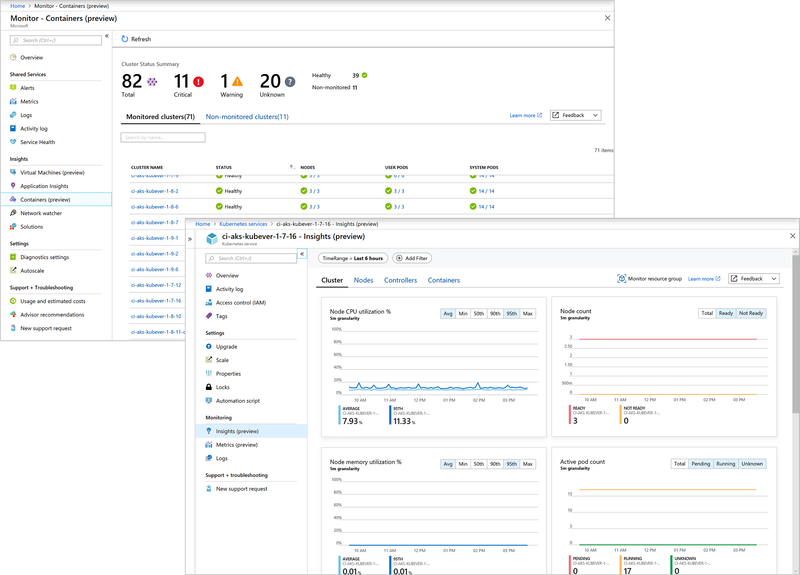

# Azure Monitor for containers overview

Azure Monitor for containers is a feature designed to monitor the performance of container workloads deployed to managed Kubernetes clusters hosted on Azure Kubernetes Service (AKS). Monitoring your containers is critical, especially when you're running a production cluster, at scale, with multiple applications.

Azure Monitor for containers gives you performance visibility by collecting memory and processor metrics from controllers, nodes, and containers that are available in Kubernetes through the Metrics API. Container logs are also collected.  After you enable monitoring from Kubernetes clusters, these metrics and logs are automatically collected for you through a containerized version of the Log Analytics agent for Linux and stored in your [Log Analytics](../log-analytics/log-analytics-overview.md) workspace. 
 
## What does Azure Monitor for containers provide?

Azure Monitor for containers includes several pre-defined views that show the residing container workloads and what affects the performance health of the monitored Kubernetes cluster so that you can:  

* Identify AKS containers that are running on the node and their average processor and memory utilization. This knowledge can help you identify resource bottlenecks.
* Identify where the container resides in a controller or a pod. This knowledge can help you view the controller's or pod's overall performance. 
* Review the resource utilization of workloads running on the host that are unrelated to the standard processes that support the pod.
* Understand the behavior of the cluster under average and heaviest loads. This knowledge can help you identify capacity needs and determine the maximum load that the cluster can sustain. 

## How do I access this feature?
You can access Azure Monitor for containers two ways, from Azure Monitor or directly from the selected AKS cluster. From Azure Monitor you have a global perspective of all the containers deployed, which are monitored and which are not, allowing you to search and filter across your subscriptions and resource groups, and then drill into Azure Monitor for containers from the selected container.  Otherwise, you can simply access the feature directly from a selected AKS container from the AKS page.  

If you are interested in monitoring and managing your Docker and Windows container hosts to view configuration, audit, and resource utilization, see the [Container Monitoring solution](../log-analytics/log-analytics-containers.md).

## Next steps
To begin monitoring your AKS cluster, review [How to onboard the Azure Monitor for containers](monitoring-container-insights-onboard.md) to understand the requirements and available methods to enable monitoring.  