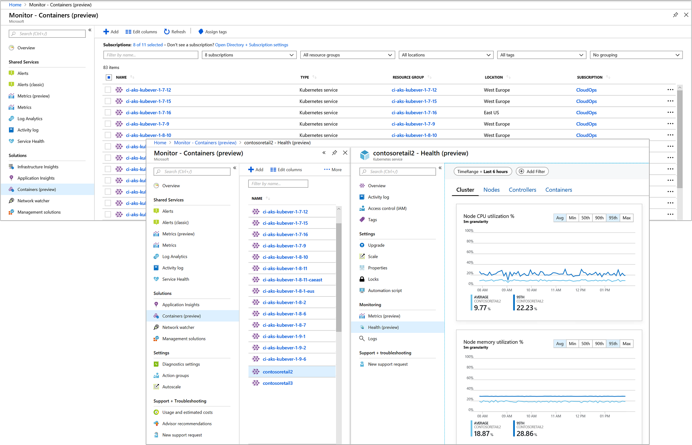

# Azure Kubernetes Service (AKS) Container Insights (preview)

Azure Monitor Container Insights is a solution designed to monitor the performance of container workloads deployed to either Azure Container Instances or managed Kubernetes clusters hosted on Azure Kubernetes Service (AKS). Monitoring your containers is critical, especially when you're running a production cluster, at scale, with multiple applications.

Container Insights gives you performance visibility by collecting memory and processor metrics from controllers, nodes, and containers that are available in Kubernetes through the Metrics API. Container logs are also collected.  After you enable Container Insights, from Kubernetes clusters these metrics and logs are automatically collected for you through a containerized version of the Log Analytics agent for Linux and stored in your [Log Analytics](../log-analytics/log-analytics-overview.md) workspace. Because Container Instances is a managed service, an extension is used to expose these metrics to the solution. 
 
## What does Container Insights provide?

Container Insights includes several pre-defined views that show the residing container workloads and what affects the performance health of the monitored Kubernetes cluster and Azure Container Instances so that you can:  

* Identify AKS containers that are running on the node and their average processor and memory utilization. This knowledge can help you identify resource bottlenecks.
* Identify processor and memory utilization of container groups and their containers hosted in Azure Container Instances.  
* Identify where the container resides in a controller or a pod. This knowledge can help you view the controller's or pod's overall performance. 
* Review the resource utilization of workloads running on the host that are unrelated to the standard processes that support the pod.
* Understand the behavior of the cluster under average and heaviest loads. This knowledge can help you identify capacity needs and determine the maximum load that the cluster can sustain. 

## What's the overhead?
The overhead to monitor your containers performance is very small.   

## How do I access Container Insights?
You can access Container Insights to view the performance of your Container Instances or managed AKS clusters with two methods, from Azure Monitor or directly from the selected AKS cluster. From Azure Monitor you have a global perspective of all the containers deployed, which are monitored and which are not, allowing you to search and filter across your subscriptions and resource groups, and then drill into Container Insights from the selected container.  Otherwise, you can simply access the solution directly from a selected AKS container from the AKS page.  

If you are interested in monitoring and managing your Docker and Windows container hosts to view configuration, audit, and resource utilization, see the [Container Monitoring solution](../log-analytics/log-analytics-containers.md).

## Next steps
To begin monitoring your AKS cluster, review [How to onboard the Azure Monitor Container Insights solution](monitoring-container-insights-onboard.md) to understand the requirements and available methods to enable monitoring with Container Insights.  