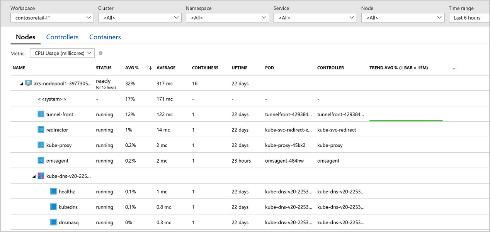
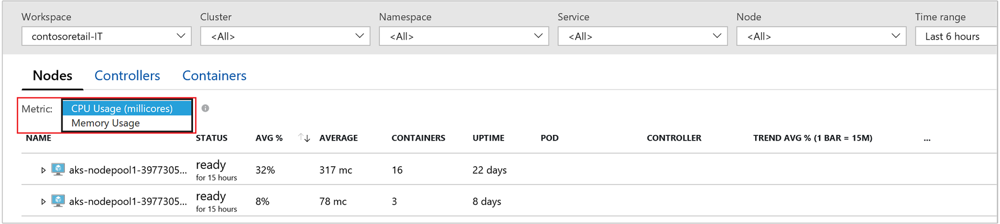
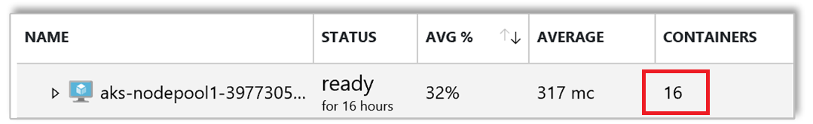
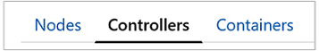
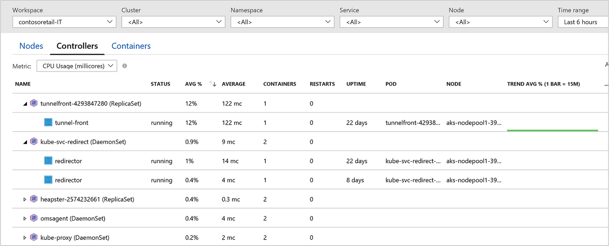
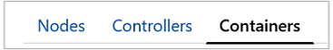
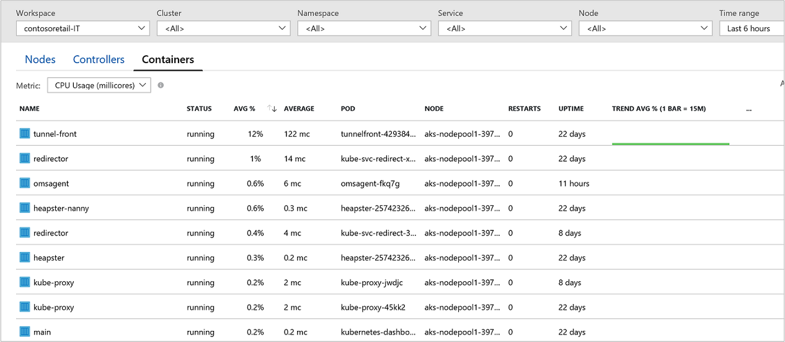
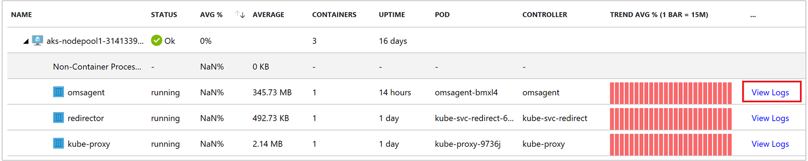

# Monitor Azure Container Service (AKS) health and performance

This article describes how to set up and use Azure Monitor Container Health to monitor the performance of your workloads deployed to Kubernetes environments hosted on Azure Container Service (AKS).  Monitoring your Kubernetes cluster and containers is critical, especially when running a production cluster, at scale, with multiple applications.

Container Health gives you performance monitoring ability by collecting memory and processor metrics from controllers, nodes, and containers available in Kubernetes through the Metrics API.  After enabling Container Health, these metrics are automatically collected for you using a containerized version of the OMS Agent for Linux and stored in your [Log Analytics](../log-analytics/log-analytics-overview.md) workspace.  The pre-defined views included show the residing container workloads and what is affecting the performance health of the Kubernetes cluster so you can understand:  

* What containers are running on the node and their average processor and memory utilization to identify resource bottlenecks
* Identify where the container resides in a controller and/or pods to see the overall  performance for a controller or pod 
* Review the resource utilization of workloads running on the host unrelated to the standard processes supporting the pod
* Understand the behavior of the cluster under average and heaviest load to help identify capacity needs and determine the maximum load it can sustain 

If you are interested in monitoring and managing your Docker and Windows container hosts to view configuration, audit, and resource utilization, see the [Container Monitoring solution](../log-analytics/log-analytics-containers.md).

## Requirements 
Before starting, review the following details so you can understand the supported prerequisites.

- Only AKS cluster versions {specify versions} are supported.
- The agent for Linux version {specify version} and later.
- A Log Analytics workspace.  If you do not have a workspace in your subscription, you can set one up through [Azure Resource Manager](../log-analytics/log-analytics-template-workspace-configuration.md), [PowerShell](https://docs.microsoft.com/azure/log-analytics/scripts/log-analytics-powershell-sample-create-workspace?toc=%2fpowershell%2fmodule%2ftoc.json), from the [Azure portal](../log-analytics/log-analytics-quick-create-workspace.md), or while enabling monitoring of your AKS cluster as described below.  

## Components 

This capability relies on the OMS Agent for Linux to collect performance and event data from all nodes in the cluster.  The agent is automatically deployed and registered with the specified Log Analytics workspace after you enable container performance monitoring. 

>[!NOTE] 
>If you have already deployed an AKS cluster, you cannot enable monitoring afterwards with this feature.  It must be enabled during deployment of the cluster and it can only be performed through the portal, not from an Azure Resource Manager template, PowerShell, or CLI.
>

## Log in to Azure portal
Log in to the Azure portal at [https://portal.azure.com](https://portal.azure.com). 

## Enable Container Health monitoring
You can only enable performance monitoring of your AKS cluster when you deploy it from the Azure portal.  Follow the steps in the quickstart article [Deploy an Azure Container Service (AKS) cluster](../aks/kubernetes-walkthrough-portal.md).  When you are on the **Monitoring** page, select **Yes** for the option **Enable Monitoring** to enable, and  then select an existing or create a new Log Analytics workspace.  

After monitoring is enabled all configuration tasks are completed successfully, you can monitor the performance of your cluster from one of two ways:

1. Directly from the AKS cluster by selecting **Health** from the left pane.<br><br> 
2. By clicking on the **Azure Monitor** tile in the AKS cluster page for the selected cluster.  In Azure Monitor, select **Health** from the left pane.  

## View performance utilization
When you open Container Health, the page immediately presents the performance utilization of your cluster nodes.  Viewing information about your AKS cluster is organized into three perspectives:

- Nodes 
- Controllers  
- Containers

The row hierarchy follows the Kubernetes object model starting with a node in your cluster.  Expand the node and you see one or more pods running on the node, and if there is more than one container grouped to a pod, they are shown as the last row in the hierarchy.<br><br> 

You can select controllers or containers from the top of the page and review the status and resource utilization for those objects.  Use the dropdown boxes at the top of the screen to filter by namespace, service, and node. If instead you want to review memory utilization, from the **Metric** drop-down list select **Memory RSS** or **Memory working set**.  **Memory RSS** is only supported for Kubernetes version 1.8 and later. Otherwise, you will see all NaN%, which is a numeric data type value representing an undefined or unrepresentable value. 



By default, Performance data is based on the last six hours but you can change the window with the **Time Range** drop-down list found on the upper right-hand corner of the page. 

In the following example, you notice for node *aks-nodepool1-39773055-0*, the value for **Containers** is 16, which is a rollup of the total number of containers deployed.<br><br> <br><br> This can help you quickly identify if you don't have proper balance of containers between nodes in your cluster.  

The following table describes the information presented when you view Nodes.

| Column | Description | 
|--------|-------------|
| Name | The name of the host |
| Status | Kubernetes view of the node status |
| AVG% | Average node percentage based on selected metric for the selected time duration |
| AVERAGE | Average nodes actual value based on selected metric for the selected time duration.  The Average value is measured from the CPU/Memory limit set for a pod. |
| Containers | Number of containers |
| Uptime | Represents the time since a node started or was rebooted |
| Pod | Not applicable|
| Controllers | Not applicable | 
| Trend AVG% | Bar graph trend based on container and node avg metric % |


From the selector, choose **Controllers**.<br><br> 

Here we can see the performance health of your controllers.<br><br> 

The row hierarchy starts with a controller and expands the controller and you see one or more pods, or one or more containers.  Expand a pod and the last row show the container grouped to the pod.  

The following table describes the information presented when you view Controllers.

| Column | Description | 
|--------|-------------|
| Name | The name of the controller|
| Status | Roll up status of the containers, if any. |
| AVG% | Roll up average of the average % of each entity for the selected metric |
| AVERAGE | Roll up of the average CPU millicore or memory performance of the container.  The Average value is measured from the CPU/Memory limit set for a pod. |
| Containers | Total number of containers for the controller|
| Restarts | Roll up of the restart count from containers |
| Uptime | Represents the time since a controller was started or rebooted |
| Pod | Not applicable |
| Node | Not applicable | 
| Trend AVG% | Bar graph trend presenting average metric % of the container |

From the selector, choose **Containers**.<br><br> 

Here we can see the performance health of your containers.<br><br> 

The following table describes the information presented when you view Containers.

| Column | Description | 
|--------|-------------|
| Name | The name of the controller|
| Status | Roll up status of the containers, if any. |
| AVG% | Roll up average of the average % of each entity for the selected metric |
| AVERAGE | Roll up of the average CPU millicore or memory performance of the container. The Average value is measured from the CPU/Memory limit set for a pod. |
| Containers | Total number of containers for the controller|
| Restarts | Roll up of the restart count from containers |
| Uptime | Represents the time since a container was started or rebooted |
| Pod | Pod information where it resides |
| Node |  Node where the container resides  | 
| Trend AVG% | Bar graph trend presenting average metric % of the container |

## Search logs to analyze data
Log Analytics can help you look for trends, diagnose bottlenecks, forecast, or correlate data that can help you determine whether the current cluster configuration is performing optimally.  Pre-defined log searches are provided to immediately start using or to customize in order to return the information the way you want. 

You can perform interactive analysis of data in the workspace by selecting the **View Log** option, available on the far right when you expand a container.  **Log Search** page appears right above the page you were on in the portal.<br><br>    

The container logs output forwarded to Log Analytics are STDOUT and STDERR. Kube-system is not being collected today, since this is monitoring Azure managed Kubernetes (AKS).   

## How to discontinue monitoring with Container Health
After enabling monitoring of your AKS container you decide you no longer wish to monitor it, you can *opt out* using the provided Azure Resource Manager template with the PowerShell cmdlet **New-AzureRmResourceGroupDeployment**.  The JSON template is configured to prompt you for the AKS cluster resource ID and the name of the resource group the cluster is deployed to.  If you are not familiar with the concepts of deploying resources using a template with PowerShell, see [Deploy resources with Resource Manager templates and Azure PowerShell](../azure-resource-manager/resource-group-template-deploy.md).

### Create and execute template

1. Copy and paste the following JSON syntax into your file:

    ```json
    {
      "$schema": "https://schema.management.azure.com/schemas/2015-01-01/deploymentTemplate.json#",
      "contentVersion": "1.0.0.0",
      "parameters": {
        "aksResourceId": {
           "type": "string",
           "metadata": {
             "description": "AKS Cluster resource id"
           }
       },
      "aksResourceLocation": {
        "type": "string",
        "metadata": {
           "description": "Location of the AKS resource e.g. \"East US\""
         }
       }
    },
    "resources": [
      {
        "name": "[split(parameters('aksResourceId'),'/')[8]]",
        "type": "Microsoft.ContainerService/managedClusters",
        "location": "[parameters('aksResourceLocation')]",
        "apiVersion": "2018-03-31",
        "properties": {
          "mode": "Incremental",
          "id": "[parameters('aksResourceId')]",
          "addonProfiles": {
            "omsagent": {
              "enabled": false,
              "config": {
                "logAnalyticsWorkspaceResourceID": null
              }
            }
           }
         }
       }
      ]
    }
    ```

2. Save this file as **OptOutTemplate.json** to a local folder.
3. You are ready to deploy this template. Use the following PowerShell commands from the folder containing the template:

    ```powershell
    Connect-AzureRmAccount
    Select-AzureRmSubscription -SubscriptionName <yourSubscriptionName>
    New-AzureRmResourceGroupDeployment -Name opt-out -ResourceGroupName <ResourceGroupName> -TemplateFile .\OptOutTemplate.json -TemplateParameterFile .\OptOutParam.json
    ```
The configuration change can take a few minutes to complete. When it finishes, you see a message similar to the following that includes the result:<br><br> 

## Next steps

[Search logs](../log-analytics/log-analytics-log-search.md) to view detailed container health and application performance information.  