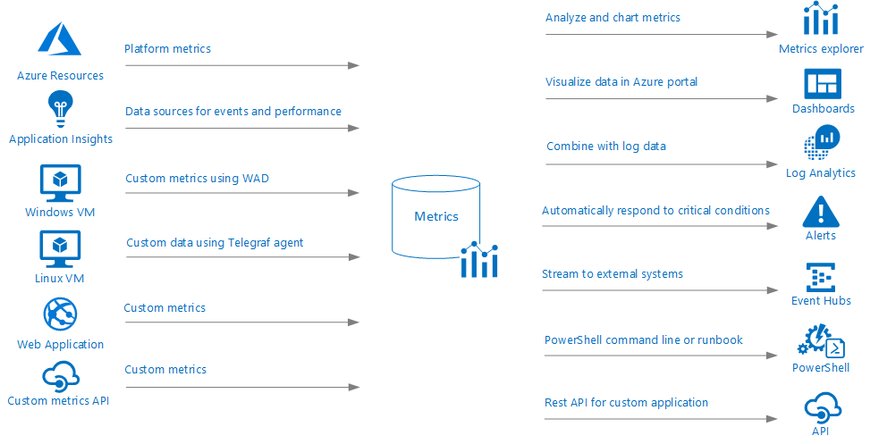
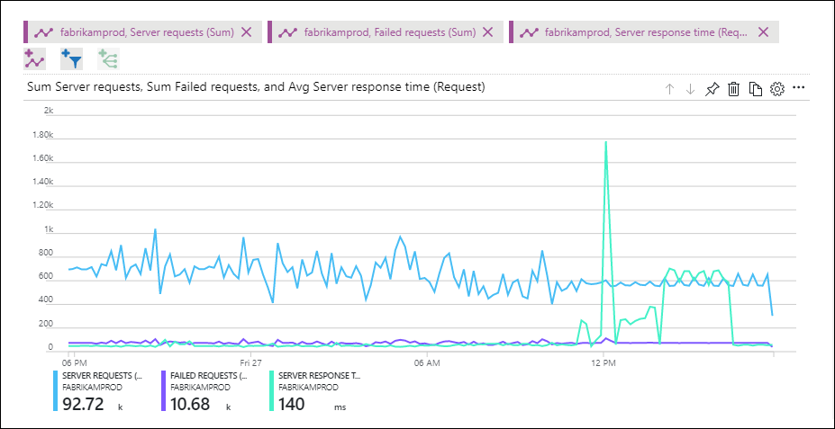
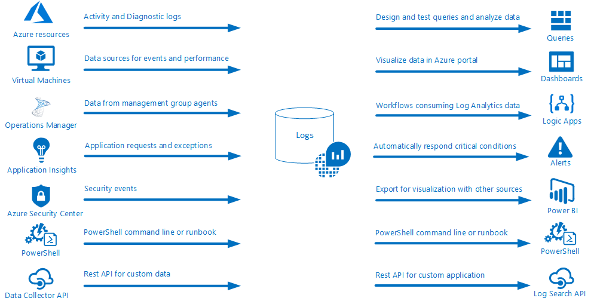
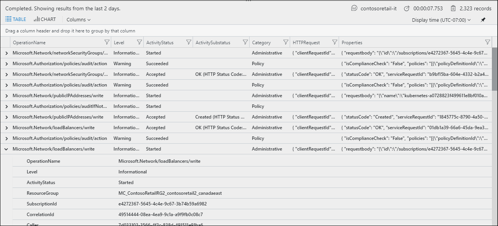

# Monitoring data collected by Azure Monitor
[Azure Monitor](../azure-monitor/overview.md) is a service that helps you monitor your applications and the resources they rely on. Central to this function is storage of telemetry and other data from monitored resources. This article provides a complete description of how this data is stored and used by Azure Monitor.

All data collected by Azure Monitor fits into one of two fundamental types, [metrics](#metrics) and [logs](#logs). Metrics are numerical values that describe some aspect of a system at a particular point in time. They are lightweight and capable of supporting near real-time scenarios. Logs contain different kinds of data organized into records with different sets of properties for each type. Telemetry such as events and traces are stored as logs in addition to performance data so that it can all be combined for analysis.

## Metrics
Metrics are numerical values that describe some aspect of a system at a particular time. They are lightweight and capable of supporting near real-time scenarios. Metrics are collected at regular intervals whether or not the value changes. They're useful for alerting because they can be sampled frequently, and an alert can be fired quickly with relatively simple logic. 

For example, you might collect processor utilization from a virtual machine every minute or the number of users logged in to your application every 10 minutes. You could fire an alert when one of those collected values or even the difference between two values exceeds a defined threshold.

Specific attributes of metrics in Azure include the following:

* Collected at one-minute frequency unless specified otherwise in the metric's definition.
* Uniquely identified by a metric name and a namespace that acts as a category.
* Stored for 93 days. You can copy metrics to Log Analytics for long term trending.

Each metric value has the following properties:
* The time the value was collected.
* The type of measurement the value represents.
* The resource the value is associated with.
* The value itself.
* Some metrics may have multiple dimensions as described in the next section. Custom metrics can have up to 10 dimensions.

### Multi-dimensional metrics
Dimensions of a metric are name-value pairs that carry additional data to describe the metric value. For example, a metric _Available disk space_ can have a dimension called _Drive_ with values _C:_, _D:_, which would allow viewing either available disk space across all drives or for each drive individually. 

The example below illustrates two datasets for a hypothetical metric called _Network Throughput_. The first dataset has no dimensions. The second dataset shows the values with two dimensions, I_P Address_ and _Direction_:

### Network Throughput

 |Timestamp        | Metric Value | 
   | ------------- |:-------------| 
   | 8/9/2017 8:14 | 1,331.8 Kbps | 
   | 8/9/2017 8:15 | 1,141.4 Kbps |
   | 8/9/2017 8:16 | 1,110.2 Kbps |

This non-dimensional metric can only answer a basic question like "what was my network throughput at a given time?”

### Network Throughput + two dimensions ("IP" and "Direction")

| Timestamp          | Dimension "IP" | Dimension "Direction" | Metric Value| 
   | ------------- |:-----------------|:------------------- |:-----------|  
   | 8/9/2017 8:14 | IP="192.168.5.2" | Direction="Send"    | 646.5 Kbps |
   | 8/9/2017 8:14 | IP="192.168.5.2" | Direction="Receive" | 420.1 Kbps |
   | 8/9/2017 8:14 | IP="10.24.2.15"  | Direction="Send"    | 150.0 Kbps | 
   | 8/9/2017 8:14 | IP="10.24.2.15"  | Direction="Receive" | 115.2 Kbps |
   | 8/9/2017 8:15 | IP="192.168.5.2" | Direction="Send"    | 515.2 Kbps |
   | 8/9/2017 8:15 | IP="192.168.5.2" | Direction="Receive" | 371.1 Kbps |
   | 8/9/2017 8:15 | IP="10.24.2.15"  | Direction="Send"    | 155.0 Kbps |
   | 8/9/2017 8:15 | IP="10.24.2.15"  | Direction="Receive" | 100.1 Kbps |

This metric can answer questions such as "what was the network throughput for each IP address?", and "how much data was sent versus received?" Multi-dimensional metrics carry additional analytical and diagnostic value compared to non-dimensional metrics.

### Value of metrics
Individual metrics typically provide little insight on their own. They provide a single value without any context other than comparison to a simple threshold. They're valuable when combined with other metrics to identify patterns and trends, or when combined with logs that provide context around particular values. 

For example, a certain number of users on your application at a given time might tell you little about the health of the application. But a sudden drop in users, indicated by multiple values of the same metric, might indicate a problem. Excessive exceptions thrown by the application, and indicated by a separate metric, might identify an application issue that's causing the drop. Events that the application creates to identify failures in its components can help you identify the root cause.

### Sources of metric data
There are three fundamental sources of metrics collected by Azure Monitor. All of these metrics are available in the metric store where they can be evaluated together regardless of their source.

**Platform metrics** are created by Azure resources and give you visibility into their health and performance. Each type of resource creates a [distinct set of metrics](../monitoring-and-diagnostics/monitoring-supported-metrics.md) without any configuration required. 

**Application metrics** are created by Application Insights for your monitored applications and help you detect performance issues and track trends in how your application is being used. This includes such values as _Server response time_ and _Browser exceptions_.

**Custom metrics** are metrics that you define in addition to the standard metric that are automatically available. Custom metrics must be created against a single resource in the same region as that resource. You can create custom metrics using the following methods:
    - [Define custom metrics in your application](../application-insights/app-insights-api-custom-events-metrics.md) that's monitored by Application Insights. These are in addition to the standard set of application metrics.
    - Publish custom metrics from your Windows virtual machines using [Windows Diagnostic Extension (WAD)](../monitoring-and-diagnostics/azure-diagnostics.md).
    - Publish custom metrics from your Linux virtual machines using [InfluxData Telegraf Agent](https://www.influxdata.com/time-series-platform/telegraf/).
    - Write custom metrics from an Azure service using the custom metrics API.
    

### What can you do with metrics?
Tasks that you can perform with metrics include the following:

- Use [Metrics explorer](../monitoring-and-diagnostics/monitoring-metric-charts.md) to analyze collected metrics and plot them on a chart. Track the performance of a resource (such as a VM, website, or logic app) by pinning charts to an [Azure dashboard](../azure-portal/azure-portal-dashboards.md).
- Configure a [metric alert rule](../monitoring-and-diagnostics/monitor-alerts-unified-usage.md) that sends a notification or takes [automated action](../monitoring-and-diagnostics/monitoring-action-groups.md) when the metric crosses a threshold.
- Use [Autoscale](../monitoring-and-diagnostics/monitoring-overview-autoscale.md) to increase or decrease resources based on a metric crossing a threshold.
- Route metrics to Log Analytics to analyze metric data together with log data and to store metric values for longer than 93 days. 
- Stream metrics to an [Event Hub](../monitoring-and-diagnostics/monitor-stream-monitoring-data-event-hubs.md) to route them to [Azure Stream Analytics](../stream-analytics/stream-analytics-introduction.md) or to external systems.
- [Archive](../monitoring-and-diagnostics/monitor-tutorial-archive-monitoring-data.md) the performance or health history of your resource for compliance, auditing, or offline reporting purposes.
- Access metric values from a command line or custom application using  [PowerShell cmdlets](https://docs.microsoft.com/powershell/module/azurerm.insights/?view=azurermps-6.7.0) or [REST API](../monitoring-and-diagnostics/monitoring-rest-api-walkthrough.md).

### Viewing metrics
Metrics in Azure are collected in the Azure Monitor metrics store. This is a time series database optimized for quick retrieval and stores metric values for 93 days. Copy metrics to Log Analytics for long term analysis and trending.

Metric data is used in a variety of ways as described above. Use [Metrics explorer](../monitoring-and-diagnostics/monitoring-metric-charts.md) to directly analyze the data in your metric store and chart the values of multiple metrics over time. You can view the charts interactively or pin them to a dashboard to view them with other visualizations. You can also retrieve metrics by using the [Azure monitoring REST API](../monitoring-and-diagnostics/monitoring-rest-api-walkthrough.md).

## Logs
Logs contain different kinds of data organized into records with different sets of properties for each type. Logs can contain numeric values like metrics but typically contain text data with detailed descriptions. They further differ from metrics in that they vary in their structure and are often not collected at regular intervals.

A common type of log entry is an event which are collected sporadically. They're created by an application or service and typically include enough information to provide complete context on their own. For example, an event can indicate that a particular resource was created or modified, a new host started in response to increased traffic, or an error was detected in an application.

Logs are especially useful for combining data from a variety of sources, for complex analysis, and for trending over time. Because the format of the data can vary, applications can create custom logs by using the structure that they need. Metrics are even replicated in logs to combine them with other monitoring data for trending and other data analysis.

### Log Analytics
Logs collected by Azure Monitor are stored in Log Analytics which collects telemetry and other data from a variety of sources. It provides a rich query language and an analytics engine that gives you insights into the operation of your applications and resources. Other Azure services such as [Azure Security Center](../security-center/security-center-intro.md) store their data in Log Analytics in order to provide a common data platform across Azure management.

> [!IMPORTANT]
> Data from Application Insights is stored in Log Analytics like other log data except that it's stored in a separate partition. This supports the same functionality as other Log Analytics data, but you must use the [Application Insights console](/application-insights/app-insights-analytics.md) or the [Application Insights API](https://dev.applicationinsights.io/) to access this data. You can use a [cross-resource query](../log-analytics/log-analytics-cross-workspace-search.md) to analyze application data together with other log data.

### Sources of log data
Log Analytics can collect data from a variety of sources both within Azure and from on-premises resources. Sources of data written to Log Analytics include the following:

- [Activity logs](../log-analytics/log-analytics-activity.md) from Azure resources that include information on their configuration and health and [Diagnostic logs](../monitoring-and-diagnostics/monitor-stream-diagnostic-logs-log-analytics.md) that provide insights into their operation.
- Agents on [Windows](../log-analytics/log-analytics-windows-agent.md) and [Linux](../log-analytics/log-analytics-linux-agents.md) virtual machines that send telemetry from the guest operating system and applications to Log Analytics according to [Data Sources](../log-analytics/log-analytics-data-sources.md) that you configure.
- Application data collected by [Application Insights](https://docs.microsoft.com/azure/application-insights/).
- Data providing insights into a particular application or service from [monitoring solutions](../monitoring/monitoring-solutions.md) or features such as Container Insights, VM Insights, or Resource Group Insights.
- Security data collected by [Azure Security Center](https://docs.microsoft.com/azure/security-center/).
- [Metrics](#metrics) from Azure resources. This allows you to store metrics for longer than 93 days and to analyze it with other log data.
- Telemetry written to [Azure Storage](../log-analytics/log-analytics-azure-storage-iis-table.md).
- Custom data from any REST API client using the [HTTP Data Collector API](../log-analytics/log-analytics-data-collector-api.md) client or from an [Azure Logic App](https://docs.microsoft.com/azure/logic-apps/) workflow.

### What can you do with logs?
Tasks that you can perform with logs include the following:

- Use the [Log Analytics page](../log-analytics/query-language/get-started-analytics-portal.md) in the Azure portal to write queries analyzing log data.  Pin results rendered as tables or charts to an [Azure dashboard](../azure-portal/azure-portal-dashboards.md).
- Configure a [log alert rule](../monitoring-and-diagnostics/alert-log.md) that sends a notification or takes [automated action](../monitoring-and-diagnostics/monitoring-action-groups.md) when the results of the query match a particular result.
- Build a workflow based on data in Log Analytics using [Logic Apps]().
- Export the results of a query to [Power BI](../log-analytics/log-analytics-powerbi.md) to use different visualizations and share with users outside of Azure.
- Access metric values from a command line or custom application using  [PowerShell cmdlets](https://docs.microsoft.com/powershell/module/azurerm.operationalinsights/?view=azurermps-6.8.1) or [REST API](https://dev.loganalytics.io/).

### Viewing log data
All data from Log Analytics is retrieved using a [log query](../log-analytics/log-analytics-queries.md) that specifies a particular set of data. Queries are written using the [Log Analytics query language](../log-analytics/query-language/get-started-queries.md) which is a rich query language to quickly retrieve, consolidate, and analyze collected data. Use the [Log Analytics page](../log-analytics/log-analytics-log-search-portals.md) in the Azure portal to  directly analyze the data in your metric store and chart the values of multiple metrics over time. You can view the charts interactively or pin them to a dashboard to view them with other visualizations. You can also retrieve metrics by using the [Azure monitoring REST API](../monitoring-and-diagnostics/monitoring-rest-api-walkthrough.md).

## Convert monitoring data

### Metrics to logs
You can copy metrics to Log Analytics to perform complex analysis with other data types by using its rich query language. You can also retain log data for longer periods than metrics, which enables you to perform trending over time. When metrics or any other performance data is stored in Log Analytics, that data acts as a log. Use metrics to support near real-time analysis and alerting while using logs for trending and analysis with other data.

You can get guidance for collecting metrics from Azure resources at [Collect Azure service logs and metrics for use in Log Analytics](../log-analytics/log-analytics-azure-storage.md). Get guidance for collecting resources metrics from Azure PaaS resources at [Configure collection of Azure PaaS resource metrics with Log Analytics](../log-analytics/log-analytics-collect-azurepass-posh.md).

### Logs to metrics
As described above, metrics are more responsive than logs, so you can create alerts with lower latency and at a lower cost. Log Analytics collects a significant amount of numeric data that would be suitable for metrics but isn't stored in the Azure metrics store.  A common example is performance data collected from agents and management solutions. Some of these values can be copied into the metrics store, where they are available for alerting and for analysis with Metrics explorer.

The explanation of this feature is available at [Create Metric Alerts for Logs in Azure Monitor](../monitoring-and-diagnostics/monitoring-metric-alerts-logs.md). The list of values support is available at 
[Supported metrics with Azure Monitor](../monitoring-and-diagnostics/monitoring-supported-metrics.md#microsoftoperationalinsightsworkspaces).

## Stream data to external systems
In addition to using the tools in Azure to analyze monitoring data, you may have a requirement to forward it to an external tool such as a security information and event management (SIEM) product. This forwarding is typically done directly from monitored resources through [Azure Event Hubs](https://docs.microsoft.com/azure/event-hubs/). 

You can get guidance for the different kinds of monitoring data at [Stream Azure monitoring data to an event hub for consumption by an external tool](../monitoring-and-diagnostics/monitor-stream-monitoring-data-event-hubs.md).

## Next steps

- Learn about the [monitoring data available](monitoring-data-sources.md) for different resources in Azure.