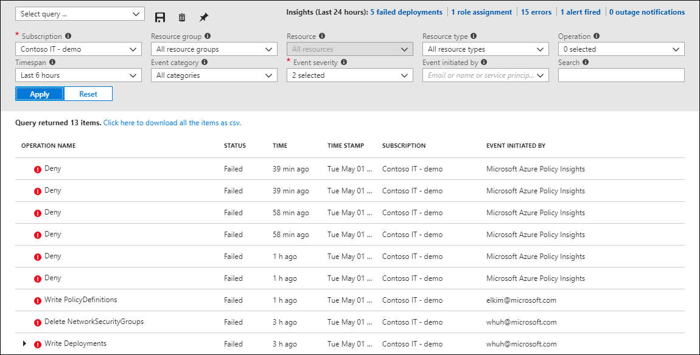
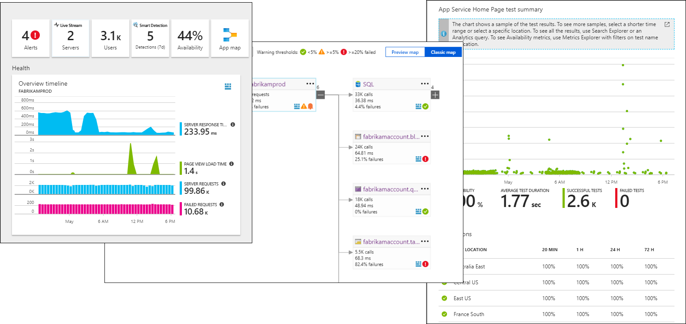
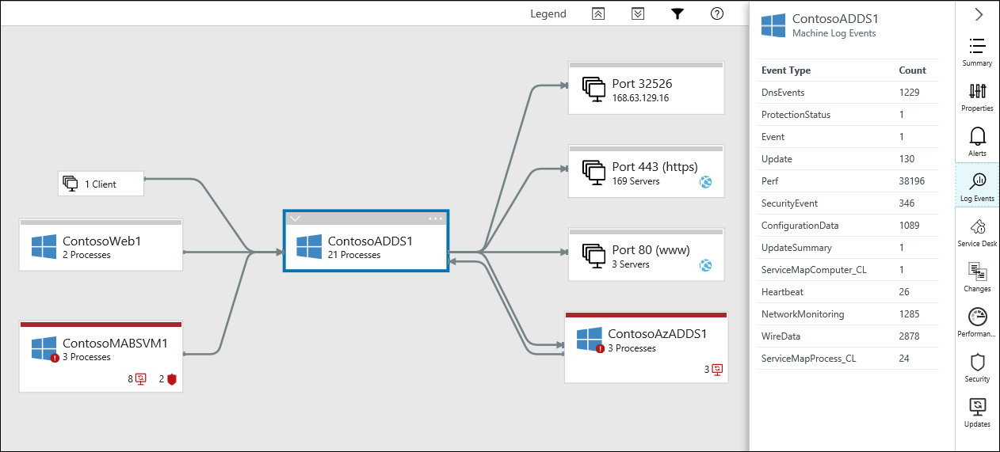

# Collect monitoring data in Azure
This article provides an overview of the monitoring data that's collected from applications and services in Azure. It also describes the tools that you can use to analyze the data. 

## Types of monitoring data
All monitoring data fits into one of two fundamental types, metrics or logs. Each type has distinct characteristics and is best suited for particular scenarios.

### Metrics
Metrics are numerical values that describe some aspect of a system at a particular time. They include:

* Distinct data, including the value itself.
* The time that the value was collected.
* The type of measurement that the value represents.
* The resource that the value is associated with. 

Metrics are collected at regular intervals whether or not the value changes. For example, you might collect processor utilization from a virtual machine every minute or the number of users logged in to your application every 10 minutes.

Metrics are lightweight and capable of supporting near real-time scenarios. They're useful for alerting because metrics can be sampled frequently, and an alert can be fired quickly with relatively simple logic. For example, you might fire an alert when a metric exceeds a threshold value. Or you might fire an alert when the difference between two metrics reaches a particular value.

Individual metrics typically provide little insight on their own. They provide a single value without any context other than comparison to a simple threshold. They're valuable when combined with other metrics to identify patterns and trends, or when combined with logs that provide context around particular values. 

For example, a certain number of users on your application at a given time might tell you little about the health of the application. But a sudden drop in users, indicated by multiple values of the same metric, might indicate a problem. Excessive exceptions thrown by the application, and indicated by a separate metric, might identify an application issue that's causing the drop. Events that the application creates to identify failures in its components can help you identify the root cause.

Alerts based on logs are not as responsive as alerts based on metrics, but they can include more complex logic. You can create an alert based on the results of any query that performs complex analysis on data from multiple sources.

### Logs
Logs contain different kinds of data organized into records with different sets of properties for each type. Logs might contain numeric values like metrics but typically contain text data with detailed descriptions. They further differ from metrics in that they vary in their structure and are often not collected at regular intervals.

A common type of log entry is an event. Events are collected sporadically. They're created by an application or service and typically include enough information to provide complete context on their own. For example, an event can indicate that a particular resource was created or modified, a new host started in response to increased traffic, or an error was detected in an application.

Logs are especially useful for combining data from a variety of sources, for complex analysis and trending over time. Because the format of the data can vary, applications can create custom logs by using the structure that they need. Metrics can even be replicated in logs to combine them with other monitoring data for trending and other data analysis.

## Monitoring tools in Azure
Monitoring data in Azure is collected and analyzed through the following sources.

### Azure Monitor
Metrics from Azure resources and applications are collected into Azure Monitor. Metric data is integrated into the pages in the Azure portal for Azure resources. For virtual machines, graphs of such metrics as CPU and network utilization appear for the selected machine. 

You can also analyze data by using [Metrics Explorer](../monitoring-and-diagnostics/monitoring-metric-charts.md), which charts the values of multiple metrics over time. You can view the charts interactively or pin them to a dashboard to view them with other visualizations. You can also retrieve metrics by using the [Azure monitoring REST API](../monitoring-and-diagnostics/monitoring-rest-api-walkthrough.md).

For more information about the metric data that different kinds of Azure resources collect, see [Sources of monitoring data in Azure](monitoring-data-sources.md). 

### Activity Log 
The [Azure Activity Log](../monitoring-and-diagnostics/monitoring-overview-activity-logs.md) stores logs about the configuration and health of Azure services. You can use Activity Log Explorer to view these logs in the Azure portal, but they're commonly [copied to Azure Log Analytics](../log-analytics/log-analytics-activity.md) to be analyzed with other log data.

You can use Activity Log Explorer to view the Activity Log filtered to match certain criteria. Most resources also have an **Activity Log** option on their menu in the Azure portal. It displays Activity Log Explorer filtered for that resource. You can also retrieve activity logs by using the [Azure Monitoring REST API](../monitoring-and-diagnostics/monitoring-rest-api-walkthrough.md).

### Log Analytics
Log Analytics provides a common data platform for management in Azure. It's the primary service that's used for storage and analysis of logs in Azure. It collects data from a variety of sources, including agents on virtual machines, management solutions, and Azure resources. You can copy data from other sources, including metrics and the Activity Log, to create a complete central repository of monitoring data.

Log Analytics has a rich query language for analyzing the data that it collects. You can use [log search portals](../log-analytics/log-analytics-log-search-portals.md) for interactively writing and testing queries and analyzing their results. You can also [create views](../log-analytics/log-analytics-view-designer.md) to visualize the results of log searches or paste the results of a query directly to an Azure dashboard.  

Management solutions include log searches and views in Log Analytics for analyzing the data that they collect. Other services, such as Azure Application Insights, store data in Log Analytics and provide additional tools for analysis.  

### Application Insights
Application Insights collects telemetry for web applications installed on a variety of platforms. It stores its data in Azure Monitor and Log Analytics. And it provides an extensive set of tools for analyzing and visualizing its data. These capabilities enable you to use a common set of services such as alerts, log searches, and dashboards that you use for other monitoring.

### Service Map
Service Map provides a visual representation of virtual machines with their processes and dependencies. It stores most of this data in Log Analytics so you can analyze it with other management data. The Service Map console also retrieves data from Log Analytics to present it in the context of the virtual machine that's being analyzed.

## Transferring monitoring data

### Metrics to logs
You can replicate metrics in Log Analytics to perform complex analysis with other data types by using its rich query language. You can also retain log data for longer periods than metrics, which enables you to perform trending over time. When metrics or any other performance data is stored in Log Analytics, that data acts as a log. Use metrics to support near real-time analysis and alerting while using logs for trending and analysis with other data.

You can get guidance for collecting metrics from Azure resources at [Collect Azure service logs and metrics for use in Log Analytics](../log-analytics/log-analytics-azure-storage.md). Get guidance for collecting resources metrics from Azure PaaS resources at [Configure collection of Azure PaaS resource metrics with Log Analytics](../log-analytics/log-analytics-collect-azurepass-posh.md).

### Logs to metrics
As described earlier, metrics are more responsive than logs, so you can create alerts with lower latency and at a lower cost. Log Analytics collects a significant amount of numeric data that would be suitable for metrics but isn't stored in Azure Monitor. 

A common example is performance data collected from agents and management solutions. Some of these values can be copied into Azure Monitor, where they are available for alerting and for analysis with Metrics Explorer.

The explanation of this feature is available at [Faster Metric Alerts for Logs now in limited public preview](https://azure.microsoft.com/blog/faster-metric-alerts-for-logs-now-in-limited-public-preview/). The list of values support is available at 
[Supported metrics and creation methods for new metric alerts](../monitoring-and-diagnostics/monitoring-near-real-time-metric-alerts.md).

### Event Hubs
In addition to using the tools in Azure to analyze monitoring data, you might want to forward it to an external tool such as a security information and event management (SIEM) product. This forwarding is typically done through [Azure Event Hubs](https://docs.microsoft.com/azure/event-hubs/). 

You can get guidance for the different kinds of monitoring data at [Stream Azure monitoring data to an event hub for consumption by an external tool](../monitoring-and-diagnostics/monitor-stream-monitoring-data-event-hubs.md).

## Next steps

- Learn about the [monitoring data available](monitoring-data-sources.md) for different resources in Azure. 