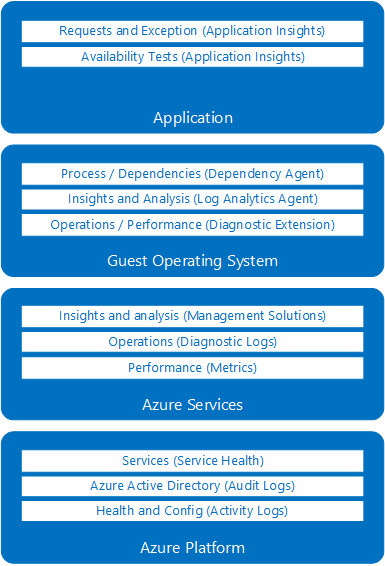
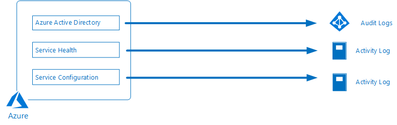
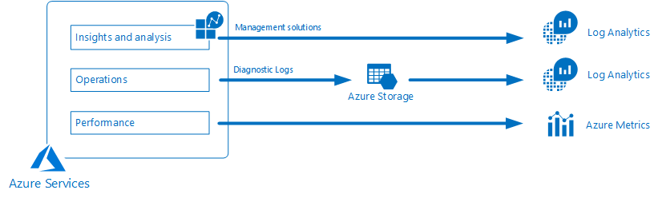
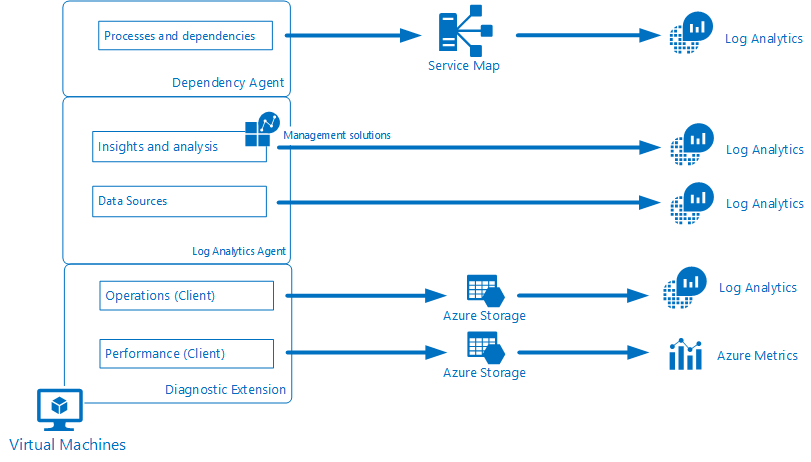
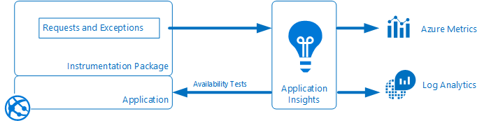
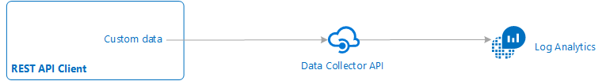

# Sources of data in Azure Monitor
This article describes the sources of data collected by Azure Monitor to monitor the health and performance of your  resources and the applications running on them. These resources could be in Azure, in another cloud, or on-premises.  See [Data collected by Azure Monitor](monitoring-data-collection.md) for details on how this data stored and how you can view it.

Monitoring data in Azure comes from a variety of sources that can be organized into tiers, the highest tiers being your application and any operating systems and the lower tiers being components of Azure platform. This is illustrated in the following diagram with each tier described in detail in the following sections.

## Azure Tenant
Telemetry related to your Azure tenant is collected from tenant-wide services such as Azure Active Directory.

### Azure Active Directory Audit Logs
[Azure Active Directory reporting](../active-directory/reports-monitoring/overview-reports.md) contains the history of sign-in activity and audit trail of changes made within a particular tenant. These audit logs can be written to Log Analytics to analyze them with other log data.

## Azure platform
Telemetry related to the health and operation of Azure itself includes data about the operation and management of your Azure subscription. It includes service health data stored in the Azure Activity log and audit logs from Azure Active Directory.

### Azure Service Health
[Azure Service Health](../monitoring-and-diagnostics/monitoring-service-notifications.md) provides information about the health of the Azure services in your subscription that your application and resources rely on. You can create alerts to be notified of current and expected critical issues that may affect your application. Service Health records are stored in the [Azure Activity log](../monitoring-and-diagnostics/monitoring-overview-activity-logs.md), so you can view them in the Activity Log Explorer and copy them into Log Analytics.

### Azure Activity Log
The [Azure Activity Log](../monitoring-and-diagnostics/monitoring-overview-activity-logs.md) includes service health records along with records on any configuration changes made to your Azure resources. The Activity log is available to all Azure resources and represents their _external_ view. The specific types of records in the Activity Log are described in [Azure Activity Log event schema](../monitoring-and-diagnostics/monitoring-activity-log-schema.md).

You can view the Activity Log for a particular resource on its page in the Azure portal or view logs from multiple resources in the [Activity Log Explorer](../monitoring-and-diagnostics/monitoring-overview-activity-logs.md). It's particularly useful to copy the log entries to Log Analytics to combine it with other monitoring data. You can also send them to other locations using [Event Hubs](../monitoring-and-diagnostics/monitoring-stream-activity-logs-event-hubs.md).

## Azure Services
Metrics and resource level diagnostic logs provide information about the _internal_ operation of Azure resources. These are available for most Azure services, and management solutions provide additional insights into particular services.

### Metrics
Most Azure services will generate [platform metrics](monitoring-data-collection.md#metrics) that reflect their performance and operation. The specific [metrics will vary for each type of resource](../monitoring-and-diagnostics/monitoring-supported-metrics.md).  They are accessible from the Metrics explorer and can be copied to Log Analytics for trending and other analysis.

### Resource diagnostic Logs
While the Activity Log provides information about operations performed on an Azure resources, resource level [Diagnostic logs](../monitoring-and-diagnostics/monitoring-overview-of-diagnostic-logs.md) provide insights into the operation of the resource itself.   The configuration requirements and content of these logs [varies by resource type](../monitoring-and-diagnostics/monitoring-diagnostic-logs-schema.md).

You can't directly view diagnostic logs in the Azure portal, but you can [send them to Azure storage for archiving](../monitoring-and-diagnostics/monitoring-archive-diagnostic-logs.md) and export them to [Event Hub](../event-hubs/event-hubs-what-is-event-hubs.md) for redirection to other services, or [to Log Analytics](../monitoring-and-diagnostics/monitor-stream-diagnostic-logs-log-analytics.md) for analysis. Some resources can write directly to Log Analytics while others write to a storage account before being [imported into Log Analytics](../log-analytics/log-analytics-azure-storage-iis-table.md#use-the-azure-portal-to-collect-logs-from-azure-storage).

### Monitoring Solutions
 [Monitoring solutions](../monitoring/monitoring-solutions.md) collect data to provide additional insight into the operation of a particular service or application. They collect data into Log Analytics where it may be analyzed using the [query language](../log-analytics/log-analytics-log-search.md) or [views](../log-analytics/log-analytics-view-designer.md) that are typically included in the solution.

## Guest Operating System
Compute resources in Azure, in other clouds, and on-premises have a guest operating system to monitor. With the installation of one or more agents, you can gather telemetry from the guest into the same monitoring tools as the Azure services themselves.

### Diagnostic Extension
With the [Azure Diagnostics Extension](../monitoring-and-diagnostics/azure-diagnostics.md), you can collect logs and performance data from the client operating system of Azure compute resources. Both metrics and logs collected from clients are stored in an Azure storage account that you can [configure Log Analytics to import from](../log-analytics/log-analytics-azure-storage-iis-table.md#use-the-azure-portal-to-collect-logs-from-azure-storage).  The Metrics explorer understands how to read from  the storage account and will include client metrics with other collected metrics.

### Log Analytics Agent
You can install the Log Analytics agent on any [Windows](../log-analytics/log-analytics-agent-windows.md) or [Linux]() virtual machine or physical computer. The virtual machine can be running in Azure, another cloud, or on-premises.  The agent connects to Log Analytics either directly or through a [connected System Center Operations Manager management group](../log-analytics/log-analytics-om-agents.md) and allows you to collect data from [data sources](../log-analytics/log-analytics-data-sources.md) that you configure or from [management solutions](../monitoring/monitoring-solutions.md) that provide additional insights into applications running on the virtual machine.

### Service Map
[Service Map](../operations-management-suite/operations-management-suite-service-map.md) requires a Dependency Agent on Windows and Linux virtual machines. This works with the Log Analytics agent to collects data about processes running on the virtual machine and dependencies on external processes. It stores this data in Log Analytics and includes a console that visually displays the data it collects in addition to other data stored in Log Analytics.

## Applications
In addition to telemetry that your application may write to the guest operating system, detailed application monitoring is done with [Application Insights](https://docs.microsoft.com/azure/application-insights/). Application Insights can collect data from applications running on a variety of platforms. The application can be running in Azure, another cloud, or on-premises.

### Application data
When you enable Application Insights for an application by installing an instrumentation package, it collects metrics and logs related to the performance and operation of the application. This includes detailed information about page views, application requests, and exceptions. Application Insights stores the data it collects in Azure Metrics and Log Analytics. It includes extensive tools for analyzing this data, but you can also analyze it with data from other sources using tools such as Metrics Explorer and log searches.

You can also use Application Insights to [create a custom metric](../application-insights/app-insights-api-custom-events-metrics.md).  This allows you to define your own logic for calculating a numeric value and then storing that value with other metrics that can be accessed from the Metric Explorer and used for [Autoscale](../monitoring-and-diagnostics/monitoring-autoscale-scale-by-custom-metric.md) and Metric alerts.

### Dependencies
In order to monitor different logical operations of an application, you must [collect telemetry across multiple components](../application-insights/app-insights-transaction-diagnostics.md). Application Insights supports [distributed telemetry correlation](../application-insights/application-insights-correlation.md) which identifies the dependencies between components allowing you to analyze them together.

### Availability tests
[Availability tests](../application-insights/app-insights-monitor-web-app-availability.md) in Application Insights allow you to test the availability and responsiveness of your application from different locations on the public Internet. You can do a simple ping test to verify that the application is alive or use Visual Studio to create a web test that simulates a user scenario.  Availability tests don't require any instrumentation in the application.

## Custom sources
In addition to the standard tiers of an application, you may need to monitor other resources that have telemetry that can't be collected with the other data sources. For these resources, you need to write this data using an Azure Monitor API.

### Data Collector API
Azure Monitor can collect log data from any REST client using the [Data Collector API](../log-analytics/log-analytics-data-collector-api.md). This allows you to create custom monitoring scenarios and extend monitoring to resources that don't expose telemetry through other sources.

## Next steps

- Learn more about the [types of monitoring data collected by Azure Monitor](monitoring-data-collection.md) and how to view and analyze this data.
