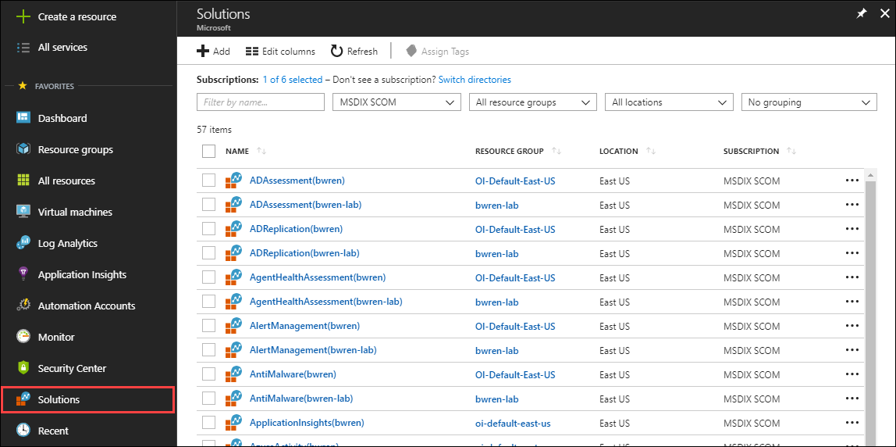
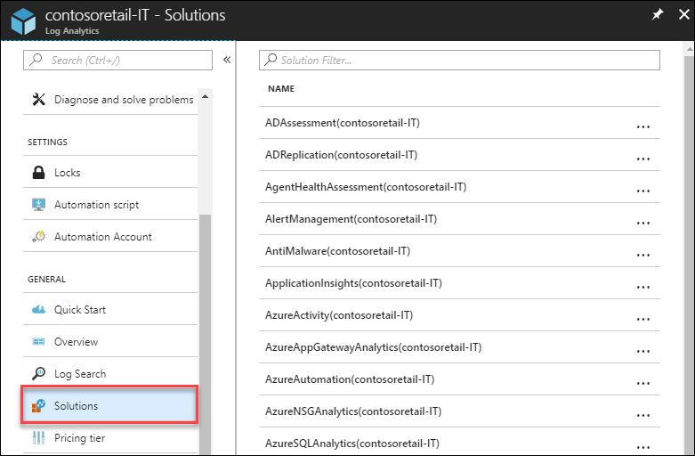
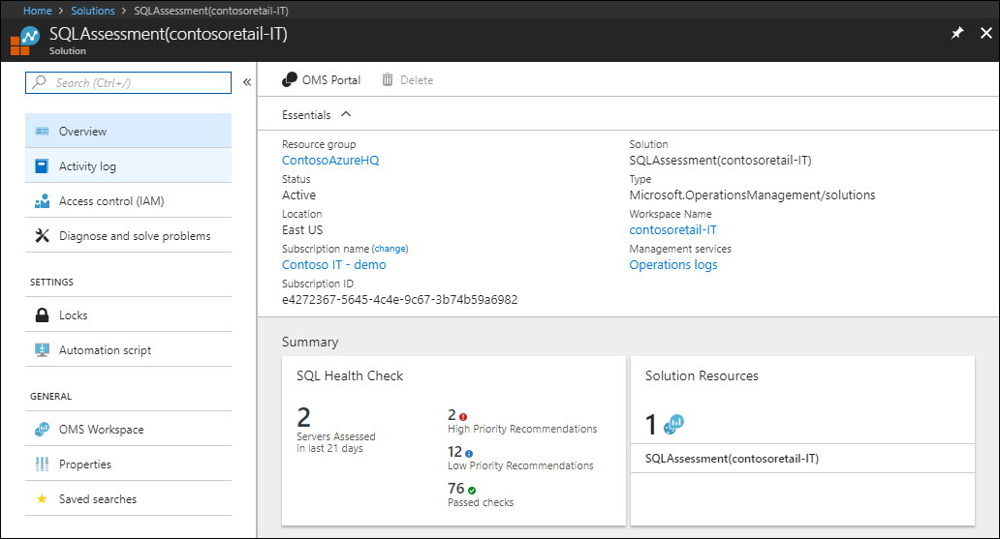
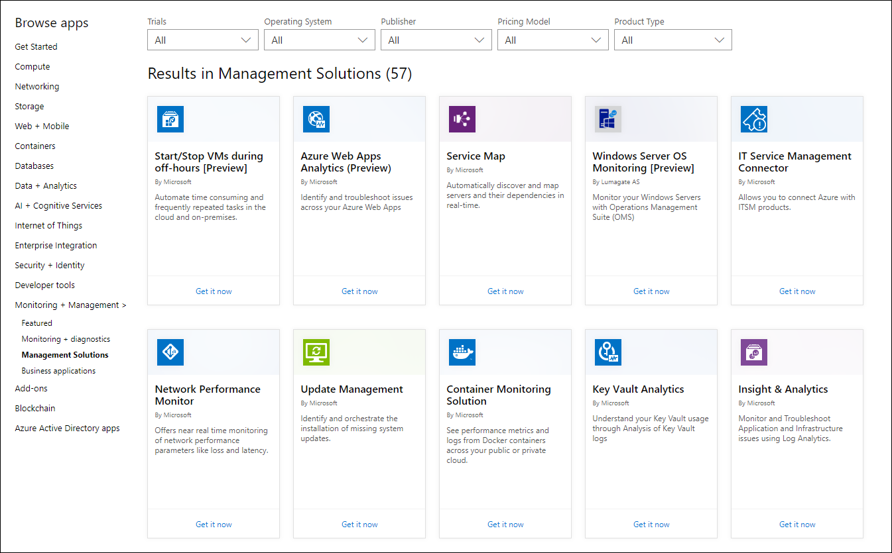

# Add Azure Log Analytics management solutions to your workspace

Management solutions leverage services in Azure to provide additional insight into the operation of a particular application or service.  They typically collect information into Log Analytics and provide log searches and views to analyze collected data.  They may also leverage other services such as Azure Automation to perform actions related to the application or service.

You can add management solutions to your Azure subscription for applications and services that you use.  They are typically available at no cost but collect data that could invoke usage charges.  In addition to solutions provided by Microsoft, partners and customers can create management solutions to be used in their own environment or made available to customers through the community.

## List management solutions 
There are two ways to list installed management solutions.  You can either view all the solutions in your subscription or just the solutions installed in a single Log Analytics workspace.

### List all management solutions in your subscription

1. Log in to the Azure portal.
2. In the left pane, select **All services**.
3. Either scroll down to **Solutions** or type *solutions* into the **Filter** dialog.
4. Solutions installed in all your workspaces are listed.  The name of the solution is followed by the name of the Log Analytics workspace it's installed in.
1. Use the dropdown boxes at the top of the screen to filter by subscription or resource group.

### List management solutions in a workspace

1. Log in to the Azure portal.
2. In the left pane, select **All services**.
3. Either scroll down to **Log Analytics** or type *Log Analytics* into the **Filter** dialog.
1. Select a workspace to open its summary screen.
1. In the left pane, select **Solutions**.
1. Solutions installed in the current workspace are listed.

## View a solution
Once installed, the most common method for using a solution is from its view on the **Overview** page for the Log Analytics workspace.  The **Overview** page displays a tile for each solution installed in the workspace.  Click on the tile for the solution to open its view which includes more detailed analysis of the data it's collected.

Management solutions can contain multiple types of Azure resources, and you can view any resources included with a solution just like any other resource. For example, any log searches included in the solution are included with **Saved Searches** in the workspace.  You can use those searches when performing ad hoc analysis in Log Analytics.

The summary page for each solution displays any Log Analytics views included in the solution and provide different options for the solution itself and its workspace.  View the summary page for a solution by using one of the procedures above to list solutions and then click on the name of the solution.

## View available management solutions
You can browse and install management solutions available from Microsoft and partners in the [Azure Marketplace](https://azuremarketplace.microsoft.com/marketplace).  Perform a [search for *Management Solutions*](https://azuremarketplace.microsoft.com/marketplace/apps/category/monitoring-management?page=1&subcategories=management-solutions) to filter for management solutions.  Click on any item for more detail.

## Install a management solution from the Azure Marketplace
You can use any of the following methods to locate and start the installation of a management solution.

- Click **Get it now** on a management solution in the Azure Marketplace.
- From the list of solutions for your subscription, click **Add**.  To the right of **Management Solutions**, click **More**.  Locate the management solution you want and click **Create**.
- In the Azure portal, select **Create a resource** > **Monitoring + Management** > **See all**.  To the right of **Management Solutions**, click **More**.  Locate the management solution you want and click **Create**.

When the installation process starts, you're prompted to provide required configuration which varies for each solution.  All of them require you to select a Log Analytics workspace to install the solution.  You can either select an existing workspace or create a new one.

## Install a solution from the community
### Azure Quickstart Templates
Members of the community can submit management solutions to Azure Quickstart Templates.  You can either download these templates for later installation or inspect them to learn how to [create your own solutions](#creating-a-solution).

1. Follow the process described in [Log Analytics workspace and Automation account](#log-analytics-workspace-and-automation-account) to link a workspace and account.
2. Go to [Azure Quickstart Templates](https://azure.microsoft.com/documentation/templates/).  
3. Search for a solution that you're interested in.
4. Select the solution from the results to view its details.
5. Click the **Deploy to Azure** button.
6. You're prompted to provide information such as the resource group and location in addition to values for any parameters in the solution.
7. Click **Purchase** to install the solution.

## Log Analytics workspace and Automation account
All management solutions require a [Log Analytics workspace](../log-analytics/log-analytics-manage-access.md) where data is collected and that includes log searches and views for the solution.  Some solutions also require and an [Automation account](../automation/automation-security-overview.md#automation-account-overview) to contain runbooks and related resources. The workspace and account must meet the following requirements.

* One installation of a solution can only use one Log Analytics workspace and one Automation account.  You can install the solution separately into multiple workspaces.
* If a solution requires an Automation account, then the Log Analytics workspace and Automation account must be linked to one another. A Log Analytics workspace may only be linked to one Automation account, and an Automation account may only be linked to one Log Analytics workspace.
* To be linked, the Log Analytics workspace and Automation account must be in the same resource group and region.  The exception is a workspace in East US region and Automation account in East US 2.

### Creating a link between a Log Analytics workspace and Automation account
How you specify the Log Analytics workspace and Automation account depends on the installation method for your solution.

* When you install a solution through the Azure Marketplace, you are prompted for a workspace and Automation account, and the link between them is created for you.  
* For solutions outside of the Azure Marketplace, you must link the Log Analytics workspace and Automation account before installing the solution.  You can do this by selecting any solution in the Azure Marketplace and selecting the Log Analytics workspace and Automation account.  You don't have to actually install the solution because the link is created as soon as the Log Analytics workspace and Automation account are selected.  Once the link is created, then you can use that Log Analytics workspace and Automation account for any solution.

### Verifying the link between a Log Analytics workspace and Automation account
You can verify the link between a Log Analytics workspace and an Automation account using the following procedure.

1. Select the Automation account in the Azure portal.
2. If the **Workspace** setting in the **Related Resources** section of the menu is enabled, then this account is attached to a Log Analytics workspace.  You can click on **Workspace** to view the details of the workspace.

## Remove a management solution

1. In the [Azure portal](https://portal.azure.com), navigate to **Log Analytics** > **Subscriptions** > ***workspace name*** and then in the ***workspace name*** blade, click **Solutions**.
2. In the list of management solutions, select the solution that you want to remove.
3. In the solution blade for your workspace, click **Delete**.  
      
4. In the confirmation dialog, click **Yes**.

## Next steps
* [Search logs](log-analytics-log-searches.md) to view detailed information gathered by management solutions.
