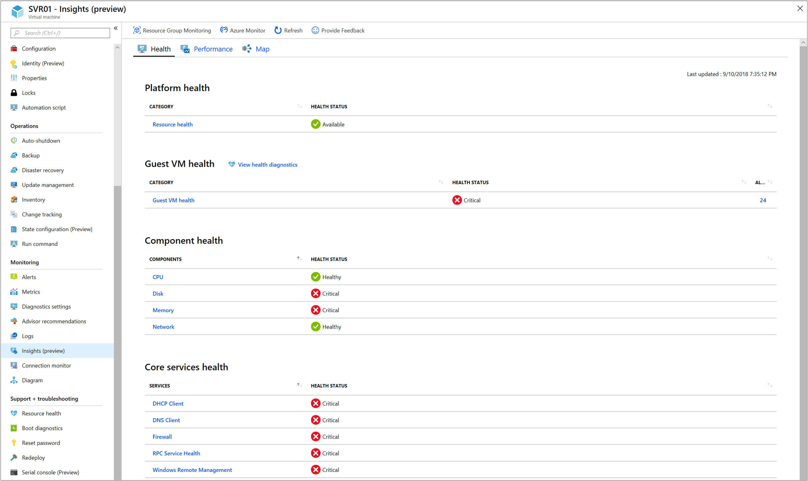
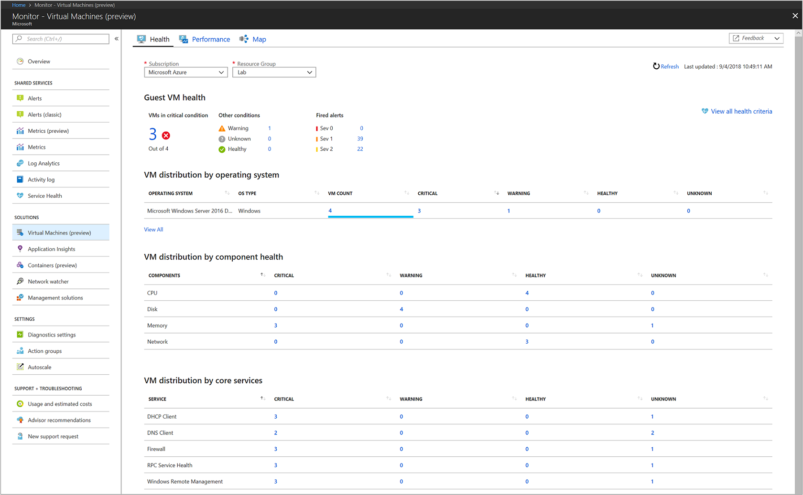
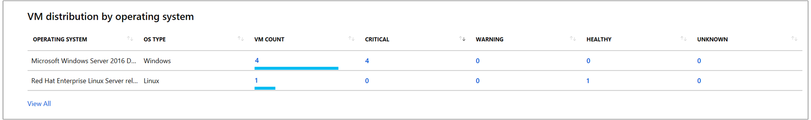
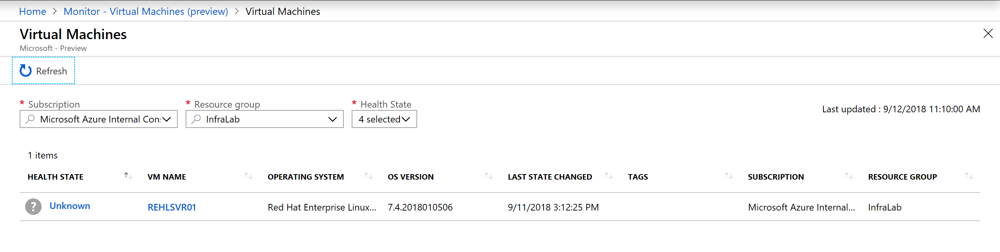
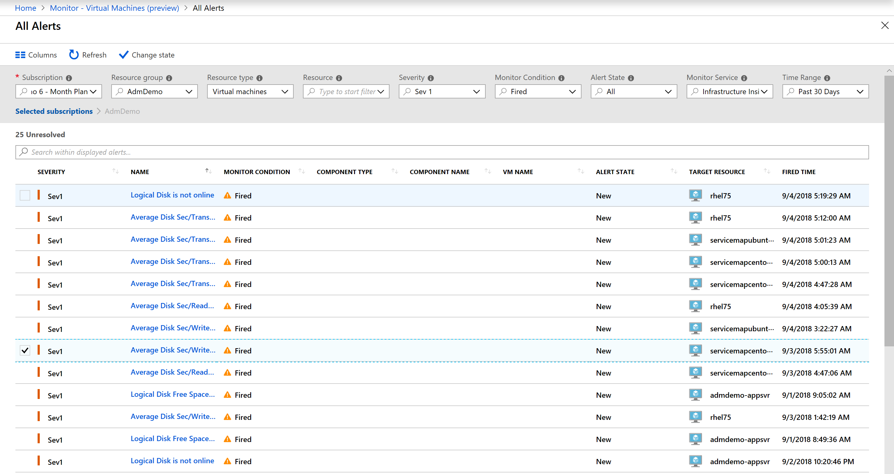
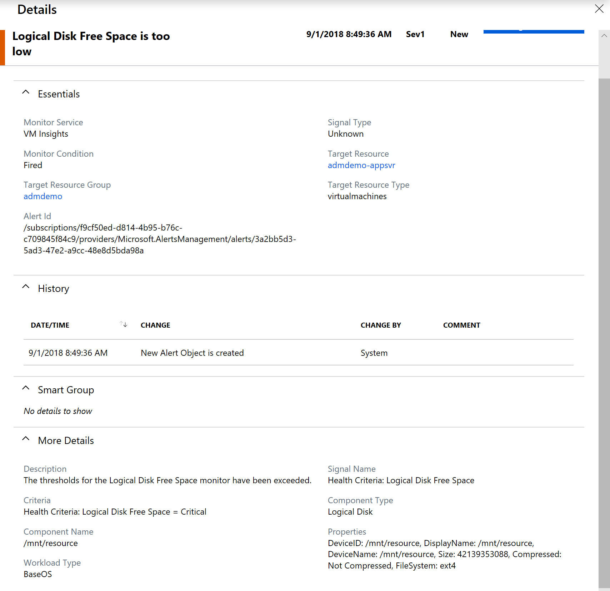

# Understand the health of your virtual machines with Azure Monitor VM insights
Viewing the health state of the operating system running on your Azure virtual machines can be observed in two ways with Azure Monitor VM insights, from a virtual machine directly or across all VMs in a resource group from Azure Monitor. This article will help you understand the experience between the two perspectives and how to quickly assess, investigate and resolve issues detected.

For information about configuring VM insights, see [Configuring solution in Azure](monitoring-vminsights-onboard.md).

## Sign in to the Azure portal
Sign in to the [Azure portal](https://portal.azure.com). 

## View health directly from a virtual machine 
To view the health of an Azure VM, select **Insights (preview)** from the left-hand pane of the virtual machine. On the VM insights page, **Health** is open by default and shows the health view of the VM.  

On the **Health** tab, under the section **Guest VM health**, the table shows the current health state of your virtual machine and the total number of alerts raised by an unhealthy component. Refer to [Alerting and an alert management](#alerting-and-alert-management) for more details.  Selecting **View health diagnostics** opens a page showing all the components of the VM, associated health criteria, state changes and other significant issues encountered by monitoring objects related to the VM. Refer to the [Health diagnostics](#health-diagnostics) for more details. 

Under the **Component health** section, the table shows a health rollup status of the primary performance categories monitored by health criteria for those areas, specifically **CPU**, **Memory**, **Disk**, and **Network**.  Selecting any one of the components opens a page listing all of the individual health criterion monitoring aspects of that component and the respective health state of each.  

When accessing VM insights Health from an Azure VM running the Windows operating system, the health state of the top 5 core Windows services is shown under the section **Core services health**.  Selecting any one of the services opens a page listing the health criteria monitoring that component and its health state.  Clicking on the name of the health criteria will open the property pane and from here you are able to review the configuration details, including if the health criteria has a corresponding Azure Monitor alert defined.  

## Aggregate virtual machine perspective
To view health collection for all of your virtual machines in a resource group, from the navigation list in the portal, select **Azure Monitor** and then select **Virtual Machines (preview)**.  

From the **Subscription** and **Resource Group** drop-down lists, select the appropriate one that includes the target VMs onboarded to view their health state. 

On the **Health** tab, you are able to learn the following:

* How many VMs are in a critical or unhealthy state, versus how many are healthy or not submitting data (referred to as an unknown state)?
* Which VMs by operating system (OS) are reporting an unhealthy state and how many?
* What monitored components of the VM are unhealthy, categorized by health state?  Is it the processor, disk, memory or network adapter?
* Which core operating system services are unhealthy, categorized by health state?

Here you can quickly identify the top critical issues detected by the health criteria  proactively monitoring the VM, and review alert details and associated knowledge article intended to assist in the diagnosis and remediation of the issue.  

### VM distribution by operating system
This section provides the distribution of VMs based on operating system running on the VM. 

The table shows VMs listed by Windows edition or Linux distribution, along with their version. In each operating system category, the VMs are broken down further based on the health of the VM. The health states defined for a VM are: 

* **Healthy** – no issues detected for the VM and it is functioning as required.  
* **Critical** – one or more critical issues are detected, which need to be addressed in order to restore normal functionality as expected. 
* **Warning** -  one or more issues are detected, which need to be addressed or the health condition could become critical.  
* **Unknown** – if the service was not able to make a connection with the VM, the status changes to an unknown state.  

You can click on any column item - **VM count**, **Critical**, **Warning**, **Healthy** or **Unknown** to drill-down into the **Virtual Machines** page see a list of filtered results matching the column selected. For example, if we want to review all VMs running **Red Hat Enterprise Linux release 7.5**, click on the **VM count** value for that OS and it will open the following page, listing the virtual machines matching that filter and their currently known health state.  

 
On the **Virtual Machines** page, if you select the name of a VM under the column **VM Name**, you are directed to the VM instance page with more details of the alerts and health criteria issues identified that are affecting the selected VM.  From here you can filter the health state details by clicking on **Health State** icon in the upper left-hand corner of the page to see which components are unhealthy or you can view alerts raised by an unhealthy component categorized by alert severity.    

From the VM list view, clicking on the name of a VM opens the **Health** page for that selected VM, similarly as if you selected **Insights (preview)** from the VM directly.

Here it shows a rollup **Health Status** for the virtual machine and **Alerts**, categorized by severity, which represent alerts raised when the health state changes from health to unhealthy for a health criteria.  Selecting **VMs in critical condition** will open a page with a list of one or more VMs that are in a critical health state.  Clicking on the health status for one of the VMs in the list will show the **Health Diagnostics** view of the VM.  Here you can find out which health criteria is reflecting a health state issue. When the **Health Diagnostics** page opens, it shows all the components of the VM and their associated health criteria with current health state.  Refer to the [Health Diagnostic](#health-diagnostics) section for more details.  

Select any of the severities to open the [All Alerts](../monitoring-and-diagnostics/monitoring-overview-unified-alerts.md#all-alerts-page) page filtered by that severity.

Selecting **View all health criteria** opens a page showing a list of all the health criteria available with this solution.  The information can be further filtered based on the following options:

* **Type** – There are three kinds of health criteria types to assess conditions and roll up overall health state of the monitored VM.  
    a. **Unit** – Measures some aspect of the virtual machine. This health criteria type might be checking a performance counter to determine the performance of the component, running a script to perform a synthetic transaction, or watch for an event that indicates an error.  By default the filter is set to unit.  
    b. **Dependency** - Provides health rollup between different entities. This health criteria allows the health of an entity to depend on the health of another kind of entity that it relies on for successful operation.  
    c. **Aggregate** -  Provides a combined health state of similar health criteria. Unit and dependency health criterion will typically be configured under an aggregate health criterion. In addition to providing better general organization of the many different health criteria targeted at an entity, aggregate health criterion provides a unique health state for distinct categories of the entities.

* **Category** - Type of health criteria used to group criteria of similar type for reporting purposes.  They are either **Availability** or **Performance**.

You can drill further down to see which instances are unhealthy by clicking on a value under the **Unhealthy Component** column.  On the page a table lists the components which are in a critical health state.    

## Health diagnostics
Health diagnostics page allows you to view all the components of the VM, associated health criteria, state changes, and other significant issues encountered by monitoring objects related to the VM. 

You can launch Health diagnostics in the following ways.

* By rollup health state for all VMs from the aggregate VM perspective in Azure Monitor.  On the VM Insights health page, click on the icon for **Critical**, **Warning**, **Healthy**, or **Unknown** health state under the section **Guest VM health** and drill down to the page that lists all the VMs matching that filtered category.  Clicking on the value in the **Health State** column will open Health Diagnostics scoped to that particular VM.      

* By operating system from the aggregate VM perspective in Azure Monitor. Under **VM distribution**, selecting any one of the column values will open the **Virtual Machines** page and return a list in the table matching the filtered category.  Clicking on the value under **Health State** column opens Health diagnostics for the selected VM.    
 
* From the guest VM on the VM Insights Health tab, by selecting **View health diagnostics** 

Health diagnostics organizes health information into the following categories: 

* Availability
* Performance
 
All health criteria defined for a selected target displays in the appropriate category. 

Health state for health criteria is defined by one of the three states – *Critical*, *Warning* and *Healthy*. There is another state *Unknown*, which is not associated with health state, but represents its known monitoring status by the solution.  

The following table provides details on the health states represented in Health diagnostics.

|Icon |Health state |Meaning |
|-----|-------------|------------|
| |Healthy |The health state is healthy if it is within the defined health conditions. In the case of a parent rollup monitor, health rolls-up and it reflects the best-case or worst-case state of the child.|
| |Critical |The health state is critical if it is not within the defined health condition. In the case of a parent rollup monitor, health rolls-up and it reflects the best-case or worst-case state of the child.|
| |Warning |The health state is warning if it is between two thresholds for the defined health condition, where one indicates a *Warning* state and the other indicates a *Critical* state. In case of a parent rollup monitor, if one or more of the children is in a warning state, then the parent will reflect *warning* state. If there is a child that is in a *Critical* and another child in a *Warning* state, the parent rollup will show a health state of *Critical*.|
| |Unknown |The health state is in an *Unknown* state when the health state cannot be computed for several reasons, such as not able to collect data, service uninitialized etc.| 

Health diagnostics page has three main sections:

* Component Model 
* Health Criteria
* State Changes 

### Component model
The left-most column in a Health diagnostics page is the component model. All the components and its discovered instances, which are associated with the VM, are displayed in this column. 

In the following example, the discovered components are disk, logical disk, processor, memory, and operating system. Multiple instances of these components are discovered and displayed in this column, with two instances of logical disk **/** and **/mnt**, one instance of network adapter **eth0**, two instances of disk **sda** and **sdb**, two instances of processor **0 and 1**, and an **Ubuntu Operating System**). 

### Health criteria
The center column in the Health diagnostics page is the **Health Criteria** column. The health model defined for the VM is displayed in a hierarchical tree. The health model for a VM consist of unit, dependency and aggregate health criteria.  

A health criterion measures the health of the monitored instance with some criteria, which could be a threshold value or a state of an entity, etc. A health criterion has either two or three health states as described in the above section. At any given point, the health criterion can be in only one of its potential states. 

The overall health of a target is determined from the health of each of its health criteria defined in the health model. This will be a combination of health criteria targeted directly at the target, health criteria targeted at components rolling up to the target through a dependency health criterion. This hierarchy is illustrated in the **Health Criteria** section of the Health Diagnostics page. The policy for how health is rolled up is part of the configuration of the aggregate and dependency health criteria. You can find a list of default set of health criteria running as part of this solution under the section [Health Criteria details](#health-criteria-details).  

In the example below, the aggregate health criterion **Core Windows Services Rollup** assesses the health of the most critical Windows Services based on individual service health criteria. The status of each service such as DNS, DHCP etc., are evaluated and the health is rolled up to corresponding rollup health criterion (as shown below).  

The health of the **Core Windows Services Rollup** rolls into the health of **Operating System availability**, which eventually rolls up to the **Availability** of the VM. 

### State changes
The right-most column in the Health diagnostics page is **State Changes**. It lists all the state changes associated with the health criteria that is selected in the **Health Criteria** section or the state change of the VM if a VM was selected from the **Component Model** or **Health Criteria** column of the table. 

This section consists of the health criteria state and the associated time sorted by the latest state on top.   

### Association of Component Model, Health Criteria and State change columns 
The three columns are interlinked with each other. When a user selects a discovered instance in the Component Model, the **Health Criteria** section is filtered to that component view and correspondingly the **State Change** is updated based on the selected health criteria. 

In the above example, when one selects **/mnt (Logical Disk)**, the Health Criteria tree is filtered to **/mnt (Logical Disk)**. The **Availability** and **Performance** tabs are filtered accordingly too. The **State Change** column shows the state change based on the availability of **/mnt (Logical Disk)**. 

At any time, you can refresh the Health diagnostics page by clicking on the **Refresh** link.  If there is an update to the health criterion's health state based on the pre-defined polling interval, this task allows you to avoid waiting and reflects the latest health state.  The **Health Criteria State** is a filter allowing you to scope the results based on the selected health state - Healthy, Warning, Critical, Unknown, and all.  The **Last Updated** time in the top right corner represents the last time when the Health diagnostics page was refreshed.  

## Alerting and alert management 
VM Insights Health integrates with [Azure Alerts](../monitoring-and-diagnostics/monitoring-overview-unified-alerts.md) and raises an alert when the predefined health criteria change from healthy to an unhealthy state when the condition is detected. Alerts are categorized by severity - Sev 0 through 4, with Sev 0 representing the highest severity level.  

Alert severity rollup are available in two places:

* From Azure Monitor when viewing health status across all monitored virtual machines on the **Health** dashboard under the section **Fired alerts**.  
* Directly from the virtual machine when you open the **Health** dashboard under the section **Fired alerts**.  

When you select either the total number of alerts or the number corresponding to a severity level, the **Alerts** page opens and lists all alerts matching your selection.  For example, if you selected the row corresponding to **Sev level 1**, then you see the following view:

You can filter this view by selecting values in the dropdown menus at the top of the page.

|Column |Description | 
|-------|------------| 
|Subscription |Select an Azure subscriptions. Only alerts in the selected subscription are included in the view. | 
|Resource Group |Select a single resource group. Only alerts with targets in the selected resource group are included in the view. | 
|Resource type |Select one or more resource types. Only alerts with targets of the selected type are included in the view. This column is only available after a resource group has been specified. | 
|Resource |Select a resource. Only alerts with that resource as a target are included in the view. This column is only available after a resource type has been specified. | 
|Severity |elect an alert severity, or select *All* to include alerts of all severities. | 
|Monitor Condition |Select a monitor condition to filter alerts if they have been *Fired* by the system or *Resolved* by the system if the condition is no longer active. Or select *All* to include alerts of all conditions. | 
|Alert state |Select an alert state, *New*, *Acknowledge*, *Closed*, or select *All* to include alerts of all states. | 
|Monitor service |Select a service, or select *All* to include all services. Only alerts from Infrastructure Insights is supported for this solution. | 
|Time range| Only alerts fired within the selected time window are included in the view. Supported values are the past hour, the past 24 hours, the past 7 days, and the past 30 days. | 

The Alert detail page is displayed when you select an alert. It provides details of the alert and enables you to change its state.

## Next steps
To identify bottlenecks and overall utilization with your VMs performance,, see [View Azure VM Performance](monitoring-vminsights-performance.md), or to view discovered application dependencies, see [View VM Insights Map](monitoring-vminsights-maps.md). 