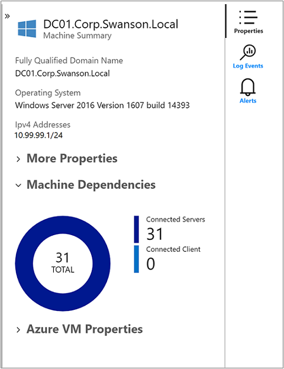
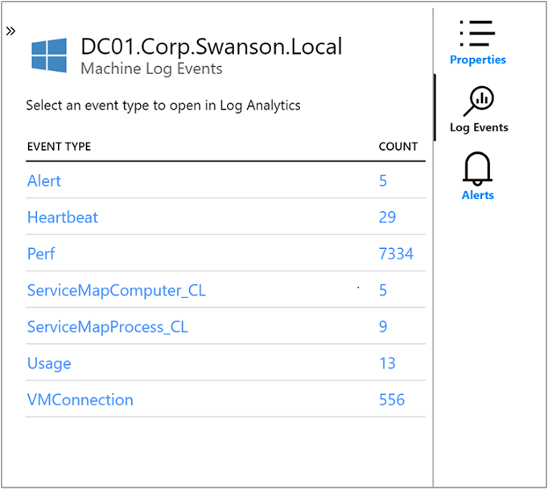
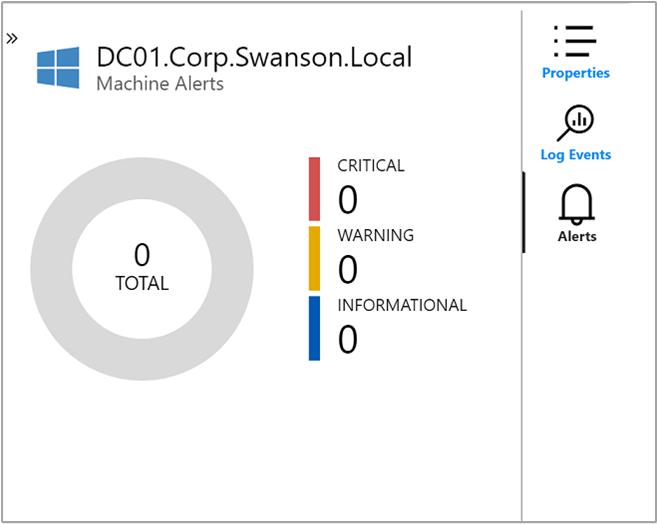
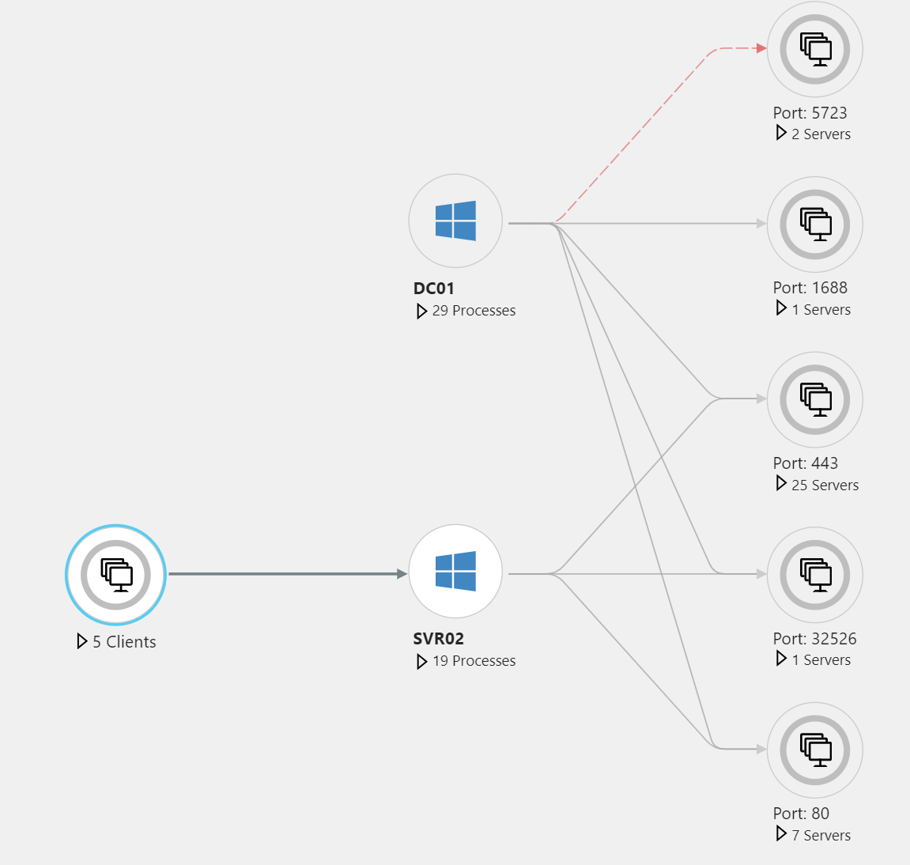
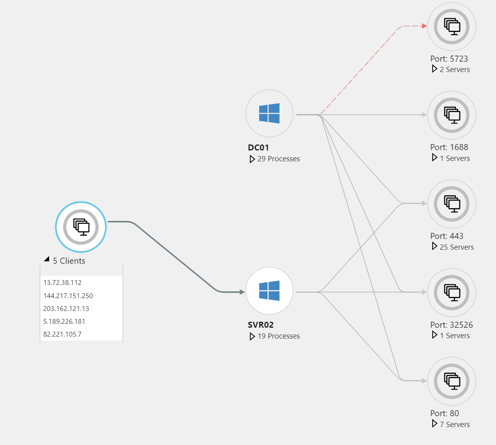
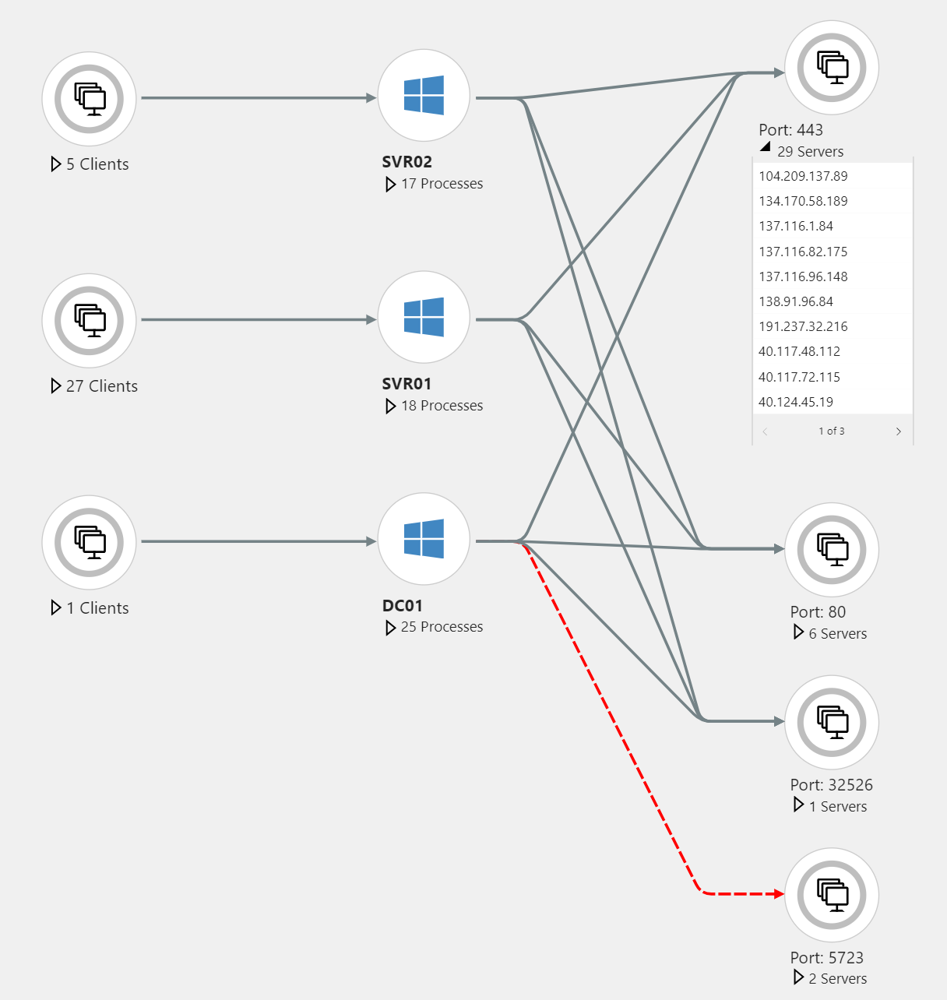
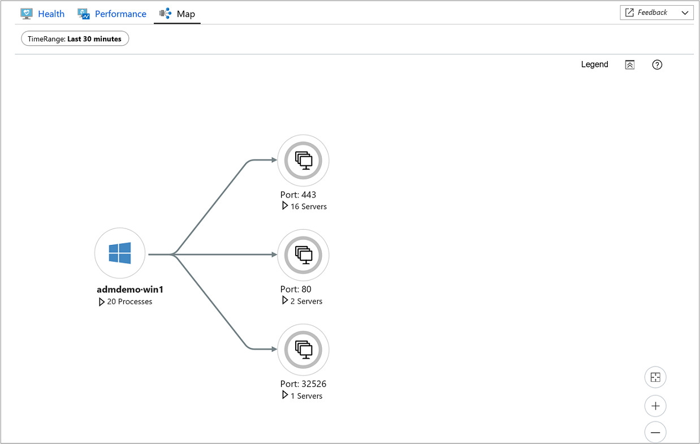

# Using VM Insights Maps to understand application components
Viewing the discovered application components on Windows and Linux virtual machines running in Azure your your environment can be observed in two ways with VM Insights, from a virtual machine directly or across all VMs in a subscription from Azure Monitor. 

This article will help you understand the experience between the two perspectives and how to use VM Insights Maps. For information about configuring VM Insights, see [Configuring solution in Azure](monitoring-vminsights-onboard.md).

## Sign in to Azure
Sign in to the Azure portal at [https://portal.azure.com](https://portal.azure.com).

## Introduction of Maps experience
Before diving into viewing Maps for a single virtual machine or group of VMs, it's important we provide a brief introduction to the feature so you understand how the information is presented and what the visualizations represent.  

Whether you select VM Insights Map feature directly from a VM or from Azure Monitor, it presents a consistent experience.  The only difference is the ability to scope from the top - a subscription, down to a particular VM in a resource group, which is only available from Azure Monitor.  

Maps visualizes the VMs dependencies, that is running process groups and processes with active network connections, over a specified time range.  When you expand a VM to show process details, only those processes that communicate with that VM are shown. The count of agentless front-end clients that connect into the virtual machine is indicated with the Port Group, along with other connections to the same port number.  Expand the Port Group to see the detailed list of servers connected over that port.   

When you click on the virtual machine, the **Properties** pane is expanded on the right to show the properties of the item selected, such as system information reported by the operating system, properties of the Azure VM, and a doughnut summarizing the discovered connections. 

On the right-side of the pane, click on the **Log Events** icon to switch focus of the pane to show a list of tables that collected data from the VM has sent to Log Analytics and is available for querying.  Clicking on any one of the record types listed will open the **Log search** page to view the results for that type with a pre-configured query filtered against the specific virtual machine.  

Close *Log search** and return to the **Properties** pane and select **Alerts** to view alerts that alerts raised for the VM from health criteria. Maps integrates with Azure Alerts to show fired alerts for the selected server in the selected time range. The server displays an icon if there are current alerts, and the Machine Alerts pane lists the alerts. 

To enable the Map feature to display relevant alerts, create an alert rule that fires for a specific computer. To create proper alerts:
- Include a clause to group by computer (for example, **by Computer interval 1 minute**).
- Choose to alert based on metric measurement.

For more information about Azure Alerts and creating alert rules, see [Unified Alerts in Azure Monitor](../monitoring-and-diagnostics/monitoring-overview-unified-alerts.md)

The **Legend** option in the upper right-hand corner describes the symbols and roles on a map.  To zoom in for a closer look at your map and move the it around, the Zoom controls at the bottom right-hand side of the page sets the zoom level and fit the page to the size of the current page.  

### Role icons
Certain processes serve particular roles on virtual machines: web servers, application servers, database, and so on. VM Insights Map annotates process and VMs with role icons to help identify at a glance the role a process or server plays. The following table describes the role icons.  

|Role icon |Description |  
|----------|------------|  
|  | Web server |  
|  | Application server |  
|  | Database server |  
|  | LDAP server |  
|  | SMB server |  

### Failed connections
Failed connections are shown in maps for processes and computers, with a dashed red line indicating that a client system is failing to reach a process or port. Failed connections are reported from any system with the dependency agent if that system is the one attempting the failed connection. Maps measures this process by observing TCP sockets that fail to establish a connection. This failure could result from a firewall, a misconfiguration in the client or server, or a remote service being unavailable.

Understanding failed connections can help with troubleshooting, migration validation, security analysis, and understanding the overall architecture of the service. Failed connections are sometimes harmless, but they often point directly to a problem, such as a failover environment suddenly becoming unreachable, or two application tiers being unable to communicate with each other after a cloud migration.

### Client Groups
Client Groups on the map represent client machines that do not have the Dependency agent installed. A single Client Group represents the clients for an individual process or machine.

To see the IP addresses of the systems in a Client Group, select the group. The contents of the group are listed beneath the group.  

### Server Port Groups
Server Port Groups represent server ports on servers that do not have the Dependency agent installed.  The group contains the server port and a count of the number of servers with connections to that port. Select the group to see the individual servers and connections listed. 

  

## View Map directly from a virtual machine 

To access VM Insights directly from a virtual machine, perform the following.

1. In the Azure portal, select **Virtual Machines**. 
2. From the list, choose a VM and in the **Monitoring** section choose **Insights (preview)**.  
3. Select the **Map** tab.

Maps visualizes the VMs dependencies, that is running process groups and processes with active network connections, over a specified time range.  By default, the map shows the last 30 minutes.  Using the **TimeRange** selector in the upper left-hand corner, you can query for historical time ranges of up to one hour to show how dependencies looked in the past (for example, during an incident or before a change occurred).  

## View Maps from Azure Monitor
From Azure Monitor, the Maps feature provides a global view of your virtual machines and their dependencies.  To access VM Insights from Azure Monitor, perform the following. 

1. In the Azure portal, select **Monitor**. 
2. Choose **Virtual Machines (preview)** in the **Solutions** section.
3. Select the **Map** tab.

From the **Workspace** selector at the top of the page, if you have more than one Log Analytics workspace, choose the one that is integrated with the solution and has virtual machines reporting to it.  You then select from the **Group** selector, a subscription or resource group to view a set of VMs and their dependencies matching the group, over a specified period of time.  By default, the map shows the last 30 minutes.  Using the **TimeRange** selector, you can query for historical time ranges of up to one hour to show how dependencies looked in the past (for example, during an incident or before a change occurred).   

Maps visualizes the VMs dependencies, that is running process groups and processes with active network connections, over a specified time range.  When you expand a VM to show process details, only those processes that communicate with that VM are shown. The count of agentless front-end clients that connect into the virtual machine is indicated with the Port Group, along with other connections to the same port number.  Expand the Port Group to see the detailed list of servers connected over that port.   

When you click on the virtual machine, the **Properties** pane is expanded on the right to show the properties of the item selected, such as system information reported by the operating system, properties of the Azure VM, and a doughnut summarizing the discovered connections. 

On the right-side of the pane, click on the **Log Events** icon to switch focus of the pane to show a list of tables that collected data from the VM has sent to Log Analytics and is available for querying.  Clicking on any one of the record types listed will open the **Log search** page to view the results for that type with a pre-configured query filtered against the specific virtual machine.  

Close *Log search** and return to the **Properties** pane and select **Alerts** to view alerts that alerts raised for the VM from health criteria. Maps integrates with Azure Alerts to show fired alerts for the selected server in the selected time range. The server displays an icon if there are current alerts, and the Machine Alerts pane lists the alerts. 

To enable the Map feature to display relevant alerts, create an alert rule that fires for a specific computer. To create proper alerts:
- Include a clause to group by computer (for example, **by Computer interval 1 minute**).
- Choose to alert based on metric measurement.

The **Legend** option in the upper right-hand corner describes the symbols and roles on a map.  To zoom in for a closer look at your map and move the it around, the Zoom controls at the bottom right-hand side of the page sets the zoom level and fit the page to the size of the current page.  

