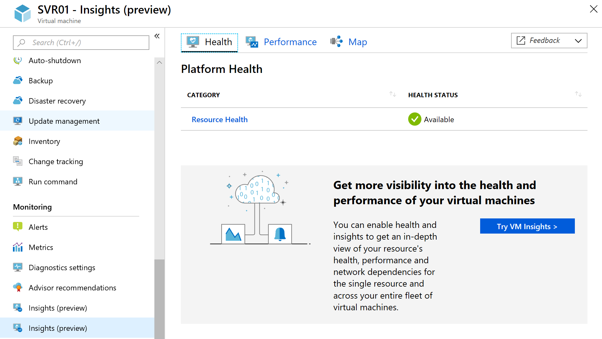
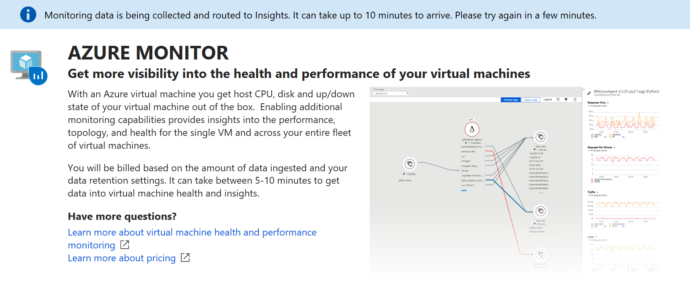

# How to onboard the Azure Monitor for VMs 
This article describes how to set up Azure Monitor for VMs to monitor the operating system health of your Azure virtual machines and discover and map application dependencies that may be hosted on them.  

Enabling Azure Monitor for VMs is accomplished by using one of the following methods, and details on using each method are provided later in the article.  

* A single Azure virtual machine by selecting **Insights (preview)** directly from the VM.
* Multiple Azure VMs using Azure Policy to ensure existing and new VMs evaluated have the required dependencies installed and are properly configured.  Non-compliant VMs are reported so you can decide based on what isn't compliant, how you want to remediate.  
* Multiple Azure VMs or virtual machine scale sets across a specified subscription or resource group using PowerShell.

## Prerequisites
Before you start, make sure that you have the following as described in the subsections below.

### Log Analytics 

A Log Analytics workspace in the following regions is currently supported:

  - West Central US  
  - East US  
  - West Europe  
  - Southeast Asia<sup>1</sup>  

<sup>1</sup> 
This region does not currently support the Health feature of Azure Monitor for VMs   

If you do not have a workspace, you can create it through [Azure CLI](../log-analytics/log-analytics-quick-create-workspace-cli.md), through [PowerShell](../log-analytics/log-analytics-quick-create-workspace-posh.md), in the [Azure portal](../log-analytics/log-analytics-quick-create-workspace.md), or with [Azure Resource Manager](../log-analytics/log-analytics-template-workspace-configuration.md).  If you are enabling monitoring for a single Azure VM from the Azure portal, you have the option to create a workspace during this process.  

To enable the solution, you need to be a member of the Log Analytics contributor role. For more information about how to control access to a Log Analytics workspace, see [Manage workspaces](../log-analytics/log-analytics-manage-access.md).

[!INCLUDE [log-analytics-agent-note](../../includes/log-analytics-agent-note.md)]

Enabling the solution for the at scale scenario first requires configuring the following in your Log Analytics workspace:

* Install the **ServiceMap** and **InfrastructureInsights** solutions
* Configure the Log Analytics workspace to collect performance counters

To configure your workspace for this scenario, see [Setup Log Analytics workspace](#setup-log-analytics-workspace).

### Supported operating systems

The following table lists the Windows and Linux operating systems that are supported with Azure Monitor for VMs.  A full list detailing the major and minor Linux OS release and kernel versions supported are provided later in this section.

|OS version |Performance |Maps |Health |  
|-----------|------------|-----|-------|  
|Windows Server 2016 1803 | X | X | X |
|Windows Server 2016 | X | X | X |  
|Windows Server 2012 R2 | X | X | |  
|Windows Server 2012 | X | X | |  
|Windows Server 2008 R2 | X | X| |  
|RHEL 7, 6| X | X| X |  
|Ubuntu 18.04, 16.04, 14.04 | X | X | X |  
|Cent OS Linux 7, 6 | X | X | X |  
|SLES 12 | X | X | X |  
|Oracle Linux 7 | X<sup>1</sup> | | X |  
|Oracle Linux 6 | X | X | X |  
|Debian 9.4, 8 | X<sup>1</sup> | | X | 

<sup>1</sup> 
The Performance feature of Azure Monitor for VMs is only available from Azure Monitor, it is not available when you access it from the left-hand pane of the Azure VM directly.  

>[!NOTE]
>The following information applies to support of the Linux operating system:  
> - Only default and SMP Linux kernel releases are supported.  
> - Nonstandard kernel releases, such as PAE and Xen, are not supported for any Linux distribution. For example, a system with the release string of "2.6.16.21-0.8-xen" is not supported.  
> - Custom kernels, including recompiles of standard kernels, are not supported.  
> - CentOSPlus kernel is not supported.  


#### Red Hat Linux 7

| OS version | Kernel version |
|:--|:--|
| 7.0 | 3.10.0-123 |
| 7.1 | 3.10.0-229 |
| 7.2 | 3.10.0-327 |
| 7.3 | 3.10.0-514 |
| 7.4 | 3.10.0-693 |
| 7.5 | 3.10.0-862 |

#### Red Hat Linux 6

| OS version | Kernel version |
|:--|:--|
| 6.0 | 2.6.32-71 |
| 6.1 | 2.6.32-131 |
| 6.2 | 2.6.32-220 |
| 6.3 | 2.6.32-279 |
| 6.4 | 2.6.32-358 |
| 6.5 | 2.6.32-431 |
| 6.6 | 2.6.32-504 |
| 6.7 | 2.6.32-573 |
| 6.8 | 2.6.32-642 |
| 6.9 | 2.6.32-696 |

#### Ubuntu Server

| OS version | Kernel version |
|:--|:--|
| Ubuntu 18.04 | kernel 4.15.* |
| Ubuntu 16.04.3 | kernel 4.15.* |
| 16.04 | 4.4.\*<br>4.8.\*<br>4.10.\*<br>4.11.\*<br>4.13.\* |
| 14.04 | 3.13.\*<br>4.4.\* |

#### Oracle Enterprise Linux 6 with Unbreakable Enterprise Kernel
| OS version | Kernel version
|:--|:--|
| 6.2 | Oracle 2.6.32-300 (UEK R1) |
| 6.3 | Oracle 2.6.39-200 (UEK R2) |
| 6.4 | Oracle 2.6.39-400 (UEK R2) |
| 6.5 | Oracle 2.6.39-400 (UEK R2 i386) |
| 6.6 | Oracle 2.6.39-400 (UEK R2 i386) |

#### Oracle Enterprise Linux 5 with Unbreakable Enterprise Kernel

| OS version | Kernel version
|:--|:--|
| 5.10 | Oracle 2.6.39-400 (UEK R2) |
| 5.11 | Oracle 2.6.39-400 (UEK R2) |

#### SUSE Linux 12 Enterprise Server

| OS version | Kernel version
|:--|:--|
|12 SP2 | 4.4.* |
|12 SP3 | 4.4.* |

### Hybrid environment connected sources
Azure Monitor for VMs Map gets its data from the Microsoft Dependency agent. The Dependency agent relies on the Log Analytics agent for its connection to Log Analytics and therefore, a system must have the Log Analytics agent installed and configured with the Dependency agent. The following table describes the connected sources that the Map feature supports in a hybrid environment.

| Connected source | Supported | Description |
|:--|:--|:--|
| Windows agents | Yes | In addition to the [Log Analytics agent for Windows](../log-analytics/log-analytics-concept-hybrid.md), Windows agents require the Microsoft Dependency agent. See the [supported operating systems](#supported-operating-systems) for a complete list of operating system versions. |
| Linux agents | Yes | In addition to the [Log Analytics agent for Linux](../log-analytics/log-analytics-concept-hybrid.md), Linux agents require the Microsoft Dependency agent. See the [supported operating systems](#supported-operating-systems) for a complete list of operating system versions. |
| System Center Operations Manager management group | No | |  

On Windows, the Microsoft Monitoring Agent (MMA) is used by both System Center Operations Manager and Log Analytics to gather and send monitoring data. System Center Operations Manager and Log Analytics provide different out-of-the box versions of the agent. These versions can each report to System Center Operations Manager, to Log Analytics, or to both.  

On Linux, the Log Analytics agent for Linux gathers and sends monitoring data to Log Analytics.   

If your Windows or Linux computers cannot directly connect to the service, you need to configure the Log Analytics agent to connect to Log Analytics using the OMS Gateway. For more information on how to deploy and configure the OMS Gateway, see [Connect computers without Internet access using the OMS Gateway](../log-analytics/log-analytics-oms-gateway.md).  

The Dependency agent can be downloaded from the following location.

| File | OS | Version | SHA-256 |
|:--|:--|:--|:--|
| [InstallDependencyAgent-Windows.exe](https://aka.ms/dependencyagentwindows) | Windows | 9.7.1 | 55030ABF553693D8B5112569FB2F97D7C54B66E9990014FC8CC43EFB70DE56C6 |
| [InstallDependencyAgent-Linux64.bin](https://aka.ms/dependencyagentlinux) | Linux | 9.7.1 | 43C75EF0D34471A0CBCE5E396FFEEF4329C9B5517266108FA5D6131A353D29FE |

## Diagnostic and usage data
Microsoft automatically collects usage and performance data through your use of the Azure Monitor service. Microsoft uses this data to provide and improve the quality, security, and integrity of the service. To provide accurate and efficient troubleshooting capabilities, data from the Map feature includes information about the configuration of your software, such as operating system and version, IP address, DNS name, and workstation name. Microsoft does not collect names, addresses, or other contact information.

For more information about data collection and usage, see the [Microsoft Online Services Privacy Statement](https://go.microsoft.com/fwlink/?LinkId=512132).

[!INCLUDE [GDPR-related guidance](../../includes/gdpr-dsr-and-stp-note.md)]

## Performance Counters enabled
Azure Monitor for VMs configures a Log Analytics Workspace to collect performance counters used by the solution.  The following table lists the objects and counters configured by the solution that are collected every 60 seconds.

### Windows performance counters

|Object name |Counter name |  
|------------|-------------|  
|LogicalDisk |% Free Space |  
|LogicalDisk |Avg. Disk sec/Read |  
|LogicalDisk |Avg. Disk sec/Transfer |  
|LogicalDisk |Avg. Disk sec/Write |  
|LogicalDisk |Disk Bytes/sec |  
|LogicalDisk |Disk Read Bytes/sec |  
|LogicalDisk |Disk Reads/sec |  
|LogicalDisk |Disk Transfers/sec |  
|LogicalDisk |Disk Write Bytes/sec |  
|LogicalDisk |Disk Writes/sec |  
|LogicalDisk |Free Megabytes |  
|Memory |Available MBytes |  
|Network Adapter |Bytes Received/sec |  
|Network Adapter |Bytes Sent/sec |  
|Processor |% Processor Time |  

### Linux performance counters

|Object name |Counter name |  
|------------|-------------|  
|Logical Disk |% Used Space |  
|Logical Disk |Disk Read Bytes/sec |  
|Logical Disk |Disk Reads/sec |  
|Logical Disk |Disk Transfers/sec |  
|Logical Disk |Disk Write Bytes/sec |  
|Logical Disk |Disk Writes/sec |  
|Logical Disk |Free Megabytes |  
|Logical Disk |Logical Disk Bytes/sec |  
|Memory |Available MBytes Memory |  
|Network |Total Bytes Received |  
|Network |Total Bytes Transmitted |  
|Processor |% Processor Time |  

## Sign in to Azure portal
Sign in to the Azure portal at [https://portal.azure.com](https://portal.azure.com). 

## Enable from the Azure portal
To enable monitoring of your Azure VM in the Azure portal, do the following:

1. In the Azure portal, select **Virtual Machines**. 
2. From the list, select a VM. 
3. On the VM page, in the **Monitoring** section, select **Insights (preview)**.
4. On the **Insights (preview)** page, select **Try now**.

    

5. On the **Azure Monitor Insights Onboarding** page, if you have an existing Log Analytics workspace in the same subscription, select it in the drop-down list.  The list preselects the default workspace and location that the virtual machine is deployed to in the subscription. 

    >[!NOTE]
    >If you want to create a new Log Analytics workspace for storing the monitoring data from the VM, follow the instructions in [Create a Log Analytics workspace](../log-analytics/log-analytics-quick-create-workspace.md) in one of the supported regions listed earlier.   

After you've enabled monitoring, it might take about 10 minutes before you can view health metrics for the virtual machine. 




## On-boarding at scale
In this section instructions on how to perform the at scale deployment of Azure Monitor for VMs using either Azure Policy or with Azure PowerShell.  The first step required is to configure your Log Analytics workspace.  

### Setup Log Analytics workspace
If you do not have a Log Analytics workspace, review the available methods suggested under the [Prerequisites](#log-analytics) section to create one.  

#### Enable performance counters
If the Log Analytics workspace referenced by the solution isn't configured to already collect the performance counters required by the solution, they will need to be enabled. This can be accomplished manually as described [here](../log-analytics/log-analytics-data-sources-performance-counters.md), or by downloading and running a PowerShell script available from [Azure Powershell Gallery](https://www.powershellgallery.com/packages/Enable-VMInsightsPerfCounters/1.1).
 
#### Install the ServiceMap and InfrastructureInsights solutions
This method includes a JSON template that specifies the configuration to enable the solution components to your Log Analytics workspace.  

If you are unfamiliar with the concept of deploying resources by using a template, see:
* [Deploy resources with Resource Manager templates and Azure PowerShell](../azure-resource-manager/resource-group-template-deploy.md)
* [Deploy resources with Resource Manager templates and the Azure CLI](../azure-resource-manager/resource-group-template-deploy-cli.md) 

If you choose to use the Azure CLI, you first need to install and use the CLI locally. You must be running the Azure CLI version 2.0.27 or later. To identify your version, run `az --version`. If you need to install or upgrade the Azure CLI, see [Install the Azure CLI](https://docs.microsoft.com/cli/azure/install-azure-cli). 

1. Copy and paste the following JSON syntax into your file:

    ```json
    {

    "$schema": "https://schema.management.azure.com/schemas/2015-01-01/deploymentTemplate.json#",
    "contentVersion": "1.0.0.0",
    "parameters": {
        "WorkspaceName": {
            "type": "string"
        },
        "WorkspaceLocation": {
            "type": "string"
        }
    },
    "resources": [
        {
            "apiVersion": "2017-03-15-preview",
            "type": "Microsoft.OperationalInsights/workspaces",
            "name": "[parameters('WorkspaceName')]",
            "location": "[parameters('WorkspaceLocation')]",
            "resources": [
                {
                    "apiVersion": "2015-11-01-preview",
                    "location": "[parameters('WorkspaceLocation')]",
                    "name": "[concat('ServiceMap', '(', parameters('WorkspaceName'),')')]",
                    "type": "Microsoft.OperationsManagement/solutions",
                    "dependsOn": [
                        "[concat('Microsoft.OperationalInsights/workspaces/', parameters('WorkspaceName'))]"
                    ],
                    "properties": {
                        "workspaceResourceId": "[resourceId('Microsoft.OperationalInsights/workspaces/', parameters('WorkspaceName'))]"
                    },

                    "plan": {
                        "name": "[concat('ServiceMap', '(', parameters('WorkspaceName'),')')]",
                        "publisher": "Microsoft",
                        "product": "[Concat('OMSGallery/', 'ServiceMap')]",
                        "promotionCode": ""
                    }
                },
                {
                    "apiVersion": "2015-11-01-preview",
                    "location": "[parameters('WorkspaceLocation')]",
                    "name": "[concat('InfrastructureInsights', '(', parameters('WorkspaceName'),')')]",
                    "type": "Microsoft.OperationsManagement/solutions",
                    "dependsOn": [
                        "[concat('Microsoft.OperationalInsights/workspaces/', parameters('WorkspaceName'))]"
                    ],
                    "properties": {
                        "workspaceResourceId": "[resourceId('Microsoft.OperationalInsights/workspaces/', parameters('WorkspaceName'))]"
                    },
                    "plan": {
                        "name": "[concat('InfrastructureInsights', '(', parameters('WorkspaceName'),')')]",
                        "publisher": "Microsoft",
                        "product": "[Concat('OMSGallery/', 'InfrastructureInsights')]",
                        "promotionCode": ""
                    }
                }
            ]
        }
    ]
    ```

2. Save this file as **installsolutionsforvminsights.json** to a local folder.
3. Edit the values for **WorkspaceName**, **ResourceGroupName**, and **WorkspaceLocation**.  The value for **WorkspaceName** is the full resource ID of your Log Analytics workspace, which includes the workspace name, and the value for **WorkspaceLocation** is the region the workspace is defined in.
4. You are ready to deploy this template using the following PowerShell command:

    ```powershell
    New-AzureRmResourceGroupDeployment -Name DeploySolutions -TemplateFile InstallSolutionsForVMInsights.json -ResourceGroupName ResourceGroupName> -WorkspaceName <WorkspaceName> -WorkspaceLocation <WorkspaceLocation - example: eastus>
    ```

    The configuration change can take a few minutes to complete. When it's completed, a message is displayed that's similar to the following and includes the result:

    ```powershell
    provisioningState       : Succeeded
    ```

### Enable using Azure Policy
To enable Azure Monitor for VMs at scale that ensures consistent compliance and automatic enablement for new VMs provisioned, [Azure Policy](../azure-policy/azure-policy-introduction.md) is recommended. These policies:

* Deploy Log Analytics agent and Dependency agent 
* Report on compliance results 
* Remediate for non-compliant VMs

Enable Azure Monitor for VMs via policy to your tenant requires: 

- Assign the initiative to a scope – management group, subscription, or resource group 
- Review and remediation of compliance results  

For more information on Azure Policy assignment, see [Azure Policy overview](../governance/policy/overview.md#policy-assignment) and review the [overview of management groups](../governance/management-groups/index.md) before continuing.  

The following table lists the policy definitions provided.  

|Name |Description |Type |  
|-----|------------|-----|  
|[Preview]: Enable Azure Monitor for VMs |Enable Azure Monitor for the Virtual Machines (VMs) in the specified scope (Management group, subscription, or resource group). Takes Log Analytics workspace as parameter. |Initiative |  
|[Preview]: Audit Dependency Agent Deployment – VM Image (OS) unlisted |Reports VMs as non-compliant if the VM Image (OS) is not in the list defined and the agent is not installed. |Policy |  
|[Preview]: Audit Log Analytics Agent Deployment – VM Image (OS) unlisted |Reports VMs as non-compliant if the VM Image (OS) is not in the list defined and the agent is not installed. |Policy |  
|[Preview]: Deploy Dependency Agent for Linux VMs |Deploy Dependency Agent for Linux VMs if the VM Image (OS) is in the list defined and the agent is not installed. |Policy |  
|[Preview]: Deploy Dependency Agent for Windows VMs |Deploy Dependency Agent for Windows VMs if the VM Image (OS) is in the list defined and the agent is not installed. |Policy |  
|[Preview]: Deploy Log Analytics Agent for Linux VMs |Deploy Log Analytics Agent for Linux VMs if the VM Image (OS) is in the list defined and the agent is not installed. |Policy |  
|[Preview]: Deploy Log Analytics Agent for Windows VMs |Deploy Log Analytics Agent for Windows VMs if the VM Image (OS) is in the list defined and the agent is not installed. |Policy |  

Stand-alone policy (Not included with the initiative) 

|Name |Description |Type |  
|-----|------------|-----|  
|[Preview]: Audit Log Analytics Workspace for VM - Report Mismatch |Report VMs as non-compliant if they are not logging to the LA workspace specified in the policy/initiative assignment. |Policy |

#### Assign Azure Monitor initiative
With this initial release, you can only create the policy assignment from the Azure portal. To understand how to complete these steps, see [Create a policy assignment from the Azure portal](../governance/policy/assign-policy-portal.md). 

1. Launch the Azure Policy service in the Azure portal by clicking **All services**, then searching for and selecting **Policy**. 
2. Select **Assignments** on the left side of the Azure Policy page. An assignment is a policy that has been assigned to take place within a specific scope.
3. Select **Assign Initiative** from the top of the **Policy - Assignments** page.
4. On the **Assign Initiative** page, select the **Scope** by clicking the ellipsis and select either a management group, or subscription and optionally a resource group. A scope limits the policy assignment in our case to a grouping of virtual machines for enforcement. Click **Select** at the bottom of the **Scope** page to save your changes.
5. **Exclusions** allow you to omit one or more resources from the scope, which is optional. 
6. Select the **Initiative definition** ellipsis to open the list of available definitions and select **[Preview] Enable Azure Monitor for VMs** from the list, and then click **Select**.
7. The **Assignment name** is automatically populated with the initiative name you selected, but you can change it. You can also add an optional **Description**. **Assigned by** is automatically populated based on who is logged in, and this field is optional.
8. Select a **Log Analytics workspace** from the dropdown list that is available in the supported region.

    >[!NOTE]
    >If the workspace is outside of the scope of the assignment, you must grant **Log Analytics Contributor** permissions to the policy assignment's Principal ID. If you don't do this you may see a deployment failure such as: `The client '343de0fe-e724-46b8-b1fb-97090f7054ed' with object id '343de0fe-e724-46b8-b1fb-97090f7054ed' does not have authorization to perform action 'microsoft.operationalinsights/workspaces/read' over scope ... ` 
    >Review [how to manually configure the managed identity](../governance/policy/how-to/remediate-resources.md#manually-configure-the-managed-identity) to grant access.
    >

9. Notice the **Managed Identity** option is checked. This is checked when the initiative being assigned includes a policy with the deployIfNotExists effect. From the **Manage Identity location** dropdown list, select the appropriate region.  
10. Click **Assign**.

#### Review and remediate the compliance results 

You can learn how to review compliance results by reading [identify non-compliance results](../governance/policy/assign-policy-portal.md#identify-non-compliant-resources). Select **Compliance** in the left side of the page and locate the **[Preview] Enable Azure Monitor for VMs** initiative that are not compliant per the assignment you created.


Based on the results of the policies included with the initiative, VMs are reported as non-compliant in following scenarios:  
  
1. Log Analytics or Dependency Agent is not deployed.  
   This is typical for a scope with existing VMs. To mitigate it, [create remediation tasks](../governance/policy/how-to/remediate-resources.md) on a non-compliant policy to deploy the required agents.    
 
    - [Preview]: Deploy Dependency Agent for Linux VMs   
    - [Preview]: Deploy Dependency Agent for Windows VMs  
    - [Preview]: Deploy Log Analytics Agent for Linux VMs  
    - [Preview]: Deploy Log Analytics Agent for Windows VMs  

2. VM Image (OS) is not in the list identified in policy definition.  
   Criteria of the deployment policy only includes VMs that are deployed from well-known Azure VM images. Check the documentation if the VM OS is supported or not. If it is not, then you need to duplicate the deployment policy and update/modify it to make the image compliant. 
  
    - [Preview]: Audit Dependency Agent Deployment – VM Image (OS) unlisted  
    - [Preview]: Audit Log Analytics Agent Deployment – VM Image (OS) unlisted

3. VMs are not logging to the specified LA workspace.  
It is possible that some VMs in the initiative scope are logging to a LA workspace different from the once specified in policy assignment. This policy is a tool to identify which VMs are reporting to a non-compliant workspace.  
 
    - [Preview]: Audit Log Analytics Workspace for VM - Report Mismatch  

### Enable with PowerShell
To enable Azure Monitor for VMs for multiple VMs or virtual machine scale sets, you can use a provided PowerShell script - [Install-VMInsights.ps1](https://www.powershellgallery.com/packages/Install-VMInsights/1.0) available from the Azure PowerShell Gallery to complete this task.  This script will iterate through every virtual machine and virtual machine scale set in your subscription, in the scoped resource group specified by *ResourceGroup*, or to a single VM or virtual machine scale set specified by *Name*.  For each VM or virtual machine scale set, the script verifies if the VM extension is already installed, and if not attempt to reinstall it.  Otherwise, it proceeds to install the Log Analytics and Dependency Agent VM extensions.   

This script requires Azure PowerShell module version 5.7.0 or later. Run `Get-Module -ListAvailable AzureRM` to find the version. If you need to upgrade, see [Install Azure PowerShell module](https://docs.microsoft.com/powershell/azure/install-azurerm-ps). If you are running PowerShell locally, you also need to run `Connect-AzureRmAccount` to create a connection with Azure.

To get help about the script, you can run `Get-Help` to get a list of argument details and example usage.   

```powershell
Get-Help .\Install-VMInsights.ps1 -Detailed

SYNOPSIS
    This script installs VM extensions for Log Analytics and Dependency Agent as needed for VM Insights.


SYNTAX
    .\Install-VMInsights.ps1 [-WorkspaceId] <String> [-WorkspaceKey] <String> [-SubscriptionId] <String> [[-ResourceGroup]
    <String>] [[-Name] <String>] [[-PolicyAssignmentName] <String>] [-ReInstall] [-TriggerVmssManualVMUpdate] [-Approve] [-WorkspaceRegion] <String>
    [-WhatIf] [-Confirm] [<CommonParameters>]


DESCRIPTION
    This script installs or re-configures following on VM's and VM Scale Sets:
    - Log Analytics VM Extension configured to supplied Log Analytics Workspace
    - Dependency Agent VM Extension

    Can be applied to:
    - Subscription
    - Resource Group in a Subscription
    - Specific VM/VM Scale Set
    - Compliance results of a policy for a VM or VM Extension

    Script will show you list of VM's/VM Scale Sets that will apply to and let you confirm to continue.
    Use -Approve switch to run without prompting, if all required parameters are provided.

    If the extensions are already installed will not install again.
    Use -ReInstall switch if you need to for example update the workspace.

    Use -WhatIf if you would like to see what would happen in terms of installs, what workspace configured to, and status of the extension.


PARAMETERS
    -WorkspaceId <String>
        Log Analytics WorkspaceID (GUID) for the data to be sent to

    -WorkspaceKey <String>
        Log Analytics Workspace primary or secondary key

    -SubscriptionId <String>
        SubscriptionId for the VMs/VM Scale Sets
        If using PolicyAssignmentName parameter, subscription that VM's are in

    -ResourceGroup <String>
        <Optional> Resource Group to which the VMs or VM Scale Sets belong to

    -Name <String>
        <Optional> To install to a single VM/VM Scale Set

    -PolicyAssignmentName <String>
        <Optional> Take the input VM's to operate on as the Compliance results from this Assignment
        If specified will only take from this source.

    -ReInstall [<SwitchParameter>]
        <Optional> If VM/VM Scale Set is already configured for a different workspace, set this to change to the new workspace

    -TriggerVmssManualVMUpdate [<SwitchParameter>]
        <Optional> Set this flag to trigger update of VM instances in a scale set whose upgrade policy is set to Manual

    -Approve [<SwitchParameter>]
        <Optional> Gives the approval for the installation to start with no confirmation prompt for the listed VM's/VM Scale Sets

    -WorkspaceRegion <String>
        Region the Log Analytics Workspace is in
        Suported values: "East US","eastus","Southeast Asia","southeastasia","West Central US","westcentralus","West Europe","westeurope"
        For Health supported is: "East US","eastus","West Central US","westcentralus"

    -WhatIf [<SwitchParameter>]
        <Optional> See what would happen in terms of installs.
        If extension is already installed will show what workspace is currently configured, and status of the VM extension

    -Confirm [<SwitchParameter>]
        <Optional> Confirm every action

    <CommonParameters>
        This cmdlet supports the common parameters: Verbose, Debug,
        ErrorAction, ErrorVariable, WarningAction, WarningVariable,
        OutBuffer, PipelineVariable, and OutVariable. For more information, see
        about_CommonParameters (https:/go.microsoft.com/fwlink/?LinkID=113216).

    -------------------------- EXAMPLE 1 --------------------------
    .\Install-VMInsights.ps1 -WorkspaceRegion eastus -WorkspaceId <WorkspaceId>-WorkspaceKey <WorkspaceKey> -SubscriptionId <SubscriptionId>
    -ResourceGroup <ResourceGroup>

    Install for all VM's in a Resource Group in a subscription

    -------------------------- EXAMPLE 2 --------------------------
    .\Install-VMInsights.ps1 -WorkspaceRegion eastus -WorkspaceId <WorkspaceId>-WorkspaceKey <WorkspaceKey> -SubscriptionId <SubscriptionId>
    -ResourceGroup <ResourceGroup> -ReInstall

    Specify to ReInstall extensions even if already installed, for example to update to a different workspace

    -------------------------- EXAMPLE 3 --------------------------
    .\Install-VMInsights.ps1 -WorkspaceRegion eastus -WorkspaceId <WorkspaceId>-WorkspaceKey <WorkspaceKey> -SubscriptionId <SubscriptionId>
    -PolicyAssignmentName a4f79f8ce891455198c08736 -ReInstall

    Specify to use a PolicyAssignmentName for source, and to ReInstall (move to a new workspace)
```

The following example demonstrates using the PowerShell commands in the folder to enable Azure Monitor for VMs and understand the expected output:

```powershell
$WorkspaceId = "<GUID>"
$WorkspaceKey = "<Key>"
$SubscriptionId = "<GUID>"
.\Install-VMInsights.ps1 -WorkspaceId $WorkspaceId -WorkspaceKey $WorkspaceKey -SubscriptionId $SubscriptionId -WorkspaceRegion eastus

Getting list of VM's or VM ScaleSets matching criteria specified

VM's or VM ScaleSets matching criteria:

db-ws-1 VM running
db-ws2012 VM running

This operation will install the Log Analytics and Dependency Agent extensions on above 2 VM's or VM Scale Sets.
VM's in a non-running state will be skipped.
Extension will not be re-installed if already installed. Use -ReInstall if desired, for example to update workspace

Confirm
Continue?
[Y] Yes  [N] No  [S] Suspend  [?] Help (default is "Y"): y

db-ws-1 : Deploying DependencyAgentWindows with name DAExtension
db-ws-1 : Successfully deployed DependencyAgentWindows
db-ws-1 : Deploying MicrosoftMonitoringAgent with name MMAExtension
db-ws-1 : Successfully deployed MicrosoftMonitoringAgent
db-ws2012 : Deploying DependencyAgentWindows with name DAExtension
db-ws2012 : Successfully deployed DependencyAgentWindows
db-ws2012 : Deploying MicrosoftMonitoringAgent with name MMAExtension
db-ws2012 : Successfully deployed MicrosoftMonitoringAgent

Summary:

Already Onboarded: (0)

Succeeded: (4)
db-ws-1 : Successfully deployed DependencyAgentWindows
db-ws-1 : Successfully deployed MicrosoftMonitoringAgent
db-ws2012 : Successfully deployed DependencyAgentWindows
db-ws2012 : Successfully deployed MicrosoftMonitoringAgent

Connected to different workspace: (0)

Not running - start VM to configure: (0)

Failed: (0)
```

## Enable for Hybrid environment
This section explains how to onboard virtual machines or physical computers hosted in your datacenter or other cloud environment for monitoring by Azure Monitor for VMs.  

The Azure Monitor for VMs Map Dependency agent does not transmit any data itself, and it does not require any changes to firewalls or ports. The data in Map is always transmitted by the Log Analytics agent to the Azure Monitor service, either directly or through the [OMS Gateway](../log-analytics/log-analytics-oms-gateway.md) if your IT security policies do not allow computers on the network to connect to the Internet.

Review the requirements and deployment methods for the [Log Analytics Linux and Windows agent](../log-analytics/log-analytics-concept-hybrid.md).

Summarized steps:

1. Install Log Analytics Agent for Windows or Linux
2. Install Azure Monitor for VMs Map Dependency agent
3. Enable collection of performance counters
4. Onboard Azure Monitor for VMs

### Install the Dependency agent on Windows 
The Dependency agent can be installed manually on Windows computers by running  `InstallDependencyAgent-Windows.exe`. If you run this executable file without any options, it starts a setup wizard that you can follow to install interactively.  

>[!NOTE]
>Administrator privileges are required to install or uninstall the agent.

The following table highlights the specific parameters supported by setup for the agent from the command line.  

| Parameter | Description |
|:--|:--|
| /? | Returns a list of the command-line options. |
| /S | Perform a silent installation with no user interaction. |

For example, to run the installation program with the `/?` parameter, type `InstallDependencyAgent-Windows.exe /?`

Files for the Windows Dependency agent are installed in `C:\Program Files\Microsoft Dependency Agent` by default.  If the Dependency agent fails to start after setup is complete, check the logs for detailed error information. The log directory is `%Programfiles%\Microsoft Dependency Agent\logs`. 

### Install the Dependency agent on Linux
The Dependency agent is installed on Linux servers from `InstallDependencyAgent-Linux64.bin`, a shell script with a self-extracting binary. You can run the file by using `sh` or add execute permissions to the file itself.

>[!NOTE]
> Root access is required to install or configure the agent.
> 

| Parameter | Description |
|:--|:--|
| -help | Get a list of the command-line options. |
| -s | Perform a silent installation with no user prompts. |
| --check | Check permissions and the operating system but do not install the agent. |

For example, to run the installation program with the `-help` parameter, type `InstallDependencyAgent-Linux64.bin -help`.

Install the Linux Dependency agent as root by running the following command, `sh InstallDependencyAgent-Linux64.bin`
    
If the Dependency agent fails to start, check the logs for detailed error information. On Linux agents, the log directory is `/var/opt/microsoft/dependency-agent/log`.

Files for the Dependency agent are placed in the following directories:

| Files | Location |
|:--|:--|
| Core files | /opt/microsoft/dependency-agent |
| Log files | /var/opt/microsoft/dependency-agent/log |
| Config files | /etc/opt/microsoft/dependency-agent/config |
| Service executable files | /opt/microsoft/dependency-agent/bin/microsoft-dependency-agent<br>/opt/microsoft/dependency-agent/bin/microsoft-dependency-agent-manager |
| Binary storage files | /var/opt/microsoft/dependency-agent/storage |

### Enable performance counters
If the Log Analytics workspace referenced by the solution isn't configured to already collect the performance counters required by the solution, they will need to be enabled. This can be accomplished manually as described [here](../log-analytics/log-analytics-data-sources-performance-counters.md), or by downloading and running a PowerShell script available from [Azure Powershell Gallery](https://www.powershellgallery.com/packages/Enable-VMInsightsPerfCounters/1.1).
 
### Onboard Azure Monitor for VMs
This method includes a JSON template that specifies the configuration to enable the solution components to your Log Analytics workspace.  

If you are unfamiliar with the concept of deploying resources by using a template, see:
* [Deploy resources with Resource Manager templates and Azure PowerShell](../azure-resource-manager/resource-group-template-deploy.md)
* [Deploy resources with Resource Manager templates and the Azure CLI](../azure-resource-manager/resource-group-template-deploy-cli.md) 

If you choose to use the Azure CLI, you first need to install and use the CLI locally. You must be running the Azure CLI version 2.0.27 or later. To identify your version, run `az --version`. If you need to install or upgrade the Azure CLI, see [Install the Azure CLI](https://docs.microsoft.com/cli/azure/install-azure-cli). 

#### Create and execute a template

1. Copy and paste the following JSON syntax into your file:

    ```json
    {

    "$schema": "https://schema.management.azure.com/schemas/2015-01-01/deploymentTemplate.json#",
    "contentVersion": "1.0.0.0",
    "parameters": {
        "WorkspaceName": {
            "type": "string"
        },
        "WorkspaceLocation": {
            "type": "string"
        }
    },
    "resources": [
        {
            "apiVersion": "2017-03-15-preview",
            "type": "Microsoft.OperationalInsights/workspaces",
            "name": "[parameters('WorkspaceName')]",
            "location": "[parameters('WorkspaceLocation')]",
            "resources": [
                {
                    "apiVersion": "2015-11-01-preview",
                    "location": "[parameters('WorkspaceLocation')]",
                    "name": "[concat('ServiceMap', '(', parameters('WorkspaceName'),')')]",
                    "type": "Microsoft.OperationsManagement/solutions",
                    "dependsOn": [
                        "[concat('Microsoft.OperationalInsights/workspaces/', parameters('WorkspaceName'))]"
                    ],
                    "properties": {
                        "workspaceResourceId": "[resourceId('Microsoft.OperationalInsights/workspaces/', parameters('WorkspaceName'))]"
                    },

                    "plan": {
                        "name": "[concat('ServiceMap', '(', parameters('WorkspaceName'),')')]",
                        "publisher": "Microsoft",
                        "product": "[Concat('OMSGallery/', 'ServiceMap')]",
                        "promotionCode": ""
                    }
                },
                {
                    "apiVersion": "2015-11-01-preview",
                    "location": "[parameters('WorkspaceLocation')]",
                    "name": "[concat('InfrastructureInsights', '(', parameters('WorkspaceName'),')')]",
                    "type": "Microsoft.OperationsManagement/solutions",
                    "dependsOn": [
                        "[concat('Microsoft.OperationalInsights/workspaces/', parameters('WorkspaceName'))]"
                    ],
                    "properties": {
                        "workspaceResourceId": "[resourceId('Microsoft.OperationalInsights/workspaces/', parameters('WorkspaceName'))]"
                    },
                    "plan": {
                        "name": "[concat('InfrastructureInsights', '(', parameters('WorkspaceName'),')')]",
                        "publisher": "Microsoft",
                        "product": "[Concat('OMSGallery/', 'InfrastructureInsights')]",
                        "promotionCode": ""
                    }
                }
            ]
        }
    ]
    ```

2. Save this file as **installsolutionsforvminsights.json** to a local folder.
3. Edit the values for **WorkspaceName**, **ResourceGroupName**, and **WorkspaceLocation**.  The value for **WorkspaceName** is the full resource ID of your Log Analytics workspace, which includes the workspace name, and the value for **WorkspaceLocation** is the region the workspace is defined in.
4. You are ready to deploy this template using the following PowerShell command:

    ```powershell
    New-AzureRmResourceGroupDeployment -Name DeploySolutions -TemplateFile InstallSolutionsForVMInsights.json -ResourceGroupName ResourceGroupName> -WorkspaceName <WorkspaceName> -WorkspaceLocation <WorkspaceLocation - example: eastus>
    ```

    The configuration change can take a few minutes to complete. When it's completed, a message is displayed that's similar to the following and includes the result:

    ```powershell
    provisioningState       : Succeeded
    ```
After you've enabled monitoring, it might take about 10 minutes before you can view health state and metrics for the hybrid computer. 

## Next steps

With monitoring enabled for your virtual machine, this information is available for analysis with Azure Monitor for VMs.  To learn how to use the Health feature, see [View Azure Monitor for VMs Health](monitoring-vminsights-health.md), or to view discovered application dependencies, see [View Azure Monitor for VMs Map](monitoring-vminsights-maps.md).  