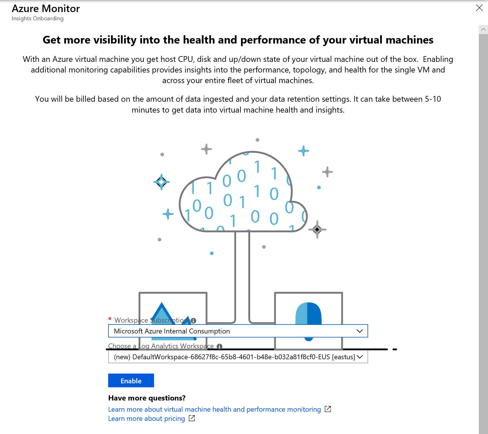
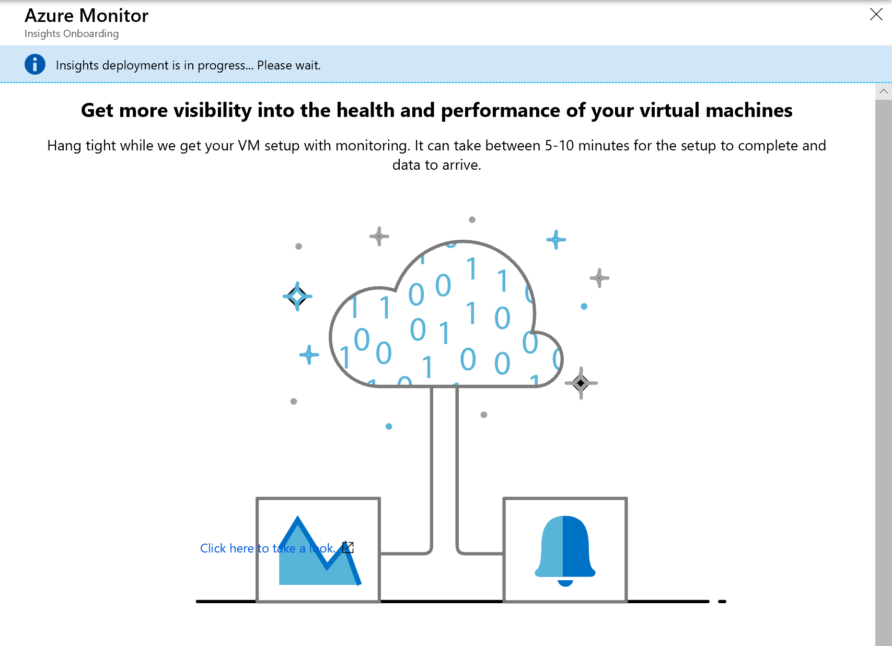

# How to onboard the Azure Monitor VM Insights 
This article describes how to set up VM Insights to monitor the operating system health of your Azure virtual machines and discover and map application dependencies that may be hosted on them.  

## Prerequisites
Before you start, make sure that you have the following as described in the sub-sections below.
  
### Log Analytics 

1. A Log Analytics workspace in the following regions are currently supported:

   - West Central US 
   - East US 
   - Southeast Asia  
   - West Europe  

    If you do not have a workspace, you can you can create it through [Azure Resource Manager](../log-analytics/log-analytics-template-workspace-configuration.md), through [PowerShell](https://docs.microsoft.com/azure/log-analytics/scripts/log-analytics-powershell-sample-create-workspace?toc=%2fpowershell%2fmodule%2ftoc.json), or in the [Azure portal](../log-analytics/log-analytics-quick-create-workspace.md).  

2. The Log Analytics contributor role, to enable the solution. For more information about how to control access to a Log Analytics workspace, see [Manage workspaces](../log-analytics/log-analytics-manage-access.md).

[!INCLUDE [log-analytics-agent-note](../../includes/log-analytics-agent-note.md)]

### Supported Operating Systems

The following versions of the Windows and Linux operating systems are officially supported with VM Insights:

|OS Version |Performance |Maps |Health |  
|-----------|------------|-----|-------|  
|Windows Server 2016 | X | X | X |  
|Windows Server 2012 R2 | X | X | |  
|Windows Server 2012 | X | X | |  
|Windows Server 2008 R2 | X | X| |  
|RHEL 7, 6| X | X| X |  
|Ubuntu 16.04, 14.04 | X | X| X |  
|Cent OS Linux 7, 6 | X | X| X |  
|SLES 12 | X | | X |  
|SLES 11 | X | X | X |  
|Oracle Linux 7 | X | | X |  
|Oracle Linux 6 | X | X | X |  
|Debian 9.4, 8 | X | | X |  

## Enable from the Azure portal
To enable monitoring of your Azure VM in the Azure portal, do the following:

1. In the Azure portal, select **Virtual Machines**. 
2. From the list, select a VM. 
3. On the VM page, in the **Monitoring** section, select **Insights (preview)**.
4. On the **Insights (preview)** page, select **Try VM Insights**.

    

5. On the **Azure Monitor Insights Onboarding** page, if you have an existing Log Analytics workspace in the same subscription, select it in the drop-down list.  

    The list preselects the default workspace and location that the virtual machine is deployed to in the subscription. 

    

>[!NOTE]
>If you want to create a new Log Analytics workspace for storing the monitoring data from the VM, follow the instructions in [Create a Log Analytics workspace](../log-analytics/log-analytics-quick-create-workspace.md). Be sure to create the workspace in the same subscription that the VM is deployed to. 

After you've enabled monitoring, it might take about 15 minutes before you can view health metrics for the virtual machine. 



## Enable with PowerShell
To onboard multiple VMs or VM Scale Sets, you use a provided PowerShell script - [Install-VMInsights.ps1](https://github.com/dougbrad/OnBoardVMInsights/blob/master/Install-VMInsights.ps1) to complete this task.  This script will iterate through every virtual machine and VM Scale Set in your subscription, in the scoped resource group specified by *ResourceGroup*, or to a single VM or Scale Set specified by *Name*.  For each VM or VM Scale Set, the script verifies if the VM extension is already installed, and if not attempt to reinstall it.  Otherwise, it proceeds to install the Log Analytics and Dependency Agent VM extensions.   

This script requires Azure PowerShell module version 5.7.0 or later. Run `Get-Module -ListAvailable AzureRM` to find the version. If you need to upgrade, see [Install Azure PowerShell module](https://docs.microsoft.com/en-us/powershell/azure/install-azurerm-ps). If you are running PowerShell locally, you also need to run `Connect-AzureRmAccount` to create a connection with Azure.

To download the PowerShell script to your local file system, run the following commands:

```posh
$client = new-object System.Net.WebClient
$client.DownloadFile(“https://raw.githubusercontent.com/dougbrad/OnBoardVMInsights/master/Install-VMInsights.ps1”,“Install-VMInsights.ps1”) 
```

To get Help about the script, you can run `Get-Help` to get a list of argument details and example usage.   

```powershell
Get-Help .\Install-VMInsights.ps1 -Detailed

SYNOPSIS
    Configure VM's and VM Scale Sets for VM Insights:
    - Installs Log Analytics VM Extension configured to supplied Log Analytics Workspace
    - Installs Dependency Agent VM Extension

    Can be applied to:
    - Subscription
    - Resource Group in a Subscription
    - Specific VM/VM Scale Set

    Script will show you list of VM's/VM Scale Sets that will apply to and let you confirm to continue.
    Use -Approve switch to run without prompting, if all required parameters are provided.

    If the extensions are already installed will not install again.
    Use -ReInstall switch if you need to for example update the workspace.

    Use -WhatIf if you would like to see what would happen in terms of installs, what workspace configured to, and status of the
    extension.

SYNTAX
    D:\GitHub\OnBoardVMInsights\Install-VMInsights.ps1 [-WorkspaceId] <String> [-WorkspaceKey] <String> [-SubscriptionId]
    <String> [[-ResourceGroup] <String>] [[-Name] <String>] [-ReInstall] [-TriggerVmssManualVMUpdate] [-Approve] [-WhatIf]
    [-Confirm] [<CommonParameters>]

PARAMETERS
    -WorkspaceId <String>
        Log Analytics WorkspaceID (GUID) for the data to be sent to

    -WorkspaceKey <String>
        Log Analytics Workspace primary or secondary key

    -SubscriptionId <String>
        SubscriptionId for the VMs/VM Scale Sets

    -ResourceGroup <String>
        <Optional> Resource Group to which the VMs or VM Scale Sets belong to

    -Name <String>
        <Optional> To install to a single VM/VM Scale Set

    -ReInstall [<SwitchParameter>]
        <Optional> If VM/VM Scale Set is already configured for a different workspace, set this to change to the
        new workspace

    -TriggerVmssManualVMUpdate [<SwitchParameter>]
        <Optional> Set this flag to trigger update of VM instances in a scale set whose upgrade policy is set to
        Manual

    -Approve [<SwitchParameter>]
        <Optional> Gives the approval for the installation to start with no confirmation prompt for the listed VM's/VM Scale Sets

    -WhatIf [<SwitchParameter>]
        <Optional> See what would happen in terms of installs.
        If extension is already installed will show what workspace is currently configured, and status of the VM
        extension

    -Confirm [<SwitchParameter>]
        <Optional> Confirm every action

    <CommonParameters>
        This cmdlet supports the common parameters: Verbose, Debug,
        ErrorAction, ErrorVariable, WarningAction, WarningVariable,
        OutBuffer, PipelineVariable, and OutVariable. For more information, see
        about_CommonParameters (https:/go.microsoft.com/fwlink/?LinkID=113216).

    -------------------------- EXAMPLE 1 --------------------------

    .\Install-VMInsights.ps1 -WorkspaceId <WorkspaceId>-WorkspaceKey <WorkspaceKey> -SubscriptionId
    <SubscriptionId> -ResourceGroup <ResourceGroup>        
```

Example of running:

```powershell
$WorkspaceId = "<GUID>"
$WorkspaceKey = "<Key>"
$SubscriptionId = "<GUID>"
.\Install-VMInsights.ps1 -WorkspaceId $WorkspaceId -WorkspaceKey $WorkspaceKey -SubscriptionId $SubscriptionId -ResourceGroup db-ws

Getting list of VM's or VM ScaleSets matching criteria specified

VM's or VM ScaleSets matching criteria:

db-ws-1 VM running
db-ws2012 VM running

This operation will install the Log Analytics and Dependency Agent extensions on above 2 VM's or VM Scale Sets.
VM's in a non-running state will be skipped.
Extension will not be re-installed if already installed. Use /ReInstall if desired, for example to update workspace

Confirm
Continue?
[Y] Yes  [N] No  [S] Suspend  [?] Help (default is "Y"): y

db-ws-1 : Deploying DependencyAgentWindows with name DAExtension
db-ws-1 : Successfully deployed DependencyAgentWindows
db-ws-1 : Deploying MicrosoftMonitoringAgent with name MMAExtension
db-ws-1 : Successfully deployed MicrosoftMonitoringAgent
db-ws2012 : Deploying DependencyAgentWindows with name DAExtension
db-ws2012 : Successfully deployed DependencyAgentWindows
db-ws2012 : Deploying MicrosoftMonitoringAgent with name MMAExtension
db-ws2012 : Successfully deployed MicrosoftMonitoringAgent

Summary:

Already Onboarded: (0)

Succeeded: (4)
db-ws-1 : Successfully deployed DependencyAgentWindows
db-ws-1 : Successfully deployed MicrosoftMonitoringAgent
db-ws2012 : Successfully deployed DependencyAgentWindows
db-ws2012 : Successfully deployed MicrosoftMonitoringAgent

Connected to different workspace: (0)

Not running - start VM to configure: (0)

Failed: (0)
```

## Next steps
