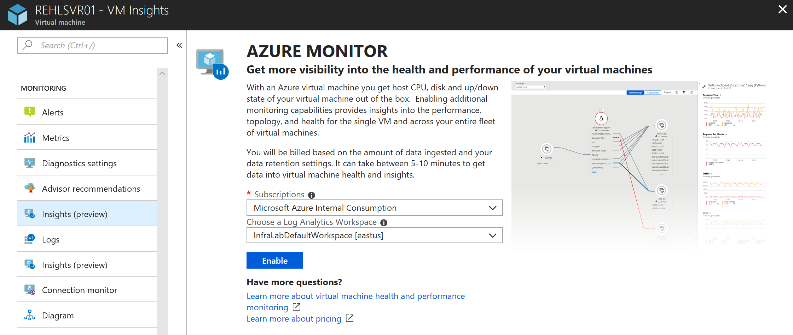

# How to onboard the Azure Monitor VM Insights 
This article describes how to set up VM Insights to monitor the operating system health of your Azure virtual machines and discover and map application dependencies that may be hosted on them.  

## Performance Counters enabled
VM Insights configures a Log Analytics Workspace to collect performance counters used by the solution.  The following table lists the objects and counters configured by the solution and are collected every 60 seconds.

### Windows performance counters

|Object name |Counter name |
|------------|-------------|
|LogicalDisk |% Free Space |
|LogicalDisk |Avg. Disk sec/Read |
|LogicalDisk |Avg. Disk sec/Transfer |
|LogicalDisk |Avg. Disk sec/Write |
|LogicalDisk |Disk Bytes/sec |
|LogicalDisk |Disk Read Bytes/sec |
|LogicalDisk |Disk Reads/sec |
|LogicalDisk |Disk Transfers/sec |
|LogicalDisk |Disk Write Bytes/sec |
|LogicalDisk |Disk Writes/sec |
|LogicalDisk |Free Megabytes |
|Memory |Available Mbytes |
|Network Adapter |Bytes Received/sec | 
|Network Adapter |Bytes Sent/sec | 
|Processor |% Processor Time |

### Linux performance counters

|Object name |Counter name |
|------------|-------------|
|Logical Disk |% Used Space |
|Logical Disk |Disk Read Bytes/sec |
|Logical Disk |Disk Reads/sec |
|Logical Disk |Disk Transfers/sec |
|Logical Disk |Disk Write Bytes/sec |
|Logical Disk |Disk Writes/sec |
|Logical Disk |Free Megabytes |
|Logical Disk |Logical Disk Bytes/sec |
|Memory |Available Mbytes Memory |
|Network |Total Bytes Received |
|Network |Total Bytes Transmitted |
|Processor |% Processor Time |

## Prerequisites
Before you start, make sure that you have the following as described in the sub-sections below.

### Hybrid environment connected sources
VM Insights Map gets its data from the Microsoft Dependency agent. The Dependency agent relies on the Log Analytics agent for its connection to Log Analytics. This means that a system must have the Log Analytics agent installed and configured with the Dependency agent.  The following table describes the connected sources that the Service Map solution supports in a hybrid environment.

| Connected source | Supported | Description |
|:--|:--|:--|
| Windows agents | Yes | In addition to the [Log Analytics agent for Windows](../log-analytics/log-analytics-concept-hybrid.md), Windows agents require the Microsoft Dependency agent. See the [supported operating systems](#supported-operating-systems) for a complete list of operating system versions. |
| Linux agents | Yes | In addition to the [Log Analytics agent for Linux](../log-analytics/log-analytics-concept-hybrid.md), Linux agents require the Microsoft Dependency agent. See the [supported operating systems](#supported-operating-systems) for a complete list of operating system versions. |
| System Center Operations Manager management group | No | |  

On Windows, the Microsoft Monitoring Agent (MMA) is used by both System Center Operations Manager and Log Analytics to gather and send monitoring data. System Center Operations Manager and Log Analytics provide different out-of-the box versions of the agent. These versions can each report to System Center Operations Manager, to Log Analytics, or to both.  

On Linux, the Log Analytics agent for Linux gathers and sends monitoring data to Log Analytics. You can use Map on servers with Log Analytics agents connected directly to the service, or that are reporting to an Operations Manager management group integrated with Log Analytics.  

If your Windows or Linux computers cannot directly connect to the service, you need to configure the Log Analytics agent to connect to Log Analytics using the OMS Gateway. For further information on how to deploy and configure the OMS Gateway, see [Connect computers without Internet access using the OMS Gateway](../log-analytics/log-analytics-oms-gateway.md).  

### Dependency agent
To monitor physical or virtual machines in a hybrid environment with VM Insights Map, you need to install the Dependency agent. The agent can be downloaded from the following location.

| File | OS | Version | SHA-256 |
|:--|:--|:--|:--|
| [InstallDependencyAgent-Windows.exe](https://aka.ms/dependencyagentwindows) | Windows | 9.5.0 | 8B8FE0F6B0A9F589C4B7B52945C2C25DF008058EB4D4866DC45EE2485062C9D7 |
| [InstallDependencyAgent-Linux64.bin](https://aka.ms/dependencyagentlinux) | Linux | 9.5.1 | 09D56EF43703A350FF586B774900E1F48E72FE3671144B5C99BB1A494C201E9E |

### Log Analytics 

A Log Analytics workspace in the following regions are currently supported:

  - West Central US  
  - East US  
  - West Europe  
  - Southeast Asia<sup>1</sup>  

<sup>1</sup> 
This region does not currently support the Health feature of VM Insights.   

If you do not have a workspace, you can you can create it through [Azure Resource Manager](../log-analytics/log-analytics-template-workspace-configuration.md), through [PowerShell](https://docs.microsoft.com/azure/log-analytics/scripts/log-analytics-powershell-sample-create-workspace?toc=%2fpowershell%2fmodule%2ftoc.json), or in the [Azure portal](../log-analytics/log-analytics-quick-create-workspace.md).  

To enable the solution, you need to be a member of the Log Analytics contributor role. For more information about how to control access to a Log Analytics workspace, see [Manage workspaces](../log-analytics/log-analytics-manage-access.md).

[!INCLUDE [log-analytics-agent-note](../../includes/log-analytics-agent-note.md)]

### Supported operating systems

The following versions of the Windows and Linux operating systems are officially supported with VM Insights:

|OS version |Performance |Maps |Health |  
|-----------|------------|-----|-------|  
|Windows Server 2016 | X | X | X |  
|Windows Server 2012 R2 | X | X | |  
|Windows Server 2012 | X | X | |  
|Windows Server 2008 R2 | X | X| |  
|RHEL 7, 6| X | X| X |  
|Ubuntu 16.04, 14.04 | X | X| X |  
|Cent OS Linux 7, 6 | X | X| X |  
|SLES 12 | X | X | X |  
|SLES 11 | X | X | X |  
|Oracle Linux 7 | X | | X |  
|Oracle Linux 6 | X | X | X |  
|Debian 9.4, 8 | X | | X |  

## Diagnostic and usage data
Microsoft automatically collects usage and performance data through your use of the Azure Monitor service. Microsoft uses this data to provide and improve the quality, security, and integrity of the service. To provide accurate and efficient troubleshooting capabilities, data from the Map feature includes information about the configuration of your software, such as operating system and version, IP address, DNS name, and workstation name. Microsoft does not collect names, addresses, or other contact information.

For more information about data collection and usage, see the [Microsoft Online Services Privacy Statement](https://go.microsoft.com/fwlink/?LinkId=512132).

[!INCLUDE [GDPR-related guidance](../../includes/gdpr-dsr-and-stp-note.md)]

## Enable from the Azure portal
To enable monitoring of your Azure VM in the Azure portal, do the following:

1. In the Azure portal, select **Virtual Machines**. 
2. From the list, select a VM. 
3. On the VM page, in the **Monitoring** section, select **Insights (preview)**.
4. On the **Insights (preview)** page, select **Try VM Insights**.

    

5. On the **Azure Monitor Insights Onboarding** page, if you have an existing Log Analytics workspace in the same subscription, select it in the drop-down list.  The list preselects the default workspace and location that the virtual machine is deployed to in the subscription. 

    >[!NOTE]
    >If you want to create a new Log Analytics workspace for storing the monitoring data from the VM, follow the instructions in [Create a Log Analytics workspace](../log-analytics/log-analytics-quick-create-workspace.md). Be sure to create the workspace in the same subscription that the VM is deployed to. 

After you've enabled monitoring, it might take about 10 minutes before you can view health metrics for the virtual machine. 


## Enable with PowerShell
To onboard multiple VMs or VM Scale Sets, you use a provided PowerShell script - [Install-VMInsights.ps1](https://github.com/dougbrad/OnBoardVMInsights/blob/master/Install-VMInsights.ps1) to complete this task.  This script will iterate through every virtual machine and VM Scale Set in your subscription, in the scoped resource group specified by *ResourceGroup*, or to a single VM or Scale Set specified by *Name*.  For each VM or VM Scale Set, the script verifies if the VM extension is already installed, and if not attempt to reinstall it.  Otherwise, it proceeds to install the Log Analytics and Dependency Agent VM extensions.   

This script requires Azure PowerShell module version 5.7.0 or later. Run `Get-Module -ListAvailable AzureRM` to find the version. If you need to upgrade, see [Install Azure PowerShell module](https://docs.microsoft.com/powershell/azure/install-azurerm-ps). If you are running PowerShell locally, you also need to run `Connect-AzureRmAccount` to create a connection with Azure.

To download the PowerShell script to your local file system, run the following commands:

```posh
$client = new-object System.Net.WebClient
$client.DownloadFile(“https://raw.githubusercontent.com/dougbrad/OnBoardVMInsights/master/Install-VMInsights.ps1”,“Install-VMInsights.ps1”) 
```

To get Help about the script, you can run `Get-Help` to get a list of argument details and example usage.   

```powershell
Get-Help .\Install-VMInsights.ps1 -Detailed

SYNOPSIS
    Configure VM's and VM Scale Sets for VM Insights:
    - Installs Log Analytics VM Extension configured to supplied Log Analytics Workspace
    - Installs Dependency Agent VM Extension

    Can be applied to:
    - Subscription
    - Resource Group in a Subscription
    - Specific VM/VM Scale Set

    Script will show you list of VM's/VM Scale Sets that will apply to and let you confirm to continue.
    Use -Approve switch to run without prompting, if all required parameters are provided.

    If the extensions are already installed will not install again.
    Use -ReInstall switch if you need to for example update the workspace.

    Use -WhatIf if you would like to see what would happen in terms of installs, what workspace configured to, and status of the
    extension.

SYNTAX
    D:\GitHub\OnBoardVMInsights\Install-VMInsights.ps1 [-WorkspaceId] <String> [-WorkspaceKey] <String> [-SubscriptionId]
    <String> [[-ResourceGroup] <String>] [[-Name] <String>] [-ReInstall] [-TriggerVmssManualVMUpdate] [-Approve] [-WhatIf]
    [-Confirm] [<CommonParameters>]

PARAMETERS
    -WorkspaceId <String>
        Log Analytics WorkspaceID (GUID) for the data to be sent to

    -WorkspaceKey <String>
        Log Analytics Workspace primary or secondary key

    -SubscriptionId <String>
        SubscriptionId for the VMs/VM Scale Sets

    -ResourceGroup <String>
        <Optional> Resource Group to which the VMs or VM Scale Sets belong to

    -Name <String>
        <Optional> To install to a single VM/VM Scale Set

    -ReInstall [<SwitchParameter>]
        <Optional> If VM/VM Scale Set is already configured for a different workspace, set this to change to the
        new workspace

    -TriggerVmssManualVMUpdate [<SwitchParameter>]
        <Optional> Set this flag to trigger update of VM instances in a scale set whose upgrade policy is set to
        Manual

    -Approve [<SwitchParameter>]
        <Optional> Gives the approval for the installation to start with no confirmation prompt for the listed VM's/VM Scale Sets

    -WhatIf [<SwitchParameter>]
        <Optional> See what would happen in terms of installs.
        If extension is already installed will show what workspace is currently configured, and status of the VM
        extension

    -Confirm [<SwitchParameter>]
        <Optional> Confirm every action

    <CommonParameters>
        This cmdlet supports the common parameters: Verbose, Debug,
        ErrorAction, ErrorVariable, WarningAction, WarningVariable,
        OutBuffer, PipelineVariable, and OutVariable. For more information, see
        about_CommonParameters (https:/go.microsoft.com/fwlink/?LinkID=113216).

    -------------------------- EXAMPLE 1 --------------------------

    .\Install-VMInsights.ps1 -WorkspaceId <WorkspaceId>-WorkspaceKey <WorkspaceKey> -SubscriptionId
    <SubscriptionId> -ResourceGroup <ResourceGroup>        
```

Example of running:

```powershell
$WorkspaceId = "<GUID>"
$WorkspaceKey = "<Key>"
$SubscriptionId = "<GUID>"
.\Install-VMInsights.ps1 -WorkspaceId $WorkspaceId -WorkspaceKey $WorkspaceKey -SubscriptionId $SubscriptionId -ResourceGroup db-ws

Getting list of VM's or VM ScaleSets matching criteria specified

VM's or VM ScaleSets matching criteria:

db-ws-1 VM running
db-ws2012 VM running

This operation will install the Log Analytics and Dependency Agent extensions on above 2 VM's or VM Scale Sets.
VM's in a non-running state will be skipped.
Extension will not be re-installed if already installed. Use /ReInstall if desired, for example to update workspace

Confirm
Continue?
[Y] Yes  [N] No  [S] Suspend  [?] Help (default is "Y"): y

db-ws-1 : Deploying DependencyAgentWindows with name DAExtension
db-ws-1 : Successfully deployed DependencyAgentWindows
db-ws-1 : Deploying MicrosoftMonitoringAgent with name MMAExtension
db-ws-1 : Successfully deployed MicrosoftMonitoringAgent
db-ws2012 : Deploying DependencyAgentWindows with name DAExtension
db-ws2012 : Successfully deployed DependencyAgentWindows
db-ws2012 : Deploying MicrosoftMonitoringAgent with name MMAExtension
db-ws2012 : Successfully deployed MicrosoftMonitoringAgent

Summary:

Already Onboarded: (0)

Succeeded: (4)
db-ws-1 : Successfully deployed DependencyAgentWindows
db-ws-1 : Successfully deployed MicrosoftMonitoringAgent
db-ws2012 : Successfully deployed DependencyAgentWindows
db-ws2012 : Successfully deployed MicrosoftMonitoringAgent

Connected to different workspace: (0)

Not running - start VM to configure: (0)

Failed: (0)
```
## Enable for Hybrid environment
This section explains how to onboard virtual machines or physical computers hosted in your datacenter or other cloud environment for monitoring by VM Insights.  

The VM Insights Map Dependency agent does not transmit any data itself, and it does not require any changes to firewalls or ports. The data in Map is always transmitted by the Log Analytics agent to the Azure Monitor service, either directly or through the [OMS Gateway](../log-analytics/log-analytics-oms-gateway.md) if your IT security policies do not allow computers on the network to connect to the Internet.

Review the requirements and deployment methods for the [Log Analytics Linux and Windows agent](../log-analytics/log-analytics-concept-hybrid.md).

Summarized steps:

1. Install Log Analytics Agent for Windows or Linux
2. Install VM Insights Dependency agent
3. Enable collection of performance counters
4. Onboard VM Insights solution

### Install the Dependency agent on Windows 
The Dependency agent can be installed manually on Windows computers by running  `InstallDependencyAgent-Windows.exe`. If you run this executable file without any options, it starts a setup wizard that you can follow to install interactively.  

>[!NOTE]
>Administrator privileges are required to install or uninstall the agent.

The following table highlights the specific parameters supported by setup for the agent from the command line.  

| Parameter | Description |
|:--|:--|
| /? | Returns a list of the command-line options. |
| /S | Perform a silent installation with no user interaction. |

For example, to run the installation program with the `/?` parameter, type `InstallDependencyAgent-Windows.exe /?`

Files for the Windows Dependency agent are installed in `C:\Program Files\Microsoft Dependency Agent` by default.  If the Dependency agent fails to start after setup is complete, check the logs for detailed error information. The log directory is `%Programfiles%\Microsoft Dependency Agent\logs`. 

### Install the Dependency agent on Linux
The Dependency agent is installed on Linux servers from `InstallDependencyAgent-Linux64.bin`, a shell script with a self-extracting binary. You can run the file by using `sh` or add execute permissions to the file itself.

>[!NOTE]
> Root access is required to install or configure the agent.
> 

| Parameter | Description |
|:--|:--|
| -help | Get a list of the command-line options. |
| -s | Perform a silent installation with no user prompts. |
| --check | Check permissions and the operating system but do not install the agent. |

For example, to run the installation program with the `-help` parameter, type `InstallDependencyAgent-Linux64.bin -help`.

Install the Linux Dependency agent as root by running the following command, `sh InstallDependencyAgent-Linux64.bin`
    
If the Dependency agent fails to start, check the logs for detailed error information. On Linux agents, the log directory is `/var/opt/microsoft/dependency-agent/log`.

Files for the Dependency agent are placed in the following directories:

| Files | Location |
|:--|:--|
| Core files | /opt/microsoft/dependency-agent |
| Log files | /var/opt/microsoft/dependency-agent/log |
| Config files | /etc/opt/microsoft/dependency-agent/config |
| Service executable files | /opt/microsoft/dependency-agent/bin/microsoft-dependency-agent<br>/opt/microsoft/dependency-agent/bin/microsoft-dependency-agent-manager |
| Binary storage files | /var/opt/microsoft/dependency-agent/storage |

### Onboard the solution
This method includes a JSON template that specifies the configuration to enable the solution components to your Log Analytics workspace.  

If you are unfamiliar with the concept of deploying resources by using a template, see:
* [Deploy resources with Resource Manager templates and Azure PowerShell](../azure-resource-manager/resource-group-template-deploy.md)
* [Deploy resources with Resource Manager templates and the Azure CLI](../azure-resource-manager/resource-group-template-deploy-cli.md) 

If you choose to use the Azure CLI, you first need to install and use the CLI locally. You must be running the Azure CLI version 2.0.27 or later. To identify your version, run `az --version`. If you need to install or upgrade the Azure CLI, see [Install the Azure CLI](https://docs.microsoft.com/cli/azure/install-azure-cli). 

#### Create and execute a template

1. Copy and paste the following JSON syntax into your file:

    ```json
    {

    "$schema": "https://schema.management.azure.com/schemas/2015-01-01/deploymentTemplate.json#",
    "contentVersion": "1.0.0.0",
    "parameters": {
        "WorkspaceName": {
            "type": "string"
        },
        "WorkspaceLocation": {
            "type": "string"
        }
    },
    "resources": [
        {
            "apiVersion": "2017-03-15-preview",
            "type": "Microsoft.OperationalInsights/workspaces",
            "name": "[parameters('WorkspaceName')]",
            "location": "[parameters('WorkspaceLocation')]",
            "resources": [
                {
                    "apiVersion": "2015-11-01-preview",
                    "location": "[parameters('WorkspaceLocation')]",
                    "name": "[concat('ServiceMap', '(', parameters('WorkspaceName'),')')]",
                    "type": "Microsoft.OperationsManagement/solutions",
                    "dependsOn": [
                        "[concat('Microsoft.OperationalInsights/workspaces/', parameters('WorkspaceName'))]"
                    ],
                    "properties": {
                        "workspaceResourceId": "[resourceId('Microsoft.OperationalInsights/workspaces/', parameters('WorkspaceName'))]"
                    },

                    "plan": {
                        "name": "[concat('ServiceMap', '(', parameters('WorkspaceName'),')')]",
                        "publisher": "Microsoft",
                        "product": "[Concat('OMSGallery/', 'ServiceMap')]",
                        "promotionCode": ""
                    }
                },
                {
                    "apiVersion": "2015-11-01-preview",
                    "location": "[parameters('WorkspaceLocation')]",
                    "name": "[concat('InfrastructureInsights', '(', parameters('WorkspaceName'),')')]",
                    "type": "Microsoft.OperationsManagement/solutions",
                    "dependsOn": [
                        "[concat('Microsoft.OperationalInsights/workspaces/', parameters('WorkspaceName'))]"
                    ],
                    "properties": {
                        "workspaceResourceId": "[resourceId('Microsoft.OperationalInsights/workspaces/', parameters('WorkspaceName'))]"
                    },
                    "plan": {
                        "name": "[concat('InfrastructureInsights', '(', parameters('WorkspaceName'),')')]",
                        "publisher": "Microsoft",
                        "product": "[Concat('OMSGallery/', 'InfrastructureInsights')]",
                        "promotionCode": ""
                    }
                }
            ]
        }
    ]
    ```

2. Save this file as **installsolutionsforvminsights.json ** to a local folder.
3. Edit the values for **WorkspaceName**, **ResourceGroupName**, and **WorkspaceLocation**.  The value for **WorkspaceName** is the is the full resource ID of your Log Analytics workspace, which includes the workspace name, and the value for **WorkspaceLocation** is the region the workspace is defined in.
4. You are ready to deploy this template using the following PowerShell command:

    ```powershell
    New-AzureRmResourceGroupDeployment -Name DeploySolutions -TemplateFile InstallSolutionsForVMInsights.json -ResourceGroupName ResourceGroupName> -WorkspaceName <WorkspaceName> -WorkspaceLocation <WorkspaceLocation - example: eastus>
    ```

    The configuration change can take a few minutes to complete. When it's completed, a message is displayed that's similar to the following and includes the result:

    ```powershell
    provisioningState       : Succeeded
    ```
After you've enabled monitoring, it might take about 10 minutes before you can view health state and metrics for the hybrid computer. 

## Next steps

With monitoring enabled for your virtual machine, this information is available for analysis with VM Insights.  To learn how to use the health feature, see [View Azure VM health](monitoring-vminsights-health.md), or to view discovered application dependencies, see [View VM Insights Map](monitoring-vminsights-maps.md).  