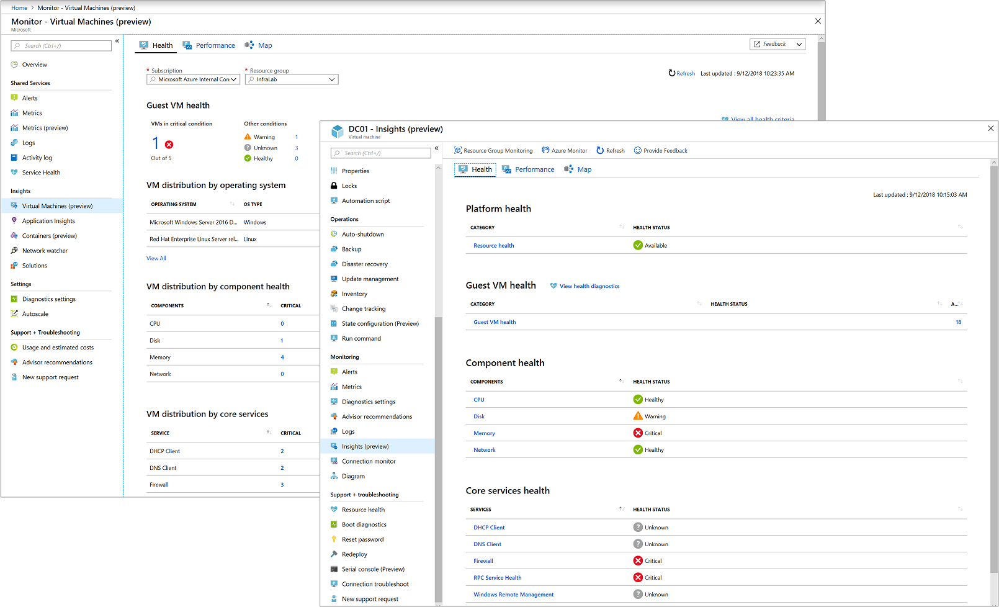

# What is Azure Monitor for VMs?

Azure Monitor for VMs monitors your Azure virtual machines (VM) at scale by analyzing the performance and health of your Windows and Linux VMs, including their different processes and interconnected dependencies on other resources and external processes. The solution includes support for monitoring performance and application dependencies for VMs hosted on-premises or another cloud provider.  It includes three key features to deliver this in-depth insight:

* Logical components of Azure VMs running Windows and Linux operating system are measured based on a set of pre-configured health criteria and alerts when the evaluated condition is met.  ​
* Core performance metrics from processor, memory, disk, and network adapter of the guest VM operating system are collected and presented in pre-defined trending performance charts.
* Dependency map showing the discovered interconnected components with that VM from multiple resource groups and subscriptions.  

These features are organized into three perspectives:

* Health
* Performance
* Map

>[!NOTE]
>Currently, the Health feature is only offered for Azure virtual machines.
>

Integration with Log Analytics delivers powerful aggregation, filtering, and ability to perform trend analysis of the data over time. The comprehensive monitoring of your workloads can't be achieved alone with Azure Monitor, Service Map, or Log Analytics.  

You can view this data in the context of single VM from the virtual machine directly, or with Azure Monitor it delivers an aggregated view of your VMs based on the following perspective for each feature:

* Health - VMs related to a resource group
* Map and Performance - VMs configured to report to a specific Log Analytics workspace

DevOps can effectively deliver predictable performance and availability of vital applications by identifying critical operating system events and performance bottlenecks, network issues, and understand if an issue is related to other dependencies.  

## Data usage 

As soon as you onboard Azure Monitor for VMs, data collected by your VMs is ingested and stored in Azure Monitor.  Azure Monitor for VMs is billed for the data ingested and retained, number of health criteria metric time-series monitored, alert rules created, notifications sent, per pricing published on the Azure Monitor [pricing page](https://azure.microsoft.com/pricing/details/monitor/)

The log size varies based on string lengths of counters and can increase with the number of logical disks and network adapters.  If you already have a workspace and are collecting these counters, there will not be any duplicate charges applied.  If you are already using Service Map, the only change you’ll see is the additional connection data being sent to Azure Monitor.​

## Next steps
Review [Onboard Azure Monitor for VMs](monitoring-vminsights-onboard.md) to understand requirements and methods to enable monitoring of your virtual machines.
