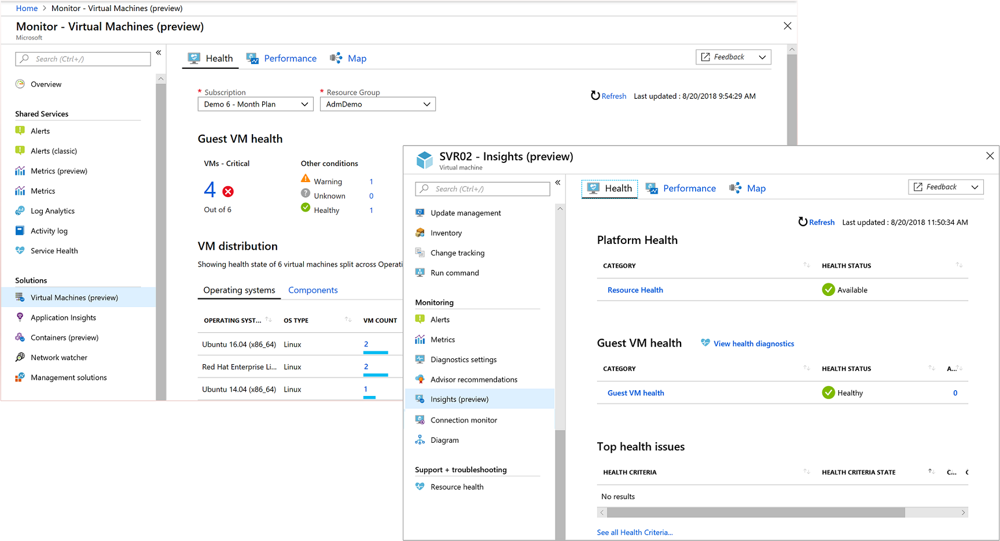

## Overview of Azure Monitor VM insights

Azure Monitor VM insights monitors your Azure virtual machines (VM) at scale by analyzing the performance and health of your Windows and Linux VMs, including their different processes and interconnected dependencies on other resources and external processes. It includes three key features to deliver this in-depth insight:
​
* Core performance metrics from processor, memory, disk, and network adapter of the guest VM operating system are collected and presented in pre-defined trending performance charts.
* Dependency map showing the discovered interconnected components with that VM from multiple resource groups and subscriptions.
* Logical components of Azure VMs running Windows and Linux operating system are measured based on a set of pre-configured health criteria and alerts when the evaluated condition is met.

Viewing this information about your virtual machines is organized into three perspectives:

* Health
* Performance
* Maps

Integration with Log Analytics delivers powerful aggregation, filtering, and ability to perform trend analysis of the data over time. The comprehensive monitoring of your workloads can't be achieved alone with Azure Monitor, Service Maps, or Log Analytics.  

You can view this data in the context of single instance of the VM from the virtual machine directly, and as an aggregated view of all VMs in your subscription from Azure Monitor. 

DevOps can effectively deliver predictable performance and availability of vital applications by identifying critical operating system events and performance bottlenecks, network issues, and understand if an issue is related to other dependencies.  

## Data usage 

As soon as you onboard the solution, data collected by your VMs is ingested and stored in Azure Log Analytics.  Pricing for Log Analytics can be found [here](https://azure.microsoft.com/pricing/details/log-analytics/) if you are new to the service and unfamiliar with the cost. 

The cost of data can be considerable depending on the following factors: 
* Number of systems you are collecting from and the collection frequency
* Type of data created by the source.  In this case, performance metrics, virtual machine process identity information, and detailed connection events.
* The period data is retained in the workspace

Based on our testing with the default configuration of the solution, the following table provides an estimate of data consumption.

|Data type | Estimated data generated |
|----------|--------------------------|
|Performance |0.5 GB /month at 60 second interval |
|Maps |1.2 GB /month for connection and identity data |
|Average Graph Store ingested data | 471 MB per VM /month|

The log size varies based on string lengths of counters and can increase with the number of logical disks and network adapters.  If you already have a workspace and are collecting these counters, there will not be any duplicate charges applied.  If you are already using Service Map, the only change you’ll see is the additional connection data being sent to Log Analytics.​

