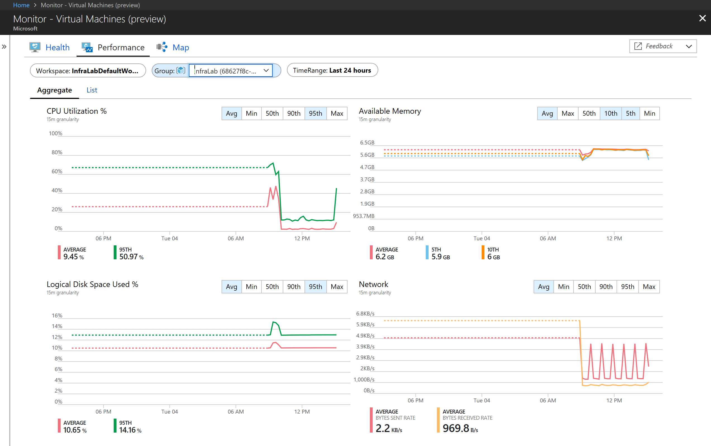
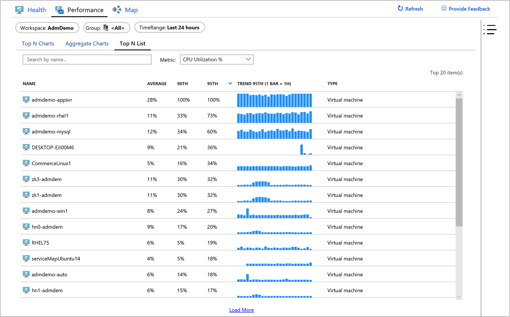
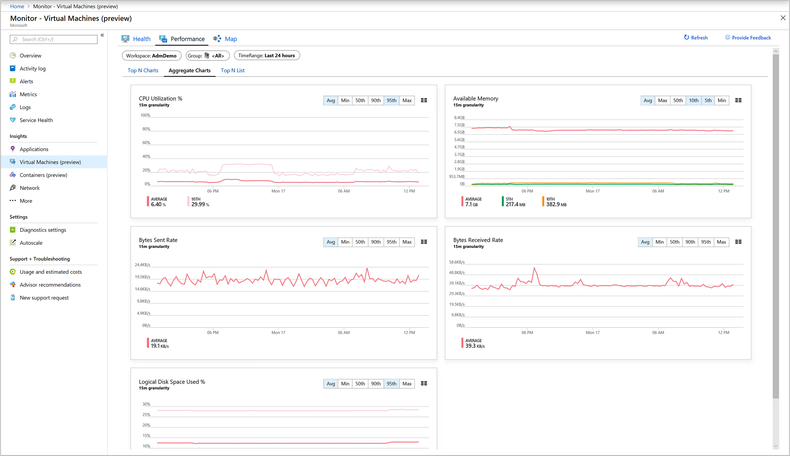
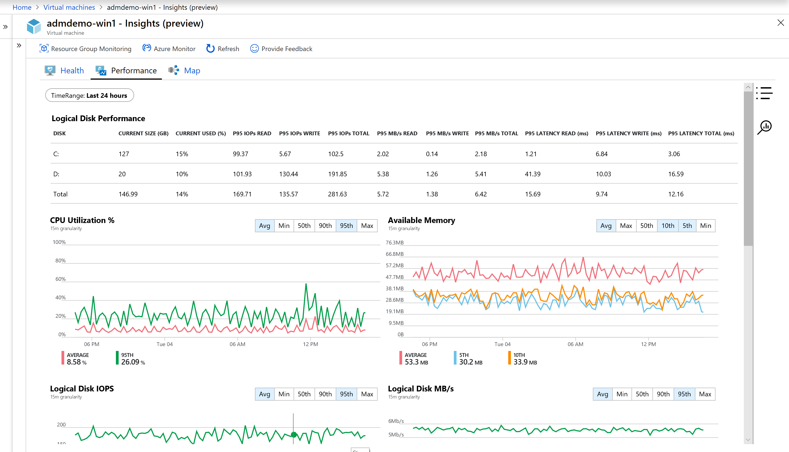

# How to chart performance with Azure Monitor for VMs
Azure Monitor for VMs includes a set of performance charts that target several key performance indicators (KPIs) to help you determine how well a virtual machine is performing. The charts show resource utilization over a period of time so you can identify bottlenecks, anomalies, or switch to a perspective listing each machine to view resource utilization based on the metric selected. While there are numerous elements to consider when dealing with performance, Azure Monitor for VMs is focused on the operating system as manifested through the processor, memory, network adapters, and disks. Performance complements the health monitoring feature and helps expose issues that indicate a possible system component failure, support tuning and optimization to achieve efficiency, or support capacity planning.  

## Multi-VM perspective from Azure Monitor
From Azure Monitor, the Performance feature provides a multi-virtual machine view of all monitored VMs deployed across resource groups in your subscriptions or in your environment.  To access from Azure Monitor, perform the following. 

1. In the Azure portal, select **Monitor**. 
2. Choose **Virtual Machines (preview)** in the **Solutions** section.
3. Select the **Performance** tab.

On the **Top N Charts** tab, if you have more than one Log Analytics workspace, choose the one that is integrated with the solution from the **Workspace** selector at the top of the page.  You then select from the **Group** selector, a subscription, resource group, or specific machine, over a specified period of time.  By default, the charts show the last 24 hours.  Using the **TimeRange** selector, you can query for historical time ranges of up to 30 days to show how performance looked in the past.   

The five capacity utilization charts shown on the page are:

* CPU Utilization % - shows the top 5 machines with the highest average processor utilization 
* Available Memory - shows the top 5 machines with the lowest average amount of available memory 
* Logical Disk Space Used % - shows the top 5 machines with the highest average disk space used % across all disk volumes 
* Bytes Sent Rate - shows the top 5 machines with highest average of bytes sent 
* Bytes Receive Rate - shows the top 5 machines with highest average of bytes sent 

Clicking on the upper right-hand corner of any one of the five charts will open **Top N List** view.  Here you see the resource utilization for that performance metric by individual VM in a list view and which machine is trending highest.  

When you click on the virtual machine, the **Properties** pane is expanded on the right to show the properties of the item selected, such as system information reported by the operating system, properties of the Azure VM, etc. Clicking on one of the options under the **Quick Links** section will redirect you to that feature directly from the selected VM.  

Switch to the **Aggregated Charts** tab to view the performance metrics filtered by average or percentiles measures.  

The following capacity utilization charts are provided:

* CPU Utilization % - defaults showing the average and top 95th percentile 
* Available Memory - defaults showing the average, top 5th and 10th percentile 
* Logical Disk Space Used % - defaults showing the average and 95th percentile 
* Bytes Sent Rate - defaults showing average bytes sent 
* Bytes Receive Rate - defaults showing average bytes received

You can also change the granularity of the charts within the time range by selecting **Avg**, **Min**, **Max**, **50th**, **90th**, and **95th** in the percentile selector.   

To view the resource utilization by individual VM in a list view and see which machine is trending with highest utilization, select the **Top N List** tab.  The **Top N List** page shows the top 20 machines sorted by the most utilized by 95th percentile for the metric *CPU Utilization %*.  You can see more machines by selecting **Load More**, and the results expand to show the top 500 machines. 

>[!NOTE]
>The list cannot show more than 500 machines at a time.  
>

To filter the results on a specific virtual machine in the list, enter its computer name in the **Search by name** textbox.  

If you would rather view utilization from a different performance metric, from the **Metric** drop-down list select **Available Memory**, **Logical Disk Space Used %**, **Network Received Byte/s**, or **Network Sent Byte/s** and the list updates to show utilization scoped to that metric.  

Selecting a virtual machine from the list opens the **Properties** panel on the right-side of the page and from here you can select **Performance detail**.  The **Virtual Machine Detail** page opens and is scoped to that VM, similar in experience when accessing VM Insights Performance directly from the Azure VM.  

## View performance directly from an Azure VM
To access directly from a virtual machine, perform the following.

1. In the Azure portal, select **Virtual Machines**. 
2. From the list, choose a VM and in the **Monitoring** section choose **Insights (preview)**.  
3. Select the **Performance** tab. 

This page not only includes performance utilization charts, but also a table showing for each logical disk discovered, its capacity, utilization, and total average by each measure.  

The following capacity utilization charts are provided:

* CPU Utilization % - defaults showing the average and top 95th percentile 
* Available Memory - defaults showing the average, top 5th and 10th percentile 
* Logical Disk Space Used % - defaults showing the average and 95th percentile 
* Logical Disk IOPS - defaults showing the average and 95th percentile
* Logical Disk MB/s - defaults showing the average and 95th percentile
* Max Logical Disk Used % - defaults showing the average and 95th percentile
* Bytes Sent Rate - defaults showing average bytes sent 
* Bytes Receive Rate - defaults showing average bytes received

## Next steps
To learn how to use the health feature, see [View Azure Monitor for VMs Health](monitoring-vminsights-health.md), or to view discovered application dependencies, see [View Azure Monitor for VMs Map](monitoring-vminsights-maps.md). 