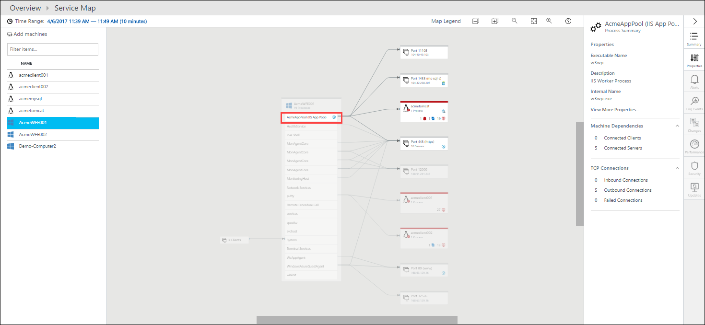

# Self-paced demo - Service Map
This is a self-paced demo that walks through using the [Service Map solution](monitoring-service-map.md) in Azure to identify and diagnose a simulated problem in a web application. Service Map automatically discovers application components on Windows and Linux systems and maps the communication between services. It also consolidates data collected by other services and solutions to assist you in analyzing performance and identifying issues. You also use [log searches in Log Analytics](../log-analytics/log-analytics-log-searches.md) to drill down on collected data in order to identify the root problem.

## Scenario description
You've just received a notification that the ACME Customer Portal application is having performance issues. The only information that you have is that these issues started about 4:00 am PST today. You aren't entirely sure of all the components that the portal is dependent on other than a set of web servers. 

## Components and features used
- [Service Map solution](monitoring-service-map.md)
- [Log Analytics log searches](../log-analytics/log-analytics-log-searches.md)

## Walkthrough

### 1. Connect to the OMS Experience Center
This walk through uses the [Operations Management Suite Experience Center](https://experience.mms.microsoft.com/), which provides a complete Log Analytics environment with sample data. Start by following this link, provide your information and then select the **Insight and Analytics** scenario.

### 2. Start Service Map
Start the Service Map solution by clicking on the **Service Map** tile.

The Service Map console is displayed. In the left pane is a list of computers in your environment with the Service Map agent installed. You select the computer that you want to view from this list.

### 3. View computer
You know that the web servers are called AcmeWFE001 and AcmeWFE002, so this seems like a reasonable place to start. Click on **AcmeWFE001**. This displays the map for AcmeWFE001 and all of its dependencies. You can see which processes are running on the selected computer and which external services they communicate with.

You're concerned about the performance of the web application so click on the **AcmeAppPool (IIS App Pool)** process. This displays the details for this process and highlights its dependencies. 

### 4. Change time window

You heard that the problem started at 4:00 AM so let's have a look at what was happening at that time. Click on **Time Range** and change the time to 4:00 AM PST (keep the current date and adjust for your local time zone) with a duration of 20 minutes.

### 5. View alert

You now see that the **acmetomcat** dependency has an alert displayed, so that's the potential problem. Click on the alert icon in **acmetomcat** to show the details for the alert. You can see that you have critical CPU utilization and can expand it for more detail. This is probably what's causing the slow performance. 

### 6. View performance

Let's have a closer look at **acmetomcat**. Click in the top right of **acmetomcat** and select **Load Server Map** to show the detail and dependencies for this machine. You can then look a bit more into those performance counters to verify your suspicion. Select the **Performance** tab to display the [performance counters collected by Log Analytics](../log-analytics/log-analytics-data-sources-performance-counters.md) over the time range. You can see that you're getting periodic spikes in the processor and memory.

### 7. View change tracking
Let's see if we can find out what might have caused this high utilization. Click on the **Summary** tab. This provides information that Log Analytics has collected from the computer such as failed connections, critical alerts, and software changes. Sections with relevant recent information should already be expanded, and you can expand other sections to inspect information that they contain.

If **Change Tracking** isn't already open, then expand it. This shows information collected by the [Change Tracking solution](../log-analytics/log-analytics-change-tracking.md). It looks like there was a software change made during this time window. Click on **Software** to get details. A backup process was added to the machine just after 4:00 AM, so this appears to be the culprit for the excessive resources being consumed.

### 8. View details in Log Search
You can further verify by looking at the detailed performance information collected in the Log Analytics workspace. Click on the **Alerts** tab again and then on one of the **High CPU** alerts. Click on **Show in Log Search**. This opens the Log Search window where you can perform [log searches](../log-analytics/log-analytics-log-searches.md) against any data stored in the workspace. Service Map already filled in a query for us to retrieve the alert we're interested in. 

### 9. Open saved search
Let's see if we can get some more detail on the performance collection that generated this alert and verify your suspicion that the problems are caused by that backup process. Change the time range to **6 hours**. Then click on **Favorites** and scroll down to the saved searches for **Service Map**. You created these queries specifically for this analysis. Click on **Top 5 Processes by CPU for acmetomcat**.

This query returns a list of the top 5 processes consuming processor on **acmetomcat**. You can inspect the query to get an introduction to the query language used for log searches. If you're interested in the processes on other computers, you could modify the query to retrieve that information.

In this case, you can see that the backup process is consistently consuming about 60% of the app server’s CPU. It's obvious that this new process is responsible for your performance problem. Your solution would obviously be to remove this new backup software off the application server. You could actually use Desired State Configuration (DSC) managed by Azure Automation to define policies that ensure this process never runs on these critical systems.

## Summary points
- [Service Map](monitoring-service-map.md) provides you with a view of your entire application even if you don't know all of its servers and dependencies.
- Service Map surfaces data collected by other management solutions to help you identify issues with your application and its underlying infrastructure.
- [Log searches](../log-analytics/log-analytics-log-searches.md) allow you to drill down into specific data collected in the Log Analytics workspace.  

## Next steps
- Learn more about [Service Map](monitoring-service-map.md).
- [Deploy and configure](monitoring-service-map-configure.md) Service Map.
- Learn about [Log Analytics](../log-analytics/log-analytics-overview.md), which is required for Service Map and stores operational data stored by agents.