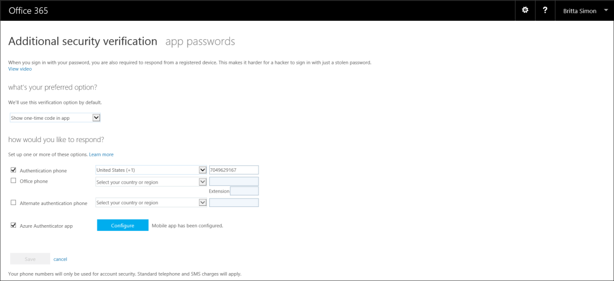
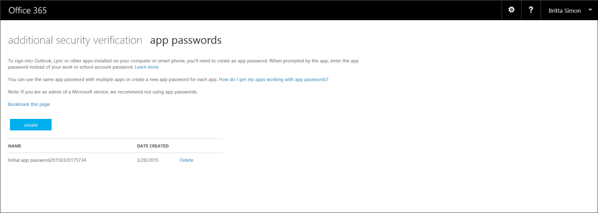

<properties 
	pageTitle="Create app passwords in the Office 365 portal for Azure Multi-Factor Authentication" 
	description="This page shows users how they can create additional app passwords in the Office 365 portal." 
	services="multi-factor-authentication" 
	documentationCenter="" 
	authors="billmath" 
	manager="terrylan" 
	editor="bryanla"/>

<tags 
	ms.service="multi-factor-authentication" 
	ms.workload="identity" 
	ms.tgt_pltfrm="na" 
	ms.devlang="na" 
	ms.topic="article" 
	ms.date="06/02/2015" 
	ms.author="billmath"/>

# Create app passwords in the Office 365 portal for Azure Multi-Factor Authentication

[What does multi-factor-authentication mean to me?](multi-factor-authenticatio-end-user.md)  
[Signing in for the first time](multi-factor-authentication-end-user-first-time.md) 
[Sign in experience](multi-factor-authentication-end-user-signin.md) 
[Help with app passwords](multi-factor-authentication-end-user-app-passwords.md) 
[Managing your settings](multi-factor-authentication-end-user-manage-settings.md)

If you use multi-factor authentication with Office 365 you will want to create app passwords through the Office 365 portal.

## To create app passwords in the Office 365 portal
--------------------------------------------------------------------------------

<ol>
<li>Sign-in to the Office 365 portal</li>
<li>In the top right corner select the settings widget</li>
<li>On the left, select Additional Security Verification</li>

<li>On the right, select **Update my phone numbers used for account security**</li>
<li>On the proofup page, at the top, select app passwords</li>

<li>Click **Create**</li>

<li>Enter a name for the app password and click **Next**</li>
<li>Copy the app password to the clipboard and paste it into your app.</li>

