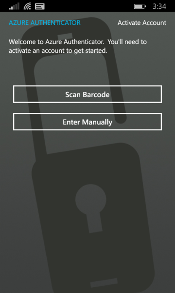

<properties 
	pageTitle="Use mobile app as your contact method with Azure MFA" 
	description="This page will show users how to use the mobile app as the primary contact method for Azure MFA." 
	services="multi-factor-authentication" 
	documentationCenter="" 
	authors="billmath" 
	manager="terrylan" 
	editor="bryanla"/>

<tags 
	ms.service="multi-factor-authentication" 
	ms.workload="identity" 
	ms.tgt_pltfrm="na" 
	ms.devlang="na" 
	ms.topic="article" 
	ms.date="06/02/2015" 
	ms.author="billmath"/>

# Use mobile app as your contact method with Azure Multi-Factor Authentication

[What does multi-factor-authentication mean to me?](multi-factor-authenticatio-end-user.md)  
[Signing in for the first time](multi-factor-authentication-end-user-first-time.md) 
[Sign in experience](multi-factor-authentication-end-user-signin.md) 
[Help with app passwords](multi-factor-authentication-end-user-app-passwords.md) 
[Managing your settings](multi-factor-authentication-end-user-manage-settings.md)

The following will walk you through setting up multi-factor authentication to use your mobile app as your primary contact method.

## To use a mobile app as your contact method
<ol>
<li>Select Mobile App from the drop-down.</li>

<li>Select either Notification or One-time password and click Set up</li>
<li>On the phone that has the Azure Authenticator app installed, launch the app and click scan barcode.</li>

<li>Scan the barcode picture that came up with the configure mobile app screen.  Click Done to close the barcode screen.  If you cannot get the barcode to scan you can enter the information manually.</li>

<li>On the phone, it will begin to activate, once this has completed click Contact me.  This will send either a notification or a verification code to your phone.  Click verify.</li>

<li>Click close.  At this point, your verification should be successful.</li>
<li>Now it is recommended that enter your mobile phone number in case you lose access to your mobile app.
<li>Specify your country from the drop-down and enter your mobile phone number in the box next to country.  Click Next.</li>
<li>At this point, you have setup your contact method and now it is time to setup app passwords for non-browser apps such as Outlook 2010 or older. If you do not use these apps click **Done**.  Otherwise continue to the next step.</li>

<li>If you are using these apps then copy the app password provided and paste the password into your non-browser application. For steps on individual applications such as Outlook and Lync see How to change the password in your email to the app password and How to change the password in your application to the app password.</li>
<li>Click Done.</li>

