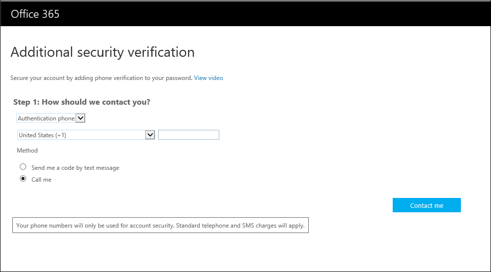

<properties 
	pageTitle="Azure Multi-Factor Authentication - End Users Guide" 
	description="This is the Azure Multi-factor authentication page that will assist your end users with getting going with Azure Multi-Factor Authentication." 
	services="multi-factor-authentication" 
	documentationCenter="" 
	authors="billmath" 
	manager="terrylan" 
	editor="bryanla"/>

<tags 
	ms.service="multi-factor-authentication" 
	ms.workload="identity" 
	ms.tgt_pltfrm="na" 
	ms.devlang="na" 
	ms.topic="article" 
	ms.date="06/02/2015" 
	ms.author="billmath"/>

# Manage your settings in the Office 365 portal

[End User Guide - Home](multi-factor-authenticatio-end-user.md)  
[Signing in for the first time](multi-factor-authentication-end-user-first-time.md) 
[Sign in experience](multi-factor-authentication-end-user-signin.md) 
[Managing your settings](multi-factor-authentication-end-user-manage-settings.md) 
[Help with app passwords](multi-factor-authentication-end-user-app-passwords.md)

If you use multi-factor authentication with Office 365 you will want to manage your additional security verification settings through the Office 365 portal.

## To access additional security verification settings in the Office 365 portal

<ol>

<li>Log on to the Office 365 portal.</li>
<li>At the top, click the icon that looks like a little cog. This will display a drop-down that says Office 365 settings.</li>

<li>Click on the Office 365, settings. This will open the settings page.</li>
<li>On the left, click additional security verification.</li>

<li>On the right, click the link that says Update my phone numbers used for account security.  This will redirect you to a new page.  You will have to verify how you are again using either your phone or the mobile app</li>
<li>Once this completes you should be on the proof-up page and you can change your settings.</li>

**Additional Resources**

* [How it Works](multi-factor-authentication-how-it-works.md)
* [Getting Started](multi-factor-authentication-get-started.md)
* [Whats Next](multi-factor-authentication-whats-next.md)
* [Learn More](multi-factor-authentication-learn-more.md)
* [End User Guide](multi-factor-authentication-end-user.md)
* [MFA Operations Guide](multi-factor-authentication-operations.md)
* [Azure Multi-Factor Authentication on MSDN](htts://msdn.microsoft.com/library/azure/dn249471.aspx)