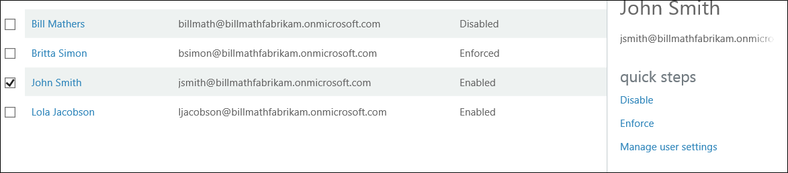
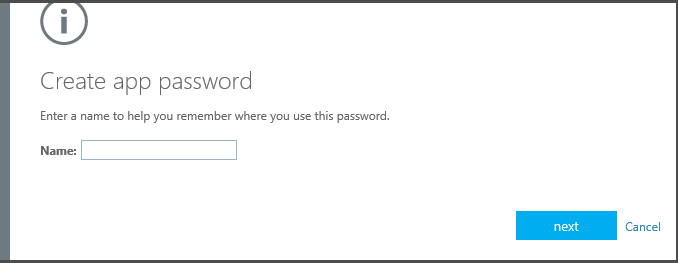

<properties 
	pageTitle="Getting started with Azure Multi-Factor Authentication in the cloud" 
	description="This is the Azure Multi-Factor authentication page that describes how to get started with Azure MFA in the cloud." 
	services="multi-factor-authentication" 
	documentationCenter="" 
	authors="billmath" 
	manager="terrylan" 
	editor="bryanla"/>

<tags 
	ms.service="multi-factor-authentication" 
	ms.workload="identity" 
	ms.tgt_pltfrm="na" 
	ms.devlang="na" 
	ms.topic="article" 
	ms.date="06/02/2015" 
	ms.author="billmath"/>

# Getting started with Azure Multi-Factor Authentication in the cloud

Now that we have determined that we are using cloud multi-factor authentication, let's get going!  Please note that if you are using Multi-Factor Authentication for Office 365 or Multi-Factor Authentication for Azure Administrators you can skip to step 3.

Step|Description|
:------------- | :------------- | 
1. Sign up for an Azure subscription|If you do not already have an Azure subscription, you need to sign-up for one. If you are just starting out and exploring using Azure MFA you can use a trial subscription
2. Create a Multi-Factor Auth Provider or assign an Azure AD Premium or Enterprise Mobility Suite license to users|You will need to either create an Azure Multi-Factor Auth Provider and assign it to your directory or assign licenses to your Azure AD Premium or EMS users. Azure Multi Factor Authentication is included in Azure Active Directory Premium and as a result it is also included with the Enterprise Mobility Suite. If you have Azure AD Premium or EMS you do not need to create a Multi-Factor Auth Provider, rather to enable MFA for an Azure AD Premium or EMS user, an Azure AD Premium or EMS license needs to be assigned to that user and then an Administrator can assign MFA to the user through the management portal. See the section below on how to assign licenses to users.
3. Turn on Multi-Factor Authentication for your users|Enable Azure MFA on your users either through the Office 365 or Azure portal. See the section below for information on how to do this.
4. Send email to end users to notify them about MFA|Once a user has had multi-factor authentication turned on for their account, it is recommended that you send them an email notifying them of this. The user will be prompted to complete the process the next time they sign-in, so this lets them no what to expect. See the section below for an example email template.
5. Have a user sign-in and complete the registration process|The next time a user signs in they will have to complete the registration process. You can include a link to the End User guide along with the email you sent in step 4 so that they are familiar with the process and know what to expect.
6. Configure app passwords for non-mfa aware apps| After the registration process has been completed, users can setup application passwords for applications that are not multi-factor authentication aware. This is required because these apps do not support multi-factor authentication and you will be unable to use them unless an app password is configured.

## Creating an Azure Multi-Factor Auth Provider
Multi-factor authentication is available by default for global administrators who have a Azure Active Directory tenant. However, if you wish to extend multi-factor authentication to all of your users and/or want to your global administrators to be able to take advantage features such as the management portal, custom greetings, and reports, then you must purchase and configure an Multi-Factor Authentication Provider.

### To create a Multi-Factor Authentication Provider
--------------------------------------------------------------------------------

1. Log on to the Azure Portal as an Administrator.
2. On the left, select Active Directory.
3. On the Active Directory page, at the top, select Multi-Factor Authentication Providers. Then at the bottom, click **New**.
4. Under App Services, select Active Auth Providers, and select Quick Create.
5. Fill in the following fields and select Create.
	1. Name – The name of the Active Auth Provider.
	2. Usage Model – The usage model of the Multi-Factor Authentication Provider.
		- Per Authentication – purchasing model that charges per authentication. Typically used for scenarios that use the Azure Multi-Factor Authentication in an application.
		- Per Enabled User – purchasing model that charges per enabled user. Typically used for scenarios such as Office 365.
	2. Directory – The Azure Active Directory tenant that the Multi-Factor Authentication Provider is associated with. Please be aware of the following:
		- You do not need an Azure AD directory to create a Multi-Factor Auth Provider.  This can be left blank if planning to use the Azure Multi-Factor Authentication Server or SDK only.
		- You will need to associate the Multi-Factor Auth Provider with an Azure AD directory if you wish to extend multi-factor authentication to all of your users and/or want your global administrators to be able to take advantage features such as the management portal, custom greetings, and reports.
		- DirSync or AAD Sync are only a requirement if you are synchronizing your on-premises Active Directory environment with an Azure AD directory.  If you only use an Azure AD directory that is not synchronized with an on-premises instance of Active Directory, you do not need DirSync or AAD Sync.
		

5. Once you click create, the Multi-Factor Authentication Provider will be created and you should see a message stating: Successfully created Multi-Factor Authentication Provider. Click Ok.

	 
## Assigning an Azure AD Premium or Enterprise Mobility license to users

If you have Azure AD Premium or the Enterprise Mobility Suite, you do not need to create a Multi-Factor Auth provider.  You need to simply assign a user a license and then you can begin turning on mfa for users.

### To assign an Azure AD Premium or Enterprise Mobilitiy Suite License
--------------------------------------------------------------------------------

1. Sign-in to the Azure Portal as an Administrator.
2. On the left, select **Active Directory**.
3. On the Active Directory page, double-click on the directory that has the users you wish to enable.
4. At the top of the directory page, select **Licenses**.
5. On the Licenses page, select Active Directory Premium or Enterprise Mobility Suite, and then click **Assign**.
6. 4.In the dialog box, select the users you want to assign licenses to, and then click the check mark icon to save the changes.

## Turn-on multi-factor authentication for users

User accounts in Azure Multi-Factor Authentication have the following three distinct states:

State | Description |Non-browser apss affected| Notes 
:-------------: | :-------------: |:-------------: |:-------------: |
Disabled | The default state for a new user not enrolled in multi-factor authentication.|No|The user is currently not using multi-factor authentication.
Enabled |The user has been enrolled in multi-factor authentication.|No.  They will continue to work until the registration process is completed.|The user is enabled but has not completed the registration process. They will be prompted to complete the process at next sign-in.
Enforced|The user has been enrolled and has completed the registration process for using multi-factor authentication.|Yes.  They will not work until app passwords are created and used. | The user may or may not have completed registration. If they have completed the registration process then they are using multi-factor authentication. Otherwise, the user will be prompted to completer the process at next sign-in
Now that we have either an Auth provider or have assigned our users a licenses, the next step is to turn mfa on for the users in the directory.  Use the following procedure to enable mfa for you users.

### To turn on multi-factor authentication
--------------------------------------------------------------------------------
1.  Sign-in to the Azure Management Portal as an Administrator.
2.  On the left, click Active Directory.
3.  Under, Directory click on the directory for the user you wish to enable.
4.  At the top, click Users.
5.  At the bottom of the page, click Manage Multi-Factor Auth.
6.  Find the user that you wish to enable for multi-factor authentication. You may need to change the view at the top. Ensure that the user’s status is disabled and place a check in the box next to their name.
7.  This will bring up two options on the right, Enable and Manage user settings. Click Enable. This will bring up a pop-up that will specify the next steps you need to take with your users. Click enable multi-factor auth.
8.  Once you have enabled your users, it is advised that you send your users an email that informs them how they can use their non-browser apps and not be locked out.

To change the user's state using Windows PowerShell, you can use the following.  You can change `$st.State` to equal one of the states mentioned above.

		$st = New-Object -TypeName Microsoft.Online.Administration.StrongAuthenticationRequirement
		$st.RelyingParty = "*"
		$st.State = “Enabled”
		$sta = @($st)
		Set-MsolUser -UserPrincipalName bsimon@contoso.com -StrongAuthenticationRequirements $sta

## Send email to end users

Once you have enabled your users, it is advised that you send your users an email that informs them that they will need to provide there contact information. The following is an email template that can be used which includes a link to a video that the users can watch.

		Subject: ACTION REQUIRED: Your password for Outlook and other apps needs updated

		Body:

		For added security, we have enabled multi-factor authentication for your account. 

		Action Required: You will need to complete the enrollment steps below to make your account secure with multi-factor authentication.  

		What to expect once MFA is enabled:

		Multi-factor authentication requires a password that you know and a phone that you have in order to sign into browser applications and to access Office 365, Azure portals.

		For Office 365 non-browser applications such as outlook, lync, a mail client on your mobile device etc, a special password called an app password is required instead of your account password to sign in. App passwords are different than your account password, and are generated during the multi-factor authentication set up process. 

		Please follow these enrollment steps to avoid interruption of your Office 365 service:

			1.  Sign in to the Office 365 Portal at http://portal.microsoftonline.com.
			2.  Follow the instructions to set up your preferred multi-factor authentication method when signing into Office 365 using a web browser. 
			3.  Create one app password for each device.
			4.  Enter the same app password in all applicable apps on that device e.g. Outlook, Mail client, Lync, Word, Powerpoint, Excel, CRM etc. 
			5.  Update your Office client applications or other mobile applications to use an app password.

		You can visit http://aka.ms/mfasetup to create app passwords or change your MFA Setting.  Please bookmark this.

		NOTE: Before entering an app password, you will need to clear the sign-in information (delete sign-in info), restart the application,   and sign-in with the username and app password. Follow the steps documented : http://technet.microsoft.com/library/dn270518.aspx#apppassword.

		Watch a video showing these steps at http://g.microsoftonline.com/1AX00en/175.

		Best Regards,
		Your Administrator

## Configure app passwords

Certain non-browser apps, such as the Apple native email client that uses EAS, currently do not support multi-factor authentication. Multi-factor authentication is enabled per user. This means that if a user has been enabled for multi-factor authentication and they are attempting to use non-browser apps, they will be unable to do so. An app password allows this to occur. 

An app password, is a password that is created within the Azure portal that allows the user to by-pass the multi-factor authentication and continue to use their application.

Some important things to keep in mind regarding app passwords:

- Users can have multiple app passwords which increases the surface area for theft. Since app passwords are hard to remember, it might encourage people to write this down. This is not recommended and should be discouraged because only one factor is required to login with app password.
- Apps which cache passwords and use it in on-premise scenarios might start failing since the app password will not be known outside of the organizational id. An example is Exchange emails that are on-premise but the archived mail is in the cloud. The same password will not work.
- The actual password is automatically generated and is not supplied by the user. This is because the automatically generated password, is harder for an attacker to guess and is more secure.
- Currently there is a limit of 40 passwords per user. You will be prompted to delete told to delete one of your existing app passwords in order to create a new one.
- It is recommended that app password names should reflect the device on which they will be used. For instance, if you have a laptop that has non-browser apps, you only need to create one app password named Laptop and use that app password in all of these applications. Although you can create separate passwords for all of these applications, it is not recommended. The recommend way is to use one app password per device.

### App password information for federated users

If your organization has setup federation between your on-premises AD environment and Azure AD then the following is important information that you should be aware when using app passwords. This applies only to federated(SSO) customers.

- The App Password is verified by Azure AD and hence by-passes federation. Federation is only actively used when setting up App Password.
- For federated(SSO) users, we will never go to the Identity Provider (IdP) unlike the passive flow. The passwords will be stored in the organizational id. If the user leaves the company, that info has to flow to organizational id using DirSync in real time. Account disable/deletion may take up to 3 hours to sync, delaying disable/deletion of App Password in Azure AD.
- On-premises Client Access Control settings are not honored by App Password
- No on-premises authentication logging / auditing capability is available for App Password
- More end-user education is required for the Microsoft Lync 2013 client. For the required steps, see How to change the password in your email to the app password.
- Certain advanced architectural designs may require using a combination of organizational username and passwords and app passwords when using multi-factor authentication with clients, depending on where they authenticate. For clients that authenticate against an on-premise infrastructure, you would use an organizational username and password. For clients that authenticate against Azure AD, you would use the app password.

	For example, suppose you have an architecture that consists of the following:

	- You are federating your on-premise instance of Active Directory with Azure AD
	- You are using Exchange online
	- You are using Lync that is specifically on-premise
	- You are using Azure Multi-Factor Authentication

In these instances, you must do the following:
	
- When signing-in to Lync, use your organizations’ username and password.
- When attempting to access the address book via an Outlook client that connects to Exchange online, use an app password.

### Allowing app password creation
By default, users cannot create app passwords.  This feature must be enabled.  To allow users the ability to create app passwords use the following procedure.

### To allow users to create app passwords
--------------------------------------------------------------------------------
1.  Sign-in to the Azure Management Portal as an administrator.
2.  On the left, click Active Directory.
3.  Under, Directory click on the directory for the user you wish to enable.
4.  At the top, click Users.
5.  At the bottom of the page, click **Manage Multi-Factor Auth**.
6.  At the top of the multi-factor authentication page, click **Service Settings**.
7.  Ensure that the radio button next to Allow users to create app passwords to sign into non-browser applications is selected.

### Creating app passwords
Users can create app passwords during their initial registration.  They are given an option at the end of the registration process that allows them to create them.

Additionally users can also create app passwords later on by changing their settings in the Azure Portal, the Office 365 portal or by 

### To create app passwords in the Office 365 portal
--------------------------------------------------------------------------------

1. Sign-in to the Office 365 portal
2. In the top right corner select the settings widget
3. On the left, select Additional Security Verification
4. On the right, select **Update my phone numbers used for account security**
5. On the proofup page, at the top, select app passwords
6. Click **Create**
7. Enter a name for the app password and click **Next**
8. Copy the app password to the clipboard and paste it into your app.

### To create app passwords in the Azure portal
--------------------------------------------------------------------------------
1. Sign-in to the Azure Management portal
3. At the top, right-click on your user name and select Additional Security Verification.
5. On the proofup page, at the top, select app passwords
6. Click **Create**
7. Enter a name for the app password and click **Next**
8. Copy the app password to the clipboard and paste it into your app.

### To create app passwords if you do not have an Office 365 or Azure subscription
--------------------------------------------------------------------------------
1. Sign-in to [https://myapps.microsoft.com](https://myapps.microsoft.com)	
2. At the top, select profile.
3. Click on your user name and select Additional Security Verification.
5. On the proofup page, at the top, select app passwords
6. Click **Create**
7. Enter a name for the app password and click **Next**
8. Copy the app password to the clipboard and paste it into your app.

