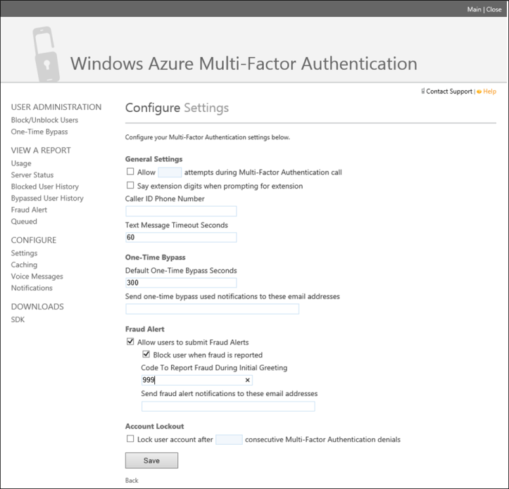

<properties 
		pageTitle="Azure Multi-Factor Authentication Fraud Alert" 
	description="This describes how to use the Azure Multi-Factor Authentication feature - fraud alert." 
	services="multi-factor-authentication" 
	documentationCenter="" 
	authors="billmath" 
	manager="terrylan" 
	editor="bryanla"/>

<tags 
	ms.service="multi-factor-authentication" 
	ms.workload="identity" 
	ms.tgt_pltfrm="na" 
	ms.devlang="na" 
	ms.topic="article" 
	ms.date="06/02/2015" 
	ms.author="billmath"/>

# Fraud Alert in Azure Multi-Factor Authentication
Fraud alert can be configured and setup so that your users can report fraudulent attempts to access their resources.

## To setup and configure fraud alert

1. Log on to http://azure.microsoft.com
2. On the left, select Active Directory.
3. At the top select Multi-Factor Auth Providers. This will bring up a list of your Multi-Factor Auth Providers.
4. If you have more than one Multi-Factor Auth Provider, select the one you wish to enable fraud alerting on and click Manage at the bottom of the page. If you have only one, just click Manage. This will open the Azure Multi-Factor Authentication Management Portal.
5. On the Azure Multi-Factor Authentication Management Portal, on the left, click Settings.
6. Under the Fraud Alert section, place a check in Allow users to submit Fraud Alerts.
7. If you want users to be blocked when fraud is reported, place a check in Block user when fraud is reported.
8. In the box under Code To Report Fraud During Initial Greeting enter a number code that can be used during call verification. If a user enters this code, instead of the # sign, then a fraud alert will be reported.
9. At the bottom, click Save.

## To report fraud alert
Fraud alert can be reported two ways.  Either through the mobile app or through the phone.  

### To report fraud alert with the mobile app
<ol>
<li>When a verification is sent to your phone click on it and it will start the Multi-Factor Authentication app.</li>
<li>To report fraud, click the Cancel and Report Fraud. This will bring up a box that says your organizations IT</li> Support staff will be notified. Click report fraud.
<li>On the app, click Close.</li>

### To report fraud alert with the phone
<ol>
<li>When a verification call comes in to your phone answer it.</li>
<li>To report fraud, enter the code that has been configured to correspond with reporting fraud via the phone and then the # sign. You will be notified that a fraud alert has been submitted.</li>
<li>End the call.</li>

## To view the fraud report

1. Log on to http://azure.microsoft.com
2. On the left, select Active Directory.
3. At the top select Multi-Factor Auth Providers. This will bring up a list of your Multi-Factor Auth Providers.
4. If you have more than one Multi-Factor Auth Provider, select the one you wish to view the fraud alert report and click Manage at the bottom of the page. If you have only one, just click Manage. This will open the Azure Multi-Factor Authentication Management Portal.
5. On the Azure Multi-Factor Authentication Management Portal, on the left, under View A Report, click Fraud Alert.
6. Specify the date range that you wish to view in the report. Also you can specify any specific usernames, phone numbers and the users status.
7. Click Run. This will bring up a report similar to the one below. You can also click Export to CSV if you wish to export the report.
