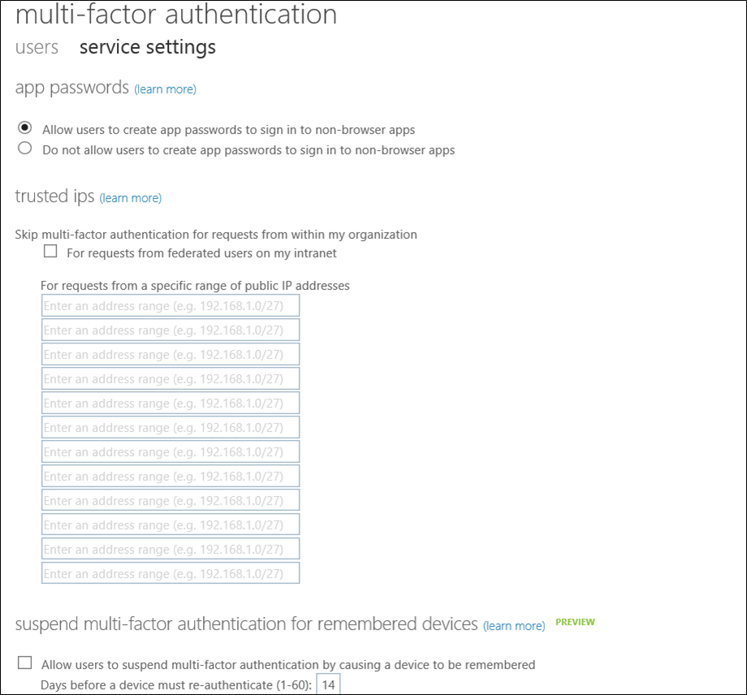

<properties 
	pageTitle="Azure Multi-Factor Authentication Trusted IPs" 
	description="This describes how to use the Azure Multi-Factor Authentication feature - trusted IPs."  
	services="multi-factor-authentication" 
	documentationCenter="" 
	authors="billmath" 
	manager="terrylan" 
	editor="bryanla"/>

<tags 
	ms.service="multi-factor-authentication" 
	ms.workload="identity" 
	ms.tgt_pltfrm="na" 
	ms.devlang="na" 
	ms.topic="article" 
	ms.date="06/02/2015" 
	ms.author="billmath"/>

# Trusted IPs in Azure Multi-Factor Authentication

Trusted IPs is a feature of multi-factor authentication that allows administrators of a managed or federated tenant the ability to bypass multi-factor authentication for users that are signing in from the company’s local intranet. The features are available for Azure AD tenants that have Azure AD Premium, Enterprise Mobility Suite or Azure Multi-Factor Authentication licenses.

 
Type of Azure AD Tenant| Available Trusted IP options
:------------- | :------------- | 
Managed|Specific IP address ranges – Administrators can specify a range of IP addresses that can bypass multi-factor authentication for users that are signing in from the company’s intranet..
Federated|<li>All Federated Users - All federated users who are signing-in from inside the organization will bypass multi-factor authentication using a claim issued by AD FS.</li><li>Specific IP address ranges – Administrators can specify a range of IP addresses that can bypass multi-factor authentication for users that are signing in from the company’s intranet.

This bypass only works from inside a company’s intranet. So for example, if you only selected all federated users, and a user signs in from outside the company’s intranet, that user will have to authenticate using multi-factor authentication even if the user presents an AD FS claim. The following table describes when multi-factor authentication and app passwords are required inside your corpnet and outside your corpnet when Trusted IPs is enabled.

|Trusted IPs enabled| Trusted IPs disabled
:------------- | :------------- | :------------- | 
Inside corpnet|For browser flows multi-factor authentication NOT required.|For browser flows, multi-factor authentication required
|For rich client apps, regular passwords will work if the user has not created any app passwords. Once an app password has been created, app passwords are required.|For rich client apps, app passwords required
Outside corpnet|For browser flows, multi-factor authentication required.|For browser flows, multi-factor authentication required.
|For rich client apps, app passwords required.|For rich client apps, app passwords required.

## To enable Trusted IPs

 
<ol>
<li>Sign-in to the Azure Management Portal.</li>
<li>On the left, click Active Directory.</li>
<li>Under, Directory click on the directory you wish to setup Trusted IPsing on.</li>
<li>On the Directory you have selected, click Configure.</li>
<li>In the multi-factor authentication section, click Manage service settings.</li>
<li>On the Service Settings page, under Trusted IPs, select either:
<ul>
<li>For requests from federated users originating from my intranet – All federated users who are signing in from the corporate network will bypass multi-factor authentication using a claim issued by AD FS. 

<li>For requests from a specific range of public IPs – enter the IP addresses in the boxes provided using CIDR notation. For example: xxx.xxx.xxx.0/24 for IP addresses in the range xxx.xxx.xxx.1 – xxx.xxx.xxx.254, or xxx.xxx.xxx.xxx/32 for a single IP address. You can enter up to 12 IP address ranges.</li></ul>

<li>Click save.</li>
<li>Once the updates have been applied, click close.</li>
 
