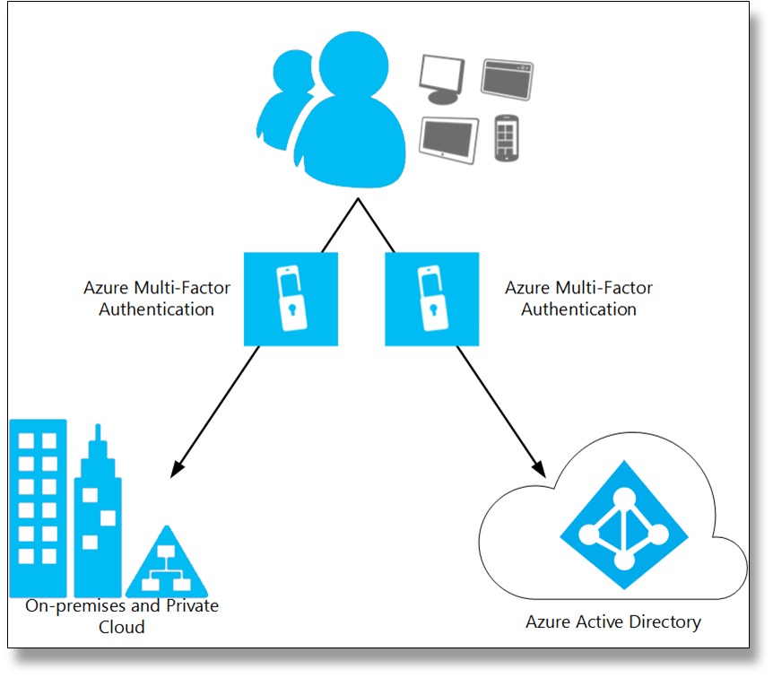
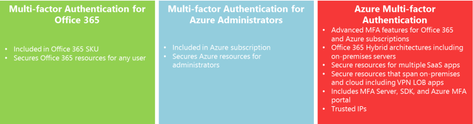

<properties 
	pageTitle="What is Azure Multi-Factor Authentication?" 
	description="Learn about Azure Multi-Factor Authentication and how it can benefit you and your organization." 
	services="multi-factor-authentication" 
	documentationCenter="" 
	authors="billmath" 
	manager="terrylan" 
	editor="lisatoft"/>

<tags 
	ms.service="multi-factor-authentication" 
	ms.workload="identity" 
	ms.tgt_pltfrm="na" 
	ms.devlang="na" 
	ms.topic="article" 
	ms.date="03/02/2015" 
	ms.author="billmath"/>

<h1 id="whatiswamfa">What is Azure Multi-Factor Authentication?</h1>

Multi-factor or two-factor authentication is a method of authentication that requires the use of more than one verification method and adds a critical second layer of security to user sign-ins and transactions. It works by requiring any two or more of the following verification methods: 

* Something you know (typically a password)
* Something you have (a trusted device that is not easily duplicated, like a phone)
* Something you are (biometrics)

The security of multi-factor authentication lies in its layered approach. Compromising multiple authentication factors presents a significant challenge for attackers. Even if an attacker manages to learn the user's password, it is useless without also having possession of the trusted device. Conversely, if the user happens to lose the device, the finder of that device won't be able to use it unless he or she also knows the user's password.
Azure Multi-Factor Authentication is the multi-factor authentication service that requires users to also verify sign-ins using a mobile app, phone call or text message. It is available to use with Azure Active Directory, to secure on-premise resources with the Azure Multi-Factor Authentication Server, and with custom applications and directories using the SDK. 

<h3>Securing cloud Azure Active Directory</h3>

Enable Multi-Factor Authentication for Azure AD identities, and users will be prompted to set up additional verification the next time they sign in. Use Multi-Factor Authentication to secure access to Azure, Microsoft Online Services like Office 365 and Dynamics CRM Online, as well as 3rd party cloud services that integrate Azure AD with no additional set up. Multi-factor authentication can be rapidly enabled for large numbers of global users and applications.  [Learn more](http://msdn.microsoft.com/library/azure/dn249466.aspx)

<h3>Securing on-premises resources and Active Directory</h3>

Enable Multi-Factor Authentication for your on-premise resources such as IIS and Active Directory using the Azure Multi-Factor Authentication Server.  The Azure Multi-Factor Authentication Server allows the administrator integrate with IIS authentication to secure Microsoft IIS web applications, RADIUS authentication, LDAP authentication, and Windows authentication.  [Learn more](http://msdn.microsoft.com/library/azure/dn249467.aspx)
<h3>Securing custom applications</h3>

An SDK enables direct integration with your cloud services. Build Active Authentication phone call and text message verification into your application's sign-in or transaction processes and leverage your application's existing user database. [Learn more](http://msdn.microsoft.com/library/azure/dn249464.aspx)

<h3>Multi-Factor Authentication for Office 365</h3>

Multi-Factor Authentication for Office 365, powered by Azure Multi-Factor Authentication, works exclusively with Office 365 applications and is managed from the Office 365 portal. So administrators can now secure their Office 365 resources with multi-factor authentication. [Learn more](http://msdn.microsoft.com/library/azure/dn383636.aspx)

<h3>Multi-Factor Authentication for Azure Administrators</h3>

The same subset of Multi-Factor Authentication capabilities for Office 365 will be available at no cost to all Azure administrators. Every administrative account of Azure subscription can now get additional protection by enabling this core multi-factor authentication functionality. So an administrator that wants to access Azure portal to create a VM, a website, manage storage, mobile services or any other Azure Service can add multi-factor authentication to his administrator account.  [Learn more](http://msdn.microsoft.com/library/azure/dn249471.aspx)

<h3>Multi-Factor Authentication feature comparison</h3>

The following shows the versions of multi-factor authentication that are available and a brief summary of the features it provides. You can use this in determining which version of multi-factor authentication is right for you. [Learn more](http://msdn.microsoft.com/library/azure/dn249471.aspx)

**Additional Resources**

* [Sign up for Azure as an organization](/manage/services/identity/organizational-account/)
* [Azure Identity](/manage/windows/fundamentals/identity/)
* [Azure Multi-Factor Authentication Library](http://technet.microsoft.com/library/dn249471.aspx)

