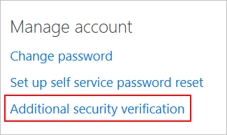
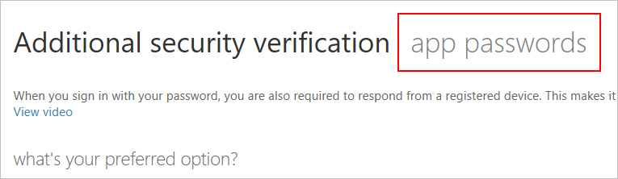
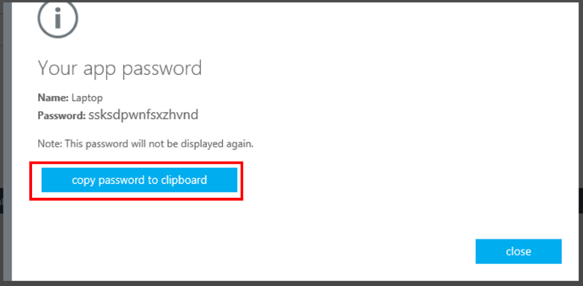

# What are App Passwords in Azure Multi-Factor Authentication?
Certain non-browser apps, such as the Apple native email client that uses Exchange Active Sync, currently do not support multi-factor authentication. Multi-factor authentication is enabled per user. This means that if a user has been enabled for multi-factor authentication and they are attempting to use non-browser apps, they will be unable to do so. An app password allows this to occur.

Once you have an app password, you use this in place of your original password with these non-browser apps. This is because when you register for two-step verification, you're telling Microsoft not to let anyone sign in with your password if they can't also perform the second verification. The Apple native email client on your phone can't sign in as you because it can't ask for two-step verification. The solution for this is to create a more secure app password that you don't use day-to-day, but only for those apps that can't support two-step verification. Use the app password so that apps can bypass multi-factor authentication and continue to work.

> [!NOTE]
> Office 2013 clients (including Outlook) support new authentication protocols and can be used with two-step verification.  This means that once enabled, app passwords are not required for use with Office 2013 clients.  For more information, see [Office 2013 modern authentication public preview announced](https://blogs.office.com/2015/03/23/office-2013-modern-authentication-public-preview-announced/).

## How to use app passwords
The following are some things to remember on how to use app passwords.

* You don't create your own app passwords. Instead, they are automatically generated. Since you only have to enter the app password once per app, it's safer to use a more complex, automatically generated password rather than making one that you can remember.
* Currently there is a limit of 40 passwords per user. If you attempt to create one after you have reached the limit, you will be prompted to delete one of your existing app passwords before you create a new one.
* You should use one app password per device, not per application. For example, you can create one app password for your laptop and use that app password for all of your applications on that laptop. Then, create a second app password to use for all your apps on your desktop. 
* You are given one app password the first time you register for two-step verification.  If you need additional ones, you can create them.

## Creating and deleting app passwords
During your initial sign-in you are given an app password that you can use.  Additionally you can also create and delete app passwords later on.  How you do this depends on how you use multi-factor authentication. Answer the following questions to determine where you should go to manage app passwords: 

1. Do you use two-step verification for your personal Microsoft account? If yes, you should refer to the [App passwords and two-step verification](https://support.microsoft.com/help/12409/microsoft-account-app-passwords-two-step-verification) article for help. If no, continue to question two.

2. Ok, so you use two-step verification for your work or school account. Do you use it to sign in to Office 365 apps? If yes, you should refer to [Create an app password for Office 365](https://support.office.com/article/Create-an-app-password-for-Office-365-3e7c860f-bda4-4441-a618-b53953ee1183) for help. If no, continue to question three. 

3. Do you use two-step verification with Microsoft Azure? If yes, continue to the [Manage app passwords in the Azure portal](#manage-app-passwords-in-the-Azure-portal) section of this article. If no, continue to question four.

4. Not sure where you use two-step verification? Continue to the [Manage app passwords with the MyApps portal](#manage-app-passwords-with-the-myapps-portal) section of this article. 

## Manage app passwords in the Azure portal
If you use two-step verification with Azure, you want to create app passwords through the Azure portal.

### To create app passwords in the Azure portal
1. Sign in to the Azure classic portal.
2. At the top, right-click your user name and select Additional Security Verification.
3. On the proofup page, at the top, select app passwords
4. Click **Create**.
5. Enter a name for the app password and click **Next**
6. Copy the app password to the clipboard and paste it into your app.
   
   

### To delete app passwords in the Azure portal
1. Sign in to the Azure classic portal.
2. At the top, right-click your user name and select Additional Security Verification.
3. At the top, next to additional security verification, select **app passwords.**
4. Next to the app password you want to delete, select **Delete**.
5. Confirm the deletion by clicking **yes**.
6. Once the app password is deleted, you can click **close**.

## Manage app passwords with the MyApps portal.
If you are not sure how you use multi-factor authentication, then you can always create and delete app passwords through the myapps portal.

### To create an app password using the Myapps portal
1. Sign in to [https://myapps.microsoft.com](https://myapps.microsoft.com)
2. Click your name at the top right, and choose **Profile**.
3. Select **Additional Security Verification**.
   

4. Select **app passwords**.
   

5. Click **Create**.
6. Enter a name for the app password and click **Next**.
7. Copy the app password to the clipboard and paste it into your app.
   

### To delete an app password using the Myapps portal
1. Sign in to [https://myapps.microsoft.com](https://myapps.microsoft.com)
2. At the top, select profile.
3. Select **Additional Security Verification**.

   

4. Select **app passwords**.

   

5. Next to the app password you want to delete, click **Delete**.

   

6. Confirm that you want to delete that password by clicking **yes**.
7. Once the app password is deleted, you can click **close**.

## Next steps

- [Manage your two-step verification settings](multi-factor-authentication-end-user-manage-settings.md)

- Try out the [Microsoft Authenticator app](microsoft-authenticator-app-how-to.md) to verify your sign-ins with app notifications, instead of receiving texts or calls. 
