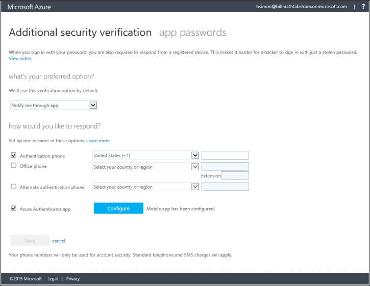

# Manage your settings for two-step verification
This article answers questions about how to update settings for two-step verification or multi-factor authentication. If you are having issues signing in to your account, refer to [Having trouble with two-step verification](multi-factor-authentication-end-user-troubleshoot.md) for troubleshooting help.

## Where to find the settings page
Depending on how your company set up Azure Multi-Factor Authentication, there are a few places where you can change your settings like your phone number.

If your IT admin sent out a specific URL or steps to manage two-step verification, follow those instructions. Otherwise, the following instructions should work for everybody else. If you follow these steps but don't see the same options, that means that your work or school customized their own portal. Ask your admin for the link to your Azure Multi-Factor Authentication portal.

1. Sign in to [https://myapps.microsoft.com](https://myapps.microsoft.com)  
2. Select your account name in the top right, then select **profile**.  
3. Select **Additional security verification**.  

    
4. The Additional security verification page loads with your settings.

    

## I want to change my phone number, or add a secondary number
It is important to configure a secondary authentication phone number.  Because your primary phone number and your mobile app are probably on the same phone, the secondary phone number is the only way you will be able to get back into your account if your phone is lost or stolen.

> [!NOTE]
> If you don't have access to your primary phone number, and need help getting in to your account, see our help topics in [Having trouble with two-step verification](multi-factor-authentication-end-user-troubleshoot.md).  

**To change your primary phone number:**  

1. On the Additional security verification page, select the text box with your current phone number and edit it with your new phone number.  
2. Select **Save**.  
3. If this is the number that you use for your preferred verification option, you have to verify the new number before you can save it.  

**To add a secondary phone number:**  

1. On the Additional security verification page, check the box next to **Alternate authentication phone.**  
2. Enter your secondary phone number in the text box.  
3. Select **Save** and your changes are finished.  

## Require two-step verification again on a device you've marked as trusted

Depending on your organization settings, you may have a checkbox that says "Don't ask again for **X** days" when you perform two-step verification on your browser. If you check this box and then lose your device or think that your account is compromised, you should restore two-step verification to all your devices. 

1. On the Additional security verification page, select **Restore multi-factor authentication on previously trusted devices**.
2. The next time you sign in on any device, you'll be prompted to perform two-step verification. 

## How do I clean up Microsoft Authenticator from my old device and move to a new one?
When you uninstall the app from your device or reset the device, it does not remove the activation on the back end. For more information, see [Microsoft Authenticator](microsoft-authenticator-app-how-to.md).

## Next steps
* Get troubleshooting tips and help on [Having trouble with two-step verification](multi-factor-authentication-end-user-troubleshoot.md)
* Set up [app passwords](multi-factor-authentication-end-user-app-passwords.md) for any apps that don't support two-step verification.
