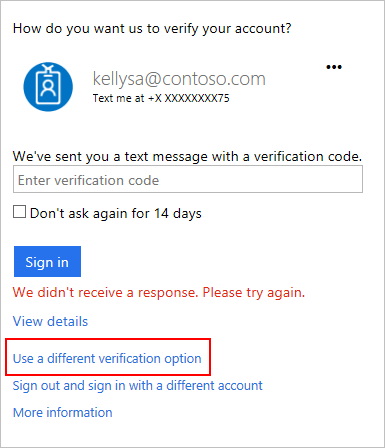

# Get help with two-step verification
This article answers the most common questions that people ask about two-step verification. 

## Why do I have to perform two-step verification? Can I turn it off?

Two-step verification is a security feature that your organization chose to use to protect your accounts. It's more secure than just a password, because it relies on two forms of authentication: something you know, and something you have with you. The something you know is your password. The something you have with you is a phone or device that you commonly have with you. When your account is protected with two-step verification, that means that a malicious hacker can't sign in as you if they get your password somehow because they don't have access to your phone, too. 

Microsoft offers two-step verification, but your organization chooses to use the feature. You can't opt out if your IT department requires it of you, just like you can't opt out of using a password to protect your account. 

If you have two-step verification turned on for your personal Microsoft account and want to change your settings, read [About two-step verification](https://support.microsoft.com/help/12408/microsoft-account-about-two-step-verification) instead. 

## I don't have my phone with me today

Some days you leave your phone at home, but still need to sign in at work. The first thing you should try is signing in with a different verification method. When you registered for two-step verification, did you set up more than one phone number? To try signing in with a different method, follow these steps:

1. Sign in as you normally would.
2. When the two-step verification page opens, choose **Use a different verification option**.

   

3. Select the verification option you want to use.
4. Continue with two-step verification.

If you don't see the **Use a different verification option** link, then that means you didn't set up alternative methods when you first registered for two-step verification. Contact your IT department to get help signing in to your account. Once you're signed in, make sure to [manage your settings](multi-factor-authentication-end-user-manage-settings.md) to add additional verification methods for next time. 

If you do see the **Use a different verification option** link, but you don't have access to your alternative methods either, contact your IT department to get help signing in to your account. 

## I lost my phone or got a new number
There are two ways to get back in to your account. The first is to sign in using your alternate authentication phone number, if you have set one up. The second is to ask your IT department to clear your settings.

If your phone was lost or stolen, we also recommend that you tell your IT department so they can reset your app passwords and clear any remembered devices. 

### Use an alternate phone number
If you have set up multiple verification options, including a secondary phone number or an authenticator app on a different device, you can use one of them to sign in.

To sign in using the alternate phone number, follow these steps:

1. Sign in as you normally would.
2. When prompted to further verify your account, choose **Use a different verification option**.
   
   

3. Select the phone number or device that you have access to.
4. After you're back in your account, [manage your settings](multi-factor-authentication-end-user-manage-settings.md) to change your authentication phone number.

### Clear your settings
If you have not configured a secondary authentication phone number, you have to contact your IT department for help. Have them clear your settings so the next time you sign in, you will be prompted to [register for two-step verification](multi-factor-authentication-end-user-first-time.md) again.

## I am not receiving a text or call on my phone
There are several reasons why you may try to sign in, but not receive the text or phone call. If you've successfully received texts or phone calls to your phone in the past, then this is probably an issue with the phone provider, not your account. Make sure that you have good cell signal, and if you are trying to receive a text message make sure that you are able to recieve text messages. Ask a friend to call you or text you as a test. 

If you've waited several minutes for a text or call, the fastest way to get into your account is to try a different option.

1. Select **Use a different verification option** on the page that's waiting for your verification.
   
    
2. Select the phone number or delivery method you want to use.
   
    If you received multiple verification codes, use the newest one.

If you don’t have another method configured, contact your IT department and ask them to clear your settings. The next time you sign in, you will be prompted to [set up multi-factor authentication](multi-factor-authentication-end-user-first-time.md) again.

If you often have delays due to bad cell signal, we recommend you use the [Microsoft Authenticator app](microsoft-authenticator-app-how-to.md) on your smartphone. The app can generate random security codes that you use to sign in, and these codes don't require any cell signal or internet connection.

## App passwords are not working
First, make sure that you have entered the app password correctly. The generated app password replaces your normal password, but only for older desktop applications that don't support two-step verification. If it still isn't working, try signing-in and [create a new app password](multi-factor-authentication-end-user-app-passwords.md).  If it still doesn't work, contact your IT department and have them [delete your existing app passwords](../multi-factor-authentication-manage-users-and-devices.md) and then you can create a new one.

## I didn't find an answer to my problem.
If you've tried these troubleshooting steps but are still running into problems, contact your IT department. They should be able to assist you.

## Related topics
* [Manage your settings for two-step verification](multi-factor-authentication-end-user-manage-settings.md)  
* [Microsoft Authenticator application FAQ](microsoft-authenticator-app-faq.md)

